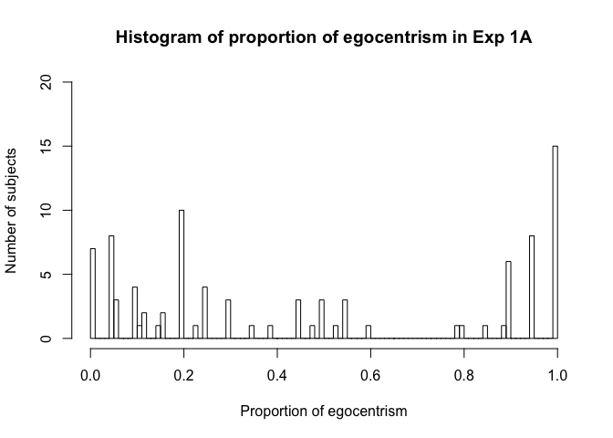
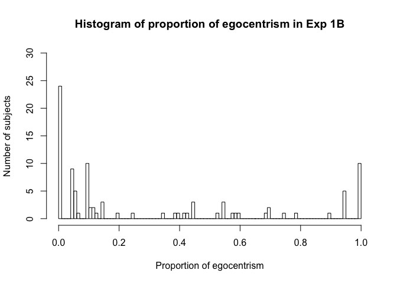
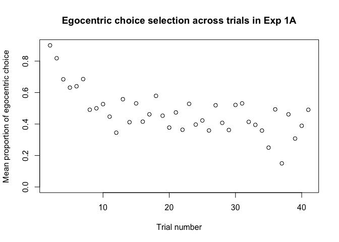
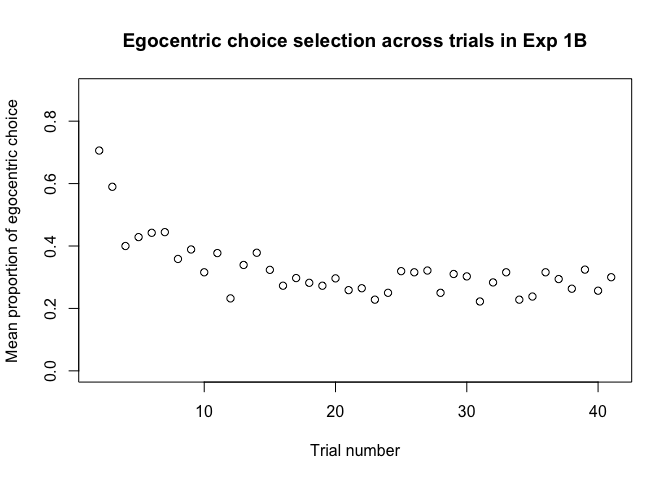
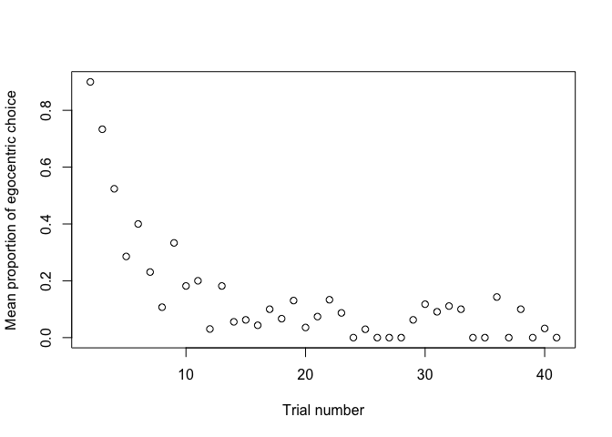
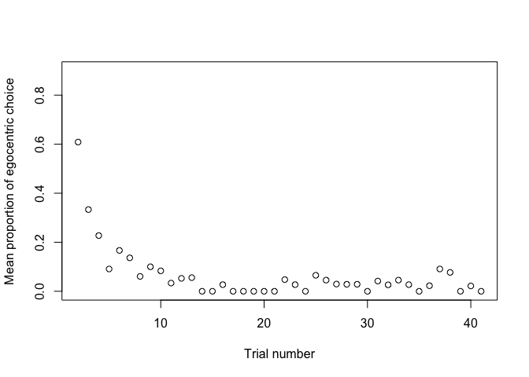

# Social and configural effects on the cognitive dynamics of perspective-taking
Alexia Galati and Rick Dale  
`r format(Sys.Date())`  


## Preliminaries for Exp 1A

Here we are loading in prior data analyzed using the scripts "GDD1_batchTrajectoryAnalysis.R". 
These include data from both the "error" (control) trials and the "ambiguous" (critical) trials of the experiment. 

We trim the data by removing trials that took more than 6000 ms from the initiation of the trial to selection of an initial folder or over 1000 pixels of total distance. These values reflect long tails of the distribution, well over 3 SD of their respective distributions. We chose to omit these trials because these radical divergences from their general distribution may reflect moments when the participant is not fully engaged in the task or understanding the trial. 

We then plot a histogram for the proportion of egocentric responses across participants.

Finally, we classify participants as egocentric, other-centric, and mixed responders based on their proportion of egocentric responses on ambiguous/critical trials. For classification, we computed the proportions of egocentric and other-centric responses of each listener on critical trials, and following Duran, Dale, and Kreuz (2011), if the proportion scores exceeded .70 for one of the two perspective categories, the listener was classified as member of that category; otherwise they were classified as a mixed responder.

In Exp 1A (GDD1A), the configural cue (i.e., the orientation of the folders appearing on the tabletop) is always aligned with the perspective of the participant/listener (ego-aligned configural cue).


```r
load('GDD1A_churnedRawTrajectoryData.Rd')

### Data cleaning and trimming ###

# Clean by approx. 3 SDs of M for control trials
resAllError1A = resAllError[resAllError$RTDV<6000&resAllError$totalDistanceDV<1000,]
resAll1A = resAll[resAll$RTDV<6000&resAll$totalDistanceDV<1000,]

# Create an aggregate variable to see distribution of egocentrism across subjects
egoChosen = 1*(resAll1A$chosen!=resAll1A$other)
perspectiveDistribution = aggregate(egoChosen~resAll1A$fl,FUN=mean)
hist(perspectiveDistribution$egoChosen,100, main = paste("Histogram of", "proportion of egocentrism in Exp 1A"), 
    xlab='Proportion of egocentrism',ylab='Number of subjects', ylim = range(0:20))
```

<!-- -->

```r
# Construct perspective preference variables
egoSubjects = perspectiveDistribution[perspectiveDistribution$egoChosen>.7,]$resAll1A
otherSubjects = perspectiveDistribution[perspectiveDistribution$egoChosen<.3,]$resAll1A
mixedSubjects = perspectiveDistribution[(perspectiveDistribution$egoChosen>=.3 & perspectiveDistribution$egoChosen<=.7) ,]$resAll1A

length(egoSubjects)
```

```
## [1] 33
```

```r
length(otherSubjects)
```

```
## [1] 43
```

```r
length(mixedSubjects)
```

```
## [1] 17
```

```r
length(unique(resAll1A$fl))
```

```
## [1] 93
```

```r
# Label perspectivePreference levels for Ambiguous/critical trials
resAll1A$perspectivePreference = 'mixed'
resAll1A$perspectivePreference[resAll1A$fl %in% egoSubjects]='ego'
resAll1A$perspectivePreference[resAll1A$fl %in% otherSubjects]='other'

# For Control trials let's trasfer the perspectivePreference variable over 
resAllError1A$perspectivePreference = 'mixed'
resAllError1A$perspectivePreference[resAllError1A$fl %in% egoSubjects]='ego'
resAllError1A$perspectivePreference[resAllError1A$fl %in% otherSubjects]='other'

# Add label for new Experiment (Exp) variable in the dataframes for Ambiguous/critical and Control trials
resAll1A$Exp = "1A" #Experiment 1A: folder orientation is constant = always aligned with ego
resAllError1A$Exp = "1A" #Experiment 1A: folder orientation is constant = always aligned with ego
```

## Preliminaries for Exp 1B

We repeat the same process for Exp 1B.

In Exp 1B (GDD1B), the configural cue (i.e., the orientation of the folders appearing on the tabletop) is always aligned with the perspective of the task partner/speaker (other-aligned configural cue).

The two experiments are otherwise identical.


```r
# Same procedure for Exp 1B 
load('GDD1B_churnedRawTrajectoryData.Rd') 

### Data cleaning and trimming ###

# Clean by approx. 3 SDs of M for control trials
resAllError1B = resAllError[resAllError$RTDV<6000&resAllError$totalDistanceDV<1000,]
resAll1B = resAll[resAll$RTDV<6000&resAll$totalDistanceDV<1000,]

# Create an aggregate variable to see distribution of egocentrism across subjects
egoChosen = 1*(resAll1B$chosen!=resAll1B$other)
perspectiveDistribution = aggregate(egoChosen~resAll1B$fl,FUN=mean)

hist(perspectiveDistribution$egoChosen,100, main = paste("Histogram of", "proportion of egocentrism in Exp 1B"), 
     xlab='Proportion of egocentrism',ylab='Number of subjects', ylim = range(0:30))
```

<!-- -->

```r
# Construct perspective preference variables
egoSubjects = perspectiveDistribution[perspectiveDistribution$egoChosen>.7,]$resAll1B
otherSubjects = perspectiveDistribution[perspectiveDistribution$egoChosen<.3,]$resAll1B
mixedSubjects = perspectiveDistribution[(perspectiveDistribution$egoChosen>=.3 & perspectiveDistribution$egoChosen<=.7) ,]$resAll1B

length(egoSubjects)
```

```
## [1] 18
```

```r
length(otherSubjects)
```

```
## [1] 59
```

```r
length(mixedSubjects)
```

```
## [1] 18
```

```r
length(unique(resAll1B$fl))
```

```
## [1] 95
```

```r
# Label perspectivePreference levels for Ambiguous/critical trials
resAll1B$perspectivePreference = 'mixed'
resAll1B$perspectivePreference[resAll1B$fl %in% egoSubjects]='ego'
resAll1B$perspectivePreference[resAll1B$fl %in% otherSubjects]='other'

# For Control trials let's trasfer the perspectivePreference variable over 
resAllError1B$perspectivePreference = 'mixed'
resAllError1B$perspectivePreference[resAllError1B$fl %in% egoSubjects]='ego'
resAllError1B$perspectivePreference[resAllError1B$fl %in% otherSubjects]='other'

# Add label for new Experiment (Exp) variable in the dataframes for Ambiguous/critical and Control trials
resAll1B$Exp = "1B" #Experiment 1B: folder orientation varies = always aligned with other 
resAllError1B$Exp = "1B" #Experiment 1B: folder orientation varies = always aligned with other 
```

## Preliminaries for both experiments 

We combine the dataframes for the two experiments and recode some of the variables.

Specifically, we create an "axis" variable, for which we combine "left-right" instructions to refer to the "lateral" axis, and "front-back" instructions to refer to the "sagittal" axis. This decision is motivated in more detail in the manuscript.

We create a new variable for offset, for which we assign "90"" degree offset to speaker positions 90 and 270, as we don't expect a difference between the two. For ambiguous trials this contrasts with the "180" offset; for control trials, with "0" offset.


```r
# Combine the two dataframes for ambiguous/critical trials
resAll = rbind(resAll1A, resAll1B)


# Combine the two dataframes for control trials
resAllError = rbind(resAllError1A, resAllError1B)

# Let's create axis variable to compress front-back and left-right instuctions into a sagittal and lateral axis
resAll$axis = 'sagittal'
resAll$axis[resAll$instruction %in% c('righ','left')]='lateral'

# Let's compress 90 and 270 speaker positions into a 90 offset
resAll$offset = '180'
resAll$offset[resAll$ppos %in% c('init_90','init_270')]='90'

# Create egocentric choice variable
resAll$egoChoice = 1*(resAll$chosen!=resAll$other)

# Let's create the axis variable for control trials
resAllError$axis = 'sagittal'
resAllError$axis[resAllError$instruction %in% c('righ','left')]='lateral'

# Let's compress 90 and 270 speaker positions into a 90 offset
resAllError$offset = '0'
resAllError$offset[resAllError$ppos %in% c('init_90','init_270')]='90'
```

## Descriptives

Let's get some descriptives for ambiguous and control trials 


```r
# Ambiguous/critical trials 
pander(aggregate(egoChoice~Exp+offset+axis,data=resAll,FUN=mean))
```


-----------------------------------
 Exp   offset    axis    egoChoice 
----- -------- -------- -----------
 1A     180    lateral    0.5553   

 1B     180    lateral    0.3425   

 1A      90    lateral    0.5722   

 1B      90    lateral    0.3646   

 1A     180    sagittal   0.3745   

 1B     180    sagittal   0.2932   

 1A      90    sagittal   0.3869   

 1B      90    sagittal   0.2647   
-----------------------------------

```r
pander(aggregate(RTDV~perspectivePreference+Exp+offset+axis,data=resAll,FUN=mean))
```


------------------------------------------------------
 perspectivePreference   Exp   offset    axis    RTDV 
----------------------- ----- -------- -------- ------
          ego            1A     180    lateral   1240 

         mixed           1A     180    lateral   1688 

         other           1A     180    lateral   2015 

          ego            1B     180    lateral   1106 

         mixed           1B     180    lateral   1736 

         other           1B     180    lateral   2012 

          ego            1A      90    lateral   1265 

         mixed           1A      90    lateral   1423 

         other           1A      90    lateral   1691 

          ego            1B      90    lateral   1063 

         mixed           1B      90    lateral   1508 

         other           1B      90    lateral   1743 

          ego            1A     180    sagittal  1345 

         mixed           1A     180    sagittal  1376 

         other           1A     180    sagittal  1462 

          ego            1B     180    sagittal  1390 

         mixed           1B     180    sagittal  1758 

         other           1B     180    sagittal  1465 

          ego            1A      90    sagittal  1290 

         mixed           1A      90    sagittal  1183 

         other           1A      90    sagittal  1328 

          ego            1B      90    sagittal  1348 

         mixed           1B      90    sagittal  1581 

         other           1B      90    sagittal  1248 
------------------------------------------------------

```r
pander(aggregate(totalDistanceDV~perspectivePreference+Exp+offset+axis,data=resAll,FUN=mean))
```


-----------------------------------------------------------------
 perspectivePreference   Exp   offset    axis    totalDistanceDV 
----------------------- ----- -------- -------- -----------------
          ego            1A     180    lateral        293.3      

         mixed           1A     180    lateral        292.7      

         other           1A     180    lateral        360.8      

          ego            1B     180    lateral        271.1      

         mixed           1B     180    lateral        317.5      

         other           1B     180    lateral        331.7      

          ego            1A      90    lateral        284.5      

         mixed           1A      90    lateral        280.6      

         other           1A      90    lateral        319.7      

          ego            1B      90    lateral        263.6      

         mixed           1B      90    lateral        294.8      

         other           1B      90    lateral        296.6      

          ego            1A     180    sagittal       283.9      

         mixed           1A     180    sagittal       295.1      

         other           1A     180    sagittal       317.8      

          ego            1B     180    sagittal       267.8      

         mixed           1B     180    sagittal       318.1      

         other           1B     180    sagittal       303.2      

          ego            1A      90    sagittal       287.3      

         mixed           1A      90    sagittal       295.7      

         other           1A      90    sagittal       298.8      

          ego            1B      90    sagittal       278.5      

         mixed           1B      90    sagittal        313       

         other           1B      90    sagittal       278.1      
-----------------------------------------------------------------

```r
pander(aggregate(xFlipDV~perspectivePreference+Exp+offset+axis,data=resAll,FUN=mean))
```


---------------------------------------------------------
 perspectivePreference   Exp   offset    axis    xFlipDV 
----------------------- ----- -------- -------- ---------
          ego            1A     180    lateral    1.556  

         mixed           1A     180    lateral    1.755  

         other           1A     180    lateral    2.439  

          ego            1B     180    lateral    1.449  

         mixed           1B     180    lateral    2.371  

         other           1B     180    lateral    2.353  

          ego            1A      90    lateral    1.661  

         mixed           1A      90    lateral    1.672  

         other           1A      90    lateral    1.933  

          ego            1B      90    lateral    1.452  

         mixed           1B      90    lateral    2.214  

         other           1B      90    lateral    1.883  

          ego            1A     180    sagittal   1.809  

         mixed           1A     180    sagittal   1.929  

         other           1A     180    sagittal   1.898  

          ego            1B     180    sagittal   1.589  

         mixed           1B     180    sagittal   2.402  

         other           1B     180    sagittal   1.957  

          ego            1A      90    sagittal   1.734  

         mixed           1A      90    sagittal   1.567  

         other           1A      90    sagittal   1.988  

          ego            1B      90    sagittal     2    

         mixed           1B      90    sagittal   2.463  

         other           1B      90    sagittal   1.86   
---------------------------------------------------------

```r
# Control trials
pander(aggregate(err~perspectivePreference+offset+axis+Exp,data=resAllError,FUN=mean)) #mixed responders have high errors .25 (this is due to front-back trials, see below)
```


--------------------------------------------------------
 perspectivePreference   offset    axis    Exp    err   
----------------------- -------- -------- ----- --------
          ego              0     lateral   1A   0.02632 

         mixed             0     lateral   1A   0.06931 

         other             0     lateral   1A   0.003922

          ego              90    lateral   1A    0.0315 

         mixed             90    lateral   1A   0.01493 

         other             90    lateral   1A   0.02326 

          ego              0     sagittal  1A   0.03158 

         mixed             0     sagittal  1A    0.2353 

         other             0     sagittal  1A   0.03137 

          ego              90    sagittal  1A   0.06349 

         mixed             90    sagittal  1A    0.1791 

         other             90    sagittal  1A   0.02326 

          ego              0     lateral   1B   0.009259

         mixed             0     lateral   1B   0.03738 

         other             0     lateral   1B   0.02266 

          ego              90    lateral   1B   0.01408 

         mixed             90    lateral   1B   0.06944 

         other             90    lateral   1B   0.03057 

          ego              0     sagittal  1B   0.01887 

         mixed             0     sagittal  1B    0.4466 

         other             0     sagittal  1B    0.0114 

          ego              90    sagittal  1B   0.02899 

         mixed             90    sagittal  1B    0.4783 

         other             90    sagittal  1B   0.03404 
--------------------------------------------------------

```r
pander(aggregate(RTDV~perspectivePreference+offset+axis+Exp,data=resAllError,FUN=mean))
```


------------------------------------------------------
 perspectivePreference   offset    axis    Exp   RTDV 
----------------------- -------- -------- ----- ------
          ego              0     lateral   1A    1235 

         mixed             0     lateral   1A    1113 

         other             0     lateral   1A    1428 

          ego              90    lateral   1A    1312 

         mixed             90    lateral   1A    1577 

         other             90    lateral   1A    1671 

          ego              0     sagittal  1A    1174 

         mixed             0     sagittal  1A    1202 

         other             0     sagittal  1A    1340 

          ego              90    sagittal  1A    1292 

         mixed             90    sagittal  1A    1318 

         other             90    sagittal  1A    1456 

          ego              0     lateral   1B    1019 

         mixed             0     lateral   1B    1314 

         other             0     lateral   1B    1376 

          ego              90    lateral   1B    1060 

         mixed             90    lateral   1B    1477 

         other             90    lateral   1B    1678 

          ego              0     sagittal  1B    1070 

         mixed             0     sagittal  1B    1419 

         other             0     sagittal  1B    1276 

          ego              90    sagittal  1B    1294 

         mixed             90    sagittal  1B    1763 

         other             90    sagittal  1B    1357 
------------------------------------------------------

```r
pander(aggregate(totalDistanceDV~perspectivePreference+offset+axis+Exp,data=resAllError,FUN=mean))
```


-----------------------------------------------------------------
 perspectivePreference   offset    axis    Exp   totalDistanceDV 
----------------------- -------- -------- ----- -----------------
          ego              0     lateral   1A         276.7      

         mixed             0     lateral   1A         274.4      

         other             0     lateral   1A         281.8      

          ego              90    lateral   1A         281.3      

         mixed             90    lateral   1A          302       

         other             90    lateral   1A         313.6      

          ego              0     sagittal  1A         269.3      

         mixed             0     sagittal  1A         278.5      

         other             0     sagittal  1A         286.2      

          ego              90    sagittal  1A         285.9      

         mixed             90    sagittal  1A         287.3      

         other             90    sagittal  1A         303.2      

          ego              0     lateral   1B         251.4      

         mixed             0     lateral   1B         289.5      

         other             0     lateral   1B          277       

          ego              90    lateral   1B         275.8      

         mixed             90    lateral   1B         307.3      

         other             90    lateral   1B         303.5      

          ego              0     sagittal  1B         267.7      

         mixed             0     sagittal  1B         289.2      

         other             0     sagittal  1B          281       

          ego              90    sagittal  1B         271.4      

         mixed             90    sagittal  1B         301.1      

         other             90    sagittal  1B          289       
-----------------------------------------------------------------

```r
pander(aggregate(xFlipDV~perspectivePreference+offset+axis+Exp,data=resAllError,FUN=mean))
```


---------------------------------------------------------
 perspectivePreference   offset    axis    Exp   xFlipDV 
----------------------- -------- -------- ----- ---------
          ego              0     lateral   1A     1.521  

         mixed             0     lateral   1A     1.465  

         other             0     lateral   1A     1.612  

          ego              90    lateral   1A     1.465  

         mixed             90    lateral   1A     2.045  

         other             90    lateral   1A     1.866  

          ego              0     sagittal  1A     1.574  

         mixed             0     sagittal  1A     1.657  

         other             0     sagittal  1A     1.675  

          ego              90    sagittal  1A     1.603  

         mixed             90    sagittal  1A     1.612  

         other             90    sagittal  1A     1.756  

          ego              0     lateral   1B     1.426  

         mixed             0     lateral   1B     1.682  

         other             0     lateral   1B     1.612  

          ego              90    lateral   1B     1.535  

         mixed             90    lateral   1B     2.014  

         other             90    lateral   1B     1.987  

          ego              0     sagittal  1B     1.632  

         mixed             0     sagittal  1B     2.214  

         other             0     sagittal  1B     1.726  

          ego              90    sagittal  1B     1.797  

         mixed             90    sagittal  1B     2.478  

         other             90    sagittal  1B     1.74   
---------------------------------------------------------

## Exploratory plotting of DVs across trials to explore stabilization

We are interested in how egocentric perspective selection might differ over time in the two experiments. 
Here, we plot the proportion of egocentric choices on ambigous trials over time (i.e. across trial order).


```r
### Perspective choice by trial, in the two Exps ###

perspectiveByTrial1A = aggregate((1*(resAll1A$chosen!=resAll1A$other))~resAll1A$trial,FUN=mean)
perspectiveByTrial1B = aggregate(( 1*(resAll1B$chosen!=resAll1B$other))~resAll1B$trial,FUN=mean)

perspectiveByTrial1A_Othercentric = aggregate((1*(resAll1A$chosen[resAll1A$perspectivePreference %in% c('other')]!=resAll1A$other[resAll1A$perspectivePreference %in% c('other')]))~resAll1A$trial[resAll1A$perspectivePreference %in% c('other')],FUN=mean)
perspectiveByTrial1B_Othercentric = aggregate((1*(resAll1B$chosen[resAll1B$perspectivePreference %in% c('other')]!=resAll1B$other[resAll1B$perspectivePreference %in% c('other')]))~resAll1B$trial[resAll1B$perspectivePreference %in% c('other')],FUN=mean)

plot(perspectiveByTrial1A, main="Egocentric choice selection across trials in Exp 1A",
     xlab = "Trial number", ylab = "Mean proportion of egocentric choice", ylim = c(0, .90))
```

<!-- -->

```r
plot(perspectiveByTrial1B, main="Egocentric choice selection across trials in Exp 1B",
     xlab = "Trial number", ylab = "Mean proportion of egocentric choice", ylim = c(0, .90))
```

<!-- -->

```r
plot(perspectiveByTrial1A_Othercentric, # main="Egocentric choice selection of Other-centric responders across trials in Exp 1A",
     xlab = "Trial number", ylab = "Mean proportion of egocentric choice", ylim = c(0,.90))
```

<!-- -->

```r
plot(perspectiveByTrial1B_Othercentric, #main="Egocentric choice selection of Other-centric responders across trials in Exp 1B",
     xlab = "Trial number", ylab = "Mean proportion of egocentric choice", ylim = c(0, .90))
```

<!-- -->

## Experiment comparisons

Before getting to the LMERs, let's compare the distribution of other, ego, mixed responders across experiments.


```r
# Let's compare the distribution of other, ego, mixed responders in GDD1B vs. GDD1A
preferenceCounts <- matrix(c(59, 18, 18, 43, 33, 17), ncol=3, byrow=TRUE)
colnames(preferenceCounts) <- c("other", "ego", "mixed")
rownames(preferenceCounts) <- c("GDD1B", "GDD1A")
preferenceCounts <- as.table(preferenceCounts)
summary(preferenceCounts)
```

```
## Number of cases in table: 188 
## Number of factors: 2 
## Test for independence of all factors:
## 	Chisq = 6.93, df = 2, p-value = 0.03128
```

```r
chisq.test(preferenceCounts)
```

```
## 
## 	Pearson's Chi-squared test
## 
## data:  preferenceCounts
## X-squared = 6.9296, df = 2, p-value = 0.03128
```

```r
# Let's also do a comparison between the distributions when the classification in ego, other, mixed
# based on lateral instructions only (left-right only)
# This is because mixed responders (based on the previous classification, on all instruction types),
# made high errors on control front-back trials (esp in Exp 1B)
# possibly due to using a different mapping to interpret front-back.
# This may suggest that their responses on ambiguous trials may have not been "mixed" or random
# but may have simply reflected this different mapping on front-back trials.
# We make this point in the paper.

preferenceCounts <- matrix(c(61, 25, 9, 29, 42, 22), ncol=3, byrow=TRUE)
colnames(preferenceCounts) <- c("other", "ego", "mixed")
rownames(preferenceCounts) <- c("GDD1B", "GDD1A")
preferenceCounts <- as.table(preferenceCounts)
summary(preferenceCounts)
```

```
## Number of cases in table: 188 
## Number of factors: 2 
## Test for independence of all factors:
## 	Chisq = 21.124, df = 2, p-value = 2.588e-05
```

```r
chisq.test(preferenceCounts)
```

```
## 
## 	Pearson's Chi-squared test
## 
## data:  preferenceCounts
## X-squared = 21.124, df = 2, p-value = 2.588e-05
```

```r
# Let's compare the distribution of other, ego, mixed responders in GDD1A vs. DDK study 1 
# In DDK1 there were 43 other, 31 ego, and 8 mixed. 
preferenceCounts <- matrix(c(43, 33, 17, 43, 31, 8), ncol=3, byrow=TRUE)
colnames(preferenceCounts) <- c("other", "ego", "mixed")
rownames(preferenceCounts) <- c("GDD1A", "DDKstudy1")
preferenceCounts <- as.table(preferenceCounts)
summary(preferenceCounts)
```

```
## Number of cases in table: 175 
## Number of factors: 2 
## Test for independence of all factors:
## 	Chisq = 2.6214, df = 2, p-value = 0.2696
```

```r
chisq.test(preferenceCounts) 
```

```
## 
## 	Pearson's Chi-squared test
## 
## data:  preferenceCounts
## X-squared = 2.6214, df = 2, p-value = 0.2696
```

```r
#The two distributions don't differ significantly. Good news for replication.
```

## Linear mixed effects models for ambiguous (critical) trials

We created separate linear mixed effects models for each of the dependent variables (proprotion of egocentric choices, RT, total Distance, x-flips) on ambiguous/critical trials, combining the data from Experiment 1a and 1b. 

We start with some pre-processing of the variables, setting the reference categories where relevant, and inspecting the data structure.


```r
resAll = as.data.frame(as.matrix(resAll))
#Defining as factors in order to set reference categories next
resAll$Exp = as.factor(as.matrix(resAll$Exp))
resAll$offset = as.factor(as.matrix(resAll$offset))
resAll$axis = as.factor(as.matrix(resAll$axis))
resAll$perspectivePreference = as.factor(as.matrix(resAll$perspectivePreference))
resAll$trial = as.integer(as.matrix(resAll$trial))

#Setting reference categories
resAll$perspectivePreference= relevel(resAll$perspectivePreference, ref = "ego")

##Check for any "holes" in the design
with(resAll, table(Exp, offset, axis, perspectivePreference))
```

```
## , , axis = lateral, perspectivePreference = ego
## 
##     offset
## Exp  180  90
##   1A 189 124
##   1B 107  73
## 
## , , axis = sagittal, perspectivePreference = ego
## 
##     offset
## Exp  180  90
##   1A 188 128
##   1B 107  72
## 
## , , axis = lateral, perspectivePreference = mixed
## 
##     offset
## Exp  180  90
##   1A  98  64
##   1B 105  70
## 
## , , axis = sagittal, perspectivePreference = mixed
## 
##     offset
## Exp  180  90
##   1A  98  67
##   1B 102  67
## 
## , , axis = lateral, perspectivePreference = other
## 
##     offset
## Exp  180  90
##   1A 246 165
##   1B 334 230
## 
## , , axis = sagittal, perspectivePreference = other
## 
##     offset
## Exp  180  90
##   1A 256 172
##   1B 347 235
```

```r
str(resAll)
```

```
## 'data.frame':	3644 obs. of  16 variables:
##  $ fl                   : Factor w/ 188 levels "100.txt","102.txt",..: 1 1 1 1 1 1 1 1 1 1 ...
##   ..- attr(*, "names")= chr  "1" "2" "3" "4" ...
##  $ trial                : int  2 4 7 8 12 13 16 17 18 21 ...
##  $ instruction          : Factor w/ 4 levels "back","fron",..: 3 1 3 4 1 3 2 2 3 4 ...
##   ..- attr(*, "names")= chr  "1" "2" "3" "4" ...
##  $ folder_config        : Factor w/ 4 levels "D1","D2","H",..: 2 1 1 1 2 2 1 4 3 2 ...
##   ..- attr(*, "names")= chr  "1" "2" "3" "4" ...
##  $ ppos                 : Factor w/ 3 levels "init_180","init_270",..: 3 3 2 1 2 1 1 1 1 3 ...
##   ..- attr(*, "names")= chr  "1" "2" "3" "4" ...
##  $ RTDV                 : Factor w/ 1459 levels " 397"," 414",..: 154 493 1234 1411 914 1437 954 626 1106 493 ...
##   ..- attr(*, "names")= chr  "1" "2" "3" "4" ...
##  $ totalDistanceDV      : Factor w/ 3644 levels " 26.60409"," 38.59668",..: 2 1653 3634 3622 3582 3584 3492 2292 3631 3447 ...
##   ..- attr(*, "names")= chr  "1" "2" "3" "4" ...
##  $ xFlipDV              : Factor w/ 14 levels " 0"," 1"," 2",..: 1 2 2 7 4 5 5 5 5 5 ...
##   ..- attr(*, "names")= chr  "1" "2" "3" "4" ...
##  $ AC                   : Factor w/ 1 level "0": 1 1 1 1 1 1 1 1 1 1 ...
##   ..- attr(*, "names")= chr  "1" "2" "3" "4" ...
##  $ chosen               : Factor w/ 2 levels "F1","F2": 1 1 2 1 1 1 1 1 2 1 ...
##   ..- attr(*, "names")= chr  "1" "2" "3" "4" ...
##  $ other                : Factor w/ 2 levels "F1","F2": 2 2 2 1 1 2 1 1 2 1 ...
##   ..- attr(*, "names")= chr  "1" "2" "3" "4" ...
##  $ perspectivePreference: Factor w/ 3 levels "ego","mixed",..: 3 3 3 3 3 3 3 3 3 3 ...
##  $ Exp                  : Factor w/ 2 levels "1A","1B": 1 1 1 1 1 1 1 1 1 1 ...
##  $ axis                 : Factor w/ 2 levels "lateral","sagittal": 1 2 1 1 2 1 2 2 1 1 ...
##  $ offset               : Factor w/ 2 levels "180","90": 2 2 2 1 2 1 1 1 1 2 ...
##  $ egoChoice            : Factor w/ 2 levels "0","1": 2 2 1 1 1 2 1 1 1 1 ...
##   ..- attr(*, "names")= chr  "1" "2" "3" "4" ...
```

```r
#make sure DVs are of the right type
resAll$egoChoice = as.factor(as.matrix(resAll$egoChoice))
resAll$RTDV = as.numeric(as.matrix(resAll$RTDV))
resAll$totalDistanceDV = as.numeric(as.matrix(resAll$totalDistanceDV))
resAll$xFlipDV = as.integer(as.matrix(resAll$xFlipDV))

#Center time/trial
resAll$centered_trial =scale(resAll$trial)
```

## Egocentric Choice models (Ambiguous/Critical trials)

For the model with perspective choice as dependent variable (egoChoice), the fixed factors included the orientation of the folders (Exp), the speaker’s position (offset: 180° vs. 90°; within-subjects), instruction's axis (axis: on a sagittal axis: front-back vs. a lateral axis: left-right; within-subjects), and their interactions. Given that the perspective choice as a dependent variable is a binary variable, we used a logistic regression model (Jaeger, 2008).   


```r
ChoiceModel1 = glmer(egoChoice ~ Exp*offset*axis 
                    + (1 | fl),
                    #+ (0 + offset | fl),
                    #+ (0 + axis | fl),
                    #+ (0 + offset:axis | fl), #did not converge
                    data=resAll,
                    family = "binomial",
                    nAGQ = 1, 
                    REML = FALSE)
```

```
## Warning: extra argument(s) 'REML' disregarded
```

```
## Warning in checkConv(attr(opt, "derivs"), opt$par, ctrl = control
## $checkConv, : Model failed to converge with max|grad| = 0.00320202 (tol =
## 0.001, component 1)
```

```r
summary(ChoiceModel1)
```

```
## Generalized linear mixed model fit by maximum likelihood (Laplace
##   Approximation) [glmerMod]
##  Family: binomial  ( logit )
## Formula: egoChoice ~ Exp * offset * axis + (1 | fl)
##    Data: resAll
## 
##      AIC      BIC   logLik deviance df.resid 
##   2668.2   2724.0  -1325.1   2650.2     3635 
## 
## Scaled residuals: 
##     Min      1Q  Median      3Q     Max 
## -6.7302 -0.3212 -0.1273  0.1939  7.1455 
## 
## Random effects:
##  Groups Name        Variance Std.Dev.
##  fl     (Intercept) 10.34    3.215   
## Number of obs: 3644, groups:  fl, 188
## 
## Fixed effects:
##                             Estimate Std. Error z value Pr(>|z|)    
## (Intercept)                  0.82304    0.36557   2.251   0.0244 *  
## Exp1B                       -2.19531    0.51839  -4.235 2.29e-05 ***
## offset90                     0.18383    0.19829   0.927   0.3539    
## axissagittal                -1.75428    0.20167  -8.699  < 2e-16 ***
## Exp1B:offset90               0.08614    0.28651   0.301   0.7637    
## Exp1B:axissagittal           1.26758    0.27966   4.533 5.83e-06 ***
## offset90:axissagittal       -0.06901    0.29572  -0.233   0.8155    
## Exp1B:offset90:axissagittal -0.55335    0.42659  -1.297   0.1946    
## ---
## Signif. codes:  0 '***' 0.001 '**' 0.01 '*' 0.05 '.' 0.1 ' ' 1
## 
## Correlation of Fixed Effects:
##             (Intr) Exp1B  offs90 axssgt Ex1B:90 Exp1B: off90:
## Exp1B       -0.708                                           
## offset90    -0.219  0.154                                    
## axissagittl -0.257  0.186  0.386                             
## Exp1B:ffs90  0.152 -0.229 -0.692 -0.268                      
## Exp1B:xssgt  0.184 -0.255 -0.278 -0.719  0.414               
## offst90:xss  0.150 -0.106 -0.670 -0.594  0.464   0.429       
## Exp1B:ff90: -0.105  0.156  0.465  0.414 -0.673  -0.608 -0.693
## convergence code: 0
## Model failed to converge with max|grad| = 0.00320202 (tol = 0.001, component 1)
```

```r
#This model does not converge and is not reported in the manuscript
ChoiceModel_time = glmer(egoChoice ~ Exp*offset*axis+ Exp*centered_trial 
                     + (1 | fl),
                     #+ (0 + offset | fl),
                     #+ (0 + axis | fl),
                     #+ (0 + offset:axis | fl), #did not converge
                     data=resAll,
                     family = "binomial",
                     # method = "Laplace",
                     nAGQ = 1, 
                     REML = FALSE)
```

```
## Warning: extra argument(s) 'REML' disregarded
```

```
## Warning in checkConv(attr(opt, "derivs"), opt$par, ctrl = control
## $checkConv, : Model failed to converge with max|grad| = 0.177113 (tol =
## 0.001, component 1)
```

```
## Warning in checkConv(attr(opt, "derivs"), opt$par, ctrl = control$checkConv, : Model is nearly unidentifiable: very large eigenvalue
##  - Rescale variables?
```

```r
summary(ChoiceModel_time)
```

```
## Generalized linear mixed model fit by maximum likelihood (Laplace
##   Approximation) [glmerMod]
##  Family: binomial  ( logit )
## Formula: egoChoice ~ Exp * offset * axis + Exp * centered_trial + (1 |  
##     fl)
##    Data: resAll
## 
##      AIC      BIC   logLik deviance df.resid 
##   2563.4   2631.6  -1270.7   2541.4     3633 
## 
## Scaled residuals: 
##     Min      1Q  Median      3Q     Max 
## -7.2415 -0.3035 -0.1091  0.1950  8.6844 
## 
## Random effects:
##  Groups Name        Variance Std.Dev.
##  fl     (Intercept) 11.94    3.455   
## Number of obs: 3644, groups:  fl, 188
## 
## Fixed effects:
##                               Estimate Std. Error z value Pr(>|z|)    
## (Intercept)                  0.8657558  0.0003995    2167   <2e-16 ***
## Exp1B                       -2.3699630  0.0003995   -5932   <2e-16 ***
## offset90                     0.0504526  0.0003995     126   <2e-16 ***
## axissagittal                -1.8714815  0.0003996   -4683   <2e-16 ***
## centered_trial              -0.6354645  0.0003997   -1590   <2e-16 ***
## Exp1B:offset90               0.0916124  0.0003995     229   <2e-16 ***
## Exp1B:axissagittal           1.3376183  0.0003995    3348   <2e-16 ***
## offset90:axissagittal        0.2795586  0.0003995     700   <2e-16 ***
## Exp1B:centered_trial         0.0449889  0.0003996     113   <2e-16 ***
## Exp1B:offset90:axissagittal -0.5947548  0.0003995   -1489   <2e-16 ***
## ---
## Signif. codes:  0 '***' 0.001 '**' 0.01 '*' 0.05 '.' 0.1 ' ' 1
## 
## Correlation of Fixed Effects:
##             (Intr) Exp1B offs90 axssgt cntrd_ Ex1B:90 Exp1B: off90: Ex1B:_
## Exp1B       0.000                                                         
## offset90    0.000  0.000                                                  
## axissagittl 0.000  0.000 0.000                                            
## centerd_trl 0.000  0.000 0.000  0.000                                     
## Exp1B:ffs90 0.000  0.000 0.000  0.000  0.000                              
## Exp1B:xssgt 0.000  0.000 0.000  0.000  0.000  0.000                       
## offst90:xss 0.000  0.000 0.000  0.000  0.000  0.000   0.000               
## Exp1B:cntr_ 0.000  0.000 0.000  0.000  0.000  0.000   0.000  0.000        
## Exp1B:ff90: 0.000  0.000 0.000  0.000  0.000  0.000   0.000  0.000  0.000 
## convergence code: 0
## Model failed to converge with max|grad| = 0.177113 (tol = 0.001, component 1)
## Model is nearly unidentifiable: very large eigenvalue
##  - Rescale variables?
```

## Response Time models (Ambiguous/Critical trials)

For the models for response time (RTDV) and the other dependent measures (totalDistanceDV, xFlipDV), in addition to the fixed effects used in the egocentric choice model, we include perspective preference as a fixed effect (perspectivePreference: egocentric, other-centric, vs. mixed responder types; between-subjects), along with its interaction with the other factors.


```r
RTModel = lmer(log(RTDV) ~ Exp*perspectivePreference*offset*axis 
                + (1 | fl)
                + (0 + offset | fl)
                + (0 + axis | fl),
                #+ (0 + offset:axis | fl), #did not converge
                data=resAll, 
                #control = glmerControl(optimizer = 'bobyqa'),
                REML=FALSE)
print('RT:'); pander(print_stats(RTModel))
```

```
## [1] "RT:"
```


-----------------------------------------------------------------------
                           &nbsp;                             Estimate 
------------------------------------------------------------ ----------
                      **(Intercept)**                          7.025   

                         **Exp1B**                            -0.09862 

               **perspectivePreferencemixed**                  0.2298  

               **perspectivePreferenceother**                  0.4817  

                        **offset90**                          0.01611  

                      **axissagittal**                        0.08141  

            **Exp1B:perspectivePreferencemixed**              0.09205  

            **Exp1B:perspectivePreferenceother**               0.1079  

                     **Exp1B:offset90**                       -0.05898 

          **perspectivePreferencemixed:offset90**              -0.142  

          **perspectivePreferenceother:offset90**             -0.2159  

                   **Exp1B:axissagittal**                     0.07802  

        **perspectivePreferencemixed:axissagittal**           -0.2011  

        **perspectivePreferenceother:axissagittal**           -0.3984  

                 **offset90:axissagittal**                    -0.04067 

       **Exp1B:perspectivePreferencemixed:offset90**          0.08363  

       **Exp1B:perspectivePreferenceother:offset90**          0.08678  

     **Exp1B:perspectivePreferencemixed:axissagittal**        0.06631  

     **Exp1B:perspectivePreferenceother:axissagittal**        -0.08086 

              **Exp1B:offset90:axissagittal**                 0.06586  

    **perspectivePreferencemixed:offset90:axissagittal**       0.0478  

    **perspectivePreferenceother:offset90:axissagittal**       0.169   

 **Exp1B:perspectivePreferencemixed:offset90:axissagittal**   -0.04931 

 **Exp1B:perspectivePreferenceother:offset90:axissagittal**    -0.167  
-----------------------------------------------------------------------

Table: Table continues below

 
-------------------------------------------------------------------------
                           &nbsp;                             Std..Error 
------------------------------------------------------------ ------------
                      **(Intercept)**                          0.06704   

                         **Exp1B**                              0.1121   

               **perspectivePreferencemixed**                   0.1144   

               **perspectivePreferenceother**                  0.08888   

                        **offset90**                           0.04102   

                      **axissagittal**                         0.04512   

            **Exp1B:perspectivePreferencemixed**                0.1711   

            **Exp1B:perspectivePreferenceother**                0.1359   

                     **Exp1B:offset90**                        0.06764   

          **perspectivePreferencemixed:offset90**              0.07016   

          **perspectivePreferenceother:offset90**              0.05439   

                   **Exp1B:axissagittal**                      0.07508   

        **perspectivePreferencemixed:axissagittal**            0.07702   

        **perspectivePreferenceother:axissagittal**             0.0597   

                 **offset90:axissagittal**                     0.05749   

       **Exp1B:perspectivePreferencemixed:offset90**            0.1039   

       **Exp1B:perspectivePreferenceother:offset90**            0.0823   

     **Exp1B:perspectivePreferencemixed:axissagittal**          0.115    

     **Exp1B:perspectivePreferenceother:axissagittal**         0.09104   

              **Exp1B:offset90:axissagittal**                  0.09524   

    **perspectivePreferencemixed:offset90:axissagittal**       0.09825   

    **perspectivePreferenceother:offset90:axissagittal**       0.07605   

 **Exp1B:perspectivePreferencemixed:offset90:axissagittal**     0.1465   

 **Exp1B:perspectivePreferenceother:offset90:axissagittal**     0.1156   
-------------------------------------------------------------------------

Table: Table continues below

 
--------------------------------------------------------------------------------
                           &nbsp;                             t.value      p    
------------------------------------------------------------ --------- ---------
                      **(Intercept)**                          104.8       0    

                         **Exp1B**                            -0.8794   0.3792  

               **perspectivePreferencemixed**                  2.008    0.04463 

               **perspectivePreferenceother**                  5.42    5.954e-08

                        **offset90**                          0.3929    0.6944  

                      **axissagittal**                         1.804    0.07121 

            **Exp1B:perspectivePreferencemixed**              0.5379    0.5907  

            **Exp1B:perspectivePreferenceother**              0.7936    0.4274  

                     **Exp1B:offset90**                       -0.8719   0.3832  

          **perspectivePreferencemixed:offset90**             -2.024    0.04295 

          **perspectivePreferenceother:offset90**             -3.969   7.212e-05

                   **Exp1B:axissagittal**                      1.039    0.2987  

        **perspectivePreferencemixed:axissagittal**           -2.611   0.009033 

        **perspectivePreferenceother:axissagittal**           -6.673   2.512e-11

                 **offset90:axissagittal**                    -0.7074   0.4793  

       **Exp1B:perspectivePreferencemixed:offset90**          0.8046    0.4211  

       **Exp1B:perspectivePreferenceother:offset90**           1.054    0.2917  

     **Exp1B:perspectivePreferencemixed:axissagittal**        0.5766    0.5642  

     **Exp1B:perspectivePreferenceother:axissagittal**        -0.8882   0.3744  

              **Exp1B:offset90:axissagittal**                 0.6915    0.4892  

    **perspectivePreferencemixed:offset90:axissagittal**      0.4865    0.6266  

    **perspectivePreferenceother:offset90:axissagittal**       2.222    0.02626 

 **Exp1B:perspectivePreferencemixed:offset90:axissagittal**   -0.3365   0.7365  

 **Exp1B:perspectivePreferenceother:offset90:axissagittal**   -1.445    0.1485  
--------------------------------------------------------------------------------

```r
# Check residuals (before and after log transform)
# There is deviation from normality and homoscedasticity, so use log(RT)
#plot(density(resid(RTModel))) #does this look approximately normal?
#qqnorm(resid(RTModel)) #check if they fall on a straight line
#qqline(resid(RTModel)) #check departure from line

#### Investigation of stabilization across trials ####

RTModel1_time = lmer(log(RTDV) ~ Exp*perspectivePreference*offset*axis+Exp*centered_trial
                    + (1 | fl)
                    + (0 + offset | fl)
                    + (0 + axis | fl),
                    #+ (0 + centered_trial | fl),
                    #+ (0 + offset:axis | fl), 
                    data=resAll, 
                    REML=FALSE)
print('RT:'); pander(print_stats(RTModel1_time))
```

```
## [1] "RT:"
```


-----------------------------------------------------------------------
                           &nbsp;                             Estimate 
------------------------------------------------------------ ----------
                      **(Intercept)**                          7.027   

                         **Exp1B**                            -0.1059  

               **perspectivePreferencemixed**                  0.2259  

               **perspectivePreferenceother**                  0.4759  

                        **offset90**                          0.004507 

                      **axissagittal**                        0.07907  

                     **centered_trial**                       -0.03945 

            **Exp1B:perspectivePreferencemixed**               0.1047  

            **Exp1B:perspectivePreferenceother**               0.1145  

                     **Exp1B:offset90**                       -0.07484 

          **perspectivePreferencemixed:offset90**             -0.1412  

          **perspectivePreferenceother:offset90**             -0.2131  

                   **Exp1B:axissagittal**                     0.08301  

        **perspectivePreferencemixed:axissagittal**           -0.1951  

        **perspectivePreferenceother:axissagittal**           -0.3896  

                 **offset90:axissagittal**                    -0.01892 

                  **Exp1B:centered_trial**                    -0.07006 

       **Exp1B:perspectivePreferencemixed:offset90**          0.08606  

       **Exp1B:perspectivePreferenceother:offset90**           0.0842  

     **Exp1B:perspectivePreferencemixed:axissagittal**        0.04483  

     **Exp1B:perspectivePreferenceother:axissagittal**         -0.086  

              **Exp1B:offset90:axissagittal**                  0.1155  

    **perspectivePreferencemixed:offset90:axissagittal**       0.0478  

    **perspectivePreferenceother:offset90:axissagittal**       0.1683  

 **Exp1B:perspectivePreferencemixed:offset90:axissagittal**   -0.04953 

 **Exp1B:perspectivePreferenceother:offset90:axissagittal**   -0.1801  
-----------------------------------------------------------------------

Table: Table continues below

 
-------------------------------------------------------------------------
                           &nbsp;                             Std..Error 
------------------------------------------------------------ ------------
                      **(Intercept)**                          0.06771   

                         **Exp1B**                              0.1133   

               **perspectivePreferencemixed**                   0.1156   

               **perspectivePreferenceother**                  0.08978   

                        **offset90**                            0.0399   

                      **axissagittal**                         0.04526   

                     **centered_trial**                        0.008512  

            **Exp1B:perspectivePreferencemixed**                0.1729   

            **Exp1B:perspectivePreferenceother**                0.1373   

                     **Exp1B:offset90**                        0.06574   

          **perspectivePreferencemixed:offset90**              0.06811   

          **perspectivePreferenceother:offset90**              0.05281   

                   **Exp1B:axissagittal**                      0.07533   

        **perspectivePreferencemixed:axissagittal**            0.07725   

        **perspectivePreferenceother:axissagittal**            0.05991   

                 **offset90:axissagittal**                     0.05602   

                  **Exp1B:centered_trial**                     0.01193   

       **Exp1B:perspectivePreferencemixed:offset90**            0.1009   

       **Exp1B:perspectivePreferenceother:offset90**            0.0799   

     **Exp1B:perspectivePreferencemixed:axissagittal**          0.1153   

     **Exp1B:perspectivePreferenceother:axissagittal**         0.09135   

              **Exp1B:offset90:axissagittal**                  0.09274   

    **perspectivePreferencemixed:offset90:axissagittal**        0.0954   

    **perspectivePreferenceother:offset90:axissagittal**       0.07384   

 **Exp1B:perspectivePreferencemixed:offset90:axissagittal**     0.1423   

 **Exp1B:perspectivePreferenceother:offset90:axissagittal**     0.1122   
-------------------------------------------------------------------------

Table: Table continues below

 
--------------------------------------------------------------------------------
                           &nbsp;                             t.value      p    
------------------------------------------------------------ --------- ---------
                      **(Intercept)**                          103.8       0    

                         **Exp1B**                            -0.9343   0.3501  

               **perspectivePreferencemixed**                  1.954    0.05075 

               **perspectivePreferenceother**                  5.301   1.151e-07

                        **offset90**                           0.113    0.9101  

                      **axissagittal**                         1.747    0.08064 

                     **centered_trial**                       -4.635   3.57e-06 

            **Exp1B:perspectivePreferencemixed**              0.6056    0.5448  

            **Exp1B:perspectivePreferenceother**               0.834    0.4043  

                     **Exp1B:offset90**                       -1.138     0.255  

          **perspectivePreferencemixed:offset90**             -2.072    0.03824 

          **perspectivePreferenceother:offset90**             -4.036   5.448e-05

                   **Exp1B:axissagittal**                      1.102    0.2705  

        **perspectivePreferencemixed:axissagittal**           -2.525    0.01156 

        **perspectivePreferenceother:axissagittal**           -6.504   7.833e-11

                 **offset90:axissagittal**                    -0.3377   0.7356  

                  **Exp1B:centered_trial**                    -5.872   4.307e-09

       **Exp1B:perspectivePreferencemixed:offset90**          0.8528    0.3938  

       **Exp1B:perspectivePreferenceother:offset90**           1.054     0.292  

     **Exp1B:perspectivePreferencemixed:axissagittal**        0.3887    0.6975  

     **Exp1B:perspectivePreferenceother:axissagittal**        -0.9414   0.3465  

              **Exp1B:offset90:axissagittal**                  1.246    0.2129  

    **perspectivePreferencemixed:offset90:axissagittal**      0.5011    0.6163  

    **perspectivePreferenceother:offset90:axissagittal**       2.28     0.02263 

 **Exp1B:perspectivePreferencemixed:offset90:axissagittal**   -0.3481   0.7277  

 **Exp1B:perspectivePreferenceother:offset90:axissagittal**   -1.605    0.1084  
--------------------------------------------------------------------------------

## Total Distance models (Ambiguous/Critical trials)


```r
DistanceModel = lmer(log(totalDistanceDV) ~ Exp*perspectivePreference*offset*axis 
                      + (1 | fl) 
                      + (0 + offset | fl)
                      + (0 + axis | fl)
                      + (0 + offset:axis | fl),
                      #+ (0 + offset:axis | fl), #did not converge
                      data=resAll, 
                      REML=FALSE) 
print('Total Distance:'); pander(print_stats(DistanceModel))
```

```
## [1] "Total Distance:"
```


-----------------------------------------------------------------------
                           &nbsp;                             Estimate 
------------------------------------------------------------ ----------
                      **(Intercept)**                          5.628   

                         **Exp1B**                            -0.05703 

               **perspectivePreferencemixed**                 0.01307  

               **perspectivePreferenceother**                   0.19   

                        **offset90**                          -0.01206 

                      **axissagittal**                        -0.02982 

            **Exp1B:perspectivePreferencemixed**               0.1297  

            **Exp1B:perspectivePreferenceother**             -0.002311 

                     **Exp1B:offset90**                       -0.03045 

          **perspectivePreferencemixed:offset90**             -0.0227  

          **perspectivePreferenceother:offset90**             -0.09806 

                   **Exp1B:axissagittal**                     0.02555  

        **perspectivePreferencemixed:axissagittal**           0.04479  

        **perspectivePreferenceother:axissagittal**           -0.0906  

                 **offset90:axissagittal**                    0.03703  

       **Exp1B:perspectivePreferencemixed:offset90**          0.004698 

       **Exp1B:perspectivePreferenceother:offset90**          0.02588  

     **Exp1B:perspectivePreferencemixed:axissagittal**        -0.03824 

     **Exp1B:perspectivePreferenceother:axissagittal**        0.008744 

              **Exp1B:offset90:axissagittal**                 0.03594  

    **perspectivePreferencemixed:offset90:axissagittal**      -0.01344 

    **perspectivePreferenceother:offset90:axissagittal**      0.02271  

 **Exp1B:perspectivePreferencemixed:offset90:axissagittal**   -0.03162 

 **Exp1B:perspectivePreferenceother:offset90:axissagittal**   -0.06359 
-----------------------------------------------------------------------

Table: Table continues below

 
-------------------------------------------------------------------------
                           &nbsp;                             Std..Error 
------------------------------------------------------------ ------------
                      **(Intercept)**                          0.03396   

                         **Exp1B**                             0.05664   

               **perspectivePreferencemixed**                   0.0579   

               **perspectivePreferenceother**                   0.045    

                        **offset90**                            0.0307   

                      **axissagittal**                         0.02869   

            **Exp1B:perspectivePreferencemixed**               0.08646   

            **Exp1B:perspectivePreferenceother**               0.06868   

                     **Exp1B:offset90**                        0.05066   

          **perspectivePreferencemixed:offset90**              0.05251   

          **perspectivePreferenceother:offset90**               0.0407   

                   **Exp1B:axissagittal**                      0.04769   

        **perspectivePreferencemixed:axissagittal**            0.04901   

        **perspectivePreferenceother:axissagittal**            0.03797   

                 **offset90:axissagittal**                     0.04252   

       **Exp1B:perspectivePreferencemixed:offset90**           0.07783   

       **Exp1B:perspectivePreferenceother:offset90**           0.06162   

     **Exp1B:perspectivePreferencemixed:axissagittal**         0.07315   

     **Exp1B:perspectivePreferenceother:axissagittal**         0.05786   

              **Exp1B:offset90:axissagittal**                  0.07045   

    **perspectivePreferencemixed:offset90:axissagittal**       0.07266   

    **perspectivePreferenceother:offset90:axissagittal**       0.05624   

 **Exp1B:perspectivePreferencemixed:offset90:axissagittal**     0.1084   

 **Exp1B:perspectivePreferenceother:offset90:axissagittal**    0.08547   
-------------------------------------------------------------------------

Table: Table continues below

 
--------------------------------------------------------------------------------
                           &nbsp;                             t.value      p    
------------------------------------------------------------ --------- ---------
                      **(Intercept)**                          165.7       0    

                         **Exp1B**                            -1.007     0.314  

               **perspectivePreferencemixed**                 0.2258    0.8214  

               **perspectivePreferenceother**                  4.221   2.427e-05

                        **offset90**                          -0.3928   0.6945  

                      **axissagittal**                        -1.039    0.2986  

            **Exp1B:perspectivePreferencemixed**                1.5     0.1337  

            **Exp1B:perspectivePreferenceother**             -0.03365   0.9732  

                     **Exp1B:offset90**                       -0.6011   0.5478  

          **perspectivePreferencemixed:offset90**             -0.4323   0.6655  

          **perspectivePreferenceother:offset90**             -2.409    0.01598 

                   **Exp1B:axissagittal**                     0.5357    0.5921  

        **perspectivePreferencemixed:axissagittal**           0.9139    0.3608  

        **perspectivePreferenceother:axissagittal**           -2.386    0.01702 

                 **offset90:axissagittal**                    0.8708    0.3839  

       **Exp1B:perspectivePreferencemixed:offset90**          0.06036   0.9519  

       **Exp1B:perspectivePreferenceother:offset90**           0.42     0.6745  

     **Exp1B:perspectivePreferencemixed:axissagittal**        -0.5227   0.6012  

     **Exp1B:perspectivePreferenceother:axissagittal**        0.1511    0.8799  

              **Exp1B:offset90:axissagittal**                 0.5102    0.6099  

    **perspectivePreferencemixed:offset90:axissagittal**      -0.185    0.8532  

    **perspectivePreferenceother:offset90:axissagittal**      0.4039    0.6863  

 **Exp1B:perspectivePreferencemixed:offset90:axissagittal**   -0.2918   0.7705  

 **Exp1B:perspectivePreferenceother:offset90:axissagittal**   -0.744    0.4569  
--------------------------------------------------------------------------------

```r
# Check residuals (before and after log transform)
# There is deviation from normality and homoscedasticity, so use log(RT)
#plot(density(resid(DistanceModel))) #does this look approximately normal?
#qqnorm(resid(DistanceModel)) #check if they fall on a straight line
#qqline(resid(DistanceModel)) #check departure from line

#### Investigation of stabilization across trials ####

DistanceModel_time = lmer(log(totalDistanceDV) ~ Exp*perspectivePreference*offset*axis+Exp*centered_trial
                    + (1 | fl)
                    + (0 + offset | fl)
                    + (0 + axis | fl),
                    #+ (0 + centered_trial | fl),
                    #+ (0 + offset:axis | fl), 
                    data=resAll, 
                    REML=FALSE)
print('Total Distance:'); pander(print_stats(DistanceModel_time))
```

```
## [1] "Total Distance:"
```


-----------------------------------------------------------------------
                           &nbsp;                             Estimate 
------------------------------------------------------------ ----------
                      **(Intercept)**                          5.628   

                         **Exp1B**                            -0.05739 

               **perspectivePreferencemixed**                 0.01344  

               **perspectivePreferenceother**                  0.1907  

                        **offset90**                          -0.01041 

                      **axissagittal**                         -0.029  

                     **centered_trial**                       0.005523 

            **Exp1B:perspectivePreferencemixed**               0.1301  

            **Exp1B:perspectivePreferenceother**             -0.003106 

                     **Exp1B:offset90**                       -0.0355  

          **perspectivePreferencemixed:offset90**             -0.02242 

          **perspectivePreferenceother:offset90**             -0.09787 

                   **Exp1B:axissagittal**                     0.02508  

        **perspectivePreferencemixed:axissagittal**           0.04376  

        **perspectivePreferenceother:axissagittal**           -0.09226 

                 **offset90:axissagittal**                    0.03345  

                  **Exp1B:centered_trial**                     -0.019  

       **Exp1B:perspectivePreferencemixed:offset90**          0.005317 

       **Exp1B:perspectivePreferenceother:offset90**           0.0259  

     **Exp1B:perspectivePreferencemixed:axissagittal**        -0.03884 

     **Exp1B:perspectivePreferenceother:axissagittal**        0.01098  

              **Exp1B:offset90:axissagittal**                 0.04833  

    **perspectivePreferencemixed:offset90:axissagittal**      -0.01366 

    **perspectivePreferenceother:offset90:axissagittal**      0.02268  

 **Exp1B:perspectivePreferencemixed:offset90:axissagittal**   -0.03204 

 **Exp1B:perspectivePreferenceother:offset90:axissagittal**   -0.06545 
-----------------------------------------------------------------------

Table: Table continues below

 
-------------------------------------------------------------------------
                           &nbsp;                             Std..Error 
------------------------------------------------------------ ------------
                      **(Intercept)**                          0.03333   

                         **Exp1B**                             0.05559   

               **perspectivePreferencemixed**                  0.05683   

               **perspectivePreferenceother**                  0.04417   

                        **offset90**                           0.03036   

                      **axissagittal**                         0.02789   

                     **centered_trial**                        0.006319  

            **Exp1B:perspectivePreferencemixed**               0.08487   

            **Exp1B:perspectivePreferenceother**               0.06742   

                     **Exp1B:offset90**                        0.05007   

          **perspectivePreferencemixed:offset90**              0.05186   

          **perspectivePreferenceother:offset90**              0.04019   

                   **Exp1B:axissagittal**                      0.04635   

        **perspectivePreferencemixed:axissagittal**            0.04766   

        **perspectivePreferenceother:axissagittal**            0.03693   

                 **offset90:axissagittal**                     0.04231   

                  **Exp1B:centered_trial**                     0.008847  

       **Exp1B:perspectivePreferencemixed:offset90**           0.07685   

       **Exp1B:perspectivePreferenceother:offset90**           0.06084   

     **Exp1B:perspectivePreferencemixed:axissagittal**         0.07113   

     **Exp1B:perspectivePreferenceother:axissagittal**         0.05625   

              **Exp1B:offset90:axissagittal**                  0.07007   

    **perspectivePreferencemixed:offset90:axissagittal**       0.07208   

    **perspectivePreferenceother:offset90:axissagittal**       0.05578   

 **Exp1B:perspectivePreferencemixed:offset90:axissagittal**     0.1075   

 **Exp1B:perspectivePreferenceother:offset90:axissagittal**    0.08477   
-------------------------------------------------------------------------

Table: Table continues below

 
--------------------------------------------------------------------------------
                           &nbsp;                             t.value      p    
------------------------------------------------------------ --------- ---------
                      **(Intercept)**                          168.8       0    

                         **Exp1B**                            -1.032    0.3019  

               **perspectivePreferencemixed**                 0.2365    0.8131  

               **perspectivePreferenceother**                  4.317   1.581e-05

                        **offset90**                          -0.3429   0.7317  

                      **axissagittal**                         -1.04    0.2984  

                     **centered_trial**                        0.874    0.3821  

            **Exp1B:perspectivePreferencemixed**               1.532    0.1254  

            **Exp1B:perspectivePreferenceother**             -0.04607   0.9633  

                     **Exp1B:offset90**                       -0.7091   0.4783  

          **perspectivePreferencemixed:offset90**             -0.4322   0.6656  

          **perspectivePreferenceother:offset90**             -2.435    0.01489 

                   **Exp1B:axissagittal**                     0.5412    0.5884  

        **perspectivePreferencemixed:axissagittal**           0.9182    0.3585  

        **perspectivePreferenceother:axissagittal**           -2.498    0.01248 

                 **offset90:axissagittal**                    0.7906    0.4292  

                  **Exp1B:centered_trial**                    -2.147    0.03178 

       **Exp1B:perspectivePreferencemixed:offset90**          0.06918   0.9448  

       **Exp1B:perspectivePreferenceother:offset90**          0.4257    0.6704  

     **Exp1B:perspectivePreferencemixed:axissagittal**        -0.546    0.5851  

     **Exp1B:perspectivePreferenceother:axissagittal**        0.1951    0.8453  

              **Exp1B:offset90:axissagittal**                 0.6897    0.4904  

    **perspectivePreferencemixed:offset90:axissagittal**      -0.1895   0.8497  

    **perspectivePreferenceother:offset90:axissagittal**      0.4067    0.6842  

 **Exp1B:perspectivePreferencemixed:offset90:axissagittal**   -0.298    0.7657  

 **Exp1B:perspectivePreferenceother:offset90:axissagittal**   -0.772    0.4401  
--------------------------------------------------------------------------------

## Directional Shifts models (Ambiguous/Critical trials)


```r
xFlipsModel = lmer(xFlipDV ~ Exp*perspectivePreference*offset*axis 
                    + (1 | fl)
                    + (0 + offset | fl)
                    + (0 + axis | fl)
                    + (0 + offset:axis | fl), 
                    data=resAll,
                    REML=FALSE)
print('Directional Shifts:'); pander(print_stats(xFlipsModel))
```

```
## [1] "Directional Shifts:"
```


-----------------------------------------------------------------------
                           &nbsp;                             Estimate 
------------------------------------------------------------ ----------
                      **(Intercept)**                          1.572   

                         **Exp1B**                            -0.1191  

               **perspectivePreferencemixed**                  0.1871  

               **perspectivePreferenceother**                  0.8618  

                        **offset90**                           0.1007  

                      **axissagittal**                         0.255   

            **Exp1B:perspectivePreferencemixed**               0.7911  

            **Exp1B:perspectivePreferenceother**              0.04906  

                     **Exp1B:offset90**                       -0.1057  

          **perspectivePreferencemixed:offset90**             -0.1844  

          **perspectivePreferenceother:offset90**             -0.5777  

                   **Exp1B:axissagittal**                     -0.1228  

        **perspectivePreferencemixed:axissagittal**           -0.09159 

        **perspectivePreferenceother:axissagittal**            -0.787  

                 **offset90:axissagittal**                    -0.1909  

       **Exp1B:perspectivePreferencemixed:offset90**           0.0612  

       **Exp1B:perspectivePreferenceother:offset90**           0.1109  

     **Exp1B:perspectivePreferencemixed:axissagittal**        -0.05499 

     **Exp1B:perspectivePreferenceother:axissagittal**         0.2517  

              **Exp1B:offset90:axissagittal**                  0.6107  

    **perspectivePreferencemixed:offset90:axissagittal**      -0.07458 

    **perspectivePreferenceother:offset90:axissagittal**       0.7544  

 **Exp1B:perspectivePreferencemixed:offset90:axissagittal**   -0.1042  

 **Exp1B:perspectivePreferenceother:offset90:axissagittal**   -0.8063  
-----------------------------------------------------------------------

Table: Table continues below

 
-------------------------------------------------------------------------
                           &nbsp;                             Std..Error 
------------------------------------------------------------ ------------
                      **(Intercept)**                           0.1911   

                         **Exp1B**                              0.3189   

               **perspectivePreferencemixed**                   0.3257   

               **perspectivePreferenceother**                   0.2531   

                        **offset90**                            0.1547   

                      **axissagittal**                          0.1456   

            **Exp1B:perspectivePreferencemixed**                0.4866   

            **Exp1B:perspectivePreferenceother**                0.3865   

                     **Exp1B:offset90**                         0.2553   

          **perspectivePreferencemixed:offset90**               0.2645   

          **perspectivePreferenceother:offset90**               0.205    

                   **Exp1B:axissagittal**                       0.242    

        **perspectivePreferencemixed:axissagittal**             0.2487   

        **perspectivePreferenceother:axissagittal**             0.1926   

                 **offset90:axissagittal**                      0.2138   

       **Exp1B:perspectivePreferencemixed:offset90**            0.3921   

       **Exp1B:perspectivePreferenceother:offset90**            0.3105   

     **Exp1B:perspectivePreferencemixed:axissagittal**          0.3711   

     **Exp1B:perspectivePreferenceother:axissagittal**          0.2936   

              **Exp1B:offset90:axissagittal**                   0.3541   

    **perspectivePreferencemixed:offset90:axissagittal**        0.3652   

    **perspectivePreferenceother:offset90:axissagittal**        0.2827   

 **Exp1B:perspectivePreferencemixed:offset90:axissagittal**     0.5446   

 **Exp1B:perspectivePreferenceother:offset90:axissagittal**     0.4296   
-------------------------------------------------------------------------

Table: Table continues below

 
--------------------------------------------------------------------------------
                           &nbsp;                             t.value      p    
------------------------------------------------------------ --------- ---------
                      **(Intercept)**                          8.227   2.22e-16 

                         **Exp1B**                            -0.3735   0.7088  

               **perspectivePreferencemixed**                 0.5745    0.5656  

               **perspectivePreferenceother**                  3.405   0.0006624

                        **offset90**                          0.6511     0.515  

                      **axissagittal**                         1.752    0.07986 

            **Exp1B:perspectivePreferencemixed**               1.626     0.104  

            **Exp1B:perspectivePreferenceother**              0.1269     0.899  

                     **Exp1B:offset90**                       -0.4139   0.6789  

          **perspectivePreferencemixed:offset90**             -0.6972   0.4857  

          **perspectivePreferenceother:offset90**             -2.818   0.004839 

                   **Exp1B:axissagittal**                     -0.5076   0.6118  

        **perspectivePreferencemixed:axissagittal**           -0.3683   0.7126  

        **perspectivePreferenceother:axissagittal**           -4.085   4.409e-05

                 **offset90:axissagittal**                    -0.8929   0.3719  

       **Exp1B:perspectivePreferencemixed:offset90**          0.1561     0.876  

       **Exp1B:perspectivePreferenceother:offset90**          0.3571     0.721  

     **Exp1B:perspectivePreferencemixed:axissagittal**        -0.1482   0.8822  

     **Exp1B:perspectivePreferenceother:axissagittal**        0.8572    0.3913  

              **Exp1B:offset90:axissagittal**                  1.725    0.08462 

    **perspectivePreferencemixed:offset90:axissagittal**      -0.2042   0.8382  

    **perspectivePreferenceother:offset90:axissagittal**       2.669   0.007613 

 **Exp1B:perspectivePreferencemixed:offset90:axissagittal**   -0.1914   0.8482  

 **Exp1B:perspectivePreferenceother:offset90:axissagittal**   -1.877    0.06053 
--------------------------------------------------------------------------------

```r
#### Investigation of stabilization across trials ####

xFlipsModel_time = lmer(xFlipDV ~ Exp*perspectivePreference*offset*axis+Exp*centered_trial
                          + (1 | fl)
                          + (0 + offset | fl)
                          + (0 + axis | fl),
                          #+ (0 + centered_trial | fl),
                          #+ (0 + offset:axis | fl), 
                          data=resAll, 
                          REML=FALSE)
print('Directional Shifts:'); pander(print_stats(xFlipsModel_time))
```

```
## [1] "Directional Shifts:"
```


-----------------------------------------------------------------------
                           &nbsp;                             Estimate 
------------------------------------------------------------ ----------
                      **(Intercept)**                           1.57   

                         **Exp1B**                            -0.1185  

               **perspectivePreferencemixed**                  0.1899  

               **perspectivePreferenceother**                  0.8687  

                        **offset90**                           0.1192  

                      **axissagittal**                         0.259   

                     **centered_trial**                       0.05819  

            **Exp1B:perspectivePreferencemixed**               0.7877  

            **Exp1B:perspectivePreferenceother**              0.04145  

                     **Exp1B:offset90**                       -0.1286  

          **perspectivePreferencemixed:offset90**             -0.1848  

          **perspectivePreferenceother:offset90**             -0.5808  

                   **Exp1B:axissagittal**                     -0.1262  

        **perspectivePreferencemixed:axissagittal**           -0.09988 

        **perspectivePreferenceother:axissagittal**           -0.8003  

                 **offset90:axissagittal**                    -0.2259  

                  **Exp1B:centered_trial**                    -0.07485 

       **Exp1B:perspectivePreferencemixed:offset90**          0.07279  

       **Exp1B:perspectivePreferenceother:offset90**           0.1164  

     **Exp1B:perspectivePreferencemixed:axissagittal**        -0.04654 

     **Exp1B:perspectivePreferenceother:axissagittal**         0.267   

              **Exp1B:offset90:axissagittal**                  0.657   

    **perspectivePreferencemixed:offset90:axissagittal**      -0.07417 

    **perspectivePreferenceother:offset90:axissagittal**       0.7558  

 **Exp1B:perspectivePreferencemixed:offset90:axissagittal**   -0.1203  

 **Exp1B:perspectivePreferenceother:offset90:axissagittal**   -0.8126  
-----------------------------------------------------------------------

Table: Table continues below

 
-------------------------------------------------------------------------
                           &nbsp;                             Std..Error 
------------------------------------------------------------ ------------
                      **(Intercept)**                           0.1832   

                         **Exp1B**                              0.3057   

               **perspectivePreferencemixed**                   0.3124   

               **perspectivePreferenceother**                   0.2428   

                        **offset90**                            0.151    

                      **axissagittal**                          0.1395   

                     **centered_trial**                        0.03146   

            **Exp1B:perspectivePreferencemixed**                0.4666   

            **Exp1B:perspectivePreferenceother**                0.3707   

                     **Exp1B:offset90**                         0.2489   

          **perspectivePreferencemixed:offset90**               0.2578   

          **perspectivePreferenceother:offset90**               0.1998   

                   **Exp1B:axissagittal**                       0.2318   

        **perspectivePreferencemixed:axissagittal**             0.2383   

        **perspectivePreferenceother:axissagittal**             0.1847   

                 **offset90:axissagittal**                      0.2105   

                  **Exp1B:centered_trial**                     0.04405   

       **Exp1B:perspectivePreferencemixed:offset90**            0.382    

       **Exp1B:perspectivePreferenceother:offset90**            0.3024   

     **Exp1B:perspectivePreferencemixed:axissagittal**          0.3557   

     **Exp1B:perspectivePreferenceother:axissagittal**          0.2813   

              **Exp1B:offset90:axissagittal**                   0.3486   

    **perspectivePreferencemixed:offset90:axissagittal**        0.3586   

    **perspectivePreferenceother:offset90:axissagittal**        0.2775   

 **Exp1B:perspectivePreferencemixed:offset90:axissagittal**     0.5348   

 **Exp1B:perspectivePreferenceother:offset90:axissagittal**     0.4217   
-------------------------------------------------------------------------

Table: Table continues below

 
--------------------------------------------------------------------------------
                           &nbsp;                             t.value      p    
------------------------------------------------------------ --------- ---------
                      **(Intercept)**                          8.572       0    

                         **Exp1B**                            -0.3875   0.6984  

               **perspectivePreferencemixed**                  0.608    0.5432  

               **perspectivePreferenceother**                  3.578   0.0003459

                        **offset90**                          0.7899    0.4296  

                      **axissagittal**                         1.857    0.0633  

                     **centered_trial**                        1.85     0.06435 

            **Exp1B:perspectivePreferencemixed**               1.688    0.09143 

            **Exp1B:perspectivePreferenceother**              0.1118     0.911  

                     **Exp1B:offset90**                       -0.5168   0.6053  

          **perspectivePreferencemixed:offset90**             -0.7168   0.4735  

          **perspectivePreferenceother:offset90**             -2.907   0.003653 

                   **Exp1B:axissagittal**                     -0.5443   0.5862  

        **perspectivePreferencemixed:axissagittal**           -0.4191   0.6752  

        **perspectivePreferenceother:axissagittal**           -4.334   1.467e-05

                 **offset90:axissagittal**                    -1.073    0.2832  

                  **Exp1B:centered_trial**                    -1.699    0.0893  

       **Exp1B:perspectivePreferencemixed:offset90**          0.1906    0.8489  

       **Exp1B:perspectivePreferenceother:offset90**           0.385    0.7002  

     **Exp1B:perspectivePreferencemixed:axissagittal**        -0.1308   0.8959  

     **Exp1B:perspectivePreferenceother:axissagittal**         0.949    0.3426  

              **Exp1B:offset90:axissagittal**                  1.885    0.05946 

    **perspectivePreferencemixed:offset90:axissagittal**      -0.2068   0.8361  

    **perspectivePreferenceother:offset90:axissagittal**       2.724   0.006454 

 **Exp1B:perspectivePreferencemixed:offset90:axissagittal**   -0.2249    0.822  

 **Exp1B:perspectivePreferenceother:offset90:axissagittal**   -1.927    0.05399 
--------------------------------------------------------------------------------

## Linear mixed effects models for control trials

We created separate linear mixed effects models for each of the dependent variables (proportion of errors, response time, total Distance, x-flips) on controls trials, combining the data from Experiment 1a and 1b. These models are reported in Appendix A in the manuscript.

We start with some pre-processing of the variables, setting the reference categories where relevant, and inspecting the data structure.


```r
resAllError = as.data.frame(as.matrix(resAllError))
#Defining as factors in order to set reference categories next
resAllError$Exp = as.factor(as.matrix(resAllError$Exp))
resAllError$offset = as.factor(as.matrix(resAllError$offset))
resAllError$axis = as.factor(as.matrix(resAllError$axis))
resAllError$perspectivePreference = as.factor(as.matrix(resAllError$perspectivePreference))

#Setting reference categories
resAllError$perspectivePreference= relevel(resAllError$perspectivePreference, ref = "ego")

##Check for any "holes" in the design
with(resAllError, table(Exp, offset, axis, perspectivePreference))
```

```
## , , axis = lateral, perspectivePreference = ego
## 
##     offset
## Exp    0  90
##   1A 190 127
##   1B 108  71
## 
## , , axis = sagittal, perspectivePreference = ego
## 
##     offset
## Exp    0  90
##   1A 190 126
##   1B 106  69
## 
## , , axis = lateral, perspectivePreference = mixed
## 
##     offset
## Exp    0  90
##   1A 101  67
##   1B 107  72
## 
## , , axis = sagittal, perspectivePreference = mixed
## 
##     offset
## Exp    0  90
##   1A 102  67
##   1B 103  69
## 
## , , axis = lateral, perspectivePreference = other
## 
##     offset
## Exp    0  90
##   1A 255 172
##   1B 353 229
## 
## , , axis = sagittal, perspectivePreference = other
## 
##     offset
## Exp    0  90
##   1A 255 172
##   1B 351 235
```

```r
str(resAllError)
```

```
## 'data.frame':	3697 obs. of  16 variables:
##  $ fl                   : Factor w/ 188 levels "100.txt","102.txt",..: 1 1 1 1 1 1 1 1 1 1 ...
##   ..- attr(*, "names")= chr  "1" "2" "3" "4" ...
##  $ trial                : Factor w/ 40 levels " 2"," 3"," 4",..: 2 4 5 8 9 10 13 14 18 19 ...
##   ..- attr(*, "names")= chr  "1" "2" "3" "4" ...
##  $ instruction          : Factor w/ 4 levels "back","fron",..: 3 4 1 2 2 2 3 4 1 3 ...
##   ..- attr(*, "names")= chr  "1" "2" "3" "4" ...
##  $ folder_config        : Factor w/ 4 levels "D1","D2","H",..: 2 2 1 1 2 2 3 2 4 1 ...
##   ..- attr(*, "names")= chr  "1" "2" "3" "4" ...
##  $ ppos                 : Factor w/ 3 levels "init_0","init_270",..: 1 1 1 2 1 3 1 2 1 3 ...
##   ..- attr(*, "names")= chr  "1" "2" "3" "4" ...
##  $ RTDV                 : Factor w/ 1362 levels " 394"," 401",..: 370 1297 1079 1100 1240 1192 934 1257 954 605 ...
##   ..- attr(*, "names")= chr  "1" "2" "3" "4" ...
##  $ AC                   : Factor w/ 1 level "0": 1 1 1 1 1 1 1 1 1 1 ...
##   ..- attr(*, "names")= chr  "1" "2" "3" "4" ...
##  $ totalDistanceDV      : Factor w/ 3697 levels " 59.24732"," 72.81244",..: 1689 3576 3361 3615 3628 448 3590 3680 3662 3437 ...
##   ..- attr(*, "names")= chr  "1" "2" "3" "4" ...
##  $ xFlipDV              : Factor w/ 13 levels " 0"," 1"," 2",..: 2 4 3 2 5 3 4 8 4 5 ...
##   ..- attr(*, "names")= chr  "1" "2" "3" "4" ...
##  $ chosen               : Factor w/ 2 levels "F1","F2": 1 2 1 2 1 1 1 2 1 1 ...
##   ..- attr(*, "names")= chr  "1" "2" "3" "4" ...
##  $ cor                  : Factor w/ 2 levels "F1","F2": 1 2 1 2 1 1 1 2 1 1 ...
##   ..- attr(*, "names")= chr  "1" "2" "3" "4" ...
##  $ err                  : Factor w/ 2 levels " TRUE","FALSE": 2 2 2 2 2 2 2 2 2 2 ...
##   ..- attr(*, "names")= chr  "1" "2" "3" "4" ...
##  $ perspectivePreference: Factor w/ 3 levels "ego","mixed",..: 3 3 3 3 3 3 3 3 3 3 ...
##  $ Exp                  : Factor w/ 2 levels "1A","1B": 1 1 1 1 1 1 1 1 1 1 ...
##  $ axis                 : Factor w/ 2 levels "lateral","sagittal": 1 1 2 2 2 2 1 1 2 1 ...
##  $ offset               : Factor w/ 2 levels "0","90": 1 1 1 2 1 2 1 2 1 2 ...
```

```r
#make sure the DVs are of the appropriate type
resAllError$err = as.factor(as.matrix(resAllError$err))
resAllError$RTDV = as.numeric(as.matrix(resAllError$RTDV))
resAllError$totalDistanceDV = as.numeric(as.matrix(resAllError$totalDistanceDV))
resAllError$xFlipDV = as.integer(as.matrix(resAllError$xFlipDV))
```

## Proportion of errors model (Control trials)


```r
ErrorModel = glmer(err ~ Exp*perspectivePreference*offset*axis 
                    + (1 | fl),
                    #+ (0 + offset | fl) #does not converge
                   # + (0 + axis | fl), #does not converge
                    #+ (0 + offset:axis | fl), #does not converge
                    data=resAllError, 
                    family = "binomial",
                    REML=FALSE)
```

```
## Warning: extra argument(s) 'REML' disregarded
```

```
## Warning in checkConv(attr(opt, "derivs"), opt$par, ctrl = control
## $checkConv, : Model failed to converge with max|grad| = 0.65297 (tol =
## 0.001, component 1)
```

```r
summary(ErrorModel)
```

```
## Generalized linear mixed model fit by maximum likelihood (Laplace
##   Approximation) [glmerMod]
##  Family: binomial  ( logit )
## Formula: err ~ Exp * perspectivePreference * offset * axis + (1 | fl)
##    Data: resAllError
## 
##      AIC      BIC   logLik deviance df.resid 
##   1125.7   1281.1   -537.9   1075.7     3672 
## 
## Scaled residuals: 
##      Min       1Q   Median       3Q      Max 
## -15.2103   0.0674   0.0970   0.1709   2.6318 
## 
## Random effects:
##  Groups Name        Variance Std.Dev.
##  fl     (Intercept) 2.263    1.504   
## Number of obs: 3697, groups:  fl, 188
## 
## Fixed effects:
##                                                        Estimate Std. Error
## (Intercept)                                             4.29078    0.55649
## Exp1B                                                   1.46625    1.28689
## perspectivePreferencemixed                             -0.33158    0.82373
## perspectivePreferenceother                              2.24693    1.22832
## offset90                                               -0.11806    0.68060
## axissagittal                                           -0.06585    0.62023
## Exp1B:perspectivePreferencemixed                       -1.25943    1.57167
## Exp1B:perspectivePreferenceother                       -3.32153    1.74588
## Exp1B:offset90                                         -0.37391    1.66625
## perspectivePreferencemixed:offset90                     1.75256    1.26942
## perspectivePreferenceother:offset90                    -1.86551    1.36394
## Exp1B:axissagittal                                     -0.79842    1.44663
## perspectivePreferencemixed:axissagittal                -1.92557    0.82395
## perspectivePreferenceother:axissagittal                -2.23648    1.28732
## offset90:axissagittal                                  -0.68316    0.89389
## Exp1B:perspectivePreferencemixed:offset90              -1.89975    2.10297
## Exp1B:perspectivePreferenceother:offset90               2.00086    2.10776
## Exp1B:perspectivePreferencemixed:axissagittal          -0.92466    1.65198
## Exp1B:perspectivePreferenceother:axissagittal           3.79620    1.93458
## Exp1B:offset90:axissagittal                             0.67954    2.04434
## perspectivePreferencemixed:offset90:axissagittal       -0.46246    1.47882
## perspectivePreferenceother:offset90:axissagittal        2.99690    1.61089
## Exp1B:perspectivePreferencemixed:offset90:axissagittal  0.85686    2.49421
## Exp1B:perspectivePreferenceother:offset90:axissagittal -3.79622    2.57603
##                                                        z value Pr(>|z|)
## (Intercept)                                              7.710 1.25e-14
## Exp1B                                                    1.139   0.2545
## perspectivePreferencemixed                              -0.403   0.6873
## perspectivePreferenceother                               1.829   0.0674
## offset90                                                -0.173   0.8623
## axissagittal                                            -0.106   0.9154
## Exp1B:perspectivePreferencemixed                        -0.801   0.4229
## Exp1B:perspectivePreferenceother                        -1.902   0.0571
## Exp1B:offset90                                          -0.224   0.8224
## perspectivePreferencemixed:offset90                      1.381   0.1674
## perspectivePreferenceother:offset90                     -1.368   0.1714
## Exp1B:axissagittal                                      -0.552   0.5810
## perspectivePreferencemixed:axissagittal                 -2.337   0.0194
## perspectivePreferenceother:axissagittal                 -1.737   0.0823
## offset90:axissagittal                                   -0.764   0.4447
## Exp1B:perspectivePreferencemixed:offset90               -0.903   0.3663
## Exp1B:perspectivePreferenceother:offset90                0.949   0.3425
## Exp1B:perspectivePreferencemixed:axissagittal           -0.560   0.5757
## Exp1B:perspectivePreferenceother:axissagittal            1.962   0.0497
## Exp1B:offset90:axissagittal                              0.332   0.7396
## perspectivePreferencemixed:offset90:axissagittal        -0.313   0.7545
## perspectivePreferenceother:offset90:axissagittal         1.860   0.0628
## Exp1B:perspectivePreferencemixed:offset90:axissagittal   0.344   0.7312
## Exp1B:perspectivePreferenceother:offset90:axissagittal  -1.474   0.1406
##                                                           
## (Intercept)                                            ***
## Exp1B                                                     
## perspectivePreferencemixed                                
## perspectivePreferenceother                             .  
## offset90                                                  
## axissagittal                                              
## Exp1B:perspectivePreferencemixed                          
## Exp1B:perspectivePreferenceother                       .  
## Exp1B:offset90                                            
## perspectivePreferencemixed:offset90                       
## perspectivePreferenceother:offset90                       
## Exp1B:axissagittal                                        
## perspectivePreferencemixed:axissagittal                *  
## perspectivePreferenceother:axissagittal                .  
## offset90:axissagittal                                     
## Exp1B:perspectivePreferencemixed:offset90                 
## Exp1B:perspectivePreferenceother:offset90                 
## Exp1B:perspectivePreferencemixed:axissagittal             
## Exp1B:perspectivePreferenceother:axissagittal          *  
## Exp1B:offset90:axissagittal                               
## perspectivePreferencemixed:offset90:axissagittal          
## perspectivePreferenceother:offset90:axissagittal       .  
## Exp1B:perspectivePreferencemixed:offset90:axissagittal    
## Exp1B:perspectivePreferenceother:offset90:axissagittal    
## ---
## Signif. codes:  0 '***' 0.001 '**' 0.01 '*' 0.05 '.' 0.1 ' ' 1
```

```
## 
## Correlation matrix not shown by default, as p = 24 > 12.
## Use print(x, correlation=TRUE)  or
## 	 vcov(x)	 if you need it
```

```
## convergence code: 0
## Model failed to converge with max|grad| = 0.65297 (tol = 0.001, component 1)
```

## Response Time model (Control trials)


```r
RTControl = lmer(log(RTDV) ~ Exp*perspectivePreference*offset*axis 
                  + (1 | fl) 
                  + (0 + offset | fl)
                  + (0 + axis | fl)
                  + (0 + offset:axis | fl),
                  data=resAllError,  
                  REML=FALSE)
print('RT:'); pander(print_stats(RTControl))
```

```
## [1] "RT:"
```


-----------------------------------------------------------------------
                           &nbsp;                             Estimate 
------------------------------------------------------------ ----------
                      **(Intercept)**                          7.024   

                         **Exp1B**                             -0.187  

               **perspectivePreferencemixed**                 -0.06959 

               **perspectivePreferenceother**                  0.1329  

                        **offset90**                          0.03607  

                      **axissagittal**                        -0.02042 

            **Exp1B:perspectivePreferencemixed**               0.2496  

            **Exp1B:perspectivePreferenceother**               0.1806  

                     **Exp1B:offset90**                       0.02828  

          **perspectivePreferencemixed:offset90**              0.2335  

          **perspectivePreferenceother:offset90**              0.1105  

                   **Exp1B:axissagittal**                     0.07781  

        **perspectivePreferencemixed:axissagittal**           0.08198  

        **perspectivePreferenceother:axissagittal**           -0.01513 

                 **offset90:axissagittal**                    0.05007  

       **Exp1B:perspectivePreferencemixed:offset90**           -0.223  

       **Exp1B:perspectivePreferenceother:offset90**          0.004497 

     **Exp1B:perspectivePreferencemixed:axissagittal**        -0.07963 

     **Exp1B:perspectivePreferenceother:axissagittal**        -0.1103  

              **Exp1B:offset90:axissagittal**                  0.0518  

    **perspectivePreferencemixed:offset90:axissagittal**      -0.2474  

    **perspectivePreferenceother:offset90:axissagittal**      -0.1454  

 **Exp1B:perspectivePreferencemixed:offset90:axissagittal**    0.2729  

 **Exp1B:perspectivePreferenceother:offset90:axissagittal**   -0.08778 
-----------------------------------------------------------------------

Table: Table continues below

 
-------------------------------------------------------------------------
                           &nbsp;                             Std..Error 
------------------------------------------------------------ ------------
                      **(Intercept)**                          0.05702   

                         **Exp1B**                             0.09558   

               **perspectivePreferencemixed**                  0.09743   

               **perspectivePreferenceother**                  0.07562   

                        **offset90**                           0.04044   

                      **axissagittal**                         0.03577   

            **Exp1B:perspectivePreferencemixed**                0.1458   

            **Exp1B:perspectivePreferenceother**                0.1158   

                     **Exp1B:offset90**                        0.06746   

          **perspectivePreferencemixed:offset90**               0.0688   

          **perspectivePreferenceother:offset90**               0.0534   

                   **Exp1B:axissagittal**                      0.05962   

        **perspectivePreferencemixed:axissagittal**            0.06065   

        **perspectivePreferenceother:axissagittal**            0.04726   

                 **offset90:axissagittal**                     0.05382   

       **Exp1B:perspectivePreferencemixed:offset90**            0.1027   

       **Exp1B:perspectivePreferenceother:offset90**           0.08165   

     **Exp1B:perspectivePreferencemixed:axissagittal**         0.09092   

     **Exp1B:perspectivePreferenceother:axissagittal**         0.07211   

              **Exp1B:offset90:axissagittal**                  0.08999   

    **perspectivePreferencemixed:offset90:axissagittal**       0.09138   

    **perspectivePreferenceother:offset90:axissagittal**       0.07099   

 **Exp1B:perspectivePreferencemixed:offset90:axissagittal**     0.137    

 **Exp1B:perspectivePreferenceother:offset90:axissagittal**     0.1087   
-------------------------------------------------------------------------

Table: Table continues below

 
-------------------------------------------------------------------------------
                           &nbsp;                             t.value     p    
------------------------------------------------------------ --------- --------
                      **(Intercept)**                          123.2      0    

                         **Exp1B**                            -1.956   0.05043 

               **perspectivePreferencemixed**                 -0.7143   0.475  

               **perspectivePreferenceother**                  1.757   0.07893 

                        **offset90**                          0.8921    0.3723 

                      **axissagittal**                        -0.5709   0.568  

            **Exp1B:perspectivePreferencemixed**               1.712   0.08698 

            **Exp1B:perspectivePreferenceother**               1.56     0.1187 

                     **Exp1B:offset90**                       0.4191    0.6751 

          **perspectivePreferencemixed:offset90**              3.395   0.000687

          **perspectivePreferenceother:offset90**              2.07    0.03849 

                   **Exp1B:axissagittal**                      1.305    0.1918 

        **perspectivePreferencemixed:axissagittal**            1.352    0.1765 

        **perspectivePreferenceother:axissagittal**           -0.3202   0.7488 

                 **offset90:axissagittal**                    0.9303    0.3522 

       **Exp1B:perspectivePreferencemixed:offset90**          -2.171   0.02995 

       **Exp1B:perspectivePreferenceother:offset90**          0.05507   0.9561 

     **Exp1B:perspectivePreferencemixed:axissagittal**        -0.8758   0.3811 

     **Exp1B:perspectivePreferenceother:axissagittal**         -1.53    0.1261 

              **Exp1B:offset90:axissagittal**                 0.5756    0.5649 

    **perspectivePreferencemixed:offset90:axissagittal**      -2.707   0.006782

    **perspectivePreferenceother:offset90:axissagittal**      -2.048   0.04051 

 **Exp1B:perspectivePreferencemixed:offset90:axissagittal**    1.991   0.04643 

 **Exp1B:perspectivePreferenceother:offset90:axissagittal**   -0.8076   0.4193 
-------------------------------------------------------------------------------

```r
#plot(density(resid(RTControl)))
#qqnorm(resid(RTControl))
#qqline(resid(RTControl))
```

## Total Distance models (Control trials)


```r
DistanceControl1 = lmer(log(totalDistanceDV) ~  Exp*perspectivePreference*offset*axis 
                        + (1 | fl) 
                        + (0 + offset | fl)
                        + (0 + axis | fl)
                        + (0 + offset:axis | fl),
                        data=resAllError,
                        REML=FALSE)
```

```
## Warning in checkConv(attr(opt, "derivs"), opt$par, ctrl = control
## $checkConv, : unable to evaluate scaled gradient
```

```
## Warning in checkConv(attr(opt, "derivs"), opt$par, ctrl = control
## $checkConv, : Model failed to converge: degenerate Hessian with 1 negative
## eigenvalues
```

```r
print('Total Distance:'); pander(print_stats(DistanceControl1))
```

```
## [1] "Total Distance:"
```


-----------------------------------------------------------------------
                           &nbsp;                             Estimate 
------------------------------------------------------------ ----------
                      **(Intercept)**                          5.594   

                         **Exp1B**                            -0.07997 

               **perspectivePreferencemixed**                 -0.00843 

               **perspectivePreferenceother**                  0.0112  

                        **offset90**                          0.01342  

                      **axissagittal**                        -0.03052 

            **Exp1B:perspectivePreferencemixed**               0.1264  

            **Exp1B:perspectivePreferenceother**              0.07008  

                     **Exp1B:offset90**                       0.04117  

          **perspectivePreferencemixed:offset90**             0.06037  

          **perspectivePreferenceother:offset90**             0.07024  

                   **Exp1B:axissagittal**                     0.08759  

        **perspectivePreferencemixed:axissagittal**           0.03971  

        **perspectivePreferenceother:axissagittal**           0.04588  

                 **offset90:axissagittal**                    0.03281  

       **Exp1B:perspectivePreferencemixed:offset90**          -0.09097 

       **Exp1B:perspectivePreferenceother:offset90**          -0.05263 

     **Exp1B:perspectivePreferencemixed:axissagittal**        -0.09475 

     **Exp1B:perspectivePreferenceother:axissagittal**        -0.09348 

              **Exp1B:offset90:axissagittal**                 -0.09554 

    **perspectivePreferencemixed:offset90:axissagittal**      -0.08273 

    **perspectivePreferenceother:offset90:axissagittal**      -0.07537 

 **Exp1B:perspectivePreferencemixed:offset90:axissagittal**    0.1334  

 **Exp1B:perspectivePreferenceother:offset90:axissagittal**   0.07238  
-----------------------------------------------------------------------

Table: Table continues below

 
-------------------------------------------------------------------------
                           &nbsp;                             Std..Error 
------------------------------------------------------------ ------------
                      **(Intercept)**                          0.02338   

                         **Exp1B**                              0.039    

               **perspectivePreferencemixed**                   0.0398   

               **perspectivePreferenceother**                  0.03094   

                        **offset90**                           0.02959   

                      **axissagittal**                         0.02468   

            **Exp1B:perspectivePreferencemixed**               0.05948   

            **Exp1B:perspectivePreferenceother**               0.04722   

                     **Exp1B:offset90**                        0.04937   

          **perspectivePreferencemixed:offset90**              0.05035   

          **perspectivePreferenceother:offset90**              0.03908   

                   **Exp1B:axissagittal**                      0.04111   

        **perspectivePreferencemixed:axissagittal**            0.04182   

        **perspectivePreferenceother:axissagittal**             0.0326   

                 **offset90:axissagittal**                     0.04059   

       **Exp1B:perspectivePreferencemixed:offset90**           0.07518   

       **Exp1B:perspectivePreferenceother:offset90**           0.05975   

     **Exp1B:perspectivePreferencemixed:axissagittal**         0.06271   

     **Exp1B:perspectivePreferenceother:axissagittal**         0.04972   

              **Exp1B:offset90:axissagittal**                  0.06786   

    **perspectivePreferencemixed:offset90:axissagittal**       0.06892   

    **perspectivePreferenceother:offset90:axissagittal**       0.05354   

 **Exp1B:perspectivePreferencemixed:offset90:axissagittal**     0.1033   

 **Exp1B:perspectivePreferenceother:offset90:axissagittal**    0.08198   
-------------------------------------------------------------------------

Table: Table continues below

 
------------------------------------------------------------------------------
                           &nbsp;                             t.value     p   
------------------------------------------------------------ --------- -------
                      **(Intercept)**                          239.2      0   

                         **Exp1B**                             -2.05   0.04033

               **perspectivePreferencemixed**                 -0.2118  0.8323 

               **perspectivePreferenceother**                 0.3619   0.7174 

                        **offset90**                          0.4535   0.6502 

                      **axissagittal**                        -1.236   0.2163 

            **Exp1B:perspectivePreferencemixed**               2.125   0.03358

            **Exp1B:perspectivePreferenceother**               1.484   0.1377 

                     **Exp1B:offset90**                       0.8339   0.4043 

          **perspectivePreferencemixed:offset90**              1.199   0.2306 

          **perspectivePreferenceother:offset90**              1.797   0.07226

                   **Exp1B:axissagittal**                      2.13    0.03314

        **perspectivePreferencemixed:axissagittal**           0.9495   0.3424 

        **perspectivePreferenceother:axissagittal**            1.407   0.1594 

                 **offset90:axissagittal**                    0.8083   0.4189 

       **Exp1B:perspectivePreferencemixed:offset90**           -1.21   0.2263 

       **Exp1B:perspectivePreferenceother:offset90**          -0.8808  0.3784 

     **Exp1B:perspectivePreferencemixed:axissagittal**        -1.511   0.1308 

     **Exp1B:perspectivePreferenceother:axissagittal**         -1.88   0.06012

              **Exp1B:offset90:axissagittal**                 -1.408   0.1592 

    **perspectivePreferencemixed:offset90:axissagittal**       -1.2     0.23  

    **perspectivePreferenceother:offset90:axissagittal**      -1.408   0.1593 

 **Exp1B:perspectivePreferencemixed:offset90:axissagittal**    1.291   0.1968 

 **Exp1B:perspectivePreferenceother:offset90:axissagittal**    0.883   0.3772 
------------------------------------------------------------------------------

```r
summary(DistanceControl1)
```

```
## Linear mixed model fit by maximum likelihood  ['lmerMod']
## Formula: log(totalDistanceDV) ~ Exp * perspectivePreference * offset *  
##     axis + (1 | fl) + (0 + offset | fl) + (0 + axis | fl) + (0 +  
##     offset:axis | fl)
##    Data: resAllError
## 
##      AIC      BIC   logLik deviance df.resid 
##    317.4    578.4   -116.7    233.4     3655 
## 
## Scaled residuals: 
##     Min      1Q  Median      3Q     Max 
## -5.7092 -0.6483 -0.0606  0.4552  5.1854 
## 
## Random effects:
##  Groups   Name                  Variance  Std.Dev.  Corr          
##  fl       (Intercept)           2.210e-15 4.701e-08               
##  fl.1     offset0               1.980e-05 4.449e-03               
##           offset90              6.604e-04 2.570e-02 1.00          
##  fl.2     axislateral           9.324e-15 9.656e-08               
##           axissagittal          2.052e-14 1.432e-07 1.00          
##  fl.3     offset0:axislateral   8.169e-03 9.038e-02               
##           offset90:axislateral  2.379e-02 1.542e-01 1.00          
##           offset0:axissagittal  1.280e-02 1.131e-01 1.00 1.00     
##           offset90:axissagittal 2.393e-02 1.547e-01 0.89 0.89 0.92
##  Residual                       5.610e-02 2.368e-01               
## Number of obs: 3697, groups:  fl, 188
## 
## Fixed effects:
##                                                        Estimate Std. Error
## (Intercept)                                             5.59354    0.02338
## Exp1B                                                  -0.07997    0.03900
## perspectivePreferencemixed                             -0.00843    0.03980
## perspectivePreferenceother                              0.01120    0.03094
## offset90                                                0.01342    0.02959
## axissagittal                                           -0.03052    0.02468
## Exp1B:perspectivePreferencemixed                        0.12640    0.05948
## Exp1B:perspectivePreferenceother                        0.07008    0.04722
## Exp1B:offset90                                          0.04117    0.04937
## perspectivePreferencemixed:offset90                     0.06037    0.05035
## perspectivePreferenceother:offset90                     0.07024    0.03908
## Exp1B:axissagittal                                      0.08759    0.04111
## perspectivePreferencemixed:axissagittal                 0.03971    0.04182
## perspectivePreferenceother:axissagittal                 0.04588    0.03260
## offset90:axissagittal                                   0.03281    0.04059
## Exp1B:perspectivePreferencemixed:offset90              -0.09097    0.07518
## Exp1B:perspectivePreferenceother:offset90              -0.05263    0.05975
## Exp1B:perspectivePreferencemixed:axissagittal          -0.09475    0.06271
## Exp1B:perspectivePreferenceother:axissagittal          -0.09348    0.04972
## Exp1B:offset90:axissagittal                            -0.09554    0.06786
## perspectivePreferencemixed:offset90:axissagittal       -0.08273    0.06892
## perspectivePreferenceother:offset90:axissagittal       -0.07537    0.05354
## Exp1B:perspectivePreferencemixed:offset90:axissagittal  0.13335    0.10333
## Exp1B:perspectivePreferenceother:offset90:axissagittal  0.07238    0.08198
##                                                        t value
## (Intercept)                                             239.20
## Exp1B                                                    -2.05
## perspectivePreferencemixed                               -0.21
## perspectivePreferenceother                                0.36
## offset90                                                  0.45
## axissagittal                                             -1.24
## Exp1B:perspectivePreferencemixed                          2.13
## Exp1B:perspectivePreferenceother                          1.48
## Exp1B:offset90                                            0.83
## perspectivePreferencemixed:offset90                       1.20
## perspectivePreferenceother:offset90                       1.80
## Exp1B:axissagittal                                        2.13
## perspectivePreferencemixed:axissagittal                   0.95
## perspectivePreferenceother:axissagittal                   1.41
## offset90:axissagittal                                     0.81
## Exp1B:perspectivePreferencemixed:offset90                -1.21
## Exp1B:perspectivePreferenceother:offset90                -0.88
## Exp1B:perspectivePreferencemixed:axissagittal            -1.51
## Exp1B:perspectivePreferenceother:axissagittal            -1.88
## Exp1B:offset90:axissagittal                              -1.41
## perspectivePreferencemixed:offset90:axissagittal         -1.20
## perspectivePreferenceother:offset90:axissagittal         -1.41
## Exp1B:perspectivePreferencemixed:offset90:axissagittal    1.29
## Exp1B:perspectivePreferenceother:offset90:axissagittal    0.88
```

```
## 
## Correlation matrix not shown by default, as p = 24 > 12.
## Use print(x, correlation=TRUE)  or
## 	 vcov(x)	 if you need it
```

```
## convergence code: 0
## unable to evaluate scaled gradient
## Model failed to converge: degenerate  Hessian with 1 negative eigenvalues
```

```r
#plot(density(resid(DistanceControl1)))
#qqnorm(resid(DistanceControl1))
#qqline(resid(DistanceControl1))
```

## Directional Shifts model (Control trials)


```r
xFlipsControl1 = lmer(xFlipDV ~ Exp*perspectivePreference*offset*axis 
                      + (1 | fl)
                      + (0 + offset | fl)
                      + (0 + axis | fl),
                      #+ (0 + offset:axis | fl), #did not converge
                      data=resAllError,
                      #family = "poisson", #models don't converge when using glmer with poisson distribution...
                      REML=FALSE)
print('Directional Shifts:'); pander(print_stats(xFlipsControl1))
```

```
## [1] "Directional Shifts:"
```


-----------------------------------------------------------------------
                           &nbsp;                             Estimate 
------------------------------------------------------------ ----------
                      **(Intercept)**                          1.525   

                         **Exp1B**                            -0.09923 

               **perspectivePreferencemixed**                 -0.05423 

               **perspectivePreferenceother**                  0.0878  

                        **offset90**                          -0.05449 

                      **axissagittal**                        0.05376  

            **Exp1B:perspectivePreferencemixed**               0.3018  

            **Exp1B:perspectivePreferenceother**              0.09635  

                     **Exp1B:offset90**                        0.1601  

          **perspectivePreferencemixed:offset90**              0.6369  

          **perspectivePreferenceother:offset90**              0.3078  

                   **Exp1B:axissagittal**                      0.1528  

        **perspectivePreferencemixed:axissagittal**            0.1322  

        **perspectivePreferenceother:axissagittal**           0.009065 

                 **offset90:axissagittal**                    0.09166  

       **Exp1B:perspectivePreferencemixed:offset90**          -0.4021  

       **Exp1B:perspectivePreferenceother:offset90**          -0.03224 

     **Exp1B:perspectivePreferencemixed:axissagittal**         0.2737  

     **Exp1B:perspectivePreferenceother:axissagittal**        -0.1051  

              **Exp1B:offset90:axissagittal**                 -0.0436  

    **perspectivePreferencemixed:offset90:axissagittal**      -0.7209  

    **perspectivePreferenceother:offset90:axissagittal**       -0.265  

 **Exp1B:perspectivePreferencemixed:offset90:axissagittal**    0.5329  

 **Exp1B:perspectivePreferenceother:offset90:axissagittal**   -0.1472  
-----------------------------------------------------------------------

Table: Table continues below

 
-------------------------------------------------------------------------
                           &nbsp;                             Std..Error 
------------------------------------------------------------ ------------
                      **(Intercept)**                           0.1464   

                         **Exp1B**                              0.2447   

               **perspectivePreferencemixed**                   0.2496   

               **perspectivePreferenceother**                   0.1939   

                        **offset90**                            0.1317   

                      **axissagittal**                          0.1218   

            **Exp1B:perspectivePreferencemixed**                0.3733   

            **Exp1B:perspectivePreferenceother**                0.2963   

                     **Exp1B:offset90**                         0.2194   

          **perspectivePreferencemixed:offset90**               0.2238   

          **perspectivePreferenceother:offset90**               0.1737   

                   **Exp1B:axissagittal**                       0.203    

        **perspectivePreferencemixed:axissagittal**             0.2064   

        **perspectivePreferenceother:axissagittal**             0.1609   

                 **offset90:axissagittal**                      0.1864   

       **Exp1B:perspectivePreferencemixed:offset90**            0.334    

       **Exp1B:perspectivePreferenceother:offset90**            0.2655   

     **Exp1B:perspectivePreferencemixed:axissagittal**          0.3095   

     **Exp1B:perspectivePreferenceother:axissagittal**          0.2455   

              **Exp1B:offset90:axissagittal**                   0.3116   

    **perspectivePreferencemixed:offset90:axissagittal**        0.3164   

    **perspectivePreferenceother:offset90:axissagittal**        0.2458   

 **Exp1B:perspectivePreferencemixed:offset90:axissagittal**     0.4745   

 **Exp1B:perspectivePreferenceother:offset90:axissagittal**     0.3764   
-------------------------------------------------------------------------

Table: Table continues below

 
-------------------------------------------------------------------------------
                           &nbsp;                             t.value     p    
------------------------------------------------------------ --------- --------
                      **(Intercept)**                          10.42      0    

                         **Exp1B**                            -0.4055   0.6851 

               **perspectivePreferencemixed**                 -0.2173   0.828  

               **perspectivePreferenceother**                 0.4528    0.6507 

                        **offset90**                          -0.4139   0.679  

                      **axissagittal**                        0.4413    0.659  

            **Exp1B:perspectivePreferencemixed**              0.8087    0.4187 

            **Exp1B:perspectivePreferenceother**              0.3252    0.7451 

                     **Exp1B:offset90**                       0.7297    0.4656 

          **perspectivePreferencemixed:offset90**              2.846   0.004428

          **perspectivePreferenceother:offset90**              1.772    0.0764 

                   **Exp1B:axissagittal**                      0.753    0.4514 

        **perspectivePreferencemixed:axissagittal**           0.6403    0.522  

        **perspectivePreferenceother:axissagittal**           0.05633   0.9551 

                 **offset90:axissagittal**                    0.4918    0.6229 

       **Exp1B:perspectivePreferencemixed:offset90**          -1.204    0.2285 

       **Exp1B:perspectivePreferenceother:offset90**          -0.1215   0.9033 

     **Exp1B:perspectivePreferencemixed:axissagittal**        0.8844    0.3765 

     **Exp1B:perspectivePreferenceother:axissagittal**        -0.4282   0.6685 

              **Exp1B:offset90:axissagittal**                 -0.1399   0.8887 

    **perspectivePreferencemixed:offset90:axissagittal**      -2.278   0.02271 

    **perspectivePreferenceother:offset90:axissagittal**      -1.078    0.2811 

 **Exp1B:perspectivePreferencemixed:offset90:axissagittal**    1.123    0.2614 

 **Exp1B:perspectivePreferenceother:offset90:axissagittal**   -0.3912   0.6957 
-------------------------------------------------------------------------------

```r
summary(xFlipsControl1)
```

```
## Linear mixed model fit by maximum likelihood  ['lmerMod']
## Formula: xFlipDV ~ Exp * perspectivePreference * offset * axis + (1 |  
##     fl) + (0 + offset | fl) + (0 + axis | fl)
##    Data: resAllError
## 
##      AIC      BIC   logLik deviance df.resid 
##  11993.8  12192.7  -5964.9  11929.8     3665 
## 
## Scaled residuals: 
##     Min      1Q  Median      3Q     Max 
## -3.3169 -0.6421 -0.1426  0.4753  7.3675 
## 
## Random effects:
##  Groups   Name         Variance  Std.Dev.  Corr 
##  fl       (Intercept)  6.901e-09 8.307e-05      
##  fl.1     offset0      4.722e-01 6.872e-01      
##           offset90     4.889e-01 6.992e-01 1.00 
##  fl.2     axislateral  1.720e-04 1.312e-02      
##           axissagittal 2.780e-02 1.667e-01 -0.53
##  Residual              1.319e+00 1.148e+00      
## Number of obs: 3697, groups:  fl, 188
## 
## Fixed effects:
##                                                         Estimate
## (Intercept)                                             1.525152
## Exp1B                                                  -0.099226
## perspectivePreferencemixed                             -0.054234
## perspectivePreferenceother                              0.087799
## offset90                                               -0.054485
## axissagittal                                            0.053765
## Exp1B:perspectivePreferencemixed                        0.301841
## Exp1B:perspectivePreferenceother                        0.096346
## Exp1B:offset90                                          0.160093
## perspectivePreferencemixed:offset90                     0.636889
## perspectivePreferenceother:offset90                     0.307814
## Exp1B:axissagittal                                      0.152832
## perspectivePreferencemixed:axissagittal                 0.132180
## perspectivePreferenceother:axissagittal                 0.009065
## offset90:axissagittal                                   0.091660
## Exp1B:perspectivePreferencemixed:offset90              -0.402141
## Exp1B:perspectivePreferenceother:offset90              -0.032244
## Exp1B:perspectivePreferencemixed:axissagittal           0.273741
## Exp1B:perspectivePreferenceother:axissagittal          -0.105111
## Exp1B:offset90:axissagittal                            -0.043597
## perspectivePreferencemixed:offset90:axissagittal       -0.720852
## perspectivePreferenceother:offset90:axissagittal       -0.264955
## Exp1B:perspectivePreferencemixed:offset90:axissagittal  0.532886
## Exp1B:perspectivePreferenceother:offset90:axissagittal -0.147235
##                                                        Std. Error t value
## (Intercept)                                              0.146410  10.417
## Exp1B                                                    0.244727  -0.405
## perspectivePreferencemixed                               0.249575  -0.217
## perspectivePreferenceother                               0.193898   0.453
## offset90                                                 0.131652  -0.414
## axissagittal                                             0.121839   0.441
## Exp1B:perspectivePreferencemixed                         0.373253   0.809
## Exp1B:perspectivePreferenceother                         0.296302   0.325
## Exp1B:offset90                                           0.219400   0.730
## perspectivePreferencemixed:offset90                      0.223787   2.846
## perspectivePreferenceother:offset90                      0.173714   1.772
## Exp1B:axissagittal                                       0.202953   0.753
## perspectivePreferencemixed:axissagittal                  0.206442   0.640
## perspectivePreferenceother:axissagittal                  0.160924   0.056
## offset90:axissagittal                                    0.186391   0.492
## Exp1B:perspectivePreferencemixed:offset90                0.333971  -1.204
## Exp1B:perspectivePreferenceother:offset90                0.265491  -0.121
## Exp1B:perspectivePreferencemixed:axissagittal            0.309532   0.884
## Exp1B:perspectivePreferenceother:axissagittal            0.245457  -0.428
## Exp1B:offset90:axissagittal                              0.311614  -0.140
## perspectivePreferencemixed:offset90:axissagittal         0.316396  -2.278
## perspectivePreferenceother:offset90:axissagittal         0.245809  -1.078
## Exp1B:perspectivePreferencemixed:offset90:axissagittal   0.474457   1.123
## Exp1B:perspectivePreferenceother:offset90:axissagittal   0.376373  -0.391
```

```
## 
## Correlation matrix not shown by default, as p = 24 > 12.
## Use print(x, correlation=TRUE)  or
## 	 vcov(x)	 if you need it
```

