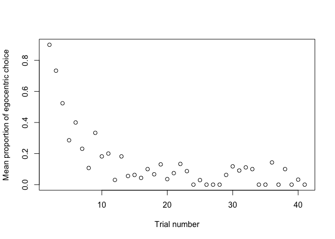
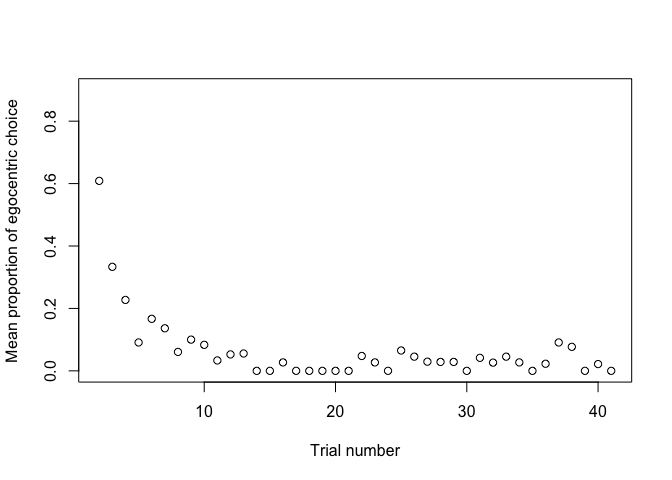
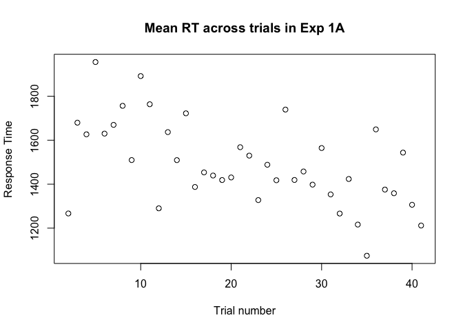
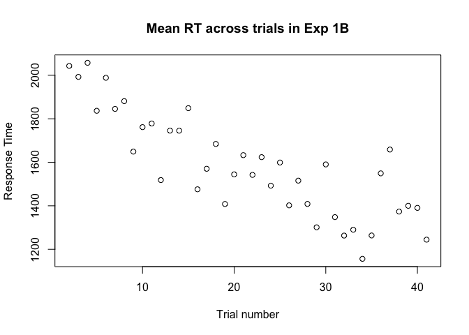

# Social and configural effects on the cognitive dynamics of perspective-taking
Alexia Galati, Rick Dale, & Nick Duran  
4/15/2017  


## Preliminaries for Exp 1A

Here we are loading in prior data analyzed using the scripts "GDD1_batchTrajectoryAnalysis.R". 
These include data from both the "error" (control) trials and the "ambiguous" (critical) trials of the experiment. 

We trim the data by removing trials that took more than 6000 ms from the initiation of the trial to selection of an initial folder or over 1000 pixels of total distance. These values reflect long tails of the distribution, well over 3 SD of their respective distributions. We chose to omit these trials because these radical divergences from their general distribution may reflect moments when the participant is not fully engaged in the task or understanding the trial. 

We then plot a histogram for the proportion of egocentric responses across participants.

Finally, we classify participants as egocentric, other-centric, and mixed responders based on their proportion of egocentric responses on ambiguous/critical trials. For classification, we computed the proportions of egocentric and other-centric responses of each listener on critical trials, and following Duran, Dale, and Kreuz (2011), if the proportion scores exceeded .70 for one of the two perspective categories, the listener was classified as member of that category; otherwise they were classified as a mixed responder.

In Exp 1A (GDD1A), the configural cue (i.e., the orientation of the folders appearing on the tabletop) is always aligned with the perspective of the participant/listener (ego-aligned configural cue).


```r
load('GDD1A_churnedRawTrajectoryData.Rd')

### Data cleaning and trimming ###

# Clean by approx. 3 SDs of M for control trials
resAllError1A = resAllError[resAllError$RTDV<6000&resAllError$totalDistanceDV<1000,]
resAll1A = resAll[resAll$RTDV<6000&resAll$totalDistanceDV<1000,]

# Create an aggregate variable to see distribution of egocentrism across subjects
egoChosen = 1*(resAll1A$chosen!=resAll1A$other)
perspectiveDistribution = aggregate(egoChosen~resAll1A$fl,FUN=mean)
hist(perspectiveDistribution$egoChosen,100, main = paste("Histogram of", "proportion of egocentrism in Exp 1A"), 
    xlab='Proportion of egocentrism',ylab='Number of subjects', ylim = range(0:20))
```

<!-- -->

```r
# Construct perspective preference variables
egoSubjects = perspectiveDistribution[perspectiveDistribution$egoChosen>.7,]$resAll1A
otherSubjects = perspectiveDistribution[perspectiveDistribution$egoChosen<.3,]$resAll1A
mixedSubjects = perspectiveDistribution[(perspectiveDistribution$egoChosen>=.3 & perspectiveDistribution$egoChosen<=.7) ,]$resAll1A

length(egoSubjects)
```

```
## [1] 33
```

```r
length(otherSubjects)
```

```
## [1] 43
```

```r
length(mixedSubjects)
```

```
## [1] 17
```

```r
length(unique(resAll1A$fl))
```

```
## [1] 93
```

```r
# Label perspectivePreference levels for Ambiguous/critical trials
resAll1A$perspectivePreference = 'mixed'
resAll1A$perspectivePreference[resAll1A$fl %in% egoSubjects]='ego'
resAll1A$perspectivePreference[resAll1A$fl %in% otherSubjects]='other'

# For Control trials let's trasfer the perspectivePreference variable over 
resAllError1A$perspectivePreference = 'mixed'
resAllError1A$perspectivePreference[resAllError1A$fl %in% egoSubjects]='ego'
resAllError1A$perspectivePreference[resAllError1A$fl %in% otherSubjects]='other'

# Add label for new Experiment (Exp) variable in the dataframes for Ambiguous/critical and Control trials
resAll1A$Exp = "1A" #Experiment 1A: folder orientation is constant = always aligned with ego
resAllError1A$Exp = "1A" #Experiment 1A: folder orientation is constant = always aligned with ego
```

## Preliminaries for Exp 1B

We repeat the same process for Exp 1B.

In Exp 1B (GDD1B), the configural cue (i.e., the orientation of the folders appearing on the tabletop) is always aligned with the perspective of the task partner/speaker (other-aligned configural cue).

The two experiments are otherwise identical.


```r
# Same procedure for Exp 1B 
load('GDD1B_churnedRawTrajectoryData.Rd') 

### Data cleaning and trimming ###

# Clean by approx. 3 SDs of M for control trials
resAllError1B = resAllError[resAllError$RTDV<6000&resAllError$totalDistanceDV<1000,]
resAll1B = resAll[resAll$RTDV<6000&resAll$totalDistanceDV<1000,]

# Create an aggregate variable to see distribution of egocentrism across subjects
egoChosen = 1*(resAll1B$chosen!=resAll1B$other)
perspectiveDistribution = aggregate(egoChosen~resAll1B$fl,FUN=mean)

hist(perspectiveDistribution$egoChosen,100, main = paste("Histogram of", "proportion of egocentrism in Exp 1B"), 
     xlab='Proportion of egocentrism',ylab='Number of subjects', ylim = range(0:30))
```

<!-- -->

```r
# Construct perspective preference variables
egoSubjects = perspectiveDistribution[perspectiveDistribution$egoChosen>.7,]$resAll1B
otherSubjects = perspectiveDistribution[perspectiveDistribution$egoChosen<.3,]$resAll1B
mixedSubjects = perspectiveDistribution[(perspectiveDistribution$egoChosen>=.3 & perspectiveDistribution$egoChosen<=.7) ,]$resAll1B

length(egoSubjects)
```

```
## [1] 18
```

```r
length(otherSubjects)
```

```
## [1] 59
```

```r
length(mixedSubjects)
```

```
## [1] 18
```

```r
length(unique(resAll1B$fl))
```

```
## [1] 95
```

```r
# Label perspectivePreference levels for Ambiguous/critical trials
resAll1B$perspectivePreference = 'mixed'
resAll1B$perspectivePreference[resAll1B$fl %in% egoSubjects]='ego'
resAll1B$perspectivePreference[resAll1B$fl %in% otherSubjects]='other'

# For Control trials let's trasfer the perspectivePreference variable over 
resAllError1B$perspectivePreference = 'mixed'
resAllError1B$perspectivePreference[resAllError1B$fl %in% egoSubjects]='ego'
resAllError1B$perspectivePreference[resAllError1B$fl %in% otherSubjects]='other'

# Add label for new Experiment (Exp) variable in the dataframes for Ambiguous/critical and Control trials
resAll1B$Exp = "1B" #Experiment 1B: folder orientation varies = always aligned with other 
resAllError1B$Exp = "1B" #Experiment 1B: folder orientation varies = always aligned with other 
```


## Preliminaries for both experiments 

We combine the dataframes for the two experiments and recode some of the variables.

Specifically, we create an "axis" variable, for which we combine "left-right" instructions to refer to the "lateral" axis, and "front-back" instructions to refer to the "sagittal" axis. This decision is motivated in more detail in the manuscript.

We create a new variable for offset, for which we assign "90"" degree offset to speaker positions 90 and 270, as we don't expect a difference between the two. For ambiguous trials this contrasts with the "180" offset; for control trials, with "0" offset.


```r
# Combine the two dataframes for ambiguous/critical trials
resAll = rbind(resAll1A, resAll1B)


# Combine the two dataframes for control trials
resAllError = rbind(resAllError1A, resAllError1B)

# Let's create axis variable to compress front-back and left-right instuctions into a sagittal and lateral axis
resAll$axis = 'sagittal'
resAll$axis[resAll$instruction %in% c('righ','left')]='lateral'

# Let's compress 90 and 270 speaker positions into a 90 offset
resAll$offset = '180'
resAll$offset[resAll$ppos %in% c('init_90','init_270')]='90'

# Create egocentric choice variable
resAll$egoChoice = 1*(resAll$chosen!=resAll$other)

# Let's create the axis variable for control trials
resAllError$axis = 'sagittal'
resAllError$axis[resAllError$instruction %in% c('righ','left')]='lateral'

# Let's compress 90 and 270 speaker positions into a 90 offset
resAllError$offset = '0'
resAllError$offset[resAllError$ppos %in% c('init_90','init_270')]='90'
```

## Descriptives

Let's get some descriptives for ambiguous and control trials 


```r
# Ambiguous/critical trials (excluding offset, to simplify)

#reconvert egoChoice to numeric if it was a factor for lmers
#resAll$egoChoice = as.numeric(as.matrix(resAll$egoChoice))
pander(aggregate(egoChoice~Exp,data=resAll,FUN=mean))
```


-----------------
 Exp   egoChoice 
----- -----------
 1A     0.4696   

 1B     0.3164   
-----------------

```r
#pander(aggregate(RTDV~perspectivePreference+Exp+axis,data=resAll,FUN=mean))
#pander(aggregate(totalDistanceDV~perspectivePreference+Exp+axis,data=resAll,FUN=mean))
#pander(aggregate(xFlipDV~perspectivePreference+Exp+axis,data=resAll,FUN=mean))

#This is to investigate what mixed responders are doing across trials in the two exps.
#resAllmixed = resAll[resAll$perspectivePreference == 'mixed',]
#options(max.print=999999)
#pander(aggregate(egoChoice~Exp+trial+fl+perspectivePreference,data=resAllmixed,FUN=mean))


# Control trials (excluding offset, to simplify)
#reconvert egoChoice to numeric if it was a factor for lmers
#resAllError$err = as.numeric(as.matrix(resAllError$err))

#pander(aggregate(err~perspectivePreference+Exp,data=resAllError,FUN=mean)) #mixed responders have high errors .25 (this is due to front-back trials, see below)
#pander(aggregate(RTDV~perspectivePreference+offset+axis+Exp,data=resAllError,FUN=mean))
#pander(aggregate(totalDistanceDV~perspectivePreference+axis+Exp,data=resAllError,FUN=mean))
#pander(aggregate(xFlipDV~perspectivePreference+axis+Exp,data=resAllError,FUN=mean))
```

## Exploratory plotting of DVs across trials to explore stabilization

We are interested in how egocentric perspective selection might differ over time in the two experiments. 
Here, we plot the proportion of egocentric choices on ambigous trials over time (i.e. across trial order).


```r
### Perspective choice by trial, in the two Exps ###

perspectiveByTrial1A = aggregate((1*(resAll1A$chosen!=resAll1A$other))~resAll1A$trial,FUN=mean)
perspectiveByTrial1B = aggregate(( 1*(resAll1B$chosen!=resAll1B$other))~resAll1B$trial,FUN=mean)

plot(perspectiveByTrial1A, main="Egocentric choice selection across trials in Exp 1A",
     xlab = "Trial number", ylab = "Mean proportion of egocentric choice", ylim = c(0, .90))
```

<!-- -->

```r
plot(perspectiveByTrial1B, main="Egocentric choice selection across trials in Exp 1B",
     xlab = "Trial number", ylab = "Mean proportion of egocentric choice", ylim = c(0, .90))
```

<!-- -->

Let's look at other-centric responders only, in the two experiments. 


```r
perspectiveByTrial1A_Othercentric = aggregate((1*(resAll1A$chosen[resAll1A$perspectivePreference %in% c('other')]!=resAll1A$other[resAll1A$perspectivePreference %in% c('other')]))~resAll1A$trial[resAll1A$perspectivePreference %in% c('other')],FUN=mean)
perspectiveByTrial1B_Othercentric = aggregate((1*(resAll1B$chosen[resAll1B$perspectivePreference %in% c('other')]!=resAll1B$other[resAll1B$perspectivePreference %in% c('other')]))~resAll1B$trial[resAll1B$perspectivePreference %in% c('other')],FUN=mean)

plot(perspectiveByTrial1A_Othercentric, # main="Egocentric choice selection of Other-centric responders across trials in Exp 1A",
     xlab = "Trial number", ylab = "Mean proportion of egocentric choice", ylim = c(0,.90))
```

<!-- -->

```r
plot(perspectiveByTrial1B_Othercentric, #main="Egocentric choice selection of Other-centric responders across trials in Exp 1B",
     xlab = "Trial number", ylab = "Mean proportion of egocentric choice", ylim = c(0, .90))
```

<!-- -->

Let's look at other DVs, specifically Response Time 


```r
RTByTrial1A = aggregate((1*(resAll1A$RTDV))~resAll1A$trial,FUN=mean)
RTByTrial1B = aggregate(( 1*(resAll1B$RTDV))~resAll1B$trial,FUN=mean)

plot(RTByTrial1A, main="Mean RT across trials in Exp 1A",
     xlab = "Trial number", ylab = "Response Time")
```

<!-- -->

```r
plot(RTByTrial1B, main="Mean RT across trials in Exp 1B",
     xlab = "Trial number", ylab = "Response Time")
```

<!-- -->

## Experiment comparisons

Before getting to the LMERs, let's compare the distribution of other, ego, mixed responders across experiments.

Let's first compare the distribution of other, ego, mixed responders in Exp 1A vs. Exp 1B.


```r
preferenceCounts <- matrix(c(59, 18, 18, 43, 33, 17), ncol=3, byrow=TRUE)
colnames(preferenceCounts) <- c("other", "ego", "mixed")
rownames(preferenceCounts) <- c("GDD1B", "GDD1A")
preferenceCounts <- as.table(preferenceCounts)
summary(preferenceCounts)
```

```
## Number of cases in table: 188 
## Number of factors: 2 
## Test for independence of all factors:
## 	Chisq = 6.93, df = 2, p-value = 0.03128
```

```r
#chisq.test(preferenceCounts)
```

Let's also compare the distributions when the classification in ego, other, mixed is based on lateral instructions only (left-right only).

This is because mixed responders (based on the previous classification, on all instruction types), made high errors on control front-back trials (esp in Exp 1B), possibly due to using a different mapping to interpret front-back. This may suggest that their responses on ambiguous trials may have not been "mixed" or random but may have simply reflected this different mapping on front-back trials. We make this point in the paper.


```r
preferenceCounts <- matrix(c(61, 25, 9, 29, 42, 22), ncol=3, byrow=TRUE)
colnames(preferenceCounts) <- c("other", "ego", "mixed")
rownames(preferenceCounts) <- c("GDD1B", "GDD1A")
preferenceCounts <- as.table(preferenceCounts)
summary(preferenceCounts)
```

```
## Number of cases in table: 188 
## Number of factors: 2 
## Test for independence of all factors:
## 	Chisq = 21.124, df = 2, p-value = 2.588e-05
```

```r
#chisq.test(preferenceCounts)
```

Let's finally compare the distribution of other, ego, mixed responders in GDD1A vs. DDK study 1 
In DDK1 there were 43 other, 31 ego, and 8 mixed. 


```r
preferenceCounts <- matrix(c(43, 33, 17, 43, 31, 8), ncol=3, byrow=TRUE)
colnames(preferenceCounts) <- c("other", "ego", "mixed")
rownames(preferenceCounts) <- c("GDD1A", "DDKstudy1")
preferenceCounts <- as.table(preferenceCounts)
summary(preferenceCounts)
```

```
## Number of cases in table: 175 
## Number of factors: 2 
## Test for independence of all factors:
## 	Chisq = 2.6214, df = 2, p-value = 0.2696
```

```r
#chisq.test(preferenceCounts) 

#The two distributions don't differ significantly. Good news for replication.
```

## Linear mixed effects models for ambiguous (critical) trials

We create separate linear mixed effects models for each of the dependent variables (proportion of egocentric choices, RT, total Distance, x-flips) on ambiguous/critical trials, combining the data from Experiment 1a and 1b. 

We start with some pre-processing of the variables, setting the reference categories where relevant, and inspecting the data structure.


```r
resAll = as.data.frame(as.matrix(resAll))

#Defining as factors in order to set reference categories next
resAll$Exp = as.factor(as.matrix(resAll$Exp))
resAll$perspectivePreference = factor(resAll$perspectivePreference)
resAll$axis = factor(resAll$axis)
resAll$offset = factor(resAll$offset)
resAll$egoChoice = factor(resAll$egoChoice)
resAll$trial = as.integer(as.matrix(resAll$trial))
resAll$fl = as.factor(as.matrix(resAll$fl))
str(resAll)
```

```
## 'data.frame':	3644 obs. of  16 variables:
##  $ fl                   : Factor w/ 188 levels "100.txt","102.txt",..: 1 1 1 1 1 1 1 1 1 1 ...
##  $ trial                : int  2 4 7 8 12 13 16 17 18 21 ...
##  $ instruction          : Factor w/ 4 levels "back","fron",..: 3 1 3 4 1 3 2 2 3 4 ...
##   ..- attr(*, "names")= chr  "1" "2" "3" "4" ...
##  $ folder_config        : Factor w/ 4 levels "D1","D2","H",..: 2 1 1 1 2 2 1 4 3 2 ...
##   ..- attr(*, "names")= chr  "1" "2" "3" "4" ...
##  $ ppos                 : Factor w/ 3 levels "init_180","init_270",..: 3 3 2 1 2 1 1 1 1 3 ...
##   ..- attr(*, "names")= chr  "1" "2" "3" "4" ...
##  $ RTDV                 : Factor w/ 1459 levels " 397"," 414",..: 154 493 1234 1411 914 1437 954 626 1106 493 ...
##   ..- attr(*, "names")= chr  "1" "2" "3" "4" ...
##  $ totalDistanceDV      : Factor w/ 3644 levels " 26.60409"," 38.59668",..: 2 1653 3634 3622 3582 3584 3492 2292 3631 3447 ...
##   ..- attr(*, "names")= chr  "1" "2" "3" "4" ...
##  $ xFlipDV              : Factor w/ 14 levels " 0"," 1"," 2",..: 1 2 2 7 4 5 5 5 5 5 ...
##   ..- attr(*, "names")= chr  "1" "2" "3" "4" ...
##  $ AC                   : Factor w/ 1 level "0": 1 1 1 1 1 1 1 1 1 1 ...
##   ..- attr(*, "names")= chr  "1" "2" "3" "4" ...
##  $ chosen               : Factor w/ 2 levels "F1","F2": 1 1 2 1 1 1 1 1 2 1 ...
##   ..- attr(*, "names")= chr  "1" "2" "3" "4" ...
##  $ other                : Factor w/ 2 levels "F1","F2": 2 2 2 1 1 2 1 1 2 1 ...
##   ..- attr(*, "names")= chr  "1" "2" "3" "4" ...
##  $ perspectivePreference: Factor w/ 3 levels "ego","mixed",..: 3 3 3 3 3 3 3 3 3 3 ...
##  $ Exp                  : Factor w/ 2 levels "1A","1B": 1 1 1 1 1 1 1 1 1 1 ...
##  $ axis                 : Factor w/ 2 levels "lateral","sagittal": 1 2 1 1 2 1 2 2 1 1 ...
##  $ offset               : Factor w/ 2 levels "180","90": 2 2 2 1 2 1 1 1 1 2 ...
##  $ egoChoice            : Factor w/ 2 levels "0","1": 2 2 1 1 1 2 1 1 1 1 ...
```

```r
contrasts(resAll$Exp)
```

```
##    1B
## 1A  0
## 1B  1
```

```r
contrasts(resAll$perspectivePreference)
```

```
##       mixed other
## ego       0     0
## mixed     1     0
## other     0     1
```

```r
contrasts(resAll$axis)
```

```
##          sagittal
## lateral         0
## sagittal        1
```

```r
contrasts(resAll$offset)
```

```
##     90
## 180  0
## 90   1
```

```r
#make sure DVs are of the right type
resAll$RTDV = as.numeric(as.matrix(resAll$RTDV))
resAll$totalDistanceDV = as.numeric(as.matrix(resAll$totalDistanceDV))
resAll$xFlipDV = as.integer(as.matrix(resAll$xFlipDV))
resAll$egoChoice = as.factor(as.matrix(resAll$egoChoice))

##Check for any "holes" in the design
#with(resAll, table(Exp, offset, axis, perspectivePreference))
#str(resAll)

#Center time/trial
resAll$centered_trial =scale(resAll$trial)
```

Step 1: Let's set up the contrast structure for each factor of interest (axis, preference, offset)


```r
resAll.cont <- within(resAll, {
  
  # Factor 1: instruction type 
  axis.latVsag <- ifelse( axis=="lateral", 1/2, 
                          ifelse( axis=="sagittal", -1/2, NA ) ) 
  
  # Factor 2: Perspective preference
  PP.othVego <- ifelse( perspectivePreference=="other", 1/2,
                        ifelse( perspectivePreference=="mixed", 0,
                                ifelse( perspectivePreference=="ego", -1/2, NA )))
  
  PP.mixVego <- ifelse( perspectivePreference=="other", 0,
                        ifelse( perspectivePreference=="mixed", 1/2,
                                ifelse( perspectivePreference=="ego", -1/2, NA )))    
  
  # Factor 3: Orientation of folders
  orient.otherVego <- ifelse( Exp=="1B", 1/2, 
                               ifelse( Exp=="1A", -1/2, NA ) ) 
  
  # Factor 4: Speaker position (offset)
  
  offset.180v90 <- ifelse( offset=="180", 1/2, 
                              ifelse( offset=="90", -1/2, NA ) )  
  
  })
```

Step 2: let's build the omnibus model for each DV with all effects of interest for research questions


```r
## Response time ##

RTModel.omni <- lmer( log(RTDV) ~ (1 | fl) 
                      + (0 + offset.180v90 | fl) 
                      + (0 + axis.latVsag | fl) 
                      + (0 + (axis.latVsag:offset.180v90) | fl) 
                      + orient.otherVego * offset.180v90 * axis.latVsag * (PP.othVego + PP.mixVego),        
                      data=resAll.cont, REML=FALSE )
summary(RTModel.omni)
```

```
## Linear mixed model fit by maximum likelihood t-tests use Satterthwaite
##   approximations to degrees of freedom [lmerMod]
## Formula: 
## log(RTDV) ~ (1 | fl) + (0 + offset.180v90 | fl) + (0 + axis.latVsag |  
##     fl) + (0 + (axis.latVsag:offset.180v90) | fl) + orient.otherVego *  
##     offset.180v90 * axis.latVsag * (PP.othVego + PP.mixVego)
##    Data: resAll.cont
## 
##      AIC      BIC   logLik deviance df.resid 
##   3450.5   3630.3  -1696.3   3392.5     3615 
## 
## Scaled residuals: 
##     Min      1Q  Median      3Q     Max 
## -3.3376 -0.6265 -0.1463  0.5046  4.6692 
## 
## Random effects:
##  Groups   Name                       Variance  Std.Dev. 
##  fl       (Intercept)                9.759e-02 3.124e-01
##  fl.1     offset.180v90              2.674e-15 5.171e-08
##  fl.2     axis.latVsag               2.233e-02 1.494e-01
##  fl.3     axis.latVsag:offset.180v90 2.177e-03 4.666e-02
##  Residual                            1.245e-01 3.529e-01
## Number of obs: 3644, groups:  fl, 188
## 
## Fixed effects:
##                                                          Estimate
## (Intercept)                                             7.160e+00
## orient.otherVego                                        2.230e-03
## offset.180v90                                           8.930e-02
## axis.latVsag                                            6.611e-02
## PP.othVego                                              2.363e-01
## PP.mixVego                                              2.943e-02
## orient.otherVego:offset.180v90                          5.371e-03
## orient.otherVego:axis.latVsag                          -6.935e-02
## offset.180v90:axis.latVsag                              2.823e-02
## orient.otherVego:PP.othVego                            -1.167e-02
## orient.otherVego:PP.mixVego                             1.612e-01
## offset.180v90:PP.othVego                                1.145e-01
## offset.180v90:PP.mixVego                                3.098e-02
## axis.latVsag:PP.othVego                                 4.254e-01
## axis.latVsag:PP.mixVego                                -5.656e-02
## orient.otherVego:offset.180v90:axis.latVsag            -5.341e-03
## orient.otherVego:offset.180v90:PP.othVego               3.483e-02
## orient.otherVego:offset.180v90:PP.mixVego              -7.933e-02
## orient.otherVego:axis.latVsag:PP.othVego                2.453e-01
## orient.otherVego:axis.latVsag:PP.mixVego               -1.699e-01
## offset.180v90:axis.latVsag:PP.othVego                   9.717e-02
## offset.180v90:axis.latVsag:PP.mixVego                  -2.450e-02
## orient.otherVego:offset.180v90:axis.latVsag:PP.othVego -1.913e-01
## orient.otherVego:offset.180v90:axis.latVsag:PP.mixVego  4.608e-02
##                                                        Std. Error
## (Intercept)                                             2.642e-02
## orient.otherVego                                        5.284e-02
## offset.180v90                                           1.337e-02
## axis.latVsag                                            1.814e-02
## PP.othVego                                              6.472e-02
## PP.mixVego                                              8.230e-02
## orient.otherVego:offset.180v90                          2.675e-02
## orient.otherVego:axis.latVsag                           3.627e-02
## offset.180v90:axis.latVsag                              2.702e-02
## orient.otherVego:PP.othVego                             1.294e-01
## orient.otherVego:PP.mixVego                             1.646e-01
## offset.180v90:PP.othVego                                3.275e-02
## offset.180v90:PP.mixVego                                4.182e-02
## axis.latVsag:PP.othVego                                 4.441e-02
## axis.latVsag:PP.mixVego                                 5.661e-02
## orient.otherVego:offset.180v90:axis.latVsag             5.404e-02
## orient.otherVego:offset.180v90:PP.othVego               6.549e-02
## orient.otherVego:offset.180v90:PP.mixVego               8.364e-02
## orient.otherVego:axis.latVsag:PP.othVego                8.882e-02
## orient.otherVego:axis.latVsag:PP.mixVego                1.132e-01
## offset.180v90:axis.latVsag:PP.othVego                   6.616e-02
## offset.180v90:axis.latVsag:PP.mixVego                   8.449e-02
## orient.otherVego:offset.180v90:axis.latVsag:PP.othVego  1.323e-01
## orient.otherVego:offset.180v90:axis.latVsag:PP.mixVego  1.690e-01
##                                                                df t value
## (Intercept)                                             1.823e+02 271.016
## orient.otherVego                                        1.823e+02   0.042
## offset.180v90                                           3.108e+03   6.677
## axis.latVsag                                            1.905e+02   3.645
## PP.othVego                                              1.821e+02   3.652
## PP.mixVego                                              1.823e+02   0.358
## orient.otherVego:offset.180v90                          3.108e+03   0.201
## orient.otherVego:axis.latVsag                           1.905e+02  -1.912
## offset.180v90:axis.latVsag                              1.920e+02   1.045
## orient.otherVego:PP.othVego                             1.821e+02  -0.090
## orient.otherVego:PP.mixVego                             1.823e+02   0.979
## offset.180v90:PP.othVego                                3.108e+03   3.495
## offset.180v90:PP.mixVego                                3.110e+03   0.741
## axis.latVsag:PP.othVego                                 1.903e+02   9.580
## axis.latVsag:PP.mixVego                                 1.925e+02  -0.999
## orient.otherVego:offset.180v90:axis.latVsag             1.920e+02  -0.099
## orient.otherVego:offset.180v90:PP.othVego               3.108e+03   0.532
## orient.otherVego:offset.180v90:PP.mixVego               3.110e+03  -0.948
## orient.otherVego:axis.latVsag:PP.othVego                1.903e+02   2.761
## orient.otherVego:axis.latVsag:PP.mixVego                1.925e+02  -1.500
## offset.180v90:axis.latVsag:PP.othVego                   1.919e+02   1.469
## offset.180v90:axis.latVsag:PP.mixVego                   1.949e+02  -0.290
## orient.otherVego:offset.180v90:axis.latVsag:PP.othVego  1.919e+02  -1.446
## orient.otherVego:offset.180v90:axis.latVsag:PP.mixVego  1.949e+02   0.273
##                                                        Pr(>|t|)    
## (Intercept)                                             < 2e-16 ***
## orient.otherVego                                       0.966380    
## offset.180v90                                          2.87e-11 ***
## axis.latVsag                                           0.000345 ***
## PP.othVego                                             0.000340 ***
## PP.mixVego                                             0.721017    
## orient.otherVego:offset.180v90                         0.840859    
## orient.otherVego:axis.latVsag                          0.057384 .  
## offset.180v90:axis.latVsag                             0.297440    
## orient.otherVego:PP.othVego                            0.928247    
## orient.otherVego:PP.mixVego                            0.328682    
## offset.180v90:PP.othVego                               0.000480 ***
## offset.180v90:PP.mixVego                               0.458850    
## axis.latVsag:PP.othVego                                 < 2e-16 ***
## axis.latVsag:PP.mixVego                                0.319047    
## orient.otherVego:offset.180v90:axis.latVsag            0.921372    
## orient.otherVego:offset.180v90:PP.othVego              0.594950    
## orient.otherVego:offset.180v90:PP.mixVego              0.342986    
## orient.otherVego:axis.latVsag:PP.othVego               0.006318 ** 
## orient.otherVego:axis.latVsag:PP.mixVego               0.135143    
## offset.180v90:axis.latVsag:PP.othVego                  0.143574    
## offset.180v90:axis.latVsag:PP.mixVego                  0.772131    
## orient.otherVego:offset.180v90:axis.latVsag:PP.othVego 0.149910    
## orient.otherVego:offset.180v90:axis.latVsag:PP.mixVego 0.785384    
## ---
## Signif. codes:  0 '***' 0.001 '**' 0.01 '*' 0.05 '.' 0.1 ' ' 1
```

```
## 
## Correlation matrix not shown by default, as p = 24 > 12.
## Use print(x, correlation=TRUE)  or
## 	 vcov(x)	 if you need it
```

```r
#print('RT:'); pander(print_stats(RTModel.omni))

## Distance ##

DistanceModel.omni <- lmer( log(totalDistanceDV) ~ (1 | fl) 
                      + (0 + offset.180v90 | fl) 
                      + (0 + axis.latVsag | fl) 
                      + (0 + (axis.latVsag:offset.180v90) | fl)
                      + orient.otherVego * offset.180v90 * axis.latVsag * (PP.othVego + PP.mixVego),        
                      data=resAll.cont, REML=FALSE )
summary(DistanceModel.omni)
```

```
## Linear mixed model fit by maximum likelihood t-tests use Satterthwaite
##   approximations to degrees of freedom [lmerMod]
## Formula: log(totalDistanceDV) ~ (1 | fl) + (0 + offset.180v90 | fl) +  
##     (0 + axis.latVsag | fl) + (0 + (axis.latVsag:offset.180v90) |  
##     fl) + orient.otherVego * offset.180v90 * axis.latVsag * (PP.othVego +  
##     PP.mixVego)
##    Data: resAll.cont
## 
##      AIC      BIC   logLik deviance df.resid 
##    949.4   1129.2   -445.7    891.4     3615 
## 
## Scaled residuals: 
##     Min      1Q  Median      3Q     Max 
## -9.5836 -0.6006 -0.0848  0.4276  4.5158 
## 
## Random effects:
##  Groups   Name                       Variance Std.Dev.
##  fl       (Intercept)                0.019792 0.14068 
##  fl.1     offset.180v90              0.000000 0.00000 
##  fl.2     axis.latVsag               0.001944 0.04409 
##  fl.3     axis.latVsag:offset.180v90 0.000000 0.00000 
##  Residual                            0.067352 0.25952 
## Number of obs: 3644, groups:  fl, 188
## 
## Fixed effects:
##                                                          Estimate
## (Intercept)                                             5.649e+00
## orient.otherVego                                       -1.596e-02
## offset.180v90                                           4.101e-02
## axis.latVsag                                            1.609e-02
## PP.othVego                                              8.583e-02
## PP.mixVego                                              3.037e-02
## orient.otherVego:offset.180v90                          1.828e-02
## orient.otherVego:axis.latVsag                          -1.803e-02
## offset.180v90:axis.latVsag                              4.142e-02
## orient.otherVego:PP.othVego                            -7.191e-02
## orient.otherVego:PP.mixVego                             1.410e-01
## offset.180v90:PP.othVego                                9.614e-02
## offset.180v90:PP.mixVego                               -1.356e-02
## axis.latVsag:PP.othVego                                 1.291e-01
## axis.latVsag:PP.mixVego                                -7.543e-02
## orient.otherVego:offset.180v90:axis.latVsag             4.446e-03
## orient.otherVego:offset.180v90:PP.othVego               7.826e-04
## orient.otherVego:offset.180v90:PP.mixVego               1.018e-02
## orient.otherVego:axis.latVsag:PP.othVego               -6.772e-03
## orient.otherVego:axis.latVsag:PP.mixVego                5.716e-02
## offset.180v90:axis.latVsag:PP.othVego                   7.629e-03
## offset.180v90:axis.latVsag:PP.mixVego                  -3.430e-02
## orient.otherVego:offset.180v90:axis.latVsag:PP.othVego -6.280e-02
## orient.otherVego:offset.180v90:axis.latVsag:PP.mixVego -1.246e-03
##                                                        Std. Error
## (Intercept)                                             1.252e-02
## orient.otherVego                                        2.504e-02
## offset.180v90                                           9.834e-03
## axis.latVsag                                            1.048e-02
## PP.othVego                                              3.067e-02
## PP.mixVego                                              3.902e-02
## orient.otherVego:offset.180v90                          1.967e-02
## orient.otherVego:axis.latVsag                           2.096e-02
## offset.180v90:axis.latVsag                              1.967e-02
## orient.otherVego:PP.othVego                             6.134e-02
## orient.otherVego:PP.mixVego                             7.803e-02
## offset.180v90:PP.othVego                                2.408e-02
## offset.180v90:PP.mixVego                                3.075e-02
## axis.latVsag:PP.othVego                                 2.566e-02
## axis.latVsag:PP.mixVego                                 3.277e-02
## orient.otherVego:offset.180v90:axis.latVsag             3.934e-02
## orient.otherVego:offset.180v90:PP.othVego               4.815e-02
## orient.otherVego:offset.180v90:PP.mixVego               6.150e-02
## orient.otherVego:axis.latVsag:PP.othVego                5.132e-02
## orient.otherVego:axis.latVsag:PP.mixVego                6.553e-02
## offset.180v90:axis.latVsag:PP.othVego                   4.816e-02
## offset.180v90:axis.latVsag:PP.mixVego                   6.151e-02
## orient.otherVego:offset.180v90:axis.latVsag:PP.othVego  9.632e-02
## orient.otherVego:offset.180v90:axis.latVsag:PP.mixVego  1.230e-01
##                                                                df t value
## (Intercept)                                             1.890e+02 451.145
## orient.otherVego                                        1.890e+02  -0.637
## offset.180v90                                           3.267e+03   4.171
## axis.latVsag                                            1.900e+02   1.535
## PP.othVego                                              1.890e+02   2.798
## PP.mixVego                                              1.900e+02   0.778
## orient.otherVego:offset.180v90                          3.267e+03   0.930
## orient.otherVego:axis.latVsag                           1.900e+02  -0.860
## offset.180v90:axis.latVsag                              3.266e+03   2.106
## orient.otherVego:PP.othVego                             1.890e+02  -1.172
## orient.otherVego:PP.mixVego                             1.900e+02   1.808
## offset.180v90:PP.othVego                                3.268e+03   3.993
## offset.180v90:PP.mixVego                                3.266e+03  -0.441
## axis.latVsag:PP.othVego                                 1.900e+02   5.031
## axis.latVsag:PP.mixVego                                 1.930e+02  -2.302
## orient.otherVego:offset.180v90:axis.latVsag             3.266e+03   0.113
## orient.otherVego:offset.180v90:PP.othVego               3.268e+03   0.016
## orient.otherVego:offset.180v90:PP.mixVego               3.266e+03   0.166
## orient.otherVego:axis.latVsag:PP.othVego                1.900e+02  -0.132
## orient.otherVego:axis.latVsag:PP.mixVego                1.930e+02   0.872
## offset.180v90:axis.latVsag:PP.othVego                   3.267e+03   0.158
## offset.180v90:axis.latVsag:PP.mixVego                   3.265e+03  -0.558
## orient.otherVego:offset.180v90:axis.latVsag:PP.othVego  3.267e+03  -0.652
## orient.otherVego:offset.180v90:axis.latVsag:PP.mixVego  3.265e+03  -0.010
##                                                        Pr(>|t|)    
## (Intercept)                                             < 2e-16 ***
## orient.otherVego                                        0.52465    
## offset.180v90                                          3.12e-05 ***
## axis.latVsag                                            0.12642    
## PP.othVego                                              0.00567 ** 
## PP.mixVego                                              0.43736    
## orient.otherVego:offset.180v90                          0.35270    
## orient.otherVego:axis.latVsag                           0.39090    
## offset.180v90:axis.latVsag                              0.03530 *  
## orient.otherVego:PP.othVego                             0.24253    
## orient.otherVego:PP.mixVego                             0.07227 .  
## offset.180v90:PP.othVego                               6.67e-05 ***
## offset.180v90:PP.mixVego                                0.65920    
## axis.latVsag:PP.othVego                                1.13e-06 ***
## axis.latVsag:PP.mixVego                                 0.02239 *  
## orient.otherVego:offset.180v90:axis.latVsag             0.91002    
## orient.otherVego:offset.180v90:PP.othVego               0.98703    
## orient.otherVego:offset.180v90:PP.mixVego               0.86851    
## orient.otherVego:axis.latVsag:PP.othVego                0.89516    
## orient.otherVego:axis.latVsag:PP.mixVego                0.38419    
## offset.180v90:axis.latVsag:PP.othVego                   0.87414    
## offset.180v90:axis.latVsag:PP.mixVego                   0.57712    
## orient.otherVego:offset.180v90:axis.latVsag:PP.othVego  0.51444    
## orient.otherVego:offset.180v90:axis.latVsag:PP.mixVego  0.99192    
## ---
## Signif. codes:  0 '***' 0.001 '**' 0.01 '*' 0.05 '.' 0.1 ' ' 1
```

```
## 
## Correlation matrix not shown by default, as p = 24 > 12.
## Use print(x, correlation=TRUE)  or
## 	 vcov(x)	 if you need it
```

```r
#print('Distance:'); pander(print_stats(DistanceModel.omni))


## Directional Shifts ##

xFlipModel.omni <- lmer( xFlipDV ~ (1 | fl) 
                            + (0 + offset.180v90 | fl) 
                            + (0 + axis.latVsag | fl) 
                            + (0 + (axis.latVsag:offset.180v90) | fl)
                            + orient.otherVego * offset.180v90 * axis.latVsag * (PP.othVego + PP.mixVego),  
                            #family = "poisson",
                            data=resAll.cont, REML=FALSE )
summary(xFlipModel.omni) 
```

```
## Linear mixed model fit by maximum likelihood t-tests use Satterthwaite
##   approximations to degrees of freedom [lmerMod]
## Formula: 
## xFlipDV ~ (1 | fl) + (0 + offset.180v90 | fl) + (0 + axis.latVsag |  
##     fl) + (0 + (axis.latVsag:offset.180v90) | fl) + orient.otherVego *  
##     offset.180v90 * axis.latVsag * (PP.othVego + PP.mixVego)
##    Data: resAll.cont
## 
##      AIC      BIC   logLik deviance df.resid 
##  12688.1  12868.0  -6315.1  12630.1     3615 
## 
## Scaled residuals: 
##     Min      1Q  Median      3Q     Max 
## -3.4541 -0.6397 -0.1149  0.5043  7.3531 
## 
## Random effects:
##  Groups   Name                       Variance  Std.Dev. 
##  fl       (Intercept)                6.536e-01 8.084e-01
##  fl.1     offset.180v90              2.061e-17 4.540e-09
##  fl.2     axis.latVsag               5.522e-02 2.350e-01
##  fl.3     axis.latVsag:offset.180v90 0.000e+00 0.000e+00
##  Residual                            1.665e+00 1.290e+00
## Number of obs: 3644, groups:  fl, 188
## 
## Fixed effects:
##                                                          Estimate
## (Intercept)                                               1.92801
## orient.otherVego                                          0.18570
## offset.180v90                                             0.07961
## axis.latVsag                                             -0.02844
## PP.othVego                                                0.23311
## PP.mixVego                                                0.29959
## orient.otherVego:offset.180v90                           -0.10856
## orient.otherVego:axis.latVsag                            -0.09704
## offset.180v90:axis.latVsag                                0.18474
## orient.otherVego:PP.othVego                              -0.47796
## orient.otherVego:PP.mixVego                               1.01219
## offset.180v90:PP.othVego                                  0.32071
## offset.180v90:PP.mixVego                                  0.05085
## axis.latVsag:PP.othVego                                   0.52764
## axis.latVsag:PP.mixVego                                  -0.08169
## orient.otherVego:offset.180v90:axis.latVsag               0.30381
## orient.otherVego:offset.180v90:PP.othVego                 0.40231
## orient.otherVego:offset.180v90:PP.mixVego                -0.22499
## orient.otherVego:axis.latVsag:PP.othVego                  0.12703
## orient.otherVego:axis.latVsag:PP.mixVego                  0.04603
## offset.180v90:axis.latVsag:PP.othVego                     0.55497
## offset.180v90:axis.latVsag:PP.mixVego                    -0.41054
## orient.otherVego:offset.180v90:axis.latVsag:PP.othVego   -0.99985
## orient.otherVego:offset.180v90:axis.latVsag:PP.mixVego    0.37655
##                                                        Std. Error
## (Intercept)                                               0.07054
## orient.otherVego                                          0.14107
## offset.180v90                                             0.04889
## axis.latVsag                                              0.05257
## PP.othVego                                                0.17278
## PP.mixVego                                                0.21976
## orient.otherVego:offset.180v90                            0.09778
## orient.otherVego:axis.latVsag                             0.10514
## offset.180v90:axis.latVsag                                0.09779
## orient.otherVego:PP.othVego                               0.34556
## orient.otherVego:PP.mixVego                               0.43952
## offset.180v90:PP.othVego                                  0.11971
## offset.180v90:PP.mixVego                                  0.15289
## axis.latVsag:PP.othVego                                   0.12871
## axis.latVsag:PP.mixVego                                   0.16434
## orient.otherVego:offset.180v90:axis.latVsag               0.19558
## orient.otherVego:offset.180v90:PP.othVego                 0.23942
## orient.otherVego:offset.180v90:PP.mixVego                 0.30577
## orient.otherVego:axis.latVsag:PP.othVego                  0.25741
## orient.otherVego:axis.latVsag:PP.mixVego                  0.32867
## offset.180v90:axis.latVsag:PP.othVego                     0.23944
## offset.180v90:axis.latVsag:PP.mixVego                     0.30581
## orient.otherVego:offset.180v90:axis.latVsag:PP.othVego    0.47888
## orient.otherVego:offset.180v90:axis.latVsag:PP.mixVego    0.61162
##                                                                df t value
## (Intercept)                                             188.00000  27.334
## orient.otherVego                                        188.00000   1.316
## offset.180v90                                          3274.00000   1.628
## axis.latVsag                                            199.00000  -0.541
## PP.othVego                                              188.00000   1.349
## PP.mixVego                                              188.00000   1.363
## orient.otherVego:offset.180v90                         3274.00000  -1.110
## orient.otherVego:axis.latVsag                           199.00000  -0.923
## offset.180v90:axis.latVsag                             3273.00000   1.889
## orient.otherVego:PP.othVego                             188.00000  -1.383
## orient.otherVego:PP.mixVego                             188.00000   2.303
## offset.180v90:PP.othVego                               3275.00000   2.679
## offset.180v90:PP.mixVego                               3273.00000   0.333
## axis.latVsag:PP.othVego                                 199.00000   4.100
## axis.latVsag:PP.mixVego                                 202.00000  -0.497
## orient.otherVego:offset.180v90:axis.latVsag            3273.00000   1.553
## orient.otherVego:offset.180v90:PP.othVego              3275.00000   1.680
## orient.otherVego:offset.180v90:PP.mixVego              3273.00000  -0.736
## orient.otherVego:axis.latVsag:PP.othVego                199.00000   0.494
## orient.otherVego:axis.latVsag:PP.mixVego                202.00000   0.140
## offset.180v90:axis.latVsag:PP.othVego                  3274.00000   2.318
## offset.180v90:axis.latVsag:PP.mixVego                  3272.00000  -1.342
## orient.otherVego:offset.180v90:axis.latVsag:PP.othVego 3274.00000  -2.088
## orient.otherVego:offset.180v90:axis.latVsag:PP.mixVego 3272.00000   0.616
##                                                        Pr(>|t|)    
## (Intercept)                                             < 2e-16 ***
## orient.otherVego                                        0.18967    
## offset.180v90                                           0.10358    
## axis.latVsag                                            0.58914    
## PP.othVego                                              0.17891    
## PP.mixVego                                              0.17443    
## orient.otherVego:offset.180v90                          0.26699    
## orient.otherVego:axis.latVsag                           0.35715    
## offset.180v90:axis.latVsag                              0.05896 .  
## orient.otherVego:PP.othVego                             0.16827    
## orient.otherVego:PP.mixVego                             0.02238 *  
## offset.180v90:PP.othVego                                0.00742 ** 
## offset.180v90:PP.mixVego                                0.73948    
## axis.latVsag:PP.othVego                                6.02e-05 ***
## axis.latVsag:PP.mixVego                                 0.61966    
## orient.otherVego:offset.180v90:axis.latVsag             0.12043    
## orient.otherVego:offset.180v90:PP.othVego               0.09298 .  
## orient.otherVego:offset.180v90:PP.mixVego               0.46190    
## orient.otherVego:axis.latVsag:PP.othVego                0.62220    
## orient.otherVego:axis.latVsag:PP.mixVego                0.88877    
## offset.180v90:axis.latVsag:PP.othVego                   0.02052 *  
## offset.180v90:axis.latVsag:PP.mixVego                   0.17953    
## orient.otherVego:offset.180v90:axis.latVsag:PP.othVego  0.03688 *  
## orient.otherVego:offset.180v90:axis.latVsag:PP.mixVego  0.53816    
## ---
## Signif. codes:  0 '***' 0.001 '**' 0.01 '*' 0.05 '.' 0.1 ' ' 1
```

```
## 
## Correlation matrix not shown by default, as p = 24 > 12.
## Use print(x, correlation=TRUE)  or
## 	 vcov(x)	 if you need it
```

```r
#print('Directional Shifts:'); pander(print_stats(xFlipModel.omni))


# Egocentric Choice models

ChoiceModel.omni <- glmer(egoChoice ~ (1 | fl)
                          #+ (0 + offset.180v90 | fl) 
                          #+ (0 + axis.latVsag | fl) 
                          #+ (0 + (axis.latVsag:offset.180v90) | fl)
                          + orient.otherVego * offset.180v90 * axis.latVsag, 
                          data=resAll.cont,
                          family = "binomial",
                          # method = "Laplace",
                          nAGQ = 1, #due to warning message, model converges with this
                          REML = FALSE)
```

```
## Warning: extra argument(s) 'REML' disregarded
```

```r
summary(ChoiceModel.omni)
```

```
## Generalized linear mixed model fit by maximum likelihood (Laplace
##   Approximation) [glmerMod]
##  Family: binomial  ( logit )
## Formula: 
## egoChoice ~ (1 | fl) + orient.otherVego * offset.180v90 * axis.latVsag
##    Data: resAll.cont
## 
##      AIC      BIC   logLik deviance df.resid 
##   2668.2   2724.0  -1325.1   2650.2     3635 
## 
## Scaled residuals: 
##     Min      1Q  Median      3Q     Max 
## -6.7308 -0.3212 -0.1273  0.1939  7.1455 
## 
## Random effects:
##  Groups Name        Variance Std.Dev.
##  fl     (Intercept) 10.34    3.215   
## Number of obs: 3644, groups:  fl, 188
## 
## Fixed effects:
##                                             Estimate Std. Error z value
## (Intercept)                                 -0.80766    0.24657  -3.276
## orient.otherVego                            -1.65621    0.49426  -3.351
## offset.180v90                               -0.05402    0.10643  -0.508
## axis.latVsag                                 1.29324    0.11393  11.352
## orient.otherVego:offset.180v90               0.19023    0.21286   0.894
## orient.otherVego:axis.latVsag               -0.99116    0.22627  -4.380
## offset.180v90:axis.latVsag                  -0.34568    0.21317  -1.622
## orient.otherVego:offset.180v90:axis.latVsag -0.55389    0.42629  -1.299
##                                             Pr(>|z|)    
## (Intercept)                                 0.001054 ** 
## orient.otherVego                            0.000806 ***
## offset.180v90                               0.611749    
## axis.latVsag                                 < 2e-16 ***
## orient.otherVego:offset.180v90              0.371499    
## orient.otherVego:axis.latVsag               1.18e-05 ***
## offset.180v90:axis.latVsag                  0.104880    
## orient.otherVego:offset.180v90:axis.latVsag 0.193835    
## ---
## Signif. codes:  0 '***' 0.001 '**' 0.01 '*' 0.05 '.' 0.1 ' ' 1
## 
## Correlation of Fixed Effects:
##             (Intr) ornt.V of.18090 axs.lV or.V:.18090 o.V:.V o.18090:
## orint.thrVg  0.004                                                   
## offst.18090 -0.040 -0.002                                            
## axis.latVsg -0.025 -0.016  0.026                                     
## or.V:.18090 -0.003 -0.041  0.035    0.030                            
## ornt.thV:.V -0.005 -0.017  0.029   -0.051  0.026                     
## of.18090:.V  0.012  0.006 -0.096   -0.193  0.001      -0.020         
## o.V:.18090:  0.005  0.012  0.001   -0.023 -0.096      -0.192  0.039
```

Step 3: Get the effect sizes of omnibus based on the MuMIn package - designed for mixed effects models


```r
#changing the format of the random effect structure to overcome issues with the MuMIn package
RTModel.omni <- lmer( log(RTDV) ~ (1 + offset.180v90 + axis.latVsag + (axis.latVsag:offset.180v90) | fl) 
                      + orient.otherVego * offset.180v90 * axis.latVsag * (PP.othVego + PP.mixVego),        
                      data=resAll.cont, REML=FALSE )
```

```
## Warning in checkConv(attr(opt, "derivs"), opt$par, ctrl = control
## $checkConv, : unable to evaluate scaled gradient
```

```
## Warning in checkConv(attr(opt, "derivs"), opt$par, ctrl = control
## $checkConv, : Model failed to converge: degenerate Hessian with 1 negative
## eigenvalues
```

```r
r.squaredGLMM(RTModel.omni)[1]
```

```
##       R2m 
## 0.1113398
```

```r
r.squaredGLMM(RTModel.omni)[2]
```

```
##       R2c 
## 0.5161973
```

```r
#alternative computation of R-squared from Xu (2003)
r.sqrt=1-var(residuals(RTModel.omni))/(var(model.response(model.frame(RTModel.omni))))

#changing the format of the random effect structure to overcome issues with the MuMIn package
DistanceModel.omni <- lmer( log(totalDistanceDV) ~ (1 + offset.180v90 + axis.latVsag + (axis.latVsag:offset.180v90) | fl) 
                            + orient.otherVego * offset.180v90 * axis.latVsag * (PP.othVego + PP.mixVego),        
                            data=resAll.cont, REML=FALSE )
r.squaredGLMM(DistanceModel.omni)[1]
```

```
##        R2m 
## 0.05029852
```

```r
r.squaredGLMM(DistanceModel.omni)[2]
```

```
##       R2c 
## 0.2745541
```

```r
#changing the format of the random effect structure to overcome issues with the MuMIn package
xFlipModel.omni <- lmer( xFlipDV ~ (1 + offset.180v90 +axis.latVsag + (axis.latVsag:offset.180v90) | fl) 
                         + orient.otherVego * offset.180v90 * axis.latVsag * (PP.othVego + PP.mixVego),  
                         #family = "poisson",
                         data=resAll.cont, REML=FALSE )
```

```
## Warning in checkConv(attr(opt, "derivs"), opt$par, ctrl = control
## $checkConv, : unable to evaluate scaled gradient

## Warning in checkConv(attr(opt, "derivs"), opt$par, ctrl = control
## $checkConv, : Model failed to converge: degenerate Hessian with 1 negative
## eigenvalues
```

```r
r.squaredGLMM(xFlipModel.omni)[1]
```

```
##       R2m 
## 0.0361575
```

```r
r.squaredGLMM(xFlipModel.omni)[2]
```

```
##       R2c 
## 0.3149371
```

```r
#Choice model only has random intercept in random effect structure; no changes needed
r.squaredGLMM(ChoiceModel.omni)[1]
```

```
## Warning: extra argument(s) 'REML' disregarded
```

```
## Warning in checkConv(attr(opt, "derivs"), opt$par, ctrl = control
## $checkConv, : Model failed to converge with max|grad| = 0.00317589 (tol =
## 0.001, component 1)
```

```
## The result is correct only if all data used by the model has not changed since model was fitted.
```

```
##        R2m 
## 0.07696019
```

```r
r.squaredGLMM(ChoiceModel.omni)[2] #even though the model converges when ran, I'm getting warnings here
```

```
## Warning: extra argument(s) 'REML' disregarded

## Warning: Model failed to converge with max|grad| = 0.00317589 (tol = 0.001,
## component 1)
```

```
## The result is correct only if all data used by the model has not changed since model was fitted.
```

```
##       R2c 
## 0.7772282
```

STEP 4a: In order to interpret the individual coefficients of the 2-way and 3-way interactions, we need to first establish that the overall interactions are statisticall significant
## Note: Testing the 2-way interaction between perspectivePreference and config


```r
#This function cleans up the output of the likelihood-ratio tests
modComp = function(model1,model2,modname){
  
  llcomp = anova(model1,model2)
  df1 = llcomp$"Chi Df"[2]
  chi1 = llcomp$"Chisq"[2]
  pr1 = llcomp$"Pr(>Chisq)"[2]
  
  test1 = data.frame(c(df1,chi1,pr1))
  colnames(test1) = modname
  rownames(test1) = c("df","chi","p")
  return(test1)
}

## Note: what this does below is remove the critical 2-way interaction coefficients from the omnibus and then compares to the omni with likelihood ratio test

#1 Orientation x Perspective Preference 
twoway.RTModel.OrientvsPP = update(RTModel.omni,.~.-PP.othVego:orient.otherVego
                                   -PP.mixVego:orient.otherVego)
```

```
## Warning in checkConv(attr(opt, "derivs"), opt$par, ctrl = control
## $checkConv, : unable to evaluate scaled gradient
```

```
## Warning in checkConv(attr(opt, "derivs"), opt$par, ctrl = control
## $checkConv, : Model failed to converge: degenerate Hessian with 1 negative
## eigenvalues
```

```r
modComp(RTModel.omni,twoway.RTModel.OrientvsPP,"twoway.RTModel.OrientvsPP")
```

```
##     twoway.RTModel.OrientvsPP
## df                   2.000000
## chi                  1.155192
## p                    0.561246
```

```r
twoway.DistanceModel.OrientvsPP = update(DistanceModel.omni,.~.-PP.othVego:orient.otherVego
                                   -PP.mixVego:orient.otherVego)
modComp(DistanceModel.omni,twoway.DistanceModel.OrientvsPP,"twoway.DistanceModel.OrientvsPP")
```

```
##     twoway.DistanceModel.OrientvsPP
## df                        2.0000000
## chi                       3.4233373
## p                         0.1805642
```

```r
twoway.xFlipModel.OrientvsPP = update(xFlipModel.omni,.~.-PP.othVego:orient.otherVego
                                         -PP.mixVego:orient.otherVego)
```

```
## Warning in checkConv(attr(opt, "derivs"), opt$par, ctrl = control
## $checkConv, : unable to evaluate scaled gradient

## Warning in checkConv(attr(opt, "derivs"), opt$par, ctrl = control
## $checkConv, : Model failed to converge: degenerate Hessian with 1 negative
## eigenvalues
```

```r
modComp(xFlipModel.omni,twoway.xFlipModel.OrientvsPP,"twoway.xFlipModel.OrientvsPP")
```

```
##     twoway.xFlipModel.OrientvsPP
## df                    2.00000000
## chi                   5.41322309
## p                     0.06676265
```

```r
#2 Orientation x Offset
twoway.RTModel.OrientvsOffset = update(RTModel.omni,.~.-orient.otherVego:offset.180v90)
```

```
## Warning in checkConv(attr(opt, "derivs"), opt$par, ctrl = control
## $checkConv, : unable to evaluate scaled gradient

## Warning in checkConv(attr(opt, "derivs"), opt$par, ctrl = control
## $checkConv, : Model failed to converge: degenerate Hessian with 1 negative
## eigenvalues
```

```r
modComp(RTModel.omni,twoway.RTModel.OrientvsOffset,"twoway.RTModel.OrientvsOffset")
```

```
##     twoway.RTModel.OrientvsOffset
## df                     1.00000000
## chi                    0.03514807
## p                      0.85128573
```

```r
twoway.DistanceModel.OrientvsOffset = update(DistanceModel.omni,.~.-orient.otherVego:offset.180v90)
modComp(DistanceModel.omni,twoway.DistanceModel.OrientvsOffset,"twoway.DistanceModel.OrientvsOffset")
```

```
##     twoway.DistanceModel.OrientvsOffset
## df                            1.0000000
## chi                           0.8103659
## p                             0.3680121
```

```r
twoway.xFlipModel.OrientvsOffset = update(xFlipModel.omni,.~.-orient.otherVego:offset.180v90)
```

```
## Warning in checkConv(attr(opt, "derivs"), opt$par, ctrl = control
## $checkConv, : unable to evaluate scaled gradient

## Warning in checkConv(attr(opt, "derivs"), opt$par, ctrl = control
## $checkConv, : Model failed to converge: degenerate Hessian with 1 negative
## eigenvalues
```

```r
modComp(xFlipModel.omni,twoway.xFlipModel.OrientvsOffset,"twoway.xFlipModel.OrientvsOffset")
```

```
##     twoway.xFlipModel.OrientvsOffset
## df                         1.0000000
## chi                        1.1141582
## p                          0.2911798
```

```r
twoway.ChoiceModel.OrientvsOffset = update(ChoiceModel.omni,.~.-orient.otherVego:offset.180v90)
```

```
## Warning: extra argument(s) 'REML' disregarded
```

```r
modComp(ChoiceModel.omni,twoway.ChoiceModel.OrientvsOffset,"twoway.ChoiceModel.OrientvsOffset")
```

```
##     twoway.ChoiceModel.OrientvsOffset
## df                           1.000000
## chi                          0.720927
## p                            0.395840
```

```r
#3 Orientation x Axis (instruction type)
twoway.RTModel.OrientvsAxis = update(RTModel.omni,.~.-orient.otherVego:axis.latVsag)
```

```
## Warning in checkConv(attr(opt, "derivs"), opt$par, ctrl = control
## $checkConv, : unable to evaluate scaled gradient

## Warning in checkConv(attr(opt, "derivs"), opt$par, ctrl = control
## $checkConv, : Model failed to converge: degenerate Hessian with 1 negative
## eigenvalues
```

```r
modComp(RTModel.omni,twoway.RTModel.OrientvsAxis,"twoway.RTModel.OrientvsAxis")
```

```
##     twoway.RTModel.OrientvsAxis
## df                   1.00000000
## chi                  3.75321899
## p                    0.05270592
```

```r
twoway.DistanceModel.OrientvsAxis = update(DistanceModel.omni,.~.-orient.otherVego:axis.latVsag)
modComp(DistanceModel.omni,twoway.DistanceModel.OrientvsAxis,"twoway.DistanceModel.OrientvsAxis")
```

```
##     twoway.DistanceModel.OrientvsAxis
## df                          1.0000000
## chi                         0.7093711
## p                           0.3996527
```

```r
twoway.xFlipModel.OrientvsAxis = update(xFlipModel.omni,.~.-orient.otherVego:axis.latVsag)
```

```
## Warning in checkConv(attr(opt, "derivs"), opt$par, ctrl = control
## $checkConv, : unable to evaluate scaled gradient

## Warning in checkConv(attr(opt, "derivs"), opt$par, ctrl = control
## $checkConv, : Model failed to converge: degenerate Hessian with 1 negative
## eigenvalues
```

```r
modComp(xFlipModel.omni,twoway.xFlipModel.OrientvsAxis,"twoway.xFlipModel.OrientvsAxis")
```

```
##     twoway.xFlipModel.OrientvsAxis
## df                       1.0000000
## chi                      0.8390938
## p                        0.3596561
```

```r
twoway.ChoiceModel.OrientvsAxis = update(ChoiceModel.omni,.~.-orient.otherVego:axis.latVsag)
```

```
## Warning: extra argument(s) 'REML' disregarded
```

```r
modComp(ChoiceModel.omni,twoway.ChoiceModel.OrientvsAxis,"twoway.ChoiceModel.OrientvsAxis")
```

```
##     twoway.ChoiceModel.OrientvsAxis
## df                     1.000000e+00
## chi                    1.765313e+01
## p                      2.650780e-05
```

```r
#4 Preference x Axis (instruction type)
twoway.RTModel.PPvsAxis = update(RTModel.omni,.~.-PP.othVego:axis.latVsag
                                   -PP.mixVego:axis.latVsag)
modComp(RTModel.omni,twoway.RTModel.PPvsAxis,"twoway.RTModel.PPvsAxis")
```

```
##     twoway.RTModel.PPvsAxis
## df             2.000000e+00
## chi            8.643504e+01
## p              1.701645e-19
```

```r
twoway.DistanceModel.PPvsAxis = update(DistanceModel.omni,.~.-PP.othVego:axis.latVsag
                                 -PP.mixVego:axis.latVsag)
modComp(DistanceModel.omni,twoway.DistanceModel.PPvsAxis,"twoway.DistanceModel.PPvsAxis")
```

```
##     twoway.DistanceModel.PPvsAxis
## df                   2.000000e+00
## chi                  2.314562e+01
## p                    9.418745e-06
```

```r
twoway.xFlipModel.PPvsAxis = update(xFlipModel.omni,.~.-PP.othVego:axis.latVsag
                                       -PP.mixVego:axis.latVsag)
```

```
## Warning in checkConv(attr(opt, "derivs"), opt$par, ctrl = control
## $checkConv, : unable to evaluate scaled gradient

## Warning in checkConv(attr(opt, "derivs"), opt$par, ctrl = control
## $checkConv, : Model failed to converge: degenerate Hessian with 1 negative
## eigenvalues
```

```r
modComp(xFlipModel.omni,twoway.xFlipModel.PPvsAxis,"twoway.xFlipModel.PPvsAxis")
```

```
##     twoway.xFlipModel.PPvsAxis
## df                2.000000e+00
## chi               1.896988e+01
## p                 7.598767e-05
```

```r
#5 Preference x Offset
twoway.RTModel.PPvsOffset = update(RTModel.omni,.~.-PP.othVego:offset.180v90
                                 -PP.mixVego:offset.180v90)
```

```
## Warning in checkConv(attr(opt, "derivs"), opt$par, ctrl = control
## $checkConv, : unable to evaluate scaled gradient

## Warning in checkConv(attr(opt, "derivs"), opt$par, ctrl = control
## $checkConv, : Model failed to converge: degenerate Hessian with 1 negative
## eigenvalues
```

```r
modComp(RTModel.omni,twoway.RTModel.PPvsOffset,"twoway.RTModel.PPvsOffset")
```

```
##     twoway.RTModel.PPvsOffset
## df               2.000000e+00
## chi              1.985948e+01
## p                4.870434e-05
```

```r
twoway.DistanceModel.PPvsOffset = update(DistanceModel.omni,.~.-PP.othVego:offset.180v90
                                   -PP.mixVego:offset.180v90)
```

```
## Warning in checkConv(attr(opt, "derivs"), opt$par, ctrl = control
## $checkConv, : unable to evaluate scaled gradient

## Warning in checkConv(attr(opt, "derivs"), opt$par, ctrl = control
## $checkConv, : Model failed to converge: degenerate Hessian with 1 negative
## eigenvalues
```

```r
modComp(DistanceModel.omni,twoway.DistanceModel.PPvsOffset,"twoway.DistanceModel.PPvsOffset")
```

```
##     twoway.DistanceModel.PPvsOffset
## df                     2.000000e+00
## chi                    1.863185e+01
## p                      8.997987e-05
```

```r
twoway.xFlipModel.PPvsOffset = update(xFlipModel.omni,.~.-PP.othVego:offset.180v90
                                         -PP.mixVego:offset.180v90)
```

```
## Warning in checkConv(attr(opt, "derivs"), opt$par, ctrl = control
## $checkConv, : unable to evaluate scaled gradient

## Warning in checkConv(attr(opt, "derivs"), opt$par, ctrl = control
## $checkConv, : Model failed to converge: degenerate Hessian with 1 negative
## eigenvalues
```

```r
modComp(xFlipModel.omni,twoway.xFlipModel.PPvsOffset,"twoway.xFlipModel.PPvsOffset")
```

```
##     twoway.xFlipModel.PPvsOffset
## df                   2.000000000
## chi                 10.341733868
## p                    0.005679643
```

```r
#6 Axis x Offset
twoway.RTModel.AxisvsOffset = update(RTModel.omni,.~.-axis.latVsag:offset.180v90)
```

```
## Warning in checkConv(attr(opt, "derivs"), opt$par, ctrl = control
## $checkConv, : unable to evaluate scaled gradient

## Warning in checkConv(attr(opt, "derivs"), opt$par, ctrl = control
## $checkConv, : Model failed to converge: degenerate Hessian with 1 negative
## eigenvalues
```

```r
modComp(RTModel.omni,twoway.RTModel.AxisvsOffset,"twoway.RTModel.AxisvsOffset")
```

```
##     twoway.RTModel.AxisvsOffset
## df                    1.0000000
## chi                   1.0912606
## p                     0.2961921
```

```r
twoway.DistanceModel.AxisvsOffset = update(DistanceModel.omni,.~.-axis.latVsag:offset.180v90)
modComp(DistanceModel.omni,twoway.DistanceModel.AxisvsOffset,"twoway.DistanceModel.AxisvsOffset")
```

```
##     twoway.DistanceModel.AxisvsOffset
## df                         1.00000000
## chi                        4.55178664
## p                          0.03288442
```

```r
twoway.xFlipModel.AxisvsOffset = update(xFlipModel.omni,.~.-axis.latVsag:offset.180v90)
```

```
## Warning in checkConv(attr(opt, "derivs"), opt$par, ctrl = control
## $checkConv, : unable to evaluate scaled gradient

## Warning in checkConv(attr(opt, "derivs"), opt$par, ctrl = control
## $checkConv, : Model failed to converge: degenerate Hessian with 1 negative
## eigenvalues
```

```r
modComp(xFlipModel.omni,twoway.xFlipModel.AxisvsOffset,"twoway.xFlipModel.AxisvsOffset")
```

```
##     twoway.xFlipModel.AxisvsOffset
## df                      1.00000000
## chi                     3.61962312
## p                       0.05710181
```

```r
twoway.ChoiceModel.AxisvsOffset = update(ChoiceModel.omni,.~.-axis.latVsag:offset.180v90)
```

```
## Warning: extra argument(s) 'REML' disregarded
```

```r
modComp(ChoiceModel.omni,twoway.ChoiceModel.AxisvsOffset,"twoway.ChoiceModel.AxisvsOffset")
```

```
##     twoway.ChoiceModel.AxisvsOffset
## df                        1.0000000
## chi                       2.3832617
## p                         0.1226412
```

STEP 4b: In order to interpret the individual coefficients of the 2-way interactions, we need to first establish that the overall 3-way interactions are statisticall significant
## Testing the 3-way interaction between perspectivePreference, folder orientation, speaker position, and axis


```r
#1
threeway.RTModel.OrientvsAxisvsOffset = update(RTModel.omni,.~.-axis.latVsag:orient.otherVego:offset.180v90)
```

```
## Warning in checkConv(attr(opt, "derivs"), opt$par, ctrl = control
## $checkConv, : unable to evaluate scaled gradient
```

```
## Warning in checkConv(attr(opt, "derivs"), opt$par, ctrl = control
## $checkConv, : Model failed to converge: degenerate Hessian with 1 negative
## eigenvalues
```

```r
modComp(RTModel.omni,threeway.RTModel.OrientvsAxisvsOffset,"threeway.RTModel_1")
```

```
##     threeway.RTModel_1
## df          1.00000000
## chi         0.01490562
## p           0.90282888
```

```r
threeway.DistanceModel.OrientvsAxisvsOffset = update(DistanceModel.omni,.~.-axis.latVsag:orient.otherVego:offset.180v90)
modComp(DistanceModel.omni,threeway.DistanceModel.OrientvsAxisvsOffset,"threeway.DistanceModel_1")
```

```
##     threeway.DistanceModel_1
## df                1.00000000
## chi               0.01131689
## p                 0.91528017
```

```r
threeway.xFlipModel.OrientvsAxisvsOffset = update(xFlipModel.omni,.~.-axis.latVsag:orient.otherVego:offset.180v90)
```

```
## Warning in checkConv(attr(opt, "derivs"), opt$par, ctrl = control
## $checkConv, : unable to evaluate scaled gradient

## Warning in checkConv(attr(opt, "derivs"), opt$par, ctrl = control
## $checkConv, : Model failed to converge: degenerate Hessian with 1 negative
## eigenvalues
```

```r
modComp(xFlipModel.omni,threeway.xFlipModel.OrientvsAxisvsOffset,"threeway.xFlipModel_1")
```

```
##     threeway.xFlipModel_1
## df              1.0000000
## chi             2.3845191
## p               0.1225426
```

```r
threeway.ChoiceModel.OrientvsAxisvsOffset = update(ChoiceModel.omni,.~.-axis.latVsag:orient.otherVego:offset.180v90)
```

```
## Warning: extra argument(s) 'REML' disregarded
```

```r
modComp(ChoiceModel.omni,threeway.ChoiceModel.OrientvsAxisvsOffset,"threeway.ChoiceModel_1")
```

```
##     threeway.ChoiceModel_1
## df               1.0000000
## chi              1.5270834
## p                0.2165507
```

```r
#2
threeway.RTModel.OrientvsAxisvsPP = update(RTModel.omni,.~.-axis.latVsag:PP.othVego:orient.otherVego
                                           -axis.latVsag:PP.mixVego:orient.otherVego)
```

```
## Warning in checkConv(attr(opt, "derivs"), opt$par, ctrl = control
## $checkConv, : unable to evaluate scaled gradient

## Warning in checkConv(attr(opt, "derivs"), opt$par, ctrl = control
## $checkConv, : Model failed to converge: degenerate Hessian with 1 negative
## eigenvalues
```

```r
modComp(RTModel.omni,threeway.RTModel.OrientvsAxisvsPP,"threeway.RTModel_2")
```

```
##     threeway.RTModel_2
## df          2.00000000
## chi         7.74310727
## p           0.02082599
```

```r
threeway.DistanceModel.OrientvsAxisvsPP = update(DistanceModel.omni,.~.-axis.latVsag:PP.othVego:orient.otherVego
                                           -axis.latVsag:PP.mixVego:orient.otherVego)
modComp(DistanceModel.omni,threeway.DistanceModel.OrientvsAxisvsPP,"threeway.DistanceModel_2")
```

```
##     threeway.DistanceModel_2
## df                 2.0000000
## chi                0.8688410
## p                  0.6476399
```

```r
threeway.xFlipModel.OrientvsAxisvsPP = update(xFlipModel.omni,.~.-axis.latVsag:PP.othVego:orient.otherVego
                                                 -axis.latVsag:PP.mixVego:orient.otherVego)
```

```
## Warning in checkConv(attr(opt, "derivs"), opt$par, ctrl = control
## $checkConv, : unable to evaluate scaled gradient

## Warning in checkConv(attr(opt, "derivs"), opt$par, ctrl = control
## $checkConv, : Model failed to converge: degenerate Hessian with 1 negative
## eigenvalues
```

```r
modComp(xFlipModel.omni,threeway.xFlipModel.OrientvsAxisvsPP,"threeway.xFlipModel_2")
```

```
##     threeway.xFlipModel_2
## df              2.0000000
## chi             0.4450586
## p               0.8004915
```

```r
#3
threeway.RTModel.AxisvsPPvsOffset = update(RTModel.omni,.~.-axis.latVsag:PP.othVego:offset.180v90
                         -axis.latVsag:PP.mixVego:offset.180v90)
```

```
## Warning in checkConv(attr(opt, "derivs"), opt$par, ctrl = control
## $checkConv, : unable to evaluate scaled gradient

## Warning in checkConv(attr(opt, "derivs"), opt$par, ctrl = control
## $checkConv, : Model failed to converge: degenerate Hessian with 1 negative
## eigenvalues
```

```r
modComp(RTModel.omni,threeway.RTModel.AxisvsPPvsOffset,"threeway.RTModel_3")
```

```
##     threeway.RTModel_3
## df           2.0000000
## chi          2.4107095
## p            0.2995857
```

```r
threeway.DistanceModel.AxisvsPPvsOffset = update(DistanceModel.omni,.~.-axis.latVsag:PP.othVego:offset.180v90
                                                 -axis.latVsag:PP.mixVego:offset.180v90)
modComp(DistanceModel.omni,threeway.DistanceModel.AxisvsPPvsOffset,"threeway.DistanceModel_3")
```

```
##     threeway.DistanceModel_3
## df                 2.0000000
## chi                0.2996502
## p                  0.8608585
```

```r
threeway.xFlipModel.AxisvsPPvsOffset = update(xFlipModel.omni,.~.-axis.latVsag:PP.othVego:offset.180v90
                                                 -axis.latVsag:PP.mixVego:offset.180v90)
```

```
## Warning in checkConv(attr(opt, "derivs"), opt$par, ctrl = control
## $checkConv, : unable to evaluate scaled gradient

## Warning in checkConv(attr(opt, "derivs"), opt$par, ctrl = control
## $checkConv, : Model failed to converge: degenerate Hessian with 1 negative
## eigenvalues
```

```r
modComp(xFlipModel.omni,threeway.xFlipModel.AxisvsPPvsOffset,"threeway.xFlipModel_3")
```

```
##     threeway.xFlipModel_3
## df             2.00000000
## chi            5.18113031
## p              0.07497765
```

```r
#4
threeway.RTModel.PPvsOrientvsOffset = update(RTModel.omni,.~.-PP.othVego:orient.otherVego:offset.180v90
                                             -PP.mixVego:orient.otherVego:offset.180v90)
modComp(RTModel.omni,threeway.RTModel.PPvsOrientvsOffset,"threeway.RTModel_4")
```

```
##     threeway.RTModel_4
## df           2.0000000
## chi          0.6724809
## p            0.7144513
```

```r
threeway.DistanceModel.PPvsOrientvsOffset = update(DistanceModel.omni,.~.-PP.othVego:orient.otherVego:offset.180v90
                                             -PP.mixVego:orient.otherVego:offset.180v90)
modComp(DistanceModel.omni,threeway.DistanceModel.PPvsOrientvsOffset,"threeway.DistanceModel_4")
```

```
##     threeway.DistanceModel_4
## df                2.00000000
## chi               0.04155192
## p                 0.97943838
```

```r
threeway.xFlipModel.PPvsOrientvsOffset = update(xFlipModel.omni,.~.-PP.othVego:orient.otherVego:offset.180v90
                                                   -PP.mixVego:orient.otherVego:offset.180v90)
modComp(xFlipModel.omni,threeway.xFlipModel.PPvsOrientvsOffset,"threeway.xFlipModel_4")
```

```
##     threeway.xFlipModel_4
## df              2.0000000
## chi             2.6120072
## p               0.2709005
```

STEP 4c: In order to interpret the individual coefficients of the 2-way and 3-way interactions, we need to first establish that the overall interactions are statisticall significant
## Testing the 4-way interaction between perspectivePreference, folder orientation, speaker position, and axis


```r
fourway.RTModel = update(RTModel.omni,.~.-axis.latVsag:PP.othVego:orient.otherVego:offset.180v90
                         -axis.latVsag:PP.othVego:orient.otherVego:offset.180v90
                         -axis.latVsag:PP.mixVego:orient.otherVego:offset.180v90
                         -axis.latVsag:PP.mixVego:orient.otherVego:offset.180v90)
```

```
## Warning in checkConv(attr(opt, "derivs"), opt$par, ctrl = control
## $checkConv, : unable to evaluate scaled gradient
```

```
## Warning in checkConv(attr(opt, "derivs"), opt$par, ctrl = control
## $checkConv, : Model failed to converge: degenerate Hessian with 1 negative
## eigenvalues
```

```r
modComp(RTModel.omni,fourway.RTModel,"fourway.RTModel")
```

```
##     fourway.RTModel
## df        2.0000000
## chi       2.2298711
## p         0.3279364
```

```r
fourway.DistanceModel = update(DistanceModel.omni,.~.-axis.latVsag:PP.othVego:orient.otherVego:offset.180v90
                         -axis.latVsag:PP.othVego:orient.otherVego:offset.180v90
                         -axis.latVsag:PP.mixVego:orient.otherVego:offset.180v90
                         -axis.latVsag:PP.mixVego:orient.otherVego:offset.180v90)
modComp(DistanceModel.omni,fourway.DistanceModel,"fourway.DistanceModel")
```

```
##     fourway.DistanceModel
## df              2.0000000
## chi             0.5691656
## p               0.7523281
```

```r
fourway.xFlipModel = update(xFlipModel.omni,.~.-axis.latVsag:PP.othVego:orient.otherVego:offset.180v90
                               -axis.latVsag:PP.othVego:orient.otherVego:offset.180v90
                               -axis.latVsag:PP.mixVego:orient.otherVego:offset.180v90
                               -axis.latVsag:PP.mixVego:orient.otherVego:offset.180v90)
```

```
## Warning in checkConv(attr(opt, "derivs"), opt$par, ctrl = control
## $checkConv, : unable to evaluate scaled gradient

## Warning in checkConv(attr(opt, "derivs"), opt$par, ctrl = control
## $checkConv, : Model failed to converge: degenerate Hessian with 1 negative
## eigenvalues
```

```r
modComp(xFlipModel.omni,fourway.xFlipModel,"fourway.xFlipModel")
```

```
##     fourway.xFlipModel
## df           2.0000000
## chi          4.4446269
## p            0.1083581
```

STEP 5: We have an overall significant 3-way interaction, between perspective preference, folder orientation, and axis, so we need to decompose holding each level of axis constant and rerun. This is a simple effects follow-up of the 3-way interaction.

# Important note: We need to pay attention to effects in the following models that do NOT interact with the dummy codes (axis.lat and axis.sag) (i.e., ignore any fixed effect that includes "axis.lat" or "axis.sag," whether it is an interaction or main effect)"


```r
resAll.cont <- within(resAll.cont, {
  
  axis.lat <- ifelse( axis=="lateral", 0, 
                      ifelse( axis=="sagittal", 1, NA ) ) 
  
  axis.sag <- ifelse( axis=="lateral", 1, 
                      ifelse( axis=="sagittal", 0, NA ) ) 
} )

#######
##// Axis: Lateral
#######

lat.omni.RT <- lmer( log(RTDV) ~ (1 | fl) 
                      + (0 + axis.lat | fl) 
                      + (0 + offset.180v90 | fl)
                      + (0 + axis.lat:offset.180v90 | fl)
                      + orient.otherVego * axis.lat * offset.180v90 * (PP.othVego + PP.mixVego),        
                      data=resAll.cont, REML=FALSE )
summary(lat.omni.RT) 
```

```
## Linear mixed model fit by maximum likelihood t-tests use Satterthwaite
##   approximations to degrees of freedom [lmerMod]
## Formula: 
## log(RTDV) ~ (1 | fl) + (0 + axis.lat | fl) + (0 + offset.180v90 |  
##     fl) + (0 + axis.lat:offset.180v90 | fl) + orient.otherVego *  
##     axis.lat * offset.180v90 * (PP.othVego + PP.mixVego)
##    Data: resAll.cont
## 
##      AIC      BIC   logLik deviance df.resid 
##   3465.4   3645.2  -1703.7   3407.4     3615 
## 
## Scaled residuals: 
##     Min      1Q  Median      3Q     Max 
## -3.3344 -0.6258 -0.1392  0.5022  4.6498 
## 
## Random effects:
##  Groups   Name                   Variance  Std.Dev. 
##  fl       (Intercept)            1.026e-01 3.203e-01
##  fl.1     axis.lat               1.630e-02 1.277e-01
##  fl.2     offset.180v90          0.000e+00 0.000e+00
##  fl.3     axis.lat:offset.180v90 2.217e-15 4.708e-08
##  Residual                        1.256e-01 3.545e-01
## Number of obs: 3644, groups:  fl, 188
## 
## Fixed effects:
##                                                      Estimate Std. Error
## (Intercept)                                         7.193e+00  2.788e-02
## orient.otherVego                                   -3.216e-02  5.575e-02
## axis.lat                                           -6.492e-02  1.703e-02
## offset.180v90                                       1.034e-01  1.902e-02
## PP.othVego                                          4.491e-01  6.832e-02
## PP.mixVego                                          3.395e-04  8.686e-02
## orient.otherVego:axis.lat                           6.845e-02  3.407e-02
## orient.otherVego:offset.180v90                      2.743e-03  3.804e-02
## axis.lat:offset.180v90                             -2.826e-02  2.687e-02
## orient.otherVego:PP.othVego                         1.104e-01  1.366e-01
## orient.otherVego:PP.mixVego                         7.652e-02  1.737e-01
## axis.lat:PP.othVego                                -4.267e-01  4.170e-02
## axis.lat:PP.mixVego                                 5.722e-02  5.319e-02
## offset.180v90:PP.othVego                            1.622e-01  4.670e-02
## offset.180v90:PP.mixVego                            1.948e-02  5.939e-02
## orient.otherVego:axis.lat:offset.180v90             4.966e-03  5.374e-02
## orient.otherVego:axis.lat:PP.othVego               -2.433e-01  8.341e-02
## orient.otherVego:axis.lat:PP.mixVego                1.719e-01  1.064e-01
## orient.otherVego:offset.180v90:PP.othVego          -5.998e-02  9.340e-02
## orient.otherVego:offset.180v90:PP.mixVego          -5.702e-02  1.188e-01
## axis.lat:offset.180v90:PP.othVego                  -9.619e-02  6.579e-02
## axis.lat:offset.180v90:PP.mixVego                   2.318e-02  8.402e-02
## orient.otherVego:axis.lat:offset.180v90:PP.othVego  1.913e-01  1.316e-01
## orient.otherVego:axis.lat:offset.180v90:PP.mixVego -4.657e-02  1.680e-01
##                                                            df t value
## (Intercept)                                         1.940e+02 258.008
## orient.otherVego                                    1.940e+02  -0.577
## axis.lat                                            2.070e+02  -3.812
## offset.180v90                                       3.223e+03   5.434
## PP.othVego                                          1.940e+02   6.574
## PP.mixVego                                          1.940e+02   0.004
## orient.otherVego:axis.lat                           2.070e+02   2.009
## orient.otherVego:offset.180v90                      3.223e+03   0.072
## axis.lat:offset.180v90                              3.222e+03  -1.052
## orient.otherVego:PP.othVego                         1.940e+02   0.808
## orient.otherVego:PP.mixVego                         1.940e+02   0.441
## axis.lat:PP.othVego                                 2.070e+02 -10.232
## axis.lat:PP.mixVego                                 2.090e+02   1.076
## offset.180v90:PP.othVego                            3.226e+03   3.473
## offset.180v90:PP.mixVego                            3.221e+03   0.328
## orient.otherVego:axis.lat:offset.180v90             3.222e+03   0.092
## orient.otherVego:axis.lat:PP.othVego                2.070e+02  -2.917
## orient.otherVego:axis.lat:PP.mixVego                2.090e+02   1.616
## orient.otherVego:offset.180v90:PP.othVego           3.226e+03  -0.642
## orient.otherVego:offset.180v90:PP.mixVego           3.221e+03  -0.480
## axis.lat:offset.180v90:PP.othVego                   3.223e+03  -1.462
## axis.lat:offset.180v90:PP.mixVego                   3.221e+03   0.276
## orient.otherVego:axis.lat:offset.180v90:PP.othVego  3.223e+03   1.454
## orient.otherVego:axis.lat:offset.180v90:PP.mixVego  3.221e+03  -0.277
##                                                    Pr(>|t|)    
## (Intercept)                                         < 2e-16 ***
## orient.otherVego                                   0.564710    
## axis.lat                                           0.000182 ***
## offset.180v90                                      5.91e-08 ***
## PP.othVego                                         4.42e-10 ***
## PP.mixVego                                         0.996885    
## orient.otherVego:axis.lat                          0.045809 *  
## orient.otherVego:offset.180v90                     0.942521    
## axis.lat:offset.180v90                             0.292957    
## orient.otherVego:PP.othVego                        0.419887    
## orient.otherVego:PP.mixVego                        0.660064    
## axis.lat:PP.othVego                                 < 2e-16 ***
## axis.lat:PP.mixVego                                0.283245    
## offset.180v90:PP.othVego                           0.000522 ***
## offset.180v90:PP.mixVego                           0.742921    
## orient.otherVego:axis.lat:offset.180v90            0.926378    
## orient.otherVego:axis.lat:PP.othVego               0.003927 ** 
## orient.otherVego:axis.lat:PP.mixVego               0.107635    
## orient.otherVego:offset.180v90:PP.othVego          0.520847    
## orient.otherVego:offset.180v90:PP.mixVego          0.631237    
## axis.lat:offset.180v90:PP.othVego                  0.143793    
## axis.lat:offset.180v90:PP.mixVego                  0.782696    
## orient.otherVego:axis.lat:offset.180v90:PP.othVego 0.146013    
## orient.otherVego:axis.lat:offset.180v90:PP.mixVego 0.781687    
## ---
## Signif. codes:  0 '***' 0.001 '**' 0.01 '*' 0.05 '.' 0.1 ' ' 1
```

```
## 
## Correlation matrix not shown by default, as p = 24 > 12.
## Use print(x, correlation=TRUE)  or
## 	 vcov(x)	 if you need it
```

```r
lat.omni.Distance <- lmer( log(totalDistanceDV) ~ (1 | fl) 
                     + (0 + axis.lat | fl) 
                     + (0 + offset.180v90 | fl)
                     + (0 + axis.lat:offset.180v90 | fl)
                     + orient.otherVego * axis.lat * offset.180v90 * (PP.othVego + PP.mixVego),        
                     data=resAll.cont, REML=FALSE )
summary(lat.omni.Distance) 
```

```
## Linear mixed model fit by maximum likelihood t-tests use Satterthwaite
##   approximations to degrees of freedom [lmerMod]
## Formula: log(totalDistanceDV) ~ (1 | fl) + (0 + axis.lat | fl) + (0 +  
##     offset.180v90 | fl) + (0 + axis.lat:offset.180v90 | fl) +  
##     orient.otherVego * axis.lat * offset.180v90 * (PP.othVego +  
##         PP.mixVego)
##    Data: resAll.cont
## 
##      AIC      BIC   logLik deviance df.resid 
##    950.2   1130.1   -446.1    892.2     3615 
## 
## Scaled residuals: 
##     Min      1Q  Median      3Q     Max 
## -9.5271 -0.6022 -0.0844  0.4292  4.5407 
## 
## Random effects:
##  Groups   Name                   Variance  Std.Dev. 
##  fl       (Intercept)            1.960e-02 1.400e-01
##  fl.1     axis.lat               1.062e-03 3.259e-02
##  fl.2     offset.180v90          0.000e+00 0.000e+00
##  fl.3     axis.lat:offset.180v90 3.672e-16 1.916e-08
##  Residual                        6.757e-02 2.599e-01
## Number of obs: 3644, groups:  fl, 188
## 
## Fixed effects:
##                                                      Estimate Std. Error
## (Intercept)                                         5.657e+00  1.341e-02
## orient.otherVego                                   -2.491e-02  2.683e-02
## axis.lat                                           -1.594e-02  1.021e-02
## offset.180v90                                       6.170e-02  1.395e-02
## PP.othVego                                          1.505e-01  3.288e-02
## PP.mixVego                                         -7.529e-03  4.181e-02
## orient.otherVego:axis.lat                           1.790e-02  2.042e-02
## orient.otherVego:offset.180v90                      2.051e-02  2.789e-02
## axis.lat:offset.180v90                             -4.140e-02  1.970e-02
## orient.otherVego:PP.othVego                        -7.560e-02  6.576e-02
## orient.otherVego:PP.mixVego                         1.696e-01  8.362e-02
## axis.lat:PP.othVego                                -1.293e-01  2.499e-02
## axis.lat:PP.mixVego                                 7.564e-02  3.192e-02
## offset.180v90:PP.othVego                            9.980e-02  3.424e-02
## offset.180v90:PP.mixVego                           -3.051e-02  4.355e-02
## orient.otherVego:axis.lat:offset.180v90            -4.562e-03  3.940e-02
## orient.otherVego:axis.lat:PP.othVego                7.191e-03  4.999e-02
## orient.otherVego:axis.lat:PP.mixVego               -5.722e-02  6.385e-02
## orient.otherVego:offset.180v90:PP.othVego          -3.044e-02  6.847e-02
## orient.otherVego:offset.180v90:PP.mixVego           9.483e-03  8.710e-02
## axis.lat:offset.180v90:PP.othVego                  -7.483e-03  4.823e-02
## axis.lat:offset.180v90:PP.mixVego                   3.398e-02  6.161e-02
## orient.otherVego:axis.lat:offset.180v90:PP.othVego  6.276e-02  9.647e-02
## orient.otherVego:axis.lat:offset.180v90:PP.mixVego  1.251e-03  1.232e-01
##                                                            df t value
## (Intercept)                                         2.450e+02 421.695
## orient.otherVego                                    2.450e+02  -0.928
## axis.lat                                            2.480e+02  -1.561
## offset.180v90                                       3.295e+03   4.425
## PP.othVego                                          2.460e+02   4.577
## PP.mixVego                                          2.460e+02  -0.180
## orient.otherVego:axis.lat                           2.480e+02   0.876
## orient.otherVego:offset.180v90                      3.295e+03   0.735
## axis.lat:offset.180v90                              3.295e+03  -2.101
## orient.otherVego:PP.othVego                         2.460e+02  -1.150
## orient.otherVego:PP.mixVego                         2.460e+02   2.029
## axis.lat:PP.othVego                                 2.480e+02  -5.172
## axis.lat:PP.mixVego                                 2.520e+02   2.369
## offset.180v90:PP.othVego                            3.297e+03   2.915
## offset.180v90:PP.mixVego                            3.293e+03  -0.701
## orient.otherVego:axis.lat:offset.180v90             3.295e+03  -0.116
## orient.otherVego:axis.lat:PP.othVego                2.480e+02   0.144
## orient.otherVego:axis.lat:PP.mixVego                2.520e+02  -0.896
## orient.otherVego:offset.180v90:PP.othVego           3.297e+03  -0.444
## orient.otherVego:offset.180v90:PP.mixVego           3.293e+03   0.109
## axis.lat:offset.180v90:PP.othVego                   3.295e+03  -0.155
## axis.lat:offset.180v90:PP.mixVego                   3.294e+03   0.552
## orient.otherVego:axis.lat:offset.180v90:PP.othVego  3.295e+03   0.651
## orient.otherVego:axis.lat:offset.180v90:PP.mixVego  3.294e+03   0.010
##                                                    Pr(>|t|)    
## (Intercept)                                         < 2e-16 ***
## orient.otherVego                                    0.35406    
## axis.lat                                            0.11969    
## offset.180v90                                      9.96e-06 ***
## PP.othVego                                         7.48e-06 ***
## PP.mixVego                                          0.85724    
## orient.otherVego:axis.lat                           0.38163    
## orient.otherVego:offset.180v90                      0.46221    
## axis.lat:offset.180v90                              0.03569 *  
## orient.otherVego:PP.othVego                         0.25142    
## orient.otherVego:PP.mixVego                         0.04356 *  
## axis.lat:PP.othVego                                4.77e-07 ***
## axis.lat:PP.mixVego                                 0.01857 *  
## offset.180v90:PP.othVego                            0.00358 ** 
## offset.180v90:PP.mixVego                            0.48360    
## orient.otherVego:axis.lat:offset.180v90             0.90784    
## orient.otherVego:axis.lat:PP.othVego                0.88573    
## orient.otherVego:axis.lat:PP.mixVego                0.37103    
## orient.otherVego:offset.180v90:PP.othVego           0.65672    
## orient.otherVego:offset.180v90:PP.mixVego           0.91330    
## axis.lat:offset.180v90:PP.othVego                   0.87672    
## axis.lat:offset.180v90:PP.mixVego                   0.58130    
## orient.otherVego:axis.lat:offset.180v90:PP.othVego  0.51534    
## orient.otherVego:axis.lat:offset.180v90:PP.mixVego  0.99190    
## ---
## Signif. codes:  0 '***' 0.001 '**' 0.01 '*' 0.05 '.' 0.1 ' ' 1
```

```
## 
## Correlation matrix not shown by default, as p = 24 > 12.
## Use print(x, correlation=TRUE)  or
## 	 vcov(x)	 if you need it
```

```r
lat.omni.xFlip <- lmer( xFlipDV ~ (1 | fl) 
                           + (0 + axis.lat | fl) 
                           + (0 + offset.180v90 | fl)
                           + (0 + axis.lat:offset.180v90 | fl)
                           + orient.otherVego * axis.lat * offset.180v90 * (PP.othVego + PP.mixVego),        
                           data=resAll.cont, REML=FALSE )
summary(lat.omni.xFlip) 
```

```
## Linear mixed model fit by maximum likelihood t-tests use Satterthwaite
##   approximations to degrees of freedom [lmerMod]
## Formula: xFlipDV ~ (1 | fl) + (0 + axis.lat | fl) + (0 + offset.180v90 |  
##     fl) + (0 + axis.lat:offset.180v90 | fl) + orient.otherVego *  
##     axis.lat * offset.180v90 * (PP.othVego + PP.mixVego)
##    Data: resAll.cont
## 
##      AIC      BIC   logLik deviance df.resid 
##  12689.8  12869.7  -6315.9  12631.8     3615 
## 
## Scaled residuals: 
##     Min      1Q  Median      3Q     Max 
## -3.4363 -0.6457 -0.1107  0.4969  7.3572 
## 
## Random effects:
##  Groups   Name                   Variance  Std.Dev. 
##  fl       (Intercept)            6.519e-01 8.074e-01
##  fl.1     axis.lat               1.996e-02 1.413e-01
##  fl.2     offset.180v90          2.927e-15 5.410e-08
##  fl.3     axis.lat:offset.180v90 0.000e+00 0.000e+00
##  Residual                        1.674e+00 1.294e+00
## Number of obs: 3644, groups:  fl, 188
## 
## Fixed effects:
##                                                      Estimate Std. Error
## (Intercept)                                           1.91318    0.07464
## orient.otherVego                                      0.13720    0.14927
## axis.lat                                              0.02923    0.05039
## offset.180v90                                         0.17217    0.06940
## PP.othVego                                            0.49704    0.18293
## PP.mixVego                                            0.25770    0.23259
## orient.otherVego:axis.lat                             0.09701    0.10078
## orient.otherVego:offset.180v90                        0.04362    0.13881
## axis.lat:offset.180v90                               -0.18485    0.09805
## orient.otherVego:PP.othVego                          -0.41433    0.36586
## orient.otherVego:PP.mixVego                           1.03504    0.46518
## axis.lat:PP.othVego                                  -0.52798    0.12336
## axis.lat:PP.mixVego                                   0.08298    0.15757
## offset.180v90:PP.othVego                              0.59759    0.17039
## offset.180v90:PP.mixVego                             -0.15333    0.21673
## orient.otherVego:axis.lat:offset.180v90              -0.30416    0.19609
## orient.otherVego:axis.lat:PP.othVego                 -0.12677    0.24673
## orient.otherVego:axis.lat:PP.mixVego                 -0.04602    0.31515
## orient.otherVego:offset.180v90:PP.othVego            -0.09752    0.34079
## orient.otherVego:offset.180v90:PP.mixVego            -0.03614    0.43347
## axis.lat:offset.180v90:PP.othVego                    -0.55437    0.24006
## axis.lat:offset.180v90:PP.mixVego                     0.40904    0.30661
## orient.otherVego:axis.lat:offset.180v90:PP.othVego    1.00046    0.48012
## orient.otherVego:axis.lat:offset.180v90:PP.mixVego   -0.37778    0.61322
##                                                            df t value
## (Intercept)                                         233.00000  25.633
## orient.otherVego                                    233.00000   0.919
## axis.lat                                            248.00000   0.580
## offset.180v90                                      3279.00000   2.481
## PP.othVego                                          233.00000   2.717
## PP.mixVego                                          233.00000   1.108
## orient.otherVego:axis.lat                           248.00000   0.963
## orient.otherVego:offset.180v90                     3279.00000   0.314
## axis.lat:offset.180v90                             3279.00000  -1.885
## orient.otherVego:PP.othVego                         233.00000  -1.132
## orient.otherVego:PP.mixVego                         233.00000   2.225
## axis.lat:PP.othVego                                 248.00000  -4.280
## axis.lat:PP.mixVego                                 252.00000   0.527
## offset.180v90:PP.othVego                           3282.00000   3.507
## offset.180v90:PP.mixVego                           3278.00000  -0.707
## orient.otherVego:axis.lat:offset.180v90            3279.00000  -1.551
## orient.otherVego:axis.lat:PP.othVego                248.00000  -0.514
## orient.otherVego:axis.lat:PP.mixVego                252.00000  -0.146
## orient.otherVego:offset.180v90:PP.othVego          3282.00000  -0.286
## orient.otherVego:offset.180v90:PP.mixVego          3278.00000  -0.083
## axis.lat:offset.180v90:PP.othVego                  3280.00000  -2.309
## axis.lat:offset.180v90:PP.mixVego                  3278.00000   1.334
## orient.otherVego:axis.lat:offset.180v90:PP.othVego 3280.00000   2.084
## orient.otherVego:axis.lat:offset.180v90:PP.mixVego 3278.00000  -0.616
##                                                    Pr(>|t|)    
## (Intercept)                                         < 2e-16 ***
## orient.otherVego                                   0.358986    
## axis.lat                                           0.562431    
## offset.180v90                                      0.013161 *  
## PP.othVego                                         0.007080 ** 
## PP.mixVego                                         0.269022    
## orient.otherVego:axis.lat                          0.336669    
## orient.otherVego:offset.180v90                     0.753338    
## axis.lat:offset.180v90                             0.059477 .  
## orient.otherVego:PP.othVego                        0.258603    
## orient.otherVego:PP.mixVego                        0.027037 *  
## axis.lat:PP.othVego                                2.67e-05 ***
## axis.lat:PP.mixVego                                0.598911    
## offset.180v90:PP.othVego                           0.000459 ***
## offset.180v90:PP.mixVego                           0.479326    
## orient.otherVego:axis.lat:offset.180v90            0.120973    
## orient.otherVego:axis.lat:PP.othVego               0.607835    
## orient.otherVego:axis.lat:PP.mixVego               0.884015    
## orient.otherVego:offset.180v90:PP.othVego          0.774765    
## orient.otherVego:offset.180v90:PP.mixVego          0.933561    
## axis.lat:offset.180v90:PP.othVego                  0.020988 *  
## axis.lat:offset.180v90:PP.mixVego                  0.182268    
## orient.otherVego:axis.lat:offset.180v90:PP.othVego 0.037256 *  
## orient.otherVego:axis.lat:offset.180v90:PP.mixVego 0.537895    
## ---
## Signif. codes:  0 '***' 0.001 '**' 0.01 '*' 0.05 '.' 0.1 ' ' 1
```

```
## 
## Correlation matrix not shown by default, as p = 24 > 12.
## Use print(x, correlation=TRUE)  or
## 	 vcov(x)	 if you need it
```

```r
##// test for two-way interaction of perspectivePreference and orientation in order to follow-up
lat.RT = update( lat.omni.RT, .~.-PP.othVego:orient.otherVego
                 -PP.mixVego:orient.otherVego)
modComp(lat.omni.RT,lat.RT,"lat.omnibus.RT")
```

```
##     lat.omnibus.RT
## df       2.0000000
## chi      1.5593665
## p        0.4585512
```

```r
lat.Distance = update( lat.omni.Distance, .~.-PP.othVego:orient.otherVego
                 -PP.mixVego:orient.otherVego)
modComp(lat.omni.Distance,lat.Distance,"lat.omnibus.Distance")
```

```
##     lat.omnibus.Distance
## df             2.0000000
## chi            4.1163520
## p              0.1276867
```

```r
lat.xFlip = update( lat.omni.xFlip, .~.-PP.othVego:orient.otherVego
                       -PP.mixVego:orient.otherVego)
modComp(lat.omni.xFlip,lat.xFlip,"lat.omnibus.xFlip")
```

```
##     lat.omnibus.xFlip
## df         2.00000000
## chi        4.90560887
## p          0.08605192
```

```r
# p = .08

#######
##// Axis: Sagittal
#######

sag.omni.RT <- lmer( log(RTDV) ~ (1 | fl) 
                     + (0 + axis.sag | fl) 
                     + (0 + offset.180v90 | fl)
                     + (0 + axis.sag:offset.180v90 | fl)
                     + orient.otherVego * axis.sag * offset.180v90 * (PP.othVego + PP.mixVego),        
                     data=resAll.cont, REML=FALSE )
summary(sag.omni.RT) 
```

```
## Linear mixed model fit by maximum likelihood t-tests use Satterthwaite
##   approximations to degrees of freedom [lmerMod]
## Formula: 
## log(RTDV) ~ (1 | fl) + (0 + axis.sag | fl) + (0 + offset.180v90 |  
##     fl) + (0 + axis.sag:offset.180v90 | fl) + orient.otherVego *  
##     axis.sag * offset.180v90 * (PP.othVego + PP.mixVego)
##    Data: resAll.cont
## 
##      AIC      BIC   logLik deviance df.resid 
##   3441.6   3621.4  -1691.8   3383.6     3615 
## 
## Scaled residuals: 
##     Min      1Q  Median      3Q     Max 
## -3.3502 -0.6192 -0.1483  0.5019  4.6861 
## 
## Random effects:
##  Groups   Name                   Variance Std.Dev.
##  fl       (Intercept)            0.089753 0.2996  
##  fl.1     axis.sag               0.023804 0.1543  
##  fl.2     offset.180v90          0.000000 0.0000  
##  fl.3     axis.sag:offset.180v90 0.003295 0.0574  
##  Residual                        0.124032 0.3522  
## Number of obs: 3644, groups:  fl, 188
## 
## Fixed effects:
##                                                      Estimate Std. Error
## (Intercept)                                         7.127e+00  2.627e-02
## orient.otherVego                                    3.716e-02  5.253e-02
## axis.sag                                            6.723e-02  1.839e-02
## offset.180v90                                       7.518e-02  1.885e-02
## PP.othVego                                          2.459e-02  6.432e-02
## PP.mixVego                                          5.739e-02  8.185e-02
## orient.otherVego:axis.sag                          -7.002e-02  3.677e-02
## orient.otherVego:offset.180v90                      8.356e-03  3.771e-02
## axis.sag:offset.180v90                              2.832e-02  2.711e-02
## orient.otherVego:PP.othVego                        -1.349e-01  1.286e-01
## orient.otherVego:PP.mixVego                         2.440e-01  1.637e-01
## axis.sag:PP.othVego                                 4.240e-01  4.502e-02
## axis.sag:PP.mixVego                                -5.582e-02  5.740e-02
## offset.180v90:PP.othVego                            6.580e-02  4.603e-02
## offset.180v90:PP.mixVego                            4.372e-02  5.904e-02
## orient.otherVego:axis.sag:offset.180v90            -5.626e-03  5.422e-02
## orient.otherVego:axis.sag:PP.othVego                2.470e-01  9.005e-02
## orient.otherVego:axis.sag:PP.mixVego               -1.669e-01  1.148e-01
## orient.otherVego:offset.180v90:PP.othVego           1.297e-01  9.207e-02
## orient.otherVego:offset.180v90:PP.mixVego          -1.018e-01  1.181e-01
## axis.sag:offset.180v90:PP.othVego                   9.789e-02  6.638e-02
## axis.sag:offset.180v90:PP.mixVego                  -2.524e-02  8.477e-02
## orient.otherVego:axis.sag:offset.180v90:PP.othVego -1.908e-01  1.328e-01
## orient.otherVego:axis.sag:offset.180v90:PP.mixVego  4.572e-02  1.695e-01
##                                                            df t value
## (Intercept)                                         1.955e+02 271.309
## orient.otherVego                                    1.955e+02   0.707
## axis.sag                                            1.993e+02   3.656
## offset.180v90                                       3.106e+03   3.987
## PP.othVego                                          1.950e+02   0.382
## PP.mixVego                                          1.959e+02   0.701
## orient.otherVego:axis.sag                           1.993e+02  -1.904
## orient.otherVego:offset.180v90                      3.106e+03   0.222
## axis.sag:offset.180v90                              6.589e+02   1.045
## orient.otherVego:PP.othVego                         1.950e+02  -1.048
## orient.otherVego:PP.mixVego                         1.959e+02   1.490
## axis.sag:PP.othVego                                 1.990e+02   9.418
## axis.sag:PP.mixVego                                 2.012e+02  -0.972
## offset.180v90:PP.othVego                            3.106e+03   1.429
## offset.180v90:PP.mixVego                            3.107e+03   0.741
## orient.otherVego:axis.sag:offset.180v90             6.589e+02  -0.104
## orient.otherVego:axis.sag:PP.othVego                1.990e+02   2.743
## orient.otherVego:axis.sag:PP.mixVego                2.012e+02  -1.454
## orient.otherVego:offset.180v90:PP.othVego           3.106e+03   1.409
## orient.otherVego:offset.180v90:PP.mixVego           3.107e+03  -0.862
## axis.sag:offset.180v90:PP.othVego                   6.579e+02   1.475
## axis.sag:offset.180v90:PP.mixVego                   6.672e+02  -0.298
## orient.otherVego:axis.sag:offset.180v90:PP.othVego  6.579e+02  -1.437
## orient.otherVego:axis.sag:offset.180v90:PP.mixVego  6.672e+02   0.270
##                                                    Pr(>|t|)    
## (Intercept)                                         < 2e-16 ***
## orient.otherVego                                   0.480212    
## axis.sag                                           0.000327 ***
## offset.180v90                                      6.84e-05 ***
## PP.othVego                                         0.702695    
## PP.mixVego                                         0.484070    
## orient.otherVego:axis.sag                          0.058360 .  
## orient.otherVego:offset.180v90                     0.824643    
## axis.sag:offset.180v90                             0.296613    
## orient.otherVego:PP.othVego                        0.295723    
## orient.otherVego:PP.mixVego                        0.137714    
## axis.sag:PP.othVego                                 < 2e-16 ***
## axis.sag:PP.mixVego                                0.331979    
## offset.180v90:PP.othVego                           0.152989    
## offset.180v90:PP.mixVego                           0.459032    
## orient.otherVego:axis.sag:offset.180v90            0.917385    
## orient.otherVego:axis.sag:PP.othVego               0.006638 ** 
## orient.otherVego:axis.sag:PP.mixVego               0.147555    
## orient.otherVego:offset.180v90:PP.othVego          0.158863    
## orient.otherVego:offset.180v90:PP.mixVego          0.388484    
## axis.sag:offset.180v90:PP.othVego                  0.140775    
## axis.sag:offset.180v90:PP.mixVego                  0.765952    
## orient.otherVego:axis.sag:offset.180v90:PP.othVego 0.151094    
## orient.otherVego:axis.sag:offset.180v90:PP.mixVego 0.787480    
## ---
## Signif. codes:  0 '***' 0.001 '**' 0.01 '*' 0.05 '.' 0.1 ' ' 1
```

```
## 
## Correlation matrix not shown by default, as p = 24 > 12.
## Use print(x, correlation=TRUE)  or
## 	 vcov(x)	 if you need it
```

```r
sag.omni.Distance <- lmer( log(totalDistanceDV) ~ (1 | fl) 
                     + (0 + axis.sag | fl) 
                     + (0 + offset.180v90 | fl)
                     + (0 + axis.sag:offset.180v90 | fl)
                     + orient.otherVego * axis.sag * offset.180v90 * (PP.othVego + PP.mixVego),        
                     data=resAll.cont, REML=FALSE )
summary(sag.omni.Distance) 
```

```
## Linear mixed model fit by maximum likelihood t-tests use Satterthwaite
##   approximations to degrees of freedom [lmerMod]
## Formula: log(totalDistanceDV) ~ (1 | fl) + (0 + axis.sag | fl) + (0 +  
##     offset.180v90 | fl) + (0 + axis.sag:offset.180v90 | fl) +  
##     orient.otherVego * axis.sag * offset.180v90 * (PP.othVego +  
##         PP.mixVego)
##    Data: resAll.cont
## 
##      AIC      BIC   logLik deviance df.resid 
##    948.9   1128.7   -445.4    890.9     3615 
## 
## Scaled residuals: 
##     Min      1Q  Median      3Q     Max 
## -9.5658 -0.6037 -0.0847  0.4265  4.4945 
## 
## Random effects:
##  Groups   Name                   Variance  Std.Dev. 
##  fl       (Intercept)            1.935e-02 1.391e-01
##  fl.1     axis.sag               1.850e-03 4.301e-02
##  fl.2     offset.180v90          8.063e-17 8.979e-09
##  fl.3     axis.sag:offset.180v90 1.223e-03 3.496e-02
##  Residual                        6.722e-02 2.593e-01
## Number of obs: 3644, groups:  fl, 188
## 
## Fixed effects:
##                                                      Estimate Std. Error
## (Intercept)                                         5.641e+00  1.333e-02
## orient.otherVego                                   -6.956e-03  2.667e-02
## axis.sag                                            1.614e-02  1.044e-02
## offset.180v90                                       2.029e-02  1.388e-02
## PP.othVego                                          2.127e-02  3.263e-02
## PP.mixVego                                          6.812e-02  4.158e-02
## orient.otherVego:axis.sag                          -1.803e-02  2.088e-02
## orient.otherVego:offset.180v90                      1.605e-02  2.776e-02
## axis.sag:offset.180v90                              4.148e-02  1.986e-02
## orient.otherVego:PP.othVego                        -6.851e-02  6.527e-02
## orient.otherVego:PP.mixVego                         1.123e-01  8.317e-02
## axis.sag:PP.othVego                                 1.290e-01  2.556e-02
## axis.sag:PP.mixVego                                -7.533e-02  3.264e-02
## offset.180v90:PP.othVego                            9.229e-02  3.389e-02
## offset.180v90:PP.mixVego                            3.631e-03  4.346e-02
## orient.otherVego:axis.sag:offset.180v90             4.526e-03  3.972e-02
## orient.otherVego:axis.sag:PP.othVego               -6.677e-03  5.113e-02
## orient.otherVego:axis.sag:PP.mixVego                5.744e-02  6.529e-02
## orient.otherVego:offset.180v90:PP.othVego           3.220e-02  6.777e-02
## orient.otherVego:offset.180v90:PP.mixVego           1.063e-02  8.692e-02
## axis.sag:offset.180v90:PP.othVego                   7.502e-03  4.862e-02
## axis.sag:offset.180v90:PP.mixVego                  -3.426e-02  6.209e-02
## orient.otherVego:axis.sag:offset.180v90:PP.othVego -6.223e-02  9.724e-02
## orient.otherVego:axis.sag:offset.180v90:PP.mixVego -1.625e-03  1.242e-01
##                                                            df t value
## (Intercept)                                         2.404e+02 423.017
## orient.otherVego                                    2.404e+02  -0.261
## axis.sag                                            2.400e+02   1.546
## offset.180v90                                       3.136e+03   1.462
## PP.othVego                                          2.394e+02   0.652
## PP.mixVego                                          2.418e+02   1.638
## orient.otherVego:axis.sag                           2.400e+02  -0.864
## orient.otherVego:offset.180v90                      3.136e+03   0.578
## axis.sag:offset.180v90                              6.738e+02   2.089
## orient.otherVego:PP.othVego                         2.394e+02  -1.050
## orient.otherVego:PP.mixVego                         2.418e+02   1.351
## axis.sag:PP.othVego                                 2.397e+02   5.047
## axis.sag:PP.mixVego                                 2.434e+02  -2.308
## offset.180v90:PP.othVego                            3.135e+03   2.724
## offset.180v90:PP.mixVego                            3.136e+03   0.084
## orient.otherVego:axis.sag:offset.180v90             6.738e+02   0.114
## orient.otherVego:axis.sag:PP.othVego                2.397e+02  -0.131
## orient.otherVego:axis.sag:PP.mixVego                2.434e+02   0.880
## orient.otherVego:offset.180v90:PP.othVego           3.135e+03   0.475
## orient.otherVego:offset.180v90:PP.mixVego           3.136e+03   0.122
## axis.sag:offset.180v90:PP.othVego                   6.727e+02   0.154
## axis.sag:offset.180v90:PP.mixVego                   6.822e+02  -0.552
## orient.otherVego:axis.sag:offset.180v90:PP.othVego  6.727e+02  -0.640
## orient.otherVego:axis.sag:offset.180v90:PP.mixVego  6.822e+02  -0.013
##                                                    Pr(>|t|)    
## (Intercept)                                         < 2e-16 ***
## orient.otherVego                                    0.79447    
## axis.sag                                            0.12337    
## offset.180v90                                       0.14376    
## PP.othVego                                          0.51514    
## PP.mixVego                                          0.10267    
## orient.otherVego:axis.sag                           0.38865    
## orient.otherVego:offset.180v90                      0.56324    
## axis.sag:offset.180v90                              0.03708 *  
## orient.otherVego:PP.othVego                         0.29495    
## orient.otherVego:PP.mixVego                         0.17804    
## axis.sag:PP.othVego                                8.86e-07 ***
## axis.sag:PP.mixVego                                 0.02186 *  
## offset.180v90:PP.othVego                            0.00649 ** 
## offset.180v90:PP.mixVego                            0.93342    
## orient.otherVego:axis.sag:offset.180v90             0.90932    
## orient.otherVego:axis.sag:PP.othVego                0.89620    
## orient.otherVego:axis.sag:PP.mixVego                0.37983    
## orient.otherVego:offset.180v90:PP.othVego           0.63469    
## orient.otherVego:offset.180v90:PP.mixVego           0.90271    
## axis.sag:offset.180v90:PP.othVego                   0.87743    
## axis.sag:offset.180v90:PP.mixVego                   0.58137    
## orient.otherVego:axis.sag:offset.180v90:PP.othVego  0.52241    
## orient.otherVego:axis.sag:offset.180v90:PP.mixVego  0.98957    
## ---
## Signif. codes:  0 '***' 0.001 '**' 0.01 '*' 0.05 '.' 0.1 ' ' 1
```

```
## 
## Correlation matrix not shown by default, as p = 24 > 12.
## Use print(x, correlation=TRUE)  or
## 	 vcov(x)	 if you need it
```

```r
sag.omni.xFlip <- lmer( xFlipDV ~ (1 | fl) 
                           + (0 + axis.sag | fl) 
                           + (0 + offset.180v90 | fl)
                           + (0 + axis.sag:offset.180v90 | fl)
                           + orient.otherVego * axis.sag * offset.180v90 * (PP.othVego + PP.mixVego),        
                           data=resAll.cont, REML=FALSE )
summary(sag.omni.xFlip)
```

```
## Linear mixed model fit by maximum likelihood t-tests use Satterthwaite
##   approximations to degrees of freedom [lmerMod]
## Formula: xFlipDV ~ (1 | fl) + (0 + axis.sag | fl) + (0 + offset.180v90 |  
##     fl) + (0 + axis.sag:offset.180v90 | fl) + orient.otherVego *  
##     axis.sag * offset.180v90 * (PP.othVego + PP.mixVego)
##    Data: resAll.cont
## 
##      AIC      BIC   logLik deviance df.resid 
##  12686.3  12866.1  -6314.1  12628.3     3615 
## 
## Scaled residuals: 
##     Min      1Q  Median      3Q     Max 
## -3.5463 -0.6430 -0.1193  0.5056  7.3665 
## 
## Random effects:
##  Groups   Name                   Variance Std.Dev.
##  fl       (Intercept)            0.63135  0.7946  
##  fl.1     axis.sag               0.07015  0.2649  
##  fl.2     offset.180v90          0.00000  0.0000  
##  fl.3     axis.sag:offset.180v90 0.00000  0.0000  
##  Residual                        1.66159  1.2890  
## Number of obs: 3644, groups:  fl, 188
## 
## Fixed effects:
##                                                      Estimate Std. Error
## (Intercept)                                           1.94199    0.07363
## orient.otherVego                                      0.23397    0.14725
## axis.sag                                             -0.02753    0.05347
## offset.180v90                                        -0.01258    0.06900
## PP.othVego                                           -0.03030    0.18022
## PP.mixVego                                            0.33980    0.22954
## orient.otherVego:axis.sag                            -0.09645    0.10694
## orient.otherVego:offset.180v90                       -0.25996    0.13800
## axis.sag:offset.180v90                                0.18424    0.09770
## orient.otherVego:PP.othVego                          -0.54097    0.36044
## orient.otherVego:PP.mixVego                           0.98757    0.45907
## axis.sag:PP.othVego                                   0.52682    0.13091
## axis.sag:PP.mixVego                                  -0.07971    0.16714
## offset.180v90:PP.othVego                              0.04260    0.16848
## offset.180v90:PP.mixVego                              0.25747    0.21607
## orient.otherVego:axis.sag:offset.180v90               0.30315    0.19540
## orient.otherVego:axis.sag:PP.othVego                  0.12571    0.26183
## orient.otherVego:axis.sag:PP.mixVego                  0.04978    0.33427
## orient.otherVego:offset.180v90:PP.othVego             0.90101    0.33695
## orient.otherVego:offset.180v90:PP.mixVego            -0.41195    0.43214
## axis.sag:offset.180v90:PP.othVego                     0.55569    0.23921
## axis.sag:offset.180v90:PP.mixVego                    -0.41286    0.30551
## orient.otherVego:axis.sag:offset.180v90:PP.othVego   -0.99747    0.47842
## orient.otherVego:axis.sag:offset.180v90:PP.mixVego    0.37343    0.61103
##                                                            df t value
## (Intercept)                                         224.00000  26.376
## orient.otherVego                                    224.00000   1.589
## axis.sag                                            232.00000  -0.515
## offset.180v90                                      3309.00000  -0.182
## PP.othVego                                          223.00000  -0.168
## PP.mixVego                                          225.00000   1.480
## orient.otherVego:axis.sag                           232.00000  -0.902
## orient.otherVego:offset.180v90                     3309.00000  -1.884
## axis.sag:offset.180v90                             3310.00000   1.886
## orient.otherVego:PP.othVego                         223.00000  -1.501
## orient.otherVego:PP.mixVego                         225.00000   2.151
## axis.sag:PP.othVego                                 231.00000   4.024
## axis.sag:PP.mixVego                                 235.00000  -0.477
## offset.180v90:PP.othVego                           3308.00000   0.253
## offset.180v90:PP.mixVego                           3310.00000   1.192
## orient.otherVego:axis.sag:offset.180v90            3310.00000   1.551
## orient.otherVego:axis.sag:PP.othVego                231.00000   0.480
## orient.otherVego:axis.sag:PP.mixVego                235.00000   0.149
## orient.otherVego:offset.180v90:PP.othVego          3308.00000   2.674
## orient.otherVego:offset.180v90:PP.mixVego          3310.00000  -0.953
## axis.sag:offset.180v90:PP.othVego                  3312.00000   2.323
## axis.sag:offset.180v90:PP.mixVego                  3310.00000  -1.351
## orient.otherVego:axis.sag:offset.180v90:PP.othVego 3312.00000  -2.085
## orient.otherVego:axis.sag:offset.180v90:PP.mixVego 3310.00000   0.611
##                                                    Pr(>|t|)    
## (Intercept)                                         < 2e-16 ***
## orient.otherVego                                    0.11350    
## axis.sag                                            0.60719    
## offset.180v90                                       0.85534    
## PP.othVego                                          0.86663    
## PP.mixVego                                          0.14017    
## orient.otherVego:axis.sag                           0.36804    
## orient.otherVego:offset.180v90                      0.05969 .  
## axis.sag:offset.180v90                              0.05941 .  
## orient.otherVego:PP.othVego                         0.13481    
## orient.otherVego:PP.mixVego                         0.03253 *  
## axis.sag:PP.othVego                                7.75e-05 ***
## axis.sag:PP.mixVego                                 0.63385    
## offset.180v90:PP.othVego                            0.80041    
## offset.180v90:PP.mixVego                            0.23350    
## orient.otherVego:axis.sag:offset.180v90             0.12089    
## orient.otherVego:axis.sag:PP.othVego                0.63158    
## orient.otherVego:axis.sag:PP.mixVego                0.88175    
## orient.otherVego:offset.180v90:PP.othVego           0.00753 ** 
## orient.otherVego:offset.180v90:PP.mixVego           0.34052    
## axis.sag:offset.180v90:PP.othVego                   0.02024 *  
## axis.sag:offset.180v90:PP.mixVego                   0.17667    
## orient.otherVego:axis.sag:offset.180v90:PP.othVego  0.03715 *  
## orient.otherVego:axis.sag:offset.180v90:PP.mixVego  0.54114    
## ---
## Signif. codes:  0 '***' 0.001 '**' 0.01 '*' 0.05 '.' 0.1 ' ' 1
```

```
## 
## Correlation matrix not shown by default, as p = 24 > 12.
## Use print(x, correlation=TRUE)  or
## 	 vcov(x)	 if you need it
```

```r
##// test for two-way interaction of perspectivePreference and orientation in order to follow-up
sag.RT = update( sag.omni.RT, .~.-PP.othVego:orient.otherVego
                 -PP.mixVego:orient.otherVego)
modComp(sag.omni.RT,sag.RT,"sag.omnibus.RT")
```

```
##     sag.omnibus.RT
## df       2.0000000
## chi      2.3467438
## p        0.3093222
```

```r
sag.Distance = update( sag.omni.Distance, .~.-PP.othVego:orient.otherVego
                 -PP.mixVego:orient.otherVego)
modComp(sag.omni.Distance,sag.Distance,"sag.omnibus.Distance")
```

```
##     sag.omnibus.Distance
## df             2.0000000
## chi            2.0178128
## p              0.3646175
```

```r
sag.xFlip = update( sag.omni.xFlip, .~.-PP.othVego:orient.otherVego
                       -PP.mixVego:orient.otherVego)
modComp(sag.omni.xFlip,sag.xFlip,"sag.omnibus.xFlip")
```

```
##     sag.omnibus.xFlip
## df         2.00000000
## chi        4.84824643
## p          0.08855573
```

```r
# p = .07
```

##### Now let's examine the effect of trial ##### 


```r
resAll.cont$centered_trial =scale(resAll.cont$trial)


## Response time ##

RTModel.time <- lmer( log(RTDV) ~ (1 | fl) 
                      + (0 + offset.180v90 | fl) 
                      + (0 + axis.latVsag | fl) 
                      + (0 + centered_trial | fl) 
                      + (0 + (axis.latVsag:offset.180v90) | fl) 
                      + centered_trial * orient.otherVego * offset.180v90 * axis.latVsag * (PP.othVego + PP.mixVego),        
                      data=resAll.cont, REML=FALSE )
summary(RTModel.time) 
```

```
## Linear mixed model fit by maximum likelihood t-tests use Satterthwaite
##   approximations to degrees of freedom [lmerMod]
## Formula: 
## log(RTDV) ~ (1 | fl) + (0 + offset.180v90 | fl) + (0 + axis.latVsag |  
##     fl) + (0 + centered_trial | fl) + (0 + (axis.latVsag:offset.180v90) |  
##     fl) + centered_trial * orient.otherVego * offset.180v90 *  
##     axis.latVsag * (PP.othVego + PP.mixVego)
##    Data: resAll.cont
## 
##      AIC      BIC   logLik deviance df.resid 
##   3208.7   3543.5  -1550.3   3100.7     3590 
## 
## Scaled residuals: 
##     Min      1Q  Median      3Q     Max 
## -3.5659 -0.5914 -0.1205  0.4895  5.0045 
## 
## Random effects:
##  Groups   Name                       Variance Std.Dev.
##  fl       (Intercept)                0.100426 0.31690 
##  fl.1     offset.180v90              0.001007 0.03174 
##  fl.2     axis.latVsag               0.025239 0.15887 
##  fl.3     centered_trial             0.004963 0.07045 
##  fl.4     axis.latVsag:offset.180v90 0.004398 0.06632 
##  Residual                            0.109529 0.33095 
## Number of obs: 3644, groups:  fl, 188
## 
## Fixed effects:
##                                                                         Estimate
## (Intercept)                                                            7.161e+00
## centered_trial                                                        -5.523e-02
## orient.otherVego                                                      -2.122e-03
## offset.180v90                                                          8.888e-02
## axis.latVsag                                                           5.592e-02
## PP.othVego                                                             2.389e-01
## PP.mixVego                                                             2.598e-02
## centered_trial:orient.otherVego                                       -6.560e-02
## centered_trial:offset.180v90                                          -3.886e-02
## orient.otherVego:offset.180v90                                         7.259e-03
## centered_trial:axis.latVsag                                           -5.383e-03
## orient.otherVego:axis.latVsag                                         -8.765e-02
## offset.180v90:axis.latVsag                                             4.638e-02
## centered_trial:PP.othVego                                             -5.504e-02
## centered_trial:PP.mixVego                                              9.067e-02
## orient.otherVego:PP.othVego                                           -1.758e-02
## orient.otherVego:PP.mixVego                                            1.823e-01
## offset.180v90:PP.othVego                                               1.118e-01
## offset.180v90:PP.mixVego                                               4.105e-02
## axis.latVsag:PP.othVego                                                4.035e-01
## axis.latVsag:PP.mixVego                                               -3.443e-02
## centered_trial:orient.otherVego:offset.180v90                          3.877e-02
## centered_trial:orient.otherVego:axis.latVsag                          -3.727e-02
## centered_trial:offset.180v90:axis.latVsag                             -2.729e-02
## orient.otherVego:offset.180v90:axis.latVsag                            4.661e-02
## centered_trial:orient.otherVego:PP.othVego                            -6.058e-02
## centered_trial:orient.otherVego:PP.mixVego                            -1.795e-02
## centered_trial:offset.180v90:PP.othVego                               -2.697e-02
## centered_trial:offset.180v90:PP.mixVego                                1.801e-02
## orient.otherVego:offset.180v90:PP.othVego                              4.778e-02
## orient.otherVego:offset.180v90:PP.mixVego                             -1.035e-01
## centered_trial:axis.latVsag:PP.othVego                                 7.620e-02
## centered_trial:axis.latVsag:PP.mixVego                                -6.634e-02
## orient.otherVego:axis.latVsag:PP.othVego                               2.110e-01
## orient.otherVego:axis.latVsag:PP.mixVego                              -1.795e-01
## offset.180v90:axis.latVsag:PP.othVego                                  1.140e-01
## offset.180v90:axis.latVsag:PP.mixVego                                 -6.509e-02
## centered_trial:orient.otherVego:offset.180v90:axis.latVsag             4.158e-04
## centered_trial:orient.otherVego:offset.180v90:PP.othVego               2.356e-02
## centered_trial:orient.otherVego:offset.180v90:PP.mixVego               8.434e-02
## centered_trial:orient.otherVego:axis.latVsag:PP.othVego               -4.842e-02
## centered_trial:orient.otherVego:axis.latVsag:PP.mixVego                3.450e-02
## centered_trial:offset.180v90:axis.latVsag:PP.othVego                   7.998e-02
## centered_trial:offset.180v90:axis.latVsag:PP.mixVego                   7.746e-04
## orient.otherVego:offset.180v90:axis.latVsag:PP.othVego                -1.514e-01
## orient.otherVego:offset.180v90:axis.latVsag:PP.mixVego                 7.558e-02
## centered_trial:orient.otherVego:offset.180v90:axis.latVsag:PP.othVego  2.885e-02
## centered_trial:orient.otherVego:offset.180v90:axis.latVsag:PP.mixVego -4.496e-01
##                                                                       Std. Error
## (Intercept)                                                            2.674e-02
## centered_trial                                                         9.030e-03
## orient.otherVego                                                       5.349e-02
## offset.180v90                                                          1.346e-02
## axis.latVsag                                                           1.862e-02
## PP.othVego                                                             6.553e-02
## PP.mixVego                                                             8.331e-02
## centered_trial:orient.otherVego                                        1.806e-02
## centered_trial:offset.180v90                                           1.379e-02
## orient.otherVego:offset.180v90                                         2.693e-02
## centered_trial:axis.latVsag                                            1.425e-02
## orient.otherVego:axis.latVsag                                          3.724e-02
## offset.180v90:axis.latVsag                                             2.679e-02
## centered_trial:PP.othVego                                              2.205e-02
## centered_trial:PP.mixVego                                              2.825e-02
## orient.otherVego:PP.othVego                                            1.311e-01
## orient.otherVego:PP.mixVego                                            1.666e-01
## offset.180v90:PP.othVego                                               3.299e-02
## offset.180v90:PP.mixVego                                               4.209e-02
## axis.latVsag:PP.othVego                                                4.555e-02
## axis.latVsag:PP.mixVego                                                5.813e-02
## centered_trial:orient.otherVego:offset.180v90                          2.759e-02
## centered_trial:orient.otherVego:axis.latVsag                           2.850e-02
## centered_trial:offset.180v90:axis.latVsag                              2.747e-02
## orient.otherVego:offset.180v90:axis.latVsag                            5.358e-02
## centered_trial:orient.otherVego:PP.othVego                             4.411e-02
## centered_trial:orient.otherVego:PP.mixVego                             5.650e-02
## centered_trial:offset.180v90:PP.othVego                                3.375e-02
## centered_trial:offset.180v90:PP.mixVego                                4.324e-02
## orient.otherVego:offset.180v90:PP.othVego                              6.597e-02
## orient.otherVego:offset.180v90:PP.mixVego                              8.418e-02
## centered_trial:axis.latVsag:PP.othVego                                 3.465e-02
## centered_trial:axis.latVsag:PP.mixVego                                 4.476e-02
## orient.otherVego:axis.latVsag:PP.othVego                               9.111e-02
## orient.otherVego:axis.latVsag:PP.mixVego                               1.163e-01
## offset.180v90:axis.latVsag:PP.othVego                                  6.563e-02
## offset.180v90:axis.latVsag:PP.mixVego                                  8.375e-02
## centered_trial:orient.otherVego:offset.180v90:axis.latVsag             5.495e-02
## centered_trial:orient.otherVego:offset.180v90:PP.othVego               6.750e-02
## centered_trial:orient.otherVego:offset.180v90:PP.mixVego               8.648e-02
## centered_trial:orient.otherVego:axis.latVsag:PP.othVego                6.930e-02
## centered_trial:orient.otherVego:axis.latVsag:PP.mixVego                8.952e-02
## centered_trial:offset.180v90:axis.latVsag:PP.othVego                   6.711e-02
## centered_trial:offset.180v90:axis.latVsag:PP.mixVego                   8.613e-02
## orient.otherVego:offset.180v90:axis.latVsag:PP.othVego                 1.313e-01
## orient.otherVego:offset.180v90:axis.latVsag:PP.mixVego                 1.675e-01
## centered_trial:orient.otherVego:offset.180v90:axis.latVsag:PP.othVego  1.342e-01
## centered_trial:orient.otherVego:offset.180v90:axis.latVsag:PP.mixVego  1.723e-01
##                                                                               df
## (Intercept)                                                            1.840e+02
## centered_trial                                                         2.170e+02
## orient.otherVego                                                       1.840e+02
## offset.180v90                                                          2.200e+02
## axis.latVsag                                                           1.990e+02
## PP.othVego                                                             1.830e+02
## PP.mixVego                                                             1.840e+02
## centered_trial:orient.otherVego                                        2.170e+02
## centered_trial:offset.180v90                                           3.106e+03
## orient.otherVego:offset.180v90                                         2.200e+02
## centered_trial:axis.latVsag                                            3.233e+03
## orient.otherVego:axis.latVsag                                          1.990e+02
## offset.180v90:axis.latVsag                                             2.170e+02
## centered_trial:PP.othVego                                              2.150e+02
## centered_trial:PP.mixVego                                              2.210e+02
## orient.otherVego:PP.othVego                                            1.830e+02
## orient.otherVego:PP.mixVego                                            1.840e+02
## offset.180v90:PP.othVego                                               2.210e+02
## offset.180v90:PP.mixVego                                               2.230e+02
## axis.latVsag:PP.othVego                                                1.990e+02
## axis.latVsag:PP.mixVego                                                2.010e+02
## centered_trial:orient.otherVego:offset.180v90                          3.106e+03
## centered_trial:orient.otherVego:axis.latVsag                           3.233e+03
## centered_trial:offset.180v90:axis.latVsag                              3.098e+03
## orient.otherVego:offset.180v90:axis.latVsag                            2.170e+02
## centered_trial:orient.otherVego:PP.othVego                             2.150e+02
## centered_trial:orient.otherVego:PP.mixVego                             2.210e+02
## centered_trial:offset.180v90:PP.othVego                                3.167e+03
## centered_trial:offset.180v90:PP.mixVego                                3.085e+03
## orient.otherVego:offset.180v90:PP.othVego                              2.210e+02
## orient.otherVego:offset.180v90:PP.mixVego                              2.230e+02
## centered_trial:axis.latVsag:PP.othVego                                 3.227e+03
## centered_trial:axis.latVsag:PP.mixVego                                 3.241e+03
## orient.otherVego:axis.latVsag:PP.othVego                               1.990e+02
## orient.otherVego:axis.latVsag:PP.mixVego                               2.010e+02
## offset.180v90:axis.latVsag:PP.othVego                                  2.180e+02
## offset.180v90:axis.latVsag:PP.mixVego                                  2.200e+02
## centered_trial:orient.otherVego:offset.180v90:axis.latVsag             3.098e+03
## centered_trial:orient.otherVego:offset.180v90:PP.othVego               3.167e+03
## centered_trial:orient.otherVego:offset.180v90:PP.mixVego               3.085e+03
## centered_trial:orient.otherVego:axis.latVsag:PP.othVego                3.227e+03
## centered_trial:orient.otherVego:axis.latVsag:PP.mixVego                3.241e+03
## centered_trial:offset.180v90:axis.latVsag:PP.othVego                   3.162e+03
## centered_trial:offset.180v90:axis.latVsag:PP.mixVego                   3.072e+03
## orient.otherVego:offset.180v90:axis.latVsag:PP.othVego                 2.180e+02
## orient.otherVego:offset.180v90:axis.latVsag:PP.mixVego                 2.200e+02
## centered_trial:orient.otherVego:offset.180v90:axis.latVsag:PP.othVego  3.162e+03
## centered_trial:orient.otherVego:offset.180v90:axis.latVsag:PP.mixVego  3.072e+03
##                                                                       t value
## (Intercept)                                                           267.770
## centered_trial                                                         -6.117
## orient.otherVego                                                       -0.040
## offset.180v90                                                           6.601
## axis.latVsag                                                            3.003
## PP.othVego                                                              3.646
## PP.mixVego                                                              0.312
## centered_trial:orient.otherVego                                        -3.632
## centered_trial:offset.180v90                                           -2.817
## orient.otherVego:offset.180v90                                          0.270
## centered_trial:axis.latVsag                                            -0.378
## orient.otherVego:axis.latVsag                                          -2.354
## offset.180v90:axis.latVsag                                              1.731
## centered_trial:PP.othVego                                              -2.496
## centered_trial:PP.mixVego                                               3.209
## orient.otherVego:PP.othVego                                            -0.134
## orient.otherVego:PP.mixVego                                             1.094
## offset.180v90:PP.othVego                                                3.388
## offset.180v90:PP.mixVego                                                0.975
## axis.latVsag:PP.othVego                                                 8.858
## axis.latVsag:PP.mixVego                                                -0.592
## centered_trial:orient.otherVego:offset.180v90                           1.405
## centered_trial:orient.otherVego:axis.latVsag                           -1.308
## centered_trial:offset.180v90:axis.latVsag                              -0.993
## orient.otherVego:offset.180v90:axis.latVsag                             0.870
## centered_trial:orient.otherVego:PP.othVego                             -1.373
## centered_trial:orient.otherVego:PP.mixVego                             -0.318
## centered_trial:offset.180v90:PP.othVego                                -0.799
## centered_trial:offset.180v90:PP.mixVego                                 0.417
## orient.otherVego:offset.180v90:PP.othVego                               0.724
## orient.otherVego:offset.180v90:PP.mixVego                              -1.230
## centered_trial:axis.latVsag:PP.othVego                                  2.199
## centered_trial:axis.latVsag:PP.mixVego                                 -1.482
## orient.otherVego:axis.latVsag:PP.othVego                                2.316
## orient.otherVego:axis.latVsag:PP.mixVego                               -1.544
## offset.180v90:axis.latVsag:PP.othVego                                   1.737
## offset.180v90:axis.latVsag:PP.mixVego                                  -0.777
## centered_trial:orient.otherVego:offset.180v90:axis.latVsag              0.008
## centered_trial:orient.otherVego:offset.180v90:PP.othVego                0.349
## centered_trial:orient.otherVego:offset.180v90:PP.mixVego                0.975
## centered_trial:orient.otherVego:axis.latVsag:PP.othVego                -0.699
## centered_trial:orient.otherVego:axis.latVsag:PP.mixVego                 0.385
## centered_trial:offset.180v90:axis.latVsag:PP.othVego                    1.192
## centered_trial:offset.180v90:axis.latVsag:PP.mixVego                    0.009
## orient.otherVego:offset.180v90:axis.latVsag:PP.othVego                 -1.154
## orient.otherVego:offset.180v90:axis.latVsag:PP.mixVego                  0.451
## centered_trial:orient.otherVego:offset.180v90:axis.latVsag:PP.othVego   0.215
## centered_trial:orient.otherVego:offset.180v90:axis.latVsag:PP.mixVego  -2.610
##                                                                       Pr(>|t|)
## (Intercept)                                                            < 2e-16
## centered_trial                                                        4.39e-09
## orient.otherVego                                                      0.968398
## offset.180v90                                                         3.00e-10
## axis.latVsag                                                          0.003012
## PP.othVego                                                            0.000347
## PP.mixVego                                                            0.755495
## centered_trial:orient.otherVego                                       0.000351
## centered_trial:offset.180v90                                          0.004877
## orient.otherVego:offset.180v90                                        0.787758
## centered_trial:axis.latVsag                                           0.705643
## orient.otherVego:axis.latVsag                                         0.019561
## offset.180v90:axis.latVsag                                            0.084850
## centered_trial:PP.othVego                                             0.013317
## centered_trial:PP.mixVego                                             0.001528
## orient.otherVego:PP.othVego                                           0.893419
## orient.otherVego:PP.mixVego                                           0.275337
## offset.180v90:PP.othVego                                              0.000834
## offset.180v90:PP.mixVego                                              0.330432
## axis.latVsag:PP.othVego                                               4.44e-16
## axis.latVsag:PP.mixVego                                               0.554297
## centered_trial:orient.otherVego:offset.180v90                         0.159974
## centered_trial:orient.otherVego:axis.latVsag                          0.191075
## centered_trial:offset.180v90:axis.latVsag                             0.320688
## orient.otherVego:offset.180v90:axis.latVsag                           0.385325
## centered_trial:orient.otherVego:PP.othVego                            0.171079
## centered_trial:orient.otherVego:PP.mixVego                            0.751069
## centered_trial:offset.180v90:PP.othVego                               0.424298
## centered_trial:offset.180v90:PP.mixVego                               0.676975
## orient.otherVego:offset.180v90:PP.othVego                             0.469707
## orient.otherVego:offset.180v90:PP.mixVego                             0.219978
## centered_trial:axis.latVsag:PP.othVego                                0.027949
## centered_trial:axis.latVsag:PP.mixVego                                0.138369
## orient.otherVego:axis.latVsag:PP.othVego                              0.021568
## orient.otherVego:axis.latVsag:PP.mixVego                              0.124215
## offset.180v90:axis.latVsag:PP.othVego                                 0.083795
## offset.180v90:axis.latVsag:PP.mixVego                                 0.437876
## centered_trial:orient.otherVego:offset.180v90:axis.latVsag            0.993963
## centered_trial:orient.otherVego:offset.180v90:PP.othVego              0.727101
## centered_trial:orient.otherVego:offset.180v90:PP.mixVego              0.329483
## centered_trial:orient.otherVego:axis.latVsag:PP.othVego               0.484847
## centered_trial:orient.otherVego:axis.latVsag:PP.mixVego               0.699951
## centered_trial:offset.180v90:axis.latVsag:PP.othVego                  0.233439
## centered_trial:offset.180v90:axis.latVsag:PP.mixVego                  0.992825
## orient.otherVego:offset.180v90:axis.latVsag:PP.othVego                0.249945
## orient.otherVego:offset.180v90:axis.latVsag:PP.mixVego                0.652266
## centered_trial:orient.otherVego:offset.180v90:axis.latVsag:PP.othVego 0.829818
## centered_trial:orient.otherVego:offset.180v90:axis.latVsag:PP.mixVego 0.009104
##                                                                          
## (Intercept)                                                           ***
## centered_trial                                                        ***
## orient.otherVego                                                         
## offset.180v90                                                         ***
## axis.latVsag                                                          ** 
## PP.othVego                                                            ***
## PP.mixVego                                                               
## centered_trial:orient.otherVego                                       ***
## centered_trial:offset.180v90                                          ** 
## orient.otherVego:offset.180v90                                           
## centered_trial:axis.latVsag                                              
## orient.otherVego:axis.latVsag                                         *  
## offset.180v90:axis.latVsag                                            .  
## centered_trial:PP.othVego                                             *  
## centered_trial:PP.mixVego                                             ** 
## orient.otherVego:PP.othVego                                              
## orient.otherVego:PP.mixVego                                              
## offset.180v90:PP.othVego                                              ***
## offset.180v90:PP.mixVego                                                 
## axis.latVsag:PP.othVego                                               ***
## axis.latVsag:PP.mixVego                                                  
## centered_trial:orient.otherVego:offset.180v90                            
## centered_trial:orient.otherVego:axis.latVsag                             
## centered_trial:offset.180v90:axis.latVsag                                
## orient.otherVego:offset.180v90:axis.latVsag                              
## centered_trial:orient.otherVego:PP.othVego                               
## centered_trial:orient.otherVego:PP.mixVego                               
## centered_trial:offset.180v90:PP.othVego                                  
## centered_trial:offset.180v90:PP.mixVego                                  
## orient.otherVego:offset.180v90:PP.othVego                                
## orient.otherVego:offset.180v90:PP.mixVego                                
## centered_trial:axis.latVsag:PP.othVego                                *  
## centered_trial:axis.latVsag:PP.mixVego                                   
## orient.otherVego:axis.latVsag:PP.othVego                              *  
## orient.otherVego:axis.latVsag:PP.mixVego                                 
## offset.180v90:axis.latVsag:PP.othVego                                 .  
## offset.180v90:axis.latVsag:PP.mixVego                                    
## centered_trial:orient.otherVego:offset.180v90:axis.latVsag               
## centered_trial:orient.otherVego:offset.180v90:PP.othVego                 
## centered_trial:orient.otherVego:offset.180v90:PP.mixVego                 
## centered_trial:orient.otherVego:axis.latVsag:PP.othVego                  
## centered_trial:orient.otherVego:axis.latVsag:PP.mixVego                  
## centered_trial:offset.180v90:axis.latVsag:PP.othVego                     
## centered_trial:offset.180v90:axis.latVsag:PP.mixVego                     
## orient.otherVego:offset.180v90:axis.latVsag:PP.othVego                   
## orient.otherVego:offset.180v90:axis.latVsag:PP.mixVego                   
## centered_trial:orient.otherVego:offset.180v90:axis.latVsag:PP.othVego    
## centered_trial:orient.otherVego:offset.180v90:axis.latVsag:PP.mixVego ** 
## ---
## Signif. codes:  0 '***' 0.001 '**' 0.01 '*' 0.05 '.' 0.1 ' ' 1
```

```
## 
## Correlation matrix not shown by default, as p = 48 > 12.
## Use print(x, correlation=TRUE)  or
## 	 vcov(x)	 if you need it
```

```r
## Distance ##

DistanceModel.time <- lmer( log(totalDistanceDV) ~ (1 | fl) 
                            + (0 + offset.180v90 | fl) 
                            + (0 + axis.latVsag | fl) 
                            + (0 + centered_trial | fl) 
                            + (0 + (axis.latVsag:offset.180v90) | fl)
                            + centered_trial * orient.otherVego * offset.180v90 * axis.latVsag * (PP.othVego + PP.mixVego),        
                            data=resAll.cont, REML=FALSE )
summary(DistanceModel.time) 
```

```
## Linear mixed model fit by maximum likelihood t-tests use Satterthwaite
##   approximations to degrees of freedom [lmerMod]
## Formula: log(totalDistanceDV) ~ (1 | fl) + (0 + offset.180v90 | fl) +  
##     (0 + axis.latVsag | fl) + (0 + centered_trial | fl) + (0 +  
##     (axis.latVsag:offset.180v90) | fl) + centered_trial * orient.otherVego *  
##     offset.180v90 * axis.latVsag * (PP.othVego + PP.mixVego)
##    Data: resAll.cont
## 
##      AIC      BIC   logLik deviance df.resid 
##    929.0   1263.9   -410.5    821.0     3590 
## 
## Scaled residuals: 
##     Min      1Q  Median      3Q     Max 
## -9.0363 -0.5982 -0.0803  0.4302  4.5888 
## 
## Random effects:
##  Groups   Name                       Variance  Std.Dev.
##  fl       (Intercept)                0.0202606 0.14234 
##  fl.1     offset.180v90              0.0000000 0.00000 
##  fl.2     axis.latVsag               0.0009745 0.03122 
##  fl.3     centered_trial             0.0023467 0.04844 
##  fl.4     axis.latVsag:offset.180v90 0.0000000 0.00000 
##  Residual                            0.0642961 0.25357 
## Number of obs: 3644, groups:  fl, 188
## 
## Fixed effects:
##                                                                         Estimate
## (Intercept)                                                            5.649e+00
## centered_trial                                                         1.377e-03
## orient.otherVego                                                      -2.137e-02
## offset.180v90                                                          4.175e-02
## axis.latVsag                                                           2.109e-02
## PP.othVego                                                             8.924e-02
## PP.mixVego                                                             2.484e-02
## centered_trial:orient.otherVego                                       -2.149e-02
## centered_trial:offset.180v90                                          -2.107e-02
## orient.otherVego:offset.180v90                                         2.572e-02
## centered_trial:axis.latVsag                                           -1.607e-02
## orient.otherVego:axis.latVsag                                         -2.430e-02
## offset.180v90:axis.latVsag                                             3.112e-02
## centered_trial:PP.othVego                                              1.521e-03
## centered_trial:PP.mixVego                                              4.661e-02
## orient.otherVego:PP.othVego                                           -6.961e-02
## orient.otherVego:PP.mixVego                                            1.477e-01
## offset.180v90:PP.othVego                                               8.713e-02
## offset.180v90:PP.mixVego                                              -5.137e-04
## axis.latVsag:PP.othVego                                                1.340e-01
## axis.latVsag:PP.mixVego                                               -6.266e-02
## centered_trial:orient.otherVego:offset.180v90                          6.689e-03
## centered_trial:orient.otherVego:axis.latVsag                          -4.789e-02
## centered_trial:offset.180v90:axis.latVsag                             -1.573e-02
## orient.otherVego:offset.180v90:axis.latVsag                            1.568e-02
## centered_trial:orient.otherVego:PP.othVego                            -9.487e-03
## centered_trial:orient.otherVego:PP.mixVego                            -2.478e-02
## centered_trial:offset.180v90:PP.othVego                               -3.704e-02
## centered_trial:offset.180v90:PP.mixVego                               -2.634e-03
## orient.otherVego:offset.180v90:PP.othVego                              1.763e-03
## orient.otherVego:offset.180v90:PP.mixVego                              3.124e-03
## centered_trial:axis.latVsag:PP.othVego                                 4.872e-02
## centered_trial:axis.latVsag:PP.mixVego                                -3.696e-02
## orient.otherVego:axis.latVsag:PP.othVego                              -2.526e-02
## orient.otherVego:axis.latVsag:PP.mixVego                               5.491e-02
## offset.180v90:axis.latVsag:PP.othVego                                 -2.296e-03
## offset.180v90:axis.latVsag:PP.mixVego                                 -6.350e-02
## centered_trial:orient.otherVego:offset.180v90:axis.latVsag             1.576e-02
## centered_trial:orient.otherVego:offset.180v90:PP.othVego               3.835e-02
## centered_trial:orient.otherVego:offset.180v90:PP.mixVego               1.778e-02
## centered_trial:orient.otherVego:axis.latVsag:PP.othVego                3.155e-02
## centered_trial:orient.otherVego:axis.latVsag:PP.mixVego                1.021e-02
## centered_trial:offset.180v90:axis.latVsag:PP.othVego                   9.660e-03
## centered_trial:offset.180v90:axis.latVsag:PP.mixVego                   7.579e-02
## orient.otherVego:offset.180v90:axis.latVsag:PP.othVego                -3.542e-02
## orient.otherVego:offset.180v90:axis.latVsag:PP.mixVego                 5.305e-03
## centered_trial:orient.otherVego:offset.180v90:axis.latVsag:PP.othVego  4.278e-02
## centered_trial:orient.otherVego:offset.180v90:axis.latVsag:PP.mixVego -1.348e-01
##                                                                       Std. Error
## (Intercept)                                                            1.269e-02
## centered_trial                                                         6.524e-03
## orient.otherVego                                                       2.537e-02
## offset.180v90                                                          1.009e-02
## axis.latVsag                                                           1.048e-02
## PP.othVego                                                             3.108e-02
## PP.mixVego                                                             3.953e-02
## centered_trial:orient.otherVego                                        1.305e-02
## centered_trial:offset.180v90                                           1.045e-02
## orient.otherVego:offset.180v90                                         2.017e-02
## centered_trial:axis.latVsag                                            1.077e-02
## orient.otherVego:axis.latVsag                                          2.096e-02
## offset.180v90:axis.latVsag                                             2.005e-02
## centered_trial:PP.othVego                                              1.596e-02
## centered_trial:PP.mixVego                                              2.040e-02
## orient.otherVego:PP.othVego                                            6.216e-02
## orient.otherVego:PP.mixVego                                            7.906e-02
## offset.180v90:PP.othVego                                               2.471e-02
## offset.180v90:PP.mixVego                                               3.153e-02
## axis.latVsag:PP.othVego                                                2.562e-02
## axis.latVsag:PP.mixVego                                                3.277e-02
## centered_trial:orient.otherVego:offset.180v90                          2.089e-02
## centered_trial:orient.otherVego:axis.latVsag                           2.154e-02
## centered_trial:offset.180v90:axis.latVsag                              2.080e-02
## orient.otherVego:offset.180v90:axis.latVsag                            4.009e-02
## centered_trial:orient.otherVego:PP.othVego                             3.192e-02
## centered_trial:orient.otherVego:PP.mixVego                             4.080e-02
## centered_trial:offset.180v90:PP.othVego                                2.556e-02
## centered_trial:offset.180v90:PP.mixVego                                3.273e-02
## orient.otherVego:offset.180v90:PP.othVego                              4.942e-02
## orient.otherVego:offset.180v90:PP.mixVego                              6.306e-02
## centered_trial:axis.latVsag:PP.othVego                                 2.620e-02
## centered_trial:axis.latVsag:PP.mixVego                                 3.382e-02
## orient.otherVego:axis.latVsag:PP.othVego                               5.125e-02
## orient.otherVego:axis.latVsag:PP.mixVego                               6.555e-02
## offset.180v90:axis.latVsag:PP.othVego                                  4.912e-02
## offset.180v90:axis.latVsag:PP.mixVego                                  6.267e-02
## centered_trial:orient.otherVego:offset.180v90:axis.latVsag             4.160e-02
## centered_trial:orient.otherVego:offset.180v90:PP.othVego               5.112e-02
## centered_trial:orient.otherVego:offset.180v90:PP.mixVego               6.547e-02
## centered_trial:orient.otherVego:axis.latVsag:PP.othVego                5.240e-02
## centered_trial:orient.otherVego:axis.latVsag:PP.mixVego                6.764e-02
## centered_trial:offset.180v90:axis.latVsag:PP.othVego                   5.080e-02
## centered_trial:offset.180v90:axis.latVsag:PP.mixVego                   6.518e-02
## orient.otherVego:offset.180v90:axis.latVsag:PP.othVego                 9.824e-02
## orient.otherVego:offset.180v90:axis.latVsag:PP.mixVego                 1.253e-01
## centered_trial:orient.otherVego:offset.180v90:axis.latVsag:PP.othVego  1.016e-01
## centered_trial:orient.otherVego:offset.180v90:axis.latVsag:PP.mixVego  1.304e-01
##                                                                               df
## (Intercept)                                                            1.940e+02
## centered_trial                                                         2.120e+02
## orient.otherVego                                                       1.940e+02
## offset.180v90                                                          3.267e+03
## axis.latVsag                                                           2.120e+02
## PP.othVego                                                             1.940e+02
## PP.mixVego                                                             1.940e+02
## centered_trial:orient.otherVego                                        2.120e+02
## centered_trial:offset.180v90                                           3.393e+03
## orient.otherVego:offset.180v90                                         3.267e+03
## centered_trial:axis.latVsag                                            3.432e+03
## orient.otherVego:axis.latVsag                                          2.120e+02
## offset.180v90:axis.latVsag                                             3.194e+03
## centered_trial:PP.othVego                                              2.110e+02
## centered_trial:PP.mixVego                                              2.150e+02
## orient.otherVego:PP.othVego                                            1.940e+02
## orient.otherVego:PP.mixVego                                            1.940e+02
## offset.180v90:PP.othVego                                               3.272e+03
## offset.180v90:PP.mixVego                                               3.267e+03
## axis.latVsag:PP.othVego                                                2.110e+02
## axis.latVsag:PP.mixVego                                                2.150e+02
## centered_trial:orient.otherVego:offset.180v90                          3.393e+03
## centered_trial:orient.otherVego:axis.latVsag                           3.432e+03
## centered_trial:offset.180v90:axis.latVsag                              3.392e+03
## orient.otherVego:offset.180v90:axis.latVsag                            3.194e+03
## centered_trial:orient.otherVego:PP.othVego                             2.110e+02
## centered_trial:orient.otherVego:PP.mixVego                             2.150e+02
## centered_trial:offset.180v90:PP.othVego                                3.395e+03
## centered_trial:offset.180v90:PP.mixVego                                3.396e+03
## orient.otherVego:offset.180v90:PP.othVego                              3.272e+03
## orient.otherVego:offset.180v90:PP.mixVego                              3.267e+03
## centered_trial:axis.latVsag:PP.othVego                                 3.425e+03
## centered_trial:axis.latVsag:PP.mixVego                                 3.436e+03
## orient.otherVego:axis.latVsag:PP.othVego                               2.110e+02
## orient.otherVego:axis.latVsag:PP.mixVego                               2.150e+02
## offset.180v90:axis.latVsag:PP.othVego                                  3.193e+03
## offset.180v90:axis.latVsag:PP.mixVego                                  3.195e+03
## centered_trial:orient.otherVego:offset.180v90:axis.latVsag             3.392e+03
## centered_trial:orient.otherVego:offset.180v90:PP.othVego               3.395e+03
## centered_trial:orient.otherVego:offset.180v90:PP.mixVego               3.396e+03
## centered_trial:orient.otherVego:axis.latVsag:PP.othVego                3.425e+03
## centered_trial:orient.otherVego:axis.latVsag:PP.mixVego                3.436e+03
## centered_trial:offset.180v90:axis.latVsag:PP.othVego                   3.389e+03
## centered_trial:offset.180v90:axis.latVsag:PP.mixVego                   3.395e+03
## orient.otherVego:offset.180v90:axis.latVsag:PP.othVego                 3.193e+03
## orient.otherVego:offset.180v90:axis.latVsag:PP.mixVego                 3.195e+03
## centered_trial:orient.otherVego:offset.180v90:axis.latVsag:PP.othVego  3.389e+03
## centered_trial:orient.otherVego:offset.180v90:axis.latVsag:PP.mixVego  3.395e+03
##                                                                       t value
## (Intercept)                                                           445.267
## centered_trial                                                          0.211
## orient.otherVego                                                       -0.842
## offset.180v90                                                           4.140
## axis.latVsag                                                            2.012
## PP.othVego                                                              2.871
## PP.mixVego                                                              0.628
## centered_trial:orient.otherVego                                        -1.647
## centered_trial:offset.180v90                                           -2.017
## orient.otherVego:offset.180v90                                          1.275
## centered_trial:axis.latVsag                                            -1.492
## orient.otherVego:axis.latVsag                                          -1.160
## offset.180v90:axis.latVsag                                              1.552
## centered_trial:PP.othVego                                               0.095
## centered_trial:PP.mixVego                                               2.285
## orient.otherVego:PP.othVego                                            -1.120
## orient.otherVego:PP.mixVego                                             1.869
## offset.180v90:PP.othVego                                                3.526
## offset.180v90:PP.mixVego                                               -0.016
## axis.latVsag:PP.othVego                                                 5.231
## axis.latVsag:PP.mixVego                                                -1.912
## centered_trial:orient.otherVego:offset.180v90                           0.320
## centered_trial:orient.otherVego:axis.latVsag                           -2.223
## centered_trial:offset.180v90:axis.latVsag                              -0.756
## orient.otherVego:offset.180v90:axis.latVsag                             0.391
## centered_trial:orient.otherVego:PP.othVego                             -0.297
## centered_trial:orient.otherVego:PP.mixVego                             -0.607
## centered_trial:offset.180v90:PP.othVego                                -1.449
## centered_trial:offset.180v90:PP.mixVego                                -0.080
## orient.otherVego:offset.180v90:PP.othVego                               0.036
## orient.otherVego:offset.180v90:PP.mixVego                               0.050
## centered_trial:axis.latVsag:PP.othVego                                  1.859
## centered_trial:axis.latVsag:PP.mixVego                                 -1.093
## orient.otherVego:axis.latVsag:PP.othVego                               -0.493
## orient.otherVego:axis.latVsag:PP.mixVego                                0.838
## offset.180v90:axis.latVsag:PP.othVego                                  -0.047
## offset.180v90:axis.latVsag:PP.mixVego                                  -1.013
## centered_trial:orient.otherVego:offset.180v90:axis.latVsag              0.379
## centered_trial:orient.otherVego:offset.180v90:PP.othVego                0.750
## centered_trial:orient.otherVego:offset.180v90:PP.mixVego                0.272
## centered_trial:orient.otherVego:axis.latVsag:PP.othVego                 0.602
## centered_trial:orient.otherVego:axis.latVsag:PP.mixVego                 0.151
## centered_trial:offset.180v90:axis.latVsag:PP.othVego                    0.190
## centered_trial:offset.180v90:axis.latVsag:PP.mixVego                    1.163
## orient.otherVego:offset.180v90:axis.latVsag:PP.othVego                 -0.361
## orient.otherVego:offset.180v90:axis.latVsag:PP.mixVego                  0.042
## centered_trial:orient.otherVego:offset.180v90:axis.latVsag:PP.othVego   0.421
## centered_trial:orient.otherVego:offset.180v90:axis.latVsag:PP.mixVego  -1.034
##                                                                       Pr(>|t|)
## (Intercept)                                                            < 2e-16
## centered_trial                                                        0.833080
## orient.otherVego                                                      0.400807
## offset.180v90                                                         3.56e-05
## axis.latVsag                                                          0.045468
## PP.othVego                                                            0.004541
## PP.mixVego                                                            0.530425
## centered_trial:orient.otherVego                                       0.101021
## centered_trial:offset.180v90                                          0.043749
## orient.otherVego:offset.180v90                                        0.202381
## centered_trial:axis.latVsag                                           0.135748
## orient.otherVego:axis.latVsag                                         0.247488
## offset.180v90:axis.latVsag                                            0.120662
## centered_trial:PP.othVego                                             0.924146
## centered_trial:PP.mixVego                                             0.023306
## orient.otherVego:PP.othVego                                           0.264147
## orient.otherVego:PP.mixVego                                           0.063172
## offset.180v90:PP.othVego                                              0.000427
## offset.180v90:PP.mixVego                                              0.987002
## axis.latVsag:PP.othVego                                               4.06e-07
## axis.latVsag:PP.mixVego                                               0.057214
## centered_trial:orient.otherVego:offset.180v90                         0.748851
## centered_trial:orient.otherVego:axis.latVsag                          0.026264
## centered_trial:offset.180v90:axis.latVsag                             0.449581
## orient.otherVego:offset.180v90:axis.latVsag                           0.695677
## centered_trial:orient.otherVego:PP.othVego                            0.766579
## centered_trial:orient.otherVego:PP.mixVego                            0.544184
## centered_trial:offset.180v90:PP.othVego                               0.147446
## centered_trial:offset.180v90:PP.mixVego                               0.935863
## orient.otherVego:offset.180v90:PP.othVego                             0.971542
## orient.otherVego:offset.180v90:PP.mixVego                             0.960489
## centered_trial:axis.latVsag:PP.othVego                                0.063058
## centered_trial:axis.latVsag:PP.mixVego                                0.274473
## orient.otherVego:axis.latVsag:PP.othVego                              0.622636
## orient.otherVego:axis.latVsag:PP.mixVego                              0.403154
## offset.180v90:axis.latVsag:PP.othVego                                 0.962717
## offset.180v90:axis.latVsag:PP.mixVego                                 0.310973
## centered_trial:orient.otherVego:offset.180v90:axis.latVsag            0.704868
## centered_trial:orient.otherVego:offset.180v90:PP.othVego              0.453234
## centered_trial:orient.otherVego:offset.180v90:PP.mixVego              0.785902
## centered_trial:orient.otherVego:axis.latVsag:PP.othVego               0.547217
## centered_trial:orient.otherVego:axis.latVsag:PP.mixVego               0.880061
## centered_trial:offset.180v90:axis.latVsag:PP.othVego                  0.849199
## centered_trial:offset.180v90:axis.latVsag:PP.mixVego                  0.245060
## orient.otherVego:offset.180v90:axis.latVsag:PP.othVego                0.718439
## orient.otherVego:offset.180v90:axis.latVsag:PP.mixVego                0.966244
## centered_trial:orient.otherVego:offset.180v90:axis.latVsag:PP.othVego 0.673718
## centered_trial:orient.otherVego:offset.180v90:axis.latVsag:PP.mixVego 0.301081
##                                                                          
## (Intercept)                                                           ***
## centered_trial                                                           
## orient.otherVego                                                         
## offset.180v90                                                         ***
## axis.latVsag                                                          *  
## PP.othVego                                                            ** 
## PP.mixVego                                                               
## centered_trial:orient.otherVego                                          
## centered_trial:offset.180v90                                          *  
## orient.otherVego:offset.180v90                                           
## centered_trial:axis.latVsag                                              
## orient.otherVego:axis.latVsag                                            
## offset.180v90:axis.latVsag                                               
## centered_trial:PP.othVego                                                
## centered_trial:PP.mixVego                                             *  
## orient.otherVego:PP.othVego                                              
## orient.otherVego:PP.mixVego                                           .  
## offset.180v90:PP.othVego                                              ***
## offset.180v90:PP.mixVego                                                 
## axis.latVsag:PP.othVego                                               ***
## axis.latVsag:PP.mixVego                                               .  
## centered_trial:orient.otherVego:offset.180v90                            
## centered_trial:orient.otherVego:axis.latVsag                          *  
## centered_trial:offset.180v90:axis.latVsag                                
## orient.otherVego:offset.180v90:axis.latVsag                              
## centered_trial:orient.otherVego:PP.othVego                               
## centered_trial:orient.otherVego:PP.mixVego                               
## centered_trial:offset.180v90:PP.othVego                                  
## centered_trial:offset.180v90:PP.mixVego                                  
## orient.otherVego:offset.180v90:PP.othVego                                
## orient.otherVego:offset.180v90:PP.mixVego                                
## centered_trial:axis.latVsag:PP.othVego                                .  
## centered_trial:axis.latVsag:PP.mixVego                                   
## orient.otherVego:axis.latVsag:PP.othVego                                 
## orient.otherVego:axis.latVsag:PP.mixVego                                 
## offset.180v90:axis.latVsag:PP.othVego                                    
## offset.180v90:axis.latVsag:PP.mixVego                                    
## centered_trial:orient.otherVego:offset.180v90:axis.latVsag               
## centered_trial:orient.otherVego:offset.180v90:PP.othVego                 
## centered_trial:orient.otherVego:offset.180v90:PP.mixVego                 
## centered_trial:orient.otherVego:axis.latVsag:PP.othVego                  
## centered_trial:orient.otherVego:axis.latVsag:PP.mixVego                  
## centered_trial:offset.180v90:axis.latVsag:PP.othVego                     
## centered_trial:offset.180v90:axis.latVsag:PP.mixVego                     
## orient.otherVego:offset.180v90:axis.latVsag:PP.othVego                   
## orient.otherVego:offset.180v90:axis.latVsag:PP.mixVego                   
## centered_trial:orient.otherVego:offset.180v90:axis.latVsag:PP.othVego    
## centered_trial:orient.otherVego:offset.180v90:axis.latVsag:PP.mixVego    
## ---
## Signif. codes:  0 '***' 0.001 '**' 0.01 '*' 0.05 '.' 0.1 ' ' 1
```

```
## 
## Correlation matrix not shown by default, as p = 48 > 12.
## Use print(x, correlation=TRUE)  or
## 	 vcov(x)	 if you need it
```

```r
## Directional Shifts ##

xFlipModel.time <- lmer( xFlipDV ~ (1 | fl) 
                         + (0 + offset.180v90 | fl) 
                         + (0 + axis.latVsag | fl) 
                         + (0 + centered_trial | fl)
                         + (0 + (axis.latVsag:offset.180v90) | fl)
                         + centered_trial * orient.otherVego * offset.180v90 * axis.latVsag * (PP.othVego + PP.mixVego),  
                         #family = "poisson",
                         data=resAll.cont, REML=FALSE )
summary(xFlipModel.time) 
```

```
## Linear mixed model fit by maximum likelihood t-tests use Satterthwaite
##   approximations to degrees of freedom [lmerMod]
## Formula: 
## xFlipDV ~ (1 | fl) + (0 + offset.180v90 | fl) + (0 + axis.latVsag |  
##     fl) + (0 + centered_trial | fl) + (0 + (axis.latVsag:offset.180v90) |  
##     fl) + centered_trial * orient.otherVego * offset.180v90 *  
##     axis.latVsag * (PP.othVego + PP.mixVego)
##    Data: resAll.cont
## 
##      AIC      BIC   logLik deviance df.resid 
##  12695.7  13030.6  -6293.9  12587.7     3590 
## 
## Scaled residuals: 
##     Min      1Q  Median      3Q     Max 
## -3.5156 -0.6433 -0.1222  0.4953  7.4169 
## 
## Random effects:
##  Groups   Name                       Variance  Std.Dev. 
##  fl       (Intercept)                6.524e-01 8.077e-01
##  fl.1     offset.180v90              0.000e+00 0.000e+00
##  fl.2     axis.latVsag               5.107e-02 2.260e-01
##  fl.3     centered_trial             1.290e-02 1.136e-01
##  fl.4     axis.latVsag:offset.180v90 1.232e-13 3.510e-07
##  Residual                            1.633e+00 1.278e+00
## Number of obs: 3644, groups:  fl, 188
## 
## Fixed effects:
##                                                                         Estimate
## (Intercept)                                                            1.919e+00
## centered_trial                                                         4.743e-02
## orient.otherVego                                                       1.549e-01
## offset.180v90                                                          9.859e-02
## axis.latVsag                                                           6.334e-03
## PP.othVego                                                             2.713e-01
## PP.mixVego                                                             2.547e-01
## centered_trial:orient.otherVego                                       -2.374e-02
## centered_trial:offset.180v90                                          -8.877e-02
## orient.otherVego:offset.180v90                                        -5.811e-02
## centered_trial:axis.latVsag                                           -8.296e-02
## orient.otherVego:axis.latVsag                                         -6.997e-02
## offset.180v90:axis.latVsag                                             1.182e-01
## centered_trial:PP.othVego                                             -1.623e-02
## centered_trial:PP.mixVego                                              1.990e-01
## orient.otherVego:PP.othVego                                           -4.551e-01
## orient.otherVego:PP.mixVego                                            1.011e+00
## offset.180v90:PP.othVego                                               2.446e-01
## offset.180v90:PP.mixVego                                               1.459e-01
## axis.latVsag:PP.othVego                                                5.267e-01
## axis.latVsag:PP.mixVego                                               -4.035e-03
## centered_trial:orient.otherVego:offset.180v90                         -2.148e-01
## centered_trial:orient.otherVego:axis.latVsag                          -1.581e-01
## centered_trial:offset.180v90:axis.latVsag                              4.856e-03
## orient.otherVego:offset.180v90:axis.latVsag                            2.410e-01
## centered_trial:orient.otherVego:PP.othVego                            -1.779e-01
## centered_trial:orient.otherVego:PP.mixVego                             1.213e-01
## centered_trial:offset.180v90:PP.othVego                               -5.408e-02
## centered_trial:offset.180v90:PP.mixVego                               -1.294e-01
## orient.otherVego:offset.180v90:PP.othVego                              3.583e-01
## orient.otherVego:offset.180v90:PP.mixVego                             -2.006e-01
## centered_trial:axis.latVsag:PP.othVego                                 3.148e-01
## centered_trial:axis.latVsag:PP.mixVego                                -2.144e-01
## orient.otherVego:axis.latVsag:PP.othVego                              -2.926e-02
## orient.otherVego:axis.latVsag:PP.mixVego                               1.206e-01
## offset.180v90:axis.latVsag:PP.othVego                                  5.672e-01
## offset.180v90:axis.latVsag:PP.mixVego                                 -5.658e-01
## centered_trial:orient.otherVego:offset.180v90:axis.latVsag             3.727e-01
## centered_trial:orient.otherVego:offset.180v90:PP.othVego               4.749e-01
## centered_trial:orient.otherVego:offset.180v90:PP.mixVego              -9.473e-02
## centered_trial:orient.otherVego:axis.latVsag:PP.othVego               -1.405e-02
## centered_trial:orient.otherVego:axis.latVsag:PP.mixVego               -1.501e-01
## centered_trial:offset.180v90:axis.latVsag:PP.othVego                  -1.848e-01
## centered_trial:offset.180v90:axis.latVsag:PP.mixVego                   6.712e-01
## orient.otherVego:offset.180v90:axis.latVsag:PP.othVego                -7.354e-01
## orient.otherVego:offset.180v90:axis.latVsag:PP.mixVego                 2.383e-01
## centered_trial:orient.otherVego:offset.180v90:axis.latVsag:PP.othVego -5.209e-01
## centered_trial:orient.otherVego:offset.180v90:axis.latVsag:PP.mixVego -4.042e-01
##                                                                       Std. Error
## (Intercept)                                                            7.075e-02
## centered_trial                                                         2.773e-02
## orient.otherVego                                                       1.415e-01
## offset.180v90                                                          5.052e-02
## axis.latVsag                                                           5.390e-02
## PP.othVego                                                             1.733e-01
## PP.mixVego                                                             2.204e-01
## centered_trial:orient.otherVego                                        5.546e-02
## centered_trial:offset.180v90                                           5.225e-02
## orient.otherVego:offset.180v90                                         1.010e-01
## centered_trial:axis.latVsag                                            5.409e-02
## orient.otherVego:axis.latVsag                                          1.078e-01
## offset.180v90:axis.latVsag                                             1.008e-01
## centered_trial:PP.othVego                                              6.778e-02
## centered_trial:PP.mixVego                                              8.686e-02
## orient.otherVego:PP.othVego                                            3.467e-01
## orient.otherVego:PP.mixVego                                            4.409e-01
## offset.180v90:PP.othVego                                               1.237e-01
## offset.180v90:PP.mixVego                                               1.580e-01
## axis.latVsag:PP.othVego                                                1.319e-01
## axis.latVsag:PP.mixVego                                                1.685e-01
## centered_trial:orient.otherVego:offset.180v90                          1.045e-01
## centered_trial:orient.otherVego:axis.latVsag                           1.082e-01
## centered_trial:offset.180v90:axis.latVsag                              1.042e-01
## orient.otherVego:offset.180v90:axis.latVsag                            2.016e-01
## centered_trial:orient.otherVego:PP.othVego                             1.356e-01
## centered_trial:orient.otherVego:PP.mixVego                             1.737e-01
## centered_trial:offset.180v90:PP.othVego                                1.278e-01
## centered_trial:offset.180v90:PP.mixVego                                1.637e-01
## orient.otherVego:offset.180v90:PP.othVego                              2.474e-01
## orient.otherVego:offset.180v90:PP.mixVego                              3.159e-01
## centered_trial:axis.latVsag:PP.othVego                                 1.316e-01
## centered_trial:axis.latVsag:PP.mixVego                                 1.699e-01
## orient.otherVego:axis.latVsag:PP.othVego                               2.639e-01
## orient.otherVego:axis.latVsag:PP.mixVego                               3.369e-01
## offset.180v90:axis.latVsag:PP.othVego                                  2.469e-01
## offset.180v90:axis.latVsag:PP.mixVego                                  3.151e-01
## centered_trial:orient.otherVego:offset.180v90:axis.latVsag             2.083e-01
## centered_trial:orient.otherVego:offset.180v90:PP.othVego               2.557e-01
## centered_trial:orient.otherVego:offset.180v90:PP.mixVego               3.275e-01
## centered_trial:orient.otherVego:axis.latVsag:PP.othVego                2.631e-01
## centered_trial:orient.otherVego:axis.latVsag:PP.mixVego                3.397e-01
## centered_trial:offset.180v90:axis.latVsag:PP.othVego                   2.546e-01
## centered_trial:offset.180v90:axis.latVsag:PP.mixVego                   3.264e-01
## orient.otherVego:offset.180v90:axis.latVsag:PP.othVego                 4.939e-01
## orient.otherVego:offset.180v90:axis.latVsag:PP.mixVego                 6.303e-01
## centered_trial:orient.otherVego:offset.180v90:axis.latVsag:PP.othVego  5.091e-01
## centered_trial:orient.otherVego:offset.180v90:axis.latVsag:PP.mixVego  6.529e-01
##                                                                               df
## (Intercept)                                                            1.910e+02
## centered_trial                                                         2.360e+02
## orient.otherVego                                                       1.910e+02
## offset.180v90                                                          3.286e+03
## axis.latVsag                                                           2.210e+02
## PP.othVego                                                             1.910e+02
## PP.mixVego                                                             1.920e+02
## centered_trial:orient.otherVego                                        2.360e+02
## centered_trial:offset.180v90                                           3.378e+03
## orient.otherVego:offset.180v90                                         3.286e+03
## centered_trial:axis.latVsag                                            3.429e+03
## orient.otherVego:axis.latVsag                                          2.210e+02
## offset.180v90:axis.latVsag                                             3.227e+03
## centered_trial:PP.othVego                                              2.340e+02
## centered_trial:PP.mixVego                                              2.410e+02
## orient.otherVego:PP.othVego                                            1.910e+02
## orient.otherVego:PP.mixVego                                            1.920e+02
## offset.180v90:PP.othVego                                               3.288e+03
## offset.180v90:PP.mixVego                                               3.286e+03
## axis.latVsag:PP.othVego                                                2.200e+02
## axis.latVsag:PP.mixVego                                                2.240e+02
## centered_trial:orient.otherVego:offset.180v90                          3.378e+03
## centered_trial:orient.otherVego:axis.latVsag                           3.429e+03
## centered_trial:offset.180v90:axis.latVsag                              3.397e+03
## orient.otherVego:offset.180v90:axis.latVsag                            3.227e+03
## centered_trial:orient.otherVego:PP.othVego                             2.340e+02
## centered_trial:orient.otherVego:PP.mixVego                             2.410e+02
## centered_trial:offset.180v90:PP.othVego                                3.377e+03
## centered_trial:offset.180v90:PP.mixVego                                3.381e+03
## orient.otherVego:offset.180v90:PP.othVego                              3.288e+03
## orient.otherVego:offset.180v90:PP.mixVego                              3.286e+03
## centered_trial:axis.latVsag:PP.othVego                                 3.424e+03
## centered_trial:axis.latVsag:PP.mixVego                                 3.433e+03
## orient.otherVego:axis.latVsag:PP.othVego                               2.200e+02
## orient.otherVego:axis.latVsag:PP.mixVego                               2.240e+02
## offset.180v90:axis.latVsag:PP.othVego                                  3.227e+03
## offset.180v90:axis.latVsag:PP.mixVego                                  3.228e+03
## centered_trial:orient.otherVego:offset.180v90:axis.latVsag             3.397e+03
## centered_trial:orient.otherVego:offset.180v90:PP.othVego               3.377e+03
## centered_trial:orient.otherVego:offset.180v90:PP.mixVego               3.381e+03
## centered_trial:orient.otherVego:axis.latVsag:PP.othVego                3.424e+03
## centered_trial:orient.otherVego:axis.latVsag:PP.mixVego                3.433e+03
## centered_trial:offset.180v90:axis.latVsag:PP.othVego                   3.398e+03
## centered_trial:offset.180v90:axis.latVsag:PP.mixVego                   3.399e+03
## orient.otherVego:offset.180v90:axis.latVsag:PP.othVego                 3.227e+03
## orient.otherVego:offset.180v90:axis.latVsag:PP.mixVego                 3.228e+03
## centered_trial:orient.otherVego:offset.180v90:axis.latVsag:PP.othVego  3.398e+03
## centered_trial:orient.otherVego:offset.180v90:axis.latVsag:PP.mixVego  3.399e+03
##                                                                       t value
## (Intercept)                                                            27.127
## centered_trial                                                          1.711
## orient.otherVego                                                        1.095
## offset.180v90                                                           1.952
## axis.latVsag                                                            0.118
## PP.othVego                                                              1.565
## PP.mixVego                                                              1.156
## centered_trial:orient.otherVego                                        -0.428
## centered_trial:offset.180v90                                           -1.699
## orient.otherVego:offset.180v90                                         -0.575
## centered_trial:axis.latVsag                                            -1.534
## orient.otherVego:axis.latVsag                                          -0.649
## offset.180v90:axis.latVsag                                              1.173
## centered_trial:PP.othVego                                              -0.239
## centered_trial:PP.mixVego                                               2.291
## orient.otherVego:PP.othVego                                            -1.313
## orient.otherVego:PP.mixVego                                             2.294
## offset.180v90:PP.othVego                                                1.977
## offset.180v90:PP.mixVego                                                0.924
## axis.latVsag:PP.othVego                                                 3.992
## axis.latVsag:PP.mixVego                                                -0.024
## centered_trial:orient.otherVego:offset.180v90                          -2.056
## centered_trial:orient.otherVego:axis.latVsag                           -1.461
## centered_trial:offset.180v90:axis.latVsag                               0.047
## orient.otherVego:offset.180v90:axis.latVsag                             1.196
## centered_trial:orient.otherVego:PP.othVego                             -1.313
## centered_trial:orient.otherVego:PP.mixVego                              0.698
## centered_trial:offset.180v90:PP.othVego                                -0.423
## centered_trial:offset.180v90:PP.mixVego                                -0.790
## orient.otherVego:offset.180v90:PP.othVego                               1.448
## orient.otherVego:offset.180v90:PP.mixVego                              -0.635
## centered_trial:axis.latVsag:PP.othVego                                  2.393
## centered_trial:axis.latVsag:PP.mixVego                                 -1.262
## orient.otherVego:axis.latVsag:PP.othVego                               -0.111
## orient.otherVego:axis.latVsag:PP.mixVego                                0.358
## offset.180v90:axis.latVsag:PP.othVego                                   2.297
## offset.180v90:axis.latVsag:PP.mixVego                                  -1.795
## centered_trial:orient.otherVego:offset.180v90:axis.latVsag              1.789
## centered_trial:orient.otherVego:offset.180v90:PP.othVego                1.857
## centered_trial:orient.otherVego:offset.180v90:PP.mixVego               -0.289
## centered_trial:orient.otherVego:axis.latVsag:PP.othVego                -0.053
## centered_trial:orient.otherVego:axis.latVsag:PP.mixVego                -0.442
## centered_trial:offset.180v90:axis.latVsag:PP.othVego                   -0.726
## centered_trial:offset.180v90:axis.latVsag:PP.mixVego                    2.056
## orient.otherVego:offset.180v90:axis.latVsag:PP.othVego                 -1.489
## orient.otherVego:offset.180v90:axis.latVsag:PP.mixVego                  0.378
## centered_trial:orient.otherVego:offset.180v90:axis.latVsag:PP.othVego  -1.023
## centered_trial:orient.otherVego:offset.180v90:axis.latVsag:PP.mixVego  -0.619
##                                                                       Pr(>|t|)
## (Intercept)                                                            < 2e-16
## centered_trial                                                          0.0885
## orient.otherVego                                                        0.2750
## offset.180v90                                                           0.0511
## axis.latVsag                                                            0.9066
## PP.othVego                                                              0.1192
## PP.mixVego                                                              0.2493
## centered_trial:orient.otherVego                                         0.6690
## centered_trial:offset.180v90                                            0.0895
## orient.otherVego:offset.180v90                                          0.5652
## centered_trial:axis.latVsag                                             0.1252
## orient.otherVego:axis.latVsag                                           0.5170
## offset.180v90:axis.latVsag                                              0.2409
## centered_trial:PP.othVego                                               0.8109
## centered_trial:PP.mixVego                                               0.0228
## orient.otherVego:PP.othVego                                             0.1908
## orient.otherVego:PP.mixVego                                             0.0229
## offset.180v90:PP.othVego                                                0.0481
## offset.180v90:PP.mixVego                                                0.3556
## axis.latVsag:PP.othVego                                               8.93e-05
## axis.latVsag:PP.mixVego                                                 0.9809
## centered_trial:orient.otherVego:offset.180v90                           0.0399
## centered_trial:orient.otherVego:axis.latVsag                            0.1440
## centered_trial:offset.180v90:axis.latVsag                               0.9628
## orient.otherVego:offset.180v90:axis.latVsag                             0.2320
## centered_trial:orient.otherVego:PP.othVego                              0.1906
## centered_trial:orient.otherVego:PP.mixVego                              0.4858
## centered_trial:offset.180v90:PP.othVego                                 0.6723
## centered_trial:offset.180v90:PP.mixVego                                 0.4296
## orient.otherVego:offset.180v90:PP.othVego                               0.1477
## orient.otherVego:offset.180v90:PP.mixVego                               0.5255
## centered_trial:axis.latVsag:PP.othVego                                  0.0168
## centered_trial:axis.latVsag:PP.mixVego                                  0.2070
## orient.otherVego:axis.latVsag:PP.othVego                                0.9118
## orient.otherVego:axis.latVsag:PP.mixVego                                0.7206
## offset.180v90:axis.latVsag:PP.othVego                                   0.0217
## offset.180v90:axis.latVsag:PP.mixVego                                   0.0727
## centered_trial:orient.otherVego:offset.180v90:axis.latVsag              0.0737
## centered_trial:orient.otherVego:offset.180v90:PP.othVego                0.0633
## centered_trial:orient.otherVego:offset.180v90:PP.mixVego                0.7724
## centered_trial:orient.otherVego:axis.latVsag:PP.othVego                 0.9574
## centered_trial:orient.otherVego:axis.latVsag:PP.mixVego                 0.6586
## centered_trial:offset.180v90:axis.latVsag:PP.othVego                    0.4680
## centered_trial:offset.180v90:axis.latVsag:PP.mixVego                    0.0398
## orient.otherVego:offset.180v90:axis.latVsag:PP.othVego                  0.1366
## orient.otherVego:offset.180v90:axis.latVsag:PP.mixVego                  0.7054
## centered_trial:orient.otherVego:offset.180v90:axis.latVsag:PP.othVego   0.3063
## centered_trial:orient.otherVego:offset.180v90:axis.latVsag:PP.mixVego   0.5359
##                                                                          
## (Intercept)                                                           ***
## centered_trial                                                        .  
## orient.otherVego                                                         
## offset.180v90                                                         .  
## axis.latVsag                                                             
## PP.othVego                                                               
## PP.mixVego                                                               
## centered_trial:orient.otherVego                                          
## centered_trial:offset.180v90                                          .  
## orient.otherVego:offset.180v90                                           
## centered_trial:axis.latVsag                                              
## orient.otherVego:axis.latVsag                                            
## offset.180v90:axis.latVsag                                               
## centered_trial:PP.othVego                                                
## centered_trial:PP.mixVego                                             *  
## orient.otherVego:PP.othVego                                              
## orient.otherVego:PP.mixVego                                           *  
## offset.180v90:PP.othVego                                              *  
## offset.180v90:PP.mixVego                                                 
## axis.latVsag:PP.othVego                                               ***
## axis.latVsag:PP.mixVego                                                  
## centered_trial:orient.otherVego:offset.180v90                         *  
## centered_trial:orient.otherVego:axis.latVsag                             
## centered_trial:offset.180v90:axis.latVsag                                
## orient.otherVego:offset.180v90:axis.latVsag                              
## centered_trial:orient.otherVego:PP.othVego                               
## centered_trial:orient.otherVego:PP.mixVego                               
## centered_trial:offset.180v90:PP.othVego                                  
## centered_trial:offset.180v90:PP.mixVego                                  
## orient.otherVego:offset.180v90:PP.othVego                                
## orient.otherVego:offset.180v90:PP.mixVego                                
## centered_trial:axis.latVsag:PP.othVego                                *  
## centered_trial:axis.latVsag:PP.mixVego                                   
## orient.otherVego:axis.latVsag:PP.othVego                                 
## orient.otherVego:axis.latVsag:PP.mixVego                                 
## offset.180v90:axis.latVsag:PP.othVego                                 *  
## offset.180v90:axis.latVsag:PP.mixVego                                 .  
## centered_trial:orient.otherVego:offset.180v90:axis.latVsag            .  
## centered_trial:orient.otherVego:offset.180v90:PP.othVego              .  
## centered_trial:orient.otherVego:offset.180v90:PP.mixVego                 
## centered_trial:orient.otherVego:axis.latVsag:PP.othVego                  
## centered_trial:orient.otherVego:axis.latVsag:PP.mixVego                  
## centered_trial:offset.180v90:axis.latVsag:PP.othVego                     
## centered_trial:offset.180v90:axis.latVsag:PP.mixVego                  *  
## orient.otherVego:offset.180v90:axis.latVsag:PP.othVego                   
## orient.otherVego:offset.180v90:axis.latVsag:PP.mixVego                   
## centered_trial:orient.otherVego:offset.180v90:axis.latVsag:PP.othVego    
## centered_trial:orient.otherVego:offset.180v90:axis.latVsag:PP.mixVego    
## ---
## Signif. codes:  0 '***' 0.001 '**' 0.01 '*' 0.05 '.' 0.1 ' ' 1
```

```
## 
## Correlation matrix not shown by default, as p = 48 > 12.
## Use print(x, correlation=TRUE)  or
## 	 vcov(x)	 if you need it
```

```r
# Egocentric Choice models

ChoiceModel.time <- glmer(egoChoice ~ (1 | fl)
                          #+ (0 + offset.180v90 | fl) 
                          #+ (0 + axis.latVsag | fl) 
                          #+ (0 + (axis.latVsag:offset.180v90) | fl)
                          #+ (0 + centered_trial | fl)
                          + centered_trial * orient.otherVego * offset.180v90 * axis.latVsag, 
                          data=resAll.cont,
                          family = "binomial",
                          # method = "Laplace",
                          nAGQ = 1, #due to warning message, model converges with this
                          REML = FALSE)
```

```
## Warning: extra argument(s) 'REML' disregarded
```

```
## Warning in checkConv(attr(opt, "derivs"), opt$par, ctrl = control
## $checkConv, : Model failed to converge with max|grad| = 0.0942583 (tol =
## 0.001, component 1)
```

```r
summary(ChoiceModel.time)
```

```
## Generalized linear mixed model fit by maximum likelihood (Laplace
##   Approximation) [glmerMod]
##  Family: binomial  ( logit )
## Formula: 
## egoChoice ~ (1 | fl) + centered_trial * orient.otherVego * offset.180v90 *  
##     axis.latVsag
##    Data: resAll.cont
## 
##      AIC      BIC   logLik deviance df.resid 
##   2548.7   2654.1  -1257.4   2514.7     3627 
## 
## Scaled residuals: 
##     Min      1Q  Median      3Q     Max 
## -6.6929 -0.2886 -0.1019  0.1949  9.0616 
## 
## Random effects:
##  Groups Name        Variance Std.Dev.
##  fl     (Intercept) 11.9     3.449   
## Number of obs: 3644, groups:  fl, 188
## 
## Fixed effects:
##                                                            Estimate
## (Intercept)                                                -0.95934
## centered_trial                                             -0.60383
## orient.otherVego                                           -1.84027
## offset.180v90                                               0.06061
## axis.latVsag                                                1.15496
## centered_trial:orient.otherVego                             0.09411
## centered_trial:offset.180v90                                0.25035
## orient.otherVego:offset.180v90                              0.35914
## centered_trial:axis.latVsag                                -0.37584
## orient.otherVego:axis.latVsag                              -1.03164
## offset.180v90:axis.latVsag                                  0.09798
## centered_trial:orient.otherVego:offset.180v90              -0.09731
## centered_trial:orient.otherVego:axis.latVsag               -0.45834
## centered_trial:offset.180v90:axis.latVsag                   0.75613
## orient.otherVego:offset.180v90:axis.latVsag                -0.57097
## centered_trial:orient.otherVego:offset.180v90:axis.latVsag  0.99197
##                                                            Std. Error
## (Intercept)                                                   0.27289
## centered_trial                                                0.06548
## orient.otherVego                                              0.54862
## offset.180v90                                                 0.12185
## axis.latVsag                                                  0.12802
## centered_trial:orient.otherVego                               0.12971
## centered_trial:offset.180v90                                  0.12578
## orient.otherVego:offset.180v90                                0.24376
## centered_trial:axis.latVsag                                   0.13122
## orient.otherVego:axis.latVsag                                 0.25436
## offset.180v90:axis.latVsag                                    0.24315
## centered_trial:orient.otherVego:offset.180v90                 0.25146
## centered_trial:orient.otherVego:axis.latVsag                  0.26259
## centered_trial:offset.180v90:axis.latVsag                     0.25030
## orient.otherVego:offset.180v90:axis.latVsag                   0.48635
## centered_trial:orient.otherVego:offset.180v90:axis.latVsag    0.50047
##                                                            z value
## (Intercept)                                                 -3.515
## centered_trial                                              -9.222
## orient.otherVego                                            -3.354
## offset.180v90                                                0.497
## axis.latVsag                                                 9.022
## centered_trial:orient.otherVego                              0.726
## centered_trial:offset.180v90                                 1.990
## orient.otherVego:offset.180v90                               1.473
## centered_trial:axis.latVsag                                 -2.864
## orient.otherVego:axis.latVsag                               -4.056
## offset.180v90:axis.latVsag                                   0.403
## centered_trial:orient.otherVego:offset.180v90               -0.387
## centered_trial:orient.otherVego:axis.latVsag                -1.745
## centered_trial:offset.180v90:axis.latVsag                    3.021
## orient.otherVego:offset.180v90:axis.latVsag                 -1.174
## centered_trial:orient.otherVego:offset.180v90:axis.latVsag   1.982
##                                                            Pr(>|z|)    
## (Intercept)                                                0.000439 ***
## centered_trial                                              < 2e-16 ***
## orient.otherVego                                           0.000795 ***
## offset.180v90                                              0.618876    
## axis.latVsag                                                < 2e-16 ***
## centered_trial:orient.otherVego                            0.468144    
## centered_trial:offset.180v90                               0.046542 *  
## orient.otherVego:offset.180v90                             0.140658    
## centered_trial:axis.latVsag                                0.004182 ** 
## orient.otherVego:axis.latVsag                                 5e-05 ***
## offset.180v90:axis.latVsag                                 0.686980    
## centered_trial:orient.otherVego:offset.180v90              0.698759    
## centered_trial:orient.otherVego:axis.latVsag               0.080901 .  
## centered_trial:offset.180v90:axis.latVsag                  0.002520 ** 
## orient.otherVego:offset.180v90:axis.latVsag                0.240393    
## centered_trial:orient.otherVego:offset.180v90:axis.latVsag 0.047471 *  
## ---
## Signif. codes:  0 '***' 0.001 '**' 0.01 '*' 0.05 '.' 0.1 ' ' 1
```

```
## 
## Correlation matrix not shown by default, as p = 16 > 12.
## Use print(x, correlation=TRUE)  or
## 	 vcov(x)	 if you need it
```

```
## convergence code: 0
## Model failed to converge with max|grad| = 0.0942583 (tol = 0.001, component 1)
```

##### Follow-up analyses excluding mixed responders (reported in Appendix B) ######


```r
resAll_NoMixed = subset(resAll, resAll$perspectivePreference %in% c('ego','other'))

resAll_NoMixed <- within(resAll_NoMixed, {
  
  # Factor 1: instruction type 
  axis.latVsag <- ifelse( axis=="lateral", 1/2, 
                          ifelse( axis=="sagittal", -1/2, NA ) ) 
  
  # Factor 2: Perspective preference
  PP.othVego <- ifelse( perspectivePreference=="other", 1/2,
                        ifelse( perspectivePreference=="ego", -1/2, NA ))
  
  # Factor 3: Orientation of folders
  orient.otherVego <- ifelse( Exp=="1B", 1/2, 
                              ifelse( Exp=="1A", -1/2, NA ) ) 
  
  # Factor 4: Speaker position (offset)
  
  offset.180v90 <- ifelse( offset=="180", 1/2, 
                           ifelse( offset=="90", -1/2, NA ) )  
  
})


RTModel_NoMixed.omni <- lmer( log(RTDV) ~ (1 | fl) 
                      + (0 + offset.180v90 | fl) 
                      + (0 + axis.latVsag | fl) 
                      + (0 + (axis.latVsag:offset.180v90) | fl) 
                      + orient.otherVego * offset.180v90 * axis.latVsag * PP.othVego,        
                      data=resAll_NoMixed, REML=FALSE )
summary(RTModel_NoMixed.omni) 
```

```
## Linear mixed model fit by maximum likelihood t-tests use Satterthwaite
##   approximations to degrees of freedom [lmerMod]
## Formula: 
## log(RTDV) ~ (1 | fl) + (0 + offset.180v90 | fl) + (0 + axis.latVsag |  
##     fl) + (0 + (axis.latVsag:offset.180v90) | fl) + orient.otherVego *  
##     offset.180v90 * axis.latVsag * PP.othVego
##    Data: resAll_NoMixed
## 
##      AIC      BIC   logLik deviance df.resid 
##   2697.6   2823.5  -1327.8   2655.6     2952 
## 
## Scaled residuals: 
##     Min      1Q  Median      3Q     Max 
## -3.3834 -0.6288 -0.1395  0.5071  4.7193 
## 
## Random effects:
##  Groups   Name                       Variance Std.Dev.
##  fl       (Intercept)                0.07660  0.2768  
##  fl.1     offset.180v90              0.00000  0.0000  
##  fl.2     axis.latVsag               0.02041  0.1429  
##  fl.3     axis.latVsag:offset.180v90 0.00000  0.0000  
##  Residual                            0.12151  0.3486  
## Number of obs: 2973, groups:  fl, 153
## 
## Fixed effects:
##                                                          Estimate
## (Intercept)                                             7.152e+00
## orient.otherVego                                       -3.679e-02
## offset.180v90                                           8.141e-02
## axis.latVsag                                            8.024e-02
## PP.othVego                                              2.522e-01
## orient.otherVego:offset.180v90                          2.546e-02
## orient.otherVego:axis.latVsag                          -2.708e-02
## offset.180v90:axis.latVsag                              3.419e-02
## orient.otherVego:PP.othVego                             6.634e-02
## offset.180v90:PP.othVego                                1.300e-01
## axis.latVsag:PP.othVego                                 3.968e-01
## orient.otherVego:offset.180v90:axis.latVsag            -1.658e-02
## orient.otherVego:offset.180v90:PP.othVego              -5.282e-03
## orient.otherVego:axis.latVsag:PP.othVego                1.607e-01
## offset.180v90:axis.latVsag:PP.othVego                   8.486e-02
## orient.otherVego:offset.180v90:axis.latVsag:PP.othVego -1.687e-01
##                                                        Std. Error
## (Intercept)                                             2.563e-02
## orient.otherVego                                        5.126e-02
## offset.180v90                                           1.427e-02
## axis.latVsag                                            1.912e-02
## PP.othVego                                              5.126e-02
## orient.otherVego:offset.180v90                          2.854e-02
## orient.otherVego:axis.latVsag                           3.824e-02
## offset.180v90:axis.latVsag                              2.854e-02
## orient.otherVego:PP.othVego                             1.025e-01
## offset.180v90:PP.othVego                                2.854e-02
## axis.latVsag:PP.othVego                                 3.824e-02
## orient.otherVego:offset.180v90:axis.latVsag             5.708e-02
## orient.otherVego:offset.180v90:PP.othVego               5.708e-02
## orient.otherVego:axis.latVsag:PP.othVego                7.648e-02
## offset.180v90:axis.latVsag:PP.othVego                   5.708e-02
## orient.otherVego:offset.180v90:axis.latVsag:PP.othVego  1.142e-01
##                                                                df t value
## (Intercept)                                             1.466e+02 279.045
## orient.otherVego                                        1.466e+02  -0.718
## offset.180v90                                           2.662e+03   5.705
## axis.latVsag                                            1.538e+02   4.197
## PP.othVego                                              1.466e+02   4.921
## orient.otherVego:offset.180v90                          2.662e+03   0.892
## orient.otherVego:axis.latVsag                           1.538e+02  -0.708
## offset.180v90:axis.latVsag                              2.661e+03   1.198
## orient.otherVego:PP.othVego                             1.466e+02   0.647
## offset.180v90:PP.othVego                                2.662e+03   4.556
## axis.latVsag:PP.othVego                                 1.538e+02  10.375
## orient.otherVego:offset.180v90:axis.latVsag             2.661e+03  -0.291
## orient.otherVego:offset.180v90:PP.othVego               2.662e+03  -0.093
## orient.otherVego:axis.latVsag:PP.othVego                1.538e+02   2.101
## offset.180v90:axis.latVsag:PP.othVego                   2.661e+03   1.487
## orient.otherVego:offset.180v90:axis.latVsag:PP.othVego  2.661e+03  -1.478
##                                                        Pr(>|t|)    
## (Intercept)                                             < 2e-16 ***
## orient.otherVego                                         0.4740    
## offset.180v90                                          1.29e-08 ***
## axis.latVsag                                           4.56e-05 ***
## PP.othVego                                             2.29e-06 ***
## orient.otherVego:offset.180v90                           0.3723    
## orient.otherVego:axis.latVsag                            0.4799    
## offset.180v90:axis.latVsag                               0.2310    
## orient.otherVego:PP.othVego                              0.5186    
## offset.180v90:PP.othVego                               5.45e-06 ***
## axis.latVsag:PP.othVego                                 < 2e-16 ***
## orient.otherVego:offset.180v90:axis.latVsag              0.7714    
## orient.otherVego:offset.180v90:PP.othVego                0.9263    
## orient.otherVego:axis.latVsag:PP.othVego                 0.0373 *  
## offset.180v90:axis.latVsag:PP.othVego                    0.1372    
## orient.otherVego:offset.180v90:axis.latVsag:PP.othVego   0.1397    
## ---
## Signif. codes:  0 '***' 0.001 '**' 0.01 '*' 0.05 '.' 0.1 ' ' 1
```

```
## 
## Correlation matrix not shown by default, as p = 16 > 12.
## Use print(x, correlation=TRUE)  or
## 	 vcov(x)	 if you need it
```

```r
#checking if this overall 3-way interaction is significant, as it is as a predictor in the omnbibus
threeway.RTModel_NoMixed.OrientvsAxisvsPP = update(RTModel_NoMixed.omni,.~.-axis.latVsag:PP.othVego:orient.otherVego)
modComp(RTModel_NoMixed.omni,threeway.RTModel_NoMixed.OrientvsAxisvsPP,"threeway.RTModel_2")
```

```
##     threeway.RTModel_2
## df          1.00000000
## chi         4.35999633
## p           0.03679238
```

```r
#Let's do the simple effects follow up for lateral and sagital models
resAll_NoMixed <- within(resAll_NoMixed, {
  
  axis.lat <- ifelse( axis=="lateral", 0, 
                      ifelse( axis=="sagittal", 1, NA ) ) 
  
  axis.sag <- ifelse( axis=="lateral", 1, 
                      ifelse( axis=="sagittal", 0, NA ) ) 
} )


lat.NoMixed.omni.RT <- lmer( log(RTDV) ~ (1 | fl) 
                             + (0 + axis.lat | fl) 
                             + (0 + offset.180v90 | fl)
                             + (0 + axis.lat:offset.180v90 | fl)
                             + orient.otherVego * axis.lat * offset.180v90 * PP.othVego,        
                             data=resAll_NoMixed, REML=FALSE )
summary(lat.NoMixed.omni.RT) 
```

```
## Linear mixed model fit by maximum likelihood t-tests use Satterthwaite
##   approximations to degrees of freedom [lmerMod]
## Formula: 
## log(RTDV) ~ (1 | fl) + (0 + axis.lat | fl) + (0 + offset.180v90 |  
##     fl) + (0 + axis.lat:offset.180v90 | fl) + orient.otherVego *  
##     axis.lat * offset.180v90 * PP.othVego
##    Data: resAll_NoMixed
## 
##      AIC      BIC   logLik deviance df.resid 
##   2708.0   2833.9  -1333.0   2666.0     2952 
## 
## Scaled residuals: 
##     Min      1Q  Median      3Q     Max 
## -3.3856 -0.6313 -0.1382  0.4964  4.6973 
## 
## Random effects:
##  Groups   Name                   Variance Std.Dev.
##  fl       (Intercept)            0.07926  0.2815  
##  fl.1     axis.lat               0.01482  0.1217  
##  fl.2     offset.180v90          0.00000  0.0000  
##  fl.3     axis.lat:offset.180v90 0.00000  0.0000  
##  Residual                        0.12245  0.3499  
## Number of obs: 2973, groups:  fl, 153
## 
## Fixed effects:
##                                                      Estimate Std. Error
## (Intercept)                                           7.19167    0.02702
## orient.otherVego                                     -0.04996    0.05403
## axis.lat                                             -0.07916    0.01797
## offset.180v90                                         0.09823    0.02032
## PP.othVego                                            0.45037    0.05403
## orient.otherVego:axis.lat                             0.02562    0.03594
## orient.otherVego:offset.180v90                        0.01750    0.04065
## axis.lat:offset.180v90                               -0.03383    0.02865
## orient.otherVego:PP.othVego                           0.14600    0.10807
## axis.lat:PP.othVego                                  -0.39766    0.03594
## offset.180v90:PP.othVego                              0.17204    0.04065
## orient.otherVego:axis.lat:offset.180v90               0.01615    0.05730
## orient.otherVego:axis.lat:PP.othVego                 -0.15760    0.07187
## orient.otherVego:offset.180v90:PP.othVego            -0.08926    0.08130
## axis.lat:offset.180v90:PP.othVego                    -0.08467    0.05730
## orient.otherVego:axis.lat:offset.180v90:PP.othVego    0.16869    0.11459
##                                                            df t value
## (Intercept)                                         158.90000 266.196
## orient.otherVego                                    158.90000  -0.925
## axis.lat                                            170.20000  -4.406
## offset.180v90                                      2637.30000   4.833
## PP.othVego                                          158.90000   8.335
## orient.otherVego:axis.lat                           170.20000   0.713
## orient.otherVego:offset.180v90                     2637.30000   0.431
## axis.lat:offset.180v90                             2634.60000  -1.181
## orient.otherVego:PP.othVego                         158.90000   1.351
## axis.lat:PP.othVego                                 170.20000 -11.066
## offset.180v90:PP.othVego                           2637.30000   4.232
## orient.otherVego:axis.lat:offset.180v90            2634.60000   0.282
## orient.otherVego:axis.lat:PP.othVego                170.20000  -2.193
## orient.otherVego:offset.180v90:PP.othVego          2637.30000  -1.098
## axis.lat:offset.180v90:PP.othVego                  2634.60000  -1.478
## orient.otherVego:axis.lat:offset.180v90:PP.othVego 2634.60000   1.472
##                                                    Pr(>|t|)    
## (Intercept)                                         < 2e-16 ***
## orient.otherVego                                     0.3566    
## axis.lat                                           1.86e-05 ***
## offset.180v90                                      1.42e-06 ***
## PP.othVego                                         3.44e-14 ***
## orient.otherVego:axis.lat                            0.4769    
## orient.otherVego:offset.180v90                       0.6668    
## axis.lat:offset.180v90                               0.2378    
## orient.otherVego:PP.othVego                          0.1786    
## axis.lat:PP.othVego                                 < 2e-16 ***
## offset.180v90:PP.othVego                           2.39e-05 ***
## orient.otherVego:axis.lat:offset.180v90              0.7780    
## orient.otherVego:axis.lat:PP.othVego                 0.0297 *  
## orient.otherVego:offset.180v90:PP.othVego            0.2724    
## axis.lat:offset.180v90:PP.othVego                    0.1396    
## orient.otherVego:axis.lat:offset.180v90:PP.othVego   0.1411    
## ---
## Signif. codes:  0 '***' 0.001 '**' 0.01 '*' 0.05 '.' 0.1 ' ' 1
```

```
## 
## Correlation matrix not shown by default, as p = 16 > 12.
## Use print(x, correlation=TRUE)  or
## 	 vcov(x)	 if you need it
```

```r
sag.NoMixed.omni.RT <- lmer( log(RTDV) ~ (1 | fl) 
                     + (0 + axis.sag | fl) 
                     + (0 + offset.180v90 | fl)
                     + (0 + axis.sag:offset.180v90 | fl)
                     + orient.otherVego * axis.sag * offset.180v90 * PP.othVego,        
                     data=resAll_NoMixed, REML=FALSE )
summary(sag.NoMixed.omni.RT) 
```

```
## Linear mixed model fit by maximum likelihood t-tests use Satterthwaite
##   approximations to degrees of freedom [lmerMod]
## Formula: 
## log(RTDV) ~ (1 | fl) + (0 + axis.sag | fl) + (0 + offset.180v90 |  
##     fl) + (0 + axis.sag:offset.180v90 | fl) + orient.otherVego *  
##     axis.sag * offset.180v90 * PP.othVego
##    Data: resAll_NoMixed
## 
##      AIC      BIC   logLik deviance df.resid 
##   2693.4   2819.3  -1325.7   2651.4     2952 
## 
## Scaled residuals: 
##     Min      1Q  Median      3Q     Max 
## -3.3703 -0.6240 -0.1450  0.5097  4.7470 
## 
## Random effects:
##  Groups   Name                   Variance Std.Dev.
##  fl       (Intercept)            0.07163  0.2676  
##  fl.1     axis.sag               0.02080  0.1442  
##  fl.2     offset.180v90          0.00000  0.0000  
##  fl.3     axis.sag:offset.180v90 0.00000  0.0000  
##  Residual                        0.12145  0.3485  
## Number of obs: 2973, groups:  fl, 153
## 
## Fixed effects:
##                                                      Estimate Std. Error
## (Intercept)                                           7.11162    0.02585
## orient.otherVego                                     -0.02273    0.05170
## axis.sag                                              0.08119    0.01919
## offset.180v90                                         0.06418    0.02010
## PP.othVego                                            0.05437    0.05170
## orient.otherVego:axis.sag                            -0.02838    0.03839
## orient.otherVego:offset.180v90                        0.03390    0.04021
## axis.sag:offset.180v90                                0.03454    0.02853
## orient.otherVego:PP.othVego                          -0.01510    0.10340
## axis.sag:PP.othVego                                   0.39593    0.03839
## offset.180v90:PP.othVego                              0.08771    0.04021
## orient.otherVego:axis.sag:offset.180v90              -0.01714    0.05706
## orient.otherVego:axis.sag:PP.othVego                  0.16347    0.07678
## orient.otherVego:offset.180v90:PP.othVego             0.07863    0.08042
## axis.sag:offset.180v90:PP.othVego                     0.08505    0.05706
## orient.otherVego:axis.sag:offset.180v90:PP.othVego   -0.16776    0.11413
##                                                            df t value
## (Intercept)                                         160.40000 275.105
## orient.otherVego                                    160.40000  -0.440
## axis.sag                                            162.60000   4.230
## offset.180v90                                      2668.90000   3.192
## PP.othVego                                          160.40000   1.052
## orient.otherVego:axis.sag                           162.60000  -0.739
## orient.otherVego:offset.180v90                     2668.90000   0.843
## axis.sag:offset.180v90                             2671.40000   1.211
## orient.otherVego:PP.othVego                         160.40000  -0.146
## axis.sag:PP.othVego                                 162.60000  10.314
## offset.180v90:PP.othVego                           2668.90000   2.181
## orient.otherVego:axis.sag:offset.180v90            2671.40000  -0.300
## orient.otherVego:axis.sag:PP.othVego                162.60000   2.129
## orient.otherVego:offset.180v90:PP.othVego          2668.90000   0.978
## axis.sag:offset.180v90:PP.othVego                  2671.40000   1.490
## orient.otherVego:axis.sag:offset.180v90:PP.othVego 2671.40000  -1.470
##                                                    Pr(>|t|)    
## (Intercept)                                         < 2e-16 ***
## orient.otherVego                                    0.66073    
## axis.sag                                            3.9e-05 ***
## offset.180v90                                       0.00143 ** 
## PP.othVego                                          0.29456    
## orient.otherVego:axis.sag                           0.46076    
## orient.otherVego:offset.180v90                      0.39927    
## axis.sag:offset.180v90                              0.22611    
## orient.otherVego:PP.othVego                         0.88406    
## axis.sag:PP.othVego                                 < 2e-16 ***
## offset.180v90:PP.othVego                            0.02924 *  
## orient.otherVego:axis.sag:offset.180v90             0.76395    
## orient.otherVego:axis.sag:PP.othVego                0.03475 *  
## orient.otherVego:offset.180v90:PP.othVego           0.32832    
## axis.sag:offset.180v90:PP.othVego                   0.13622    
## orient.otherVego:axis.sag:offset.180v90:PP.othVego  0.14170    
## ---
## Signif. codes:  0 '***' 0.001 '**' 0.01 '*' 0.05 '.' 0.1 ' ' 1
```

```
## 
## Correlation matrix not shown by default, as p = 16 > 12.
## Use print(x, correlation=TRUE)  or
## 	 vcov(x)	 if you need it
```

```r
##// test for two-way interaction of perspectivePreference and orientation in order to follow-up
lat.NoMixed.RT = update( lat.NoMixed.omni.RT, .~.-PP.othVego:orient.otherVego)
modComp(lat.NoMixed.omni.RT,lat.NoMixed.RT,"sag.omnibus.RT")
```

```
##     sag.omnibus.RT
## df       1.0000000
## chi      1.8183128
## p        0.1775142
```

```r
# p = .17

sag.NoMixed.RT = update( sag.NoMixed.omni.RT, .~.-PP.othVego:orient.otherVego)
modComp(sag.NoMixed.omni.RT,sag.NoMixed.RT,"sag.omnibus.RT")
```

```
##     sag.omnibus.RT
## df      1.00000000
## chi     0.02131912
## p       0.88391294
```

```r
# p = .93

# Distance model 

DistanceModel_NoMixed.omni <- lmer( log(totalDistanceDV) ~ (1 | fl) 
                              + (0 + offset.180v90 | fl) 
                              + (0 + axis.latVsag | fl) 
                              + (0 + (axis.latVsag:offset.180v90) | fl) 
                              + orient.otherVego * offset.180v90 * axis.latVsag * PP.othVego,        
                              data=resAll_NoMixed, REML=FALSE )
summary(DistanceModel_NoMixed.omni) 
```

```
## Linear mixed model fit by maximum likelihood t-tests use Satterthwaite
##   approximations to degrees of freedom [lmerMod]
## Formula: log(totalDistanceDV) ~ (1 | fl) + (0 + offset.180v90 | fl) +  
##     (0 + axis.latVsag | fl) + (0 + (axis.latVsag:offset.180v90) |  
##     fl) + orient.otherVego * offset.180v90 * axis.latVsag * PP.othVego
##    Data: resAll_NoMixed
## 
##      AIC      BIC   logLik deviance df.resid 
##    845.1    971.1   -401.6    803.1     2952 
## 
## Scaled residuals: 
##     Min      1Q  Median      3Q     Max 
## -9.4506 -0.5977 -0.0806  0.4352  4.4580 
## 
## Random effects:
##  Groups   Name                       Variance Std.Dev.
##  fl       (Intercept)                0.019949 0.1412  
##  fl.1     offset.180v90              0.000000 0.0000  
##  fl.2     axis.latVsag               0.001927 0.0439  
##  fl.3     axis.latVsag:offset.180v90 0.000000 0.0000  
##  Residual                            0.069178 0.2630  
## Number of obs: 2973, groups:  fl, 153
## 
## Fixed effects:
##                                                          Estimate
## (Intercept)                                             5.641e+00
## orient.otherVego                                       -5.121e-02
## offset.180v90                                           4.440e-02
## axis.latVsag                                            3.494e-02
## PP.othVego                                              1.010e-01
## orient.otherVego:offset.180v90                          1.573e-02
## orient.otherVego:axis.latVsag                          -3.231e-02
## offset.180v90:axis.latVsag                              4.999e-02
## orient.otherVego:PP.othVego                            -1.420e-03
## offset.180v90:PP.othVego                                8.936e-02
## axis.latVsag:PP.othVego                                 9.137e-02
## orient.otherVego:offset.180v90:axis.latVsag             4.747e-03
## orient.otherVego:offset.180v90:PP.othVego               5.857e-03
## orient.otherVego:axis.latVsag:PP.othVego                2.179e-02
## offset.180v90:axis.latVsag:PP.othVego                  -9.508e-03
## orient.otherVego:offset.180v90:axis.latVsag:PP.othVego -6.344e-02
##                                                        Std. Error
## (Intercept)                                             1.367e-02
## orient.otherVego                                        2.735e-02
## offset.180v90                                           1.076e-02
## axis.latVsag                                            1.145e-02
## PP.othVego                                              2.735e-02
## orient.otherVego:offset.180v90                          2.153e-02
## orient.otherVego:axis.latVsag                           2.291e-02
## offset.180v90:axis.latVsag                              2.153e-02
## orient.otherVego:PP.othVego                             5.469e-02
## offset.180v90:PP.othVego                                2.153e-02
## axis.latVsag:PP.othVego                                 2.291e-02
## orient.otherVego:offset.180v90:axis.latVsag             4.306e-02
## orient.otherVego:offset.180v90:PP.othVego               4.306e-02
## orient.otherVego:axis.latVsag:PP.othVego                4.581e-02
## offset.180v90:axis.latVsag:PP.othVego                   4.306e-02
## orient.otherVego:offset.180v90:axis.latVsag:PP.othVego  8.611e-02
##                                                                df t value
## (Intercept)                                             1.534e+02 412.594
## orient.otherVego                                        1.534e+02  -1.873
## offset.180v90                                           2.667e+03   4.125
## axis.latVsag                                            1.523e+02   3.051
## PP.othVego                                              1.534e+02   3.694
## orient.otherVego:offset.180v90                          2.667e+03   0.731
## orient.otherVego:axis.latVsag                           1.523e+02  -1.411
## offset.180v90:axis.latVsag                              2.667e+03   2.322
## orient.otherVego:PP.othVego                             1.534e+02  -0.026
## offset.180v90:PP.othVego                                2.667e+03   4.151
## axis.latVsag:PP.othVego                                 1.523e+02   3.989
## orient.otherVego:offset.180v90:axis.latVsag             2.667e+03   0.110
## orient.otherVego:offset.180v90:PP.othVego               2.667e+03   0.136
## orient.otherVego:axis.latVsag:PP.othVego                1.523e+02   0.476
## offset.180v90:axis.latVsag:PP.othVego                   2.667e+03  -0.221
## orient.otherVego:offset.180v90:axis.latVsag:PP.othVego  2.667e+03  -0.737
##                                                        Pr(>|t|)    
## (Intercept)                                             < 2e-16 ***
## orient.otherVego                                       0.063018 .  
## offset.180v90                                          3.82e-05 ***
## axis.latVsag                                           0.002691 ** 
## PP.othVego                                             0.000306 ***
## orient.otherVego:offset.180v90                         0.464912    
## orient.otherVego:axis.latVsag                          0.160381    
## offset.180v90:axis.latVsag                             0.020298 *  
## orient.otherVego:PP.othVego                            0.979325    
## offset.180v90:PP.othVego                               3.42e-05 ***
## axis.latVsag:PP.othVego                                0.000103 ***
## orient.otherVego:offset.180v90:axis.latVsag            0.912223    
## orient.otherVego:offset.180v90:PP.othVego              0.891797    
## orient.otherVego:axis.latVsag:PP.othVego               0.634922    
## offset.180v90:axis.latVsag:PP.othVego                  0.825246    
## orient.otherVego:offset.180v90:axis.latVsag:PP.othVego 0.461403    
## ---
## Signif. codes:  0 '***' 0.001 '**' 0.01 '*' 0.05 '.' 0.1 ' ' 1
```

```
## 
## Correlation matrix not shown by default, as p = 16 > 12.
## Use print(x, correlation=TRUE)  or
## 	 vcov(x)	 if you need it
```

```r
# Directional shifts

xFlipModel_NoMixed.omni <- lmer( xFlipDV ~ (1 | fl) 
                                    + (0 + offset.180v90 | fl) 
                                    + (0 + axis.latVsag | fl) 
                                    + (0 + (axis.latVsag:offset.180v90) | fl) 
                                    + orient.otherVego * offset.180v90 * axis.latVsag * PP.othVego,  
                                    #family = "poisson",
                                    data=resAll_NoMixed, REML=FALSE )
summary(xFlipModel_NoMixed.omni) 
```

```
## Linear mixed model fit by maximum likelihood t-tests use Satterthwaite
##   approximations to degrees of freedom [lmerMod]
## Formula: 
## xFlipDV ~ (1 | fl) + (0 + offset.180v90 | fl) + (0 + axis.latVsag |  
##     fl) + (0 + (axis.latVsag:offset.180v90) | fl) + orient.otherVego *  
##     offset.180v90 * axis.latVsag * PP.othVego
##    Data: resAll_NoMixed
## 
##      AIC      BIC   logLik deviance df.resid 
##  10261.8  10387.8  -5109.9  10219.8     2952 
## 
## Scaled residuals: 
##     Min      1Q  Median      3Q     Max 
## -2.4512 -0.6456 -0.1212  0.5135  7.4168 
## 
## Random effects:
##  Groups   Name                       Variance  Std.Dev. 
##  fl       (Intercept)                4.385e-01 6.622e-01
##  fl.1     offset.180v90              1.392e-12 1.180e-06
##  fl.2     axis.latVsag               4.190e-02 2.047e-01
##  fl.3     axis.latVsag:offset.180v90 0.000e+00 0.000e+00
##  Residual                            1.649e+00 1.284e+00
## Number of obs: 2973, groups:  fl, 153
## 
## Fixed effects:
##                                                          Estimate
## (Intercept)                                             1.853e+00
## orient.otherVego                                       -6.663e-02
## offset.180v90                                           6.689e-02
## axis.latVsag                                           -8.396e-03
## PP.othVego                                              3.831e-01
## orient.otherVego:offset.180v90                         -5.251e-02
## orient.otherVego:axis.latVsag                          -1.085e-01
## offset.180v90:axis.latVsag                              2.880e-01
## orient.otherVego:PP.othVego                             2.696e-02
## offset.180v90:PP.othVego                                3.468e-01
## axis.latVsag:PP.othVego                                 4.863e-01
## orient.otherVego:offset.180v90:axis.latVsag             2.083e-01
## orient.otherVego:offset.180v90:PP.othVego               2.885e-01
## orient.otherVego:axis.latVsag:PP.othVego                1.500e-01
## offset.180v90:axis.latVsag:PP.othVego                   3.509e-01
## orient.otherVego:offset.180v90:axis.latVsag:PP.othVego -8.115e-01
##                                                        Std. Error
## (Intercept)                                             6.453e-02
## orient.otherVego                                        1.291e-01
## offset.180v90                                           5.256e-02
## axis.latVsag                                            5.563e-02
## PP.othVego                                              1.291e-01
## orient.otherVego:offset.180v90                          1.051e-01
## orient.otherVego:axis.latVsag                           1.113e-01
## offset.180v90:axis.latVsag                              1.051e-01
## orient.otherVego:PP.othVego                             2.581e-01
## offset.180v90:PP.othVego                                1.051e-01
## axis.latVsag:PP.othVego                                 1.113e-01
## orient.otherVego:offset.180v90:axis.latVsag             2.102e-01
## orient.otherVego:offset.180v90:PP.othVego               2.102e-01
## orient.otherVego:axis.latVsag:PP.othVego                2.225e-01
## offset.180v90:axis.latVsag:PP.othVego                   2.102e-01
## orient.otherVego:offset.180v90:axis.latVsag:PP.othVego  4.205e-01
##                                                                df t value
## (Intercept)                                             1.537e+02  28.711
## orient.otherVego                                        1.537e+02  -0.516
## offset.180v90                                           2.674e+03   1.273
## axis.latVsag                                            1.597e+02  -0.151
## PP.othVego                                              1.537e+02   2.969
## orient.otherVego:offset.180v90                          2.674e+03  -0.499
## orient.otherVego:axis.latVsag                           1.597e+02  -0.975
## offset.180v90:axis.latVsag                              2.674e+03   2.740
## orient.otherVego:PP.othVego                             1.537e+02   0.104
## offset.180v90:PP.othVego                                2.674e+03   3.299
## axis.latVsag:PP.othVego                                 1.597e+02   4.371
## orient.otherVego:offset.180v90:axis.latVsag             2.674e+03   0.991
## orient.otherVego:offset.180v90:PP.othVego               2.674e+03   1.372
## orient.otherVego:axis.latVsag:PP.othVego                1.597e+02   0.674
## offset.180v90:axis.latVsag:PP.othVego                   2.674e+03   1.669
## orient.otherVego:offset.180v90:axis.latVsag:PP.othVego  2.674e+03  -1.930
##                                                        Pr(>|t|)    
## (Intercept)                                             < 2e-16 ***
## orient.otherVego                                       0.606375    
## offset.180v90                                          0.203211    
## axis.latVsag                                           0.880239    
## PP.othVego                                             0.003469 ** 
## orient.otherVego:offset.180v90                         0.617468    
## orient.otherVego:axis.latVsag                          0.330816    
## offset.180v90:axis.latVsag                             0.006193 ** 
## orient.otherVego:PP.othVego                            0.916941    
## offset.180v90:PP.othVego                               0.000984 ***
## axis.latVsag:PP.othVego                                2.22e-05 ***
## orient.otherVego:offset.180v90:axis.latVsag            0.321961    
## orient.otherVego:offset.180v90:PP.othVego              0.170027    
## orient.otherVego:axis.latVsag:PP.othVego               0.501215    
## offset.180v90:axis.latVsag:PP.othVego                  0.095227 .  
## orient.otherVego:offset.180v90:axis.latVsag:PP.othVego 0.053727 .  
## ---
## Signif. codes:  0 '***' 0.001 '**' 0.01 '*' 0.05 '.' 0.1 ' ' 1
```

```
## 
## Correlation matrix not shown by default, as p = 16 > 12.
## Use print(x, correlation=TRUE)  or
## 	 vcov(x)	 if you need it
```

```r
# Egocentric choice models

ChoiceModel_NoMixed.omni <- glmer(egoChoice ~ (1 | fl)
                          #+ (0 + offset.180v90 | fl) 
                          #+ (0 + axis.latVsag | fl) 
                          #+ (0 + (axis.latVsag:offset.180v90) | fl)
                          +  orient.otherVego * offset.180v90 * axis.latVsag, 
                          data=resAll_NoMixed,
                          family = "binomial",
                          # method = "Laplace",
                          nAGQ = 1, #due to warning message, model converges with this
                          REML = FALSE)
```

```
## Warning: extra argument(s) 'REML' disregarded
```

```r
summary(ChoiceModel_NoMixed.omni)
```

```
## Generalized linear mixed model fit by maximum likelihood (Laplace
##   Approximation) [glmerMod]
##  Family: binomial  ( logit )
## Formula: 
## egoChoice ~ (1 | fl) + orient.otherVego * offset.180v90 * axis.latVsag
##    Data: resAll_NoMixed
## 
##      AIC      BIC   logLik deviance df.resid 
##   1719.7   1773.6   -850.8   1701.7     2964 
## 
## Scaled residuals: 
##     Min      1Q  Median      3Q     Max 
## -5.3103 -0.2846 -0.0957  0.1611  6.1713 
## 
## Random effects:
##  Groups Name        Variance Std.Dev.
##  fl     (Intercept) 14.22    3.771   
## Number of obs: 2973, groups:  fl, 153
## 
## Fixed effects:
##                                             Estimate Std. Error z value
## (Intercept)                                 -1.05745    0.33626  -3.145
## orient.otherVego                            -2.46214    0.68070  -3.617
## offset.180v90                               -0.34121    0.15162  -2.250
## axis.latVsag                                 1.09324    0.15957   6.851
## orient.otherVego:offset.180v90               0.09064    0.30306   0.299
## orient.otherVego:axis.latVsag               -0.29849    0.31639  -0.943
## offset.180v90:axis.latVsag                  -0.50979    0.30304  -1.682
## orient.otherVego:offset.180v90:axis.latVsag -0.60041    0.60603  -0.991
##                                             Pr(>|z|)    
## (Intercept)                                 0.001662 ** 
## orient.otherVego                            0.000298 ***
## offset.180v90                               0.024425 *  
## axis.latVsag                                7.33e-12 ***
## orient.otherVego:offset.180v90              0.764875    
## orient.otherVego:axis.latVsag               0.345466    
## offset.180v90:axis.latVsag                  0.092520 .  
## orient.otherVego:offset.180v90:axis.latVsag 0.321820    
## ---
## Signif. codes:  0 '***' 0.001 '**' 0.01 '*' 0.05 '.' 0.1 ' ' 1
## 
## Correlation of Fixed Effects:
##             (Intr) ornt.V of.18090 axs.lV or.V:.18090 o.V:.V o.18090:
## orint.thrVg  0.053                                                   
## offst.18090 -0.028  0.005                                            
## axis.latVsg -0.041 -0.042  0.049                                     
## or.V:.18090 -0.001 -0.032  0.186    0.053                            
## ornt.thV:.V -0.020 -0.030  0.052    0.159  0.054                     
## of.18090:.V  0.024  0.015 -0.146   -0.156 -0.052      -0.030         
## o.V:.18090:  0.013  0.027 -0.051   -0.033 -0.147      -0.154  0.194
```

```r
##Effect sizes
RTModel_NoMixed.omni <- lmer( log(RTDV) ~ (1 + offset.180v90 + axis.latVsag + (axis.latVsag:offset.180v90)| fl) 
                              + orient.otherVego * offset.180v90 * axis.latVsag * PP.othVego,        
                              data=resAll_NoMixed, REML=FALSE )

r.squaredGLMM(RTModel_NoMixed.omni)[2]
```

```
##       R2c 
## 0.4895056
```

```r
DistanceModel_NoMixed.omni <- lmer( log(totalDistanceDV) ~ (1 + offset.180v90 + axis.latVsag + (axis.latVsag:offset.180v90) | fl) 
                                    + orient.otherVego * offset.180v90 * axis.latVsag * PP.othVego,        
                                    data=resAll_NoMixed, REML=FALSE )
r.squaredGLMM(DistanceModel_NoMixed.omni)[2]
```

```
##      R2c 
## 0.279614
```

```r
xFlipModel_NoMixed.omni <- lmer( xFlipDV ~ (1 + offset.180v90 + axis.latVsag + (axis.latVsag:offset.180v90) | fl) 
                                 + orient.otherVego * offset.180v90 * axis.latVsag * PP.othVego,  
                                 #family = "poisson",
                                 data=resAll_NoMixed, REML=FALSE )
r.squaredGLMM(xFlipModel_NoMixed.omni)[2]
```

```
##       R2c 
## 0.2483696
```

```r
r.squaredGLMM(ChoiceModel_NoMixed.omni)[2] 
```

```
## Warning: extra argument(s) 'REML' disregarded
```

```
## Warning in checkConv(attr(opt, "derivs"), opt$par, ctrl = control
## $checkConv, : Model failed to converge with max|grad| = 0.010404 (tol =
## 0.001, component 1)
```

```
## The result is correct only if all data used by the model has not changed since model was fitted.
```

```
##       R2c 
## 0.8298063
```

##### LMERS FOR CONTROL TRIALS (reported in Appendix A) #####

Preliminaries


```r
resAllError = as.data.frame(as.matrix(resAllError))
#Defining as factors in order to set reference categories next
resAllError$Exp = as.factor(as.matrix(resAllError$Exp))
resAllError$offset = as.factor(as.matrix(resAllError$offset))
resAllError$axis = as.factor(as.matrix(resAllError$axis))
resAllError$perspectivePreference = as.factor(as.matrix(resAllError$perspectivePreference))

##Check for any "holes" in the design
with(resAllError, table(Exp, offset, axis, perspectivePreference))
```

```
## , , axis = lateral, perspectivePreference = ego
## 
##     offset
## Exp    0  90
##   1A 190 127
##   1B 108  71
## 
## , , axis = sagittal, perspectivePreference = ego
## 
##     offset
## Exp    0  90
##   1A 190 126
##   1B 106  69
## 
## , , axis = lateral, perspectivePreference = mixed
## 
##     offset
## Exp    0  90
##   1A 101  67
##   1B 107  72
## 
## , , axis = sagittal, perspectivePreference = mixed
## 
##     offset
## Exp    0  90
##   1A 102  67
##   1B 103  69
## 
## , , axis = lateral, perspectivePreference = other
## 
##     offset
## Exp    0  90
##   1A 255 172
##   1B 353 229
## 
## , , axis = sagittal, perspectivePreference = other
## 
##     offset
## Exp    0  90
##   1A 255 172
##   1B 351 235
```

```r
str(resAllError)
```

```
## 'data.frame':	3697 obs. of  16 variables:
##  $ fl                   : Factor w/ 188 levels "100.txt","102.txt",..: 1 1 1 1 1 1 1 1 1 1 ...
##   ..- attr(*, "names")= chr  "1" "2" "3" "4" ...
##  $ trial                : Factor w/ 40 levels " 2"," 3"," 4",..: 2 4 5 8 9 10 13 14 18 19 ...
##   ..- attr(*, "names")= chr  "1" "2" "3" "4" ...
##  $ instruction          : Factor w/ 4 levels "back","fron",..: 3 4 1 2 2 2 3 4 1 3 ...
##   ..- attr(*, "names")= chr  "1" "2" "3" "4" ...
##  $ folder_config        : Factor w/ 4 levels "D1","D2","H",..: 2 2 1 1 2 2 3 2 4 1 ...
##   ..- attr(*, "names")= chr  "1" "2" "3" "4" ...
##  $ ppos                 : Factor w/ 3 levels "init_0","init_270",..: 1 1 1 2 1 3 1 2 1 3 ...
##   ..- attr(*, "names")= chr  "1" "2" "3" "4" ...
##  $ RTDV                 : Factor w/ 1362 levels " 394"," 401",..: 370 1297 1079 1100 1240 1192 934 1257 954 605 ...
##   ..- attr(*, "names")= chr  "1" "2" "3" "4" ...
##  $ AC                   : Factor w/ 1 level "0": 1 1 1 1 1 1 1 1 1 1 ...
##   ..- attr(*, "names")= chr  "1" "2" "3" "4" ...
##  $ totalDistanceDV      : Factor w/ 3697 levels " 59.24732"," 72.81244",..: 1689 3576 3361 3615 3628 448 3590 3680 3662 3437 ...
##   ..- attr(*, "names")= chr  "1" "2" "3" "4" ...
##  $ xFlipDV              : Factor w/ 13 levels " 0"," 1"," 2",..: 2 4 3 2 5 3 4 8 4 5 ...
##   ..- attr(*, "names")= chr  "1" "2" "3" "4" ...
##  $ chosen               : Factor w/ 2 levels "F1","F2": 1 2 1 2 1 1 1 2 1 1 ...
##   ..- attr(*, "names")= chr  "1" "2" "3" "4" ...
##  $ cor                  : Factor w/ 2 levels "F1","F2": 1 2 1 2 1 1 1 2 1 1 ...
##   ..- attr(*, "names")= chr  "1" "2" "3" "4" ...
##  $ err                  : Factor w/ 2 levels " TRUE","FALSE": 2 2 2 2 2 2 2 2 2 2 ...
##   ..- attr(*, "names")= chr  "1" "2" "3" "4" ...
##  $ perspectivePreference: Factor w/ 3 levels "ego","mixed",..: 3 3 3 3 3 3 3 3 3 3 ...
##  $ Exp                  : Factor w/ 2 levels "1A","1B": 1 1 1 1 1 1 1 1 1 1 ...
##  $ axis                 : Factor w/ 2 levels "lateral","sagittal": 1 1 2 2 2 2 1 1 2 1 ...
##  $ offset               : Factor w/ 2 levels "0","90": 1 1 1 2 1 2 1 2 1 2 ...
```

```r
#To remove mixed responders who have high errors
#resAllError = subset(resAllError, resAllError$perspectivePreference != "mixed")

#make sure the DVs are of the appropriate type
resAllError$err = as.factor(as.matrix(resAllError$err))
resAllError$RTDV = as.numeric(as.matrix(resAllError$RTDV))
resAllError$totalDistanceDV = as.numeric(as.matrix(resAllError$totalDistanceDV))
resAllError$xFlipDV = as.integer(as.matrix(resAllError$xFlipDV))
```

Step 1: Set up contrast structure


```r
resAllError.cont <- within(resAllError, {
  
  # Factor 1: instruction type 
  axis.latVsag <- ifelse( axis=="lateral", 1/2, 
                          ifelse( axis=="sagittal", -1/2, NA ) ) 
  
  # Factor 2: Perspective preference
  PP.othVego <- ifelse( perspectivePreference=="other", 1/2,
                        ifelse( perspectivePreference=="mixed", 0,
                                ifelse( perspectivePreference=="ego", -1/2, NA )))
  
  PP.mixVego <- ifelse( perspectivePreference=="other", 0,
                        ifelse( perspectivePreference=="mixed", 1/2,
                                ifelse( perspectivePreference=="ego", -1/2, NA )))    
  
  # Factor 3: Orientation of folders
  orient.otherVego <- ifelse( Exp=="1B", 1/2, 
                              ifelse( Exp=="1A", -1/2, NA ) ) 
  
  # Factor 4: Speaker position (offset)
  
  offset.90v0 <- ifelse( offset=="90", 1/2, 
                           ifelse( offset=="0", -1/2, NA ) )  
  
})
```

Step 2: Build the omnibus models with all effects of interest for research questions


```r
RTModelControl.omni <- lmer( log(RTDV) ~ (1 | fl) 
                      + (0 + offset.90v0 | fl) 
                      + (0 + axis.latVsag | fl) 
                      + (0 + (axis.latVsag:offset.90v0) | fl) 
                      + orient.otherVego * offset.90v0 * axis.latVsag * (PP.othVego + PP.mixVego),        
                      data=resAllError.cont, REML=FALSE )
summary(RTModelControl.omni) 
```

```
## Linear mixed model fit by maximum likelihood t-tests use Satterthwaite
##   approximations to degrees of freedom [lmerMod]
## Formula: 
## log(RTDV) ~ (1 | fl) + (0 + offset.90v0 | fl) + (0 + axis.latVsag |  
##     fl) + (0 + (axis.latVsag:offset.90v0) | fl) + orient.otherVego *  
##     offset.90v0 * axis.latVsag * (PP.othVego + PP.mixVego)
##    Data: resAllError.cont
## 
##      AIC      BIC   logLik deviance df.resid 
##   2803.5   2983.8  -1372.8   2745.5     3668 
## 
## Scaled residuals: 
##     Min      1Q  Median      3Q     Max 
## -2.6865 -0.6157 -0.1423  0.4946  5.6363 
## 
## Random effects:
##  Groups   Name                     Variance Std.Dev.
##  fl       (Intercept)              0.089414 0.29902 
##  fl.1     offset.90v0              0.006601 0.08124 
##  fl.2     axis.latVsag             0.012370 0.11122 
##  fl.3     axis.latVsag:offset.90v0 0.000000 0.00000 
##  Residual                          0.102322 0.31988 
## Number of obs: 3697, groups:  fl, 188
## 
## Fixed effects:
##                                                        Estimate Std. Error
## (Intercept)                                           7.087e+00  2.518e-02
## orient.otherVego                                     -3.030e-02  5.037e-02
## offset.90v0                                           1.155e-01  1.377e-02
## axis.latVsag                                          2.110e-03  1.511e-02
## PP.othVego                                            1.894e-01  6.170e-02
## PP.mixVego                                            1.481e-02  7.844e-02
## orient.otherVego:offset.90v0                          1.323e-02  2.754e-02
## orient.otherVego:axis.latVsag                        -6.990e-02  3.022e-02
## offset.90v0:axis.latVsag                              2.359e-02  2.412e-02
## orient.otherVego:PP.othVego                           2.964e-02  1.234e-01
## orient.otherVego:PP.mixVego                           1.528e-01  1.569e-01
## offset.90v0:PP.othVego                               -1.913e-02  3.369e-02
## offset.90v0:PP.mixVego                                7.763e-02  4.288e-02
## axis.latVsag:PP.othVego                               2.120e-01  3.698e-02
## axis.latVsag:PP.mixVego                              -9.202e-02  4.705e-02
## orient.otherVego:offset.90v0:axis.latVsag            -1.118e-01  4.823e-02
## orient.otherVego:offset.90v0:PP.othVego               1.797e-03  6.739e-02
## orient.otherVego:offset.90v0:PP.mixVego              -9.135e-02  8.575e-02
## orient.otherVego:axis.latVsag:PP.othVego              2.399e-01  7.396e-02
## orient.otherVego:axis.latVsag:PP.mixVego             -1.807e-01  9.409e-02
## offset.90v0:axis.latVsag:PP.othVego                   1.791e-01  5.898e-02
## offset.90v0:axis.latVsag:PP.mixVego                   2.176e-02  7.509e-02
## orient.otherVego:offset.90v0:axis.latVsag:PP.othVego  2.935e-01  1.180e-01
## orient.otherVego:offset.90v0:axis.latVsag:PP.mixVego -4.205e-01  1.502e-01
##                                                              df t value
## (Intercept)                                           1.802e+02 281.384
## orient.otherVego                                      1.802e+02  -0.602
## offset.90v0                                           1.883e+02   8.387
## axis.latVsag                                          1.948e+02   0.140
## PP.othVego                                            1.800e+02   3.070
## PP.mixVego                                            1.800e+02   0.189
## orient.otherVego:offset.90v0                          1.883e+02   0.480
## orient.otherVego:axis.latVsag                         1.948e+02  -2.313
## offset.90v0:axis.latVsag                              3.129e+03   0.978
## orient.otherVego:PP.othVego                           1.800e+02   0.240
## orient.otherVego:PP.mixVego                           1.800e+02   0.974
## offset.90v0:PP.othVego                                1.875e+02  -0.568
## offset.90v0:PP.mixVego                                1.885e+02   1.811
## axis.latVsag:PP.othVego                               1.941e+02   5.733
## axis.latVsag:PP.mixVego                               1.949e+02  -1.956
## orient.otherVego:offset.90v0:axis.latVsag             3.129e+03  -2.318
## orient.otherVego:offset.90v0:PP.othVego               1.875e+02   0.027
## orient.otherVego:offset.90v0:PP.mixVego               1.885e+02  -1.065
## orient.otherVego:axis.latVsag:PP.othVego              1.941e+02   3.244
## orient.otherVego:axis.latVsag:PP.mixVego              1.949e+02  -1.920
## offset.90v0:axis.latVsag:PP.othVego                   3.127e+03   3.036
## offset.90v0:axis.latVsag:PP.mixVego                   3.129e+03   0.290
## orient.otherVego:offset.90v0:axis.latVsag:PP.othVego  3.127e+03   2.488
## orient.otherVego:offset.90v0:axis.latVsag:PP.mixVego  3.129e+03  -2.800
##                                                      Pr(>|t|)    
## (Intercept)                                           < 2e-16 ***
## orient.otherVego                                      0.54818    
## offset.90v0                                          1.15e-14 ***
## axis.latVsag                                          0.88909    
## PP.othVego                                            0.00247 ** 
## PP.mixVego                                            0.85045    
## orient.otherVego:offset.90v0                          0.63162    
## orient.otherVego:axis.latVsag                         0.02179 *  
## offset.90v0:axis.latVsag                              0.32808    
## orient.otherVego:PP.othVego                           0.81049    
## orient.otherVego:PP.mixVego                           0.33148    
## offset.90v0:PP.othVego                                0.57083    
## offset.90v0:PP.mixVego                                0.07180 .  
## axis.latVsag:PP.othVego                              3.72e-08 ***
## axis.latVsag:PP.mixVego                               0.05191 .  
## orient.otherVego:offset.90v0:axis.latVsag             0.02053 *  
## orient.otherVego:offset.90v0:PP.othVego               0.97875    
## orient.otherVego:offset.90v0:PP.mixVego               0.28815    
## orient.otherVego:axis.latVsag:PP.othVego              0.00139 ** 
## orient.otherVego:axis.latVsag:PP.mixVego              0.05629 .  
## offset.90v0:axis.latVsag:PP.othVego                   0.00241 ** 
## offset.90v0:axis.latVsag:PP.mixVego                   0.77202    
## orient.otherVego:offset.90v0:axis.latVsag:PP.othVego  0.01289 *  
## orient.otherVego:offset.90v0:axis.latVsag:PP.mixVego  0.00514 ** 
## ---
## Signif. codes:  0 '***' 0.001 '**' 0.01 '*' 0.05 '.' 0.1 ' ' 1
```

```
## 
## Correlation matrix not shown by default, as p = 24 > 12.
## Use print(x, correlation=TRUE)  or
## 	 vcov(x)	 if you need it
```

```r
print('RT:'); pander(print_stats(RTModelControl.omni))
```

```
## [1] "RT:"
```


---------------------------------------------------------------------
                          &nbsp;                            Estimate 
---------------------------------------------------------- ----------
                     **(Intercept)**                         7.087   

                   **orient.otherVego**                     -0.0303  

                     **offset.90v0**                         0.1155  

                     **axis.latVsag**                       0.00211  

                      **PP.othVego**                         0.1894  

                      **PP.mixVego**                        0.01481  

             **orient.otherVego:offset.90v0**               0.01323  

            **orient.otherVego:axis.latVsag**               -0.0699  

               **offset.90v0:axis.latVsag**                 0.02359  

             **orient.otherVego:PP.othVego**                0.02964  

             **orient.otherVego:PP.mixVego**                 0.1528  

                **offset.90v0:PP.othVego**                  -0.01913 

                **offset.90v0:PP.mixVego**                  0.07763  

               **axis.latVsag:PP.othVego**                   0.212   

               **axis.latVsag:PP.mixVego**                  -0.09202 

      **orient.otherVego:offset.90v0:axis.latVsag**         -0.1118  

       **orient.otherVego:offset.90v0:PP.othVego**          0.001797 

       **orient.otherVego:offset.90v0:PP.mixVego**          -0.09135 

       **orient.otherVego:axis.latVsag:PP.othVego**          0.2399  

       **orient.otherVego:axis.latVsag:PP.mixVego**         -0.1807  

         **offset.90v0:axis.latVsag:PP.othVego**             0.1791  

         **offset.90v0:axis.latVsag:PP.mixVego**            0.02176  

 **orient.otherVego:offset.90v0:axis.latVsag:PP.othVego**    0.2935  

 **orient.otherVego:offset.90v0:axis.latVsag:PP.mixVego**   -0.4205  
---------------------------------------------------------------------

Table: Table continues below

 
-----------------------------------------------------------------------------
                          &nbsp;                            Std..Error   df  
---------------------------------------------------------- ------------ -----
                     **(Intercept)**                         0.02518    180.2

                   **orient.otherVego**                      0.05037    180.2

                     **offset.90v0**                         0.01377    188.3

                     **axis.latVsag**                        0.01511    194.8

                      **PP.othVego**                          0.0617     180 

                      **PP.mixVego**                         0.07844     180 

             **orient.otherVego:offset.90v0**                0.02754    188.3

            **orient.otherVego:axis.latVsag**                0.03022    194.8

               **offset.90v0:axis.latVsag**                  0.02412    3129 

             **orient.otherVego:PP.othVego**                  0.1234     180 

             **orient.otherVego:PP.mixVego**                  0.1569     180 

                **offset.90v0:PP.othVego**                   0.03369    187.5

                **offset.90v0:PP.mixVego**                   0.04288    188.5

               **axis.latVsag:PP.othVego**                   0.03698    194.1

               **axis.latVsag:PP.mixVego**                   0.04705    194.9

      **orient.otherVego:offset.90v0:axis.latVsag**          0.04823    3129 

       **orient.otherVego:offset.90v0:PP.othVego**           0.06738    187.5

       **orient.otherVego:offset.90v0:PP.mixVego**           0.08576    188.5

       **orient.otherVego:axis.latVsag:PP.othVego**          0.07396    194.1

       **orient.otherVego:axis.latVsag:PP.mixVego**          0.09409    194.9

         **offset.90v0:axis.latVsag:PP.othVego**             0.05898    3127 

         **offset.90v0:axis.latVsag:PP.mixVego**             0.07509    3129 

 **orient.otherVego:offset.90v0:axis.latVsag:PP.othVego**     0.118     3127 

 **orient.otherVego:offset.90v0:axis.latVsag:PP.mixVego**     0.1502    3129 
-----------------------------------------------------------------------------

Table: Table continues below

 
-------------------------------------------------------------------------------
                          &nbsp;                            t.value   Pr...t.. 
---------------------------------------------------------- --------- ----------
                     **(Intercept)**                         281.4       0     

                   **orient.otherVego**                     -0.6016    0.5482  

                     **offset.90v0**                         8.387   1.155e-14 

                     **axis.latVsag**                       0.1396     0.8891  

                      **PP.othVego**                         3.07     0.002472 

                      **PP.mixVego**                        0.1888     0.8505  

             **orient.otherVego:offset.90v0**               0.4802     0.6316  

            **orient.otherVego:axis.latVsag**               -2.313    0.02179  

               **offset.90v0:axis.latVsag**                 0.9781     0.3281  

             **orient.otherVego:PP.othVego**                0.2401     0.8105  

             **orient.otherVego:PP.mixVego**                0.9738     0.3315  

                **offset.90v0:PP.othVego**                  -0.5678    0.5708  

                **offset.90v0:PP.mixVego**                   1.811     0.0718  

               **axis.latVsag:PP.othVego**                   5.733   3.721e-08 

               **axis.latVsag:PP.mixVego**                  -1.956    0.05191  

      **orient.otherVego:offset.90v0:axis.latVsag**         -2.318    0.02053  

       **orient.otherVego:offset.90v0:PP.othVego**          0.02668    0.9787  

       **orient.otherVego:offset.90v0:PP.mixVego**          -1.065     0.2881  

       **orient.otherVego:axis.latVsag:PP.othVego**          3.244    0.001388 

       **orient.otherVego:axis.latVsag:PP.mixVego**          -1.92    0.05629  

         **offset.90v0:axis.latVsag:PP.othVego**             3.036    0.002414 

         **offset.90v0:axis.latVsag:PP.mixVego**            0.2898     0.772   

 **orient.otherVego:offset.90v0:axis.latVsag:PP.othVego**    2.488    0.01289  

 **orient.otherVego:offset.90v0:axis.latVsag:PP.mixVego**    -2.8     0.005141 
-------------------------------------------------------------------------------

Table: Table continues below

 
--------------------------------------------------------------------
                          &nbsp;                               p    
---------------------------------------------------------- ---------
                     **(Intercept)**                           0    

                   **orient.otherVego**                     0.5474  

                     **offset.90v0**                           0    

                     **axis.latVsag**                       0.8889  

                      **PP.othVego**                       0.002141 

                      **PP.mixVego**                        0.8502  

             **orient.otherVego:offset.90v0**               0.6311  

            **orient.otherVego:axis.latVsag**               0.02074 

               **offset.90v0:axis.latVsag**                  0.328  

             **orient.otherVego:PP.othVego**                0.8102  

             **orient.otherVego:PP.mixVego**                0.3302  

                **offset.90v0:PP.othVego**                  0.5701  

                **offset.90v0:PP.mixVego**                  0.07021 

               **axis.latVsag:PP.othVego**                 9.845e-09

               **axis.latVsag:PP.mixVego**                  0.05048 

      **orient.otherVego:offset.90v0:axis.latVsag**         0.02047 

       **orient.otherVego:offset.90v0:PP.othVego**          0.9787  

       **orient.otherVego:offset.90v0:PP.mixVego**          0.2868  

       **orient.otherVego:axis.latVsag:PP.othVego**        0.001179 

       **orient.otherVego:axis.latVsag:PP.mixVego**         0.05483 

         **offset.90v0:axis.latVsag:PP.othVego**           0.002395 

         **offset.90v0:axis.latVsag:PP.mixVego**             0.772  

 **orient.otherVego:offset.90v0:axis.latVsag:PP.othVego**   0.01284 

 **orient.otherVego:offset.90v0:axis.latVsag:PP.mixVego**   0.00511 
--------------------------------------------------------------------

```r
#changing the format of the random effect structure for MuMIN package
RTModelControl.omni <- lmer( log(RTDV) ~ (1 + offset.90v0 + axis.latVsag + (axis.latVsag:offset.90v0) | fl) 
                             + orient.otherVego * offset.90v0 * axis.latVsag * (PP.othVego + PP.mixVego),        
                             data=resAllError.cont, REML=FALSE )
r.squaredGLMM(RTModelControl.omni)[2]
```

```
##       R2c 
## 0.5127236
```

```r
## Distance ##

DistanceModelControl.omni <- lmer( log(totalDistanceDV) ~ (1 | fl) 
                            + (0 + offset.90v0 | fl) 
                            + (0 + axis.latVsag | fl) 
                            + (0 + (axis.latVsag:offset.90v0) | fl)
                            + orient.otherVego * offset.90v0 * axis.latVsag * (PP.othVego + PP.mixVego),        
                            data=resAllError.cont, REML=FALSE )
summary(DistanceModelControl.omni) 
```

```
## Linear mixed model fit by maximum likelihood t-tests use Satterthwaite
##   approximations to degrees of freedom [lmerMod]
## Formula: log(totalDistanceDV) ~ (1 | fl) + (0 + offset.90v0 | fl) + (0 +  
##     axis.latVsag | fl) + (0 + (axis.latVsag:offset.90v0) | fl) +  
##     orient.otherVego * offset.90v0 * axis.latVsag * (PP.othVego +  
##         PP.mixVego)
##    Data: resAllError.cont
## 
##      AIC      BIC   logLik deviance df.resid 
##    331.2    511.4   -136.6    273.2     3668 
## 
## Scaled residuals: 
##     Min      1Q  Median      3Q     Max 
## -5.7281 -0.6351 -0.0617  0.4407  5.1765 
## 
## Random effects:
##  Groups   Name                     Variance Std.Dev.
##  fl       (Intercept)              0.014758 0.12148 
##  fl.1     offset.90v0              0.002325 0.04822 
##  fl.2     axis.latVsag             0.000000 0.00000 
##  fl.3     axis.latVsag:offset.90v0 0.000000 0.00000 
##  Residual                          0.057001 0.23875 
## Number of obs: 3697, groups:  fl, 188
## 
## Fixed effects:
##                                                        Estimate Std. Error
## (Intercept)                                           5.611e+00  1.091e-02
## orient.otherVego                                     -1.227e-02  2.182e-02
## offset.90v0                                           3.640e-02  9.826e-03
## axis.latVsag                                          6.327e-03  8.999e-03
## PP.othVego                                            4.124e-02  2.672e-02
## PP.mixVego                                            3.405e-02  3.397e-02
## orient.otherVego:offset.90v0                         -1.999e-02  1.965e-02
## orient.otherVego:axis.latVsag                        -1.118e-02  1.800e-02
## offset.90v0:axis.latVsag                              3.333e-02  1.799e-02
## orient.otherVego:PP.othVego                          -2.472e-02  5.344e-02
## orient.otherVego:PP.mixVego                           7.963e-02  6.794e-02
## offset.90v0:PP.othVego                                2.851e-02  2.404e-02
## offset.90v0:PP.mixVego                               -6.944e-03  3.059e-02
## axis.latVsag:PP.othVego                               1.642e-02  2.201e-02
## axis.latVsag:PP.mixVego                               6.782e-03  2.802e-02
## orient.otherVego:offset.90v0:axis.latVsag             2.791e-02  3.599e-02
## orient.otherVego:offset.90v0:PP.othVego              -6.329e-03  4.808e-02
## orient.otherVego:offset.90v0:PP.mixVego              -2.151e-02  6.119e-02
## orient.otherVego:axis.latVsag:PP.othVego              5.677e-02  4.402e-02
## orient.otherVego:axis.latVsag:PP.mixVego             -6.417e-04  5.604e-02
## offset.90v0:axis.latVsag:PP.othVego                   4.109e-02  4.401e-02
## offset.90v0:axis.latVsag:PP.mixVego                  -5.073e-03  5.603e-02
## orient.otherVego:offset.90v0:axis.latVsag:PP.othVego -1.043e-02  8.803e-02
## orient.otherVego:offset.90v0:axis.latVsag:PP.mixVego -1.275e-01  1.121e-01
##                                                              df t value
## (Intercept)                                           1.890e+02 514.306
## orient.otherVego                                      1.890e+02  -0.562
## offset.90v0                                           1.870e+02   3.704
## axis.latVsag                                          3.303e+03   0.703
## PP.othVego                                            1.890e+02   1.543
## PP.mixVego                                            1.890e+02   1.002
## orient.otherVego:offset.90v0                          1.870e+02  -1.017
## orient.otherVego:axis.latVsag                         3.303e+03  -0.621
## offset.90v0:axis.latVsag                              3.304e+03   1.852
## orient.otherVego:PP.othVego                           1.890e+02  -0.463
## orient.otherVego:PP.mixVego                           1.890e+02   1.172
## offset.90v0:PP.othVego                                1.860e+02   1.186
## offset.90v0:PP.mixVego                                1.870e+02  -0.227
## axis.latVsag:PP.othVego                               3.302e+03   0.746
## axis.latVsag:PP.mixVego                               3.303e+03   0.242
## orient.otherVego:offset.90v0:axis.latVsag             3.304e+03   0.776
## orient.otherVego:offset.90v0:PP.othVego               1.860e+02  -0.132
## orient.otherVego:offset.90v0:PP.mixVego               1.870e+02  -0.352
## orient.otherVego:axis.latVsag:PP.othVego              3.302e+03   1.290
## orient.otherVego:axis.latVsag:PP.mixVego              3.303e+03  -0.011
## offset.90v0:axis.latVsag:PP.othVego                   3.302e+03   0.933
## offset.90v0:axis.latVsag:PP.mixVego                   3.304e+03  -0.091
## orient.otherVego:offset.90v0:axis.latVsag:PP.othVego  3.302e+03  -0.118
## orient.otherVego:offset.90v0:axis.latVsag:PP.mixVego  3.304e+03  -1.138
##                                                      Pr(>|t|)    
## (Intercept)                                           < 2e-16 ***
## orient.otherVego                                     0.574661    
## offset.90v0                                          0.000279 ***
## axis.latVsag                                         0.482029    
## PP.othVego                                           0.124412    
## PP.mixVego                                           0.317504    
## orient.otherVego:offset.90v0                         0.310475    
## orient.otherVego:axis.latVsag                        0.534538    
## offset.90v0:axis.latVsag                             0.064049 .  
## orient.otherVego:PP.othVego                          0.644184    
## orient.otherVego:PP.mixVego                          0.242668    
## offset.90v0:PP.othVego                               0.237080    
## offset.90v0:PP.mixVego                               0.820704    
## axis.latVsag:PP.othVego                              0.455672    
## axis.latVsag:PP.mixVego                              0.808755    
## orient.otherVego:offset.90v0:axis.latVsag            0.438042    
## orient.otherVego:offset.90v0:PP.othVego              0.895414    
## orient.otherVego:offset.90v0:PP.mixVego              0.725567    
## orient.otherVego:axis.latVsag:PP.othVego             0.197249    
## orient.otherVego:axis.latVsag:PP.mixVego             0.990863    
## offset.90v0:axis.latVsag:PP.othVego                  0.350637    
## offset.90v0:axis.latVsag:PP.mixVego                  0.927859    
## orient.otherVego:offset.90v0:axis.latVsag:PP.othVego 0.905730    
## orient.otherVego:offset.90v0:axis.latVsag:PP.mixVego 0.255252    
## ---
## Signif. codes:  0 '***' 0.001 '**' 0.01 '*' 0.05 '.' 0.1 ' ' 1
```

```
## 
## Correlation matrix not shown by default, as p = 24 > 12.
## Use print(x, correlation=TRUE)  or
## 	 vcov(x)	 if you need it
```

```r
print('Distance:'); pander(print_stats(DistanceModelControl.omni))
```

```
## [1] "Distance:"
```


---------------------------------------------------------------------
                          &nbsp;                            Estimate 
---------------------------------------------------------- ----------
                     **(Intercept)**                         5.611   

                   **orient.otherVego**                     -0.01227 

                     **offset.90v0**                         0.0364  

                     **axis.latVsag**                       0.006327 

                      **PP.othVego**                        0.04124  

                      **PP.mixVego**                        0.03405  

             **orient.otherVego:offset.90v0**               -0.01999 

            **orient.otherVego:axis.latVsag**               -0.01118 

               **offset.90v0:axis.latVsag**                 0.03333  

             **orient.otherVego:PP.othVego**                -0.02472 

             **orient.otherVego:PP.mixVego**                0.07963  

                **offset.90v0:PP.othVego**                  0.02851  

                **offset.90v0:PP.mixVego**                 -0.006944 

               **axis.latVsag:PP.othVego**                  0.01642  

               **axis.latVsag:PP.mixVego**                  0.006782 

      **orient.otherVego:offset.90v0:axis.latVsag**         0.02791  

       **orient.otherVego:offset.90v0:PP.othVego**         -0.006329 

       **orient.otherVego:offset.90v0:PP.mixVego**          -0.02151 

       **orient.otherVego:axis.latVsag:PP.othVego**         0.05677  

       **orient.otherVego:axis.latVsag:PP.mixVego**        -0.0006417

         **offset.90v0:axis.latVsag:PP.othVego**            0.04109  

         **offset.90v0:axis.latVsag:PP.mixVego**           -0.005073 

 **orient.otherVego:offset.90v0:axis.latVsag:PP.othVego**   -0.01043 

 **orient.otherVego:offset.90v0:axis.latVsag:PP.mixVego**   -0.1275  
---------------------------------------------------------------------

Table: Table continues below

 
-----------------------------------------------------------------------------
                          &nbsp;                            Std..Error   df  
---------------------------------------------------------- ------------ -----
                     **(Intercept)**                         0.01091    189.2

                   **orient.otherVego**                      0.02182    189.2

                     **offset.90v0**                         0.009826   186.9

                     **axis.latVsag**                        0.008999   3303 

                      **PP.othVego**                         0.02672    188.9

                      **PP.mixVego**                         0.03397    189.1

             **orient.otherVego:offset.90v0**                0.01965    186.9

            **orient.otherVego:axis.latVsag**                 0.018     3303 

               **offset.90v0:axis.latVsag**                  0.01799    3304 

             **orient.otherVego:PP.othVego**                 0.05344    188.9

             **orient.otherVego:PP.mixVego**                 0.06794    189.1

                **offset.90v0:PP.othVego**                   0.02404     186 

                **offset.90v0:PP.mixVego**                   0.03059    187.1

               **axis.latVsag:PP.othVego**                   0.02201    3302 

               **axis.latVsag:PP.mixVego**                   0.02802    3303 

      **orient.otherVego:offset.90v0:axis.latVsag**          0.03599    3304 

       **orient.otherVego:offset.90v0:PP.othVego**           0.04808     186 

       **orient.otherVego:offset.90v0:PP.mixVego**           0.06119    187.1

       **orient.otherVego:axis.latVsag:PP.othVego**          0.04402    3302 

       **orient.otherVego:axis.latVsag:PP.mixVego**          0.05604    3303 

         **offset.90v0:axis.latVsag:PP.othVego**             0.04401    3302 

         **offset.90v0:axis.latVsag:PP.mixVego**             0.05603    3304 

 **orient.otherVego:offset.90v0:axis.latVsag:PP.othVego**    0.08803    3302 

 **orient.otherVego:offset.90v0:axis.latVsag:PP.mixVego**     0.1121    3304 
-----------------------------------------------------------------------------

Table: Table continues below

 
-------------------------------------------------------------------------------
                          &nbsp;                            t.value   Pr...t.. 
---------------------------------------------------------- --------- ----------
                     **(Intercept)**                         514.3       0     

                   **orient.otherVego**                     -0.5622    0.5747  

                     **offset.90v0**                         3.704   0.0002793 

                     **axis.latVsag**                       0.7031     0.482   

                      **PP.othVego**                         1.543     0.1244  

                      **PP.mixVego**                         1.002     0.3175  

             **orient.otherVego:offset.90v0**               -1.017     0.3105  

            **orient.otherVego:axis.latVsag**               -0.6212    0.5345  

               **offset.90v0:axis.latVsag**                  1.852    0.06405  

             **orient.otherVego:PP.othVego**                -0.4626    0.6442  

             **orient.otherVego:PP.mixVego**                 1.172     0.2427  

                **offset.90v0:PP.othVego**                   1.186     0.2371  

                **offset.90v0:PP.mixVego**                  -0.227     0.8207  

               **axis.latVsag:PP.othVego**                  0.7461     0.4557  

               **axis.latVsag:PP.mixVego**                  0.2421     0.8088  

      **orient.otherVego:offset.90v0:axis.latVsag**         0.7756     0.438   

       **orient.otherVego:offset.90v0:PP.othVego**          -0.1316    0.8954  

       **orient.otherVego:offset.90v0:PP.mixVego**          -0.3516    0.7256  

       **orient.otherVego:axis.latVsag:PP.othVego**          1.29      0.1972  

       **orient.otherVego:axis.latVsag:PP.mixVego**        -0.01145    0.9909  

         **offset.90v0:axis.latVsag:PP.othVego**            0.9335     0.3506  

         **offset.90v0:axis.latVsag:PP.mixVego**           -0.09055    0.9279  

 **orient.otherVego:offset.90v0:axis.latVsag:PP.othVego**   -0.1184    0.9057  

 **orient.otherVego:offset.90v0:axis.latVsag:PP.mixVego**   -1.138     0.2553  
-------------------------------------------------------------------------------

Table: Table continues below

 
--------------------------------------------------------------------
                          &nbsp;                               p    
---------------------------------------------------------- ---------
                     **(Intercept)**                           0    

                   **orient.otherVego**                      0.574  

                     **offset.90v0**                       0.0002122

                     **axis.latVsag**                        0.482  

                      **PP.othVego**                        0.1227  

                      **PP.mixVego**                        0.3162  

             **orient.otherVego:offset.90v0**               0.3092  

            **orient.otherVego:axis.latVsag**               0.5345  

               **offset.90v0:axis.latVsag**                 0.06396 

             **orient.otherVego:PP.othVego**                0.6437  

             **orient.otherVego:PP.mixVego**                0.2412  

                **offset.90v0:PP.othVego**                  0.2356  

                **offset.90v0:PP.mixVego**                  0.8205  

               **axis.latVsag:PP.othVego**                  0.4556  

               **axis.latVsag:PP.mixVego**                  0.8087  

      **orient.otherVego:offset.90v0:axis.latVsag**          0.438  

       **orient.otherVego:offset.90v0:PP.othVego**          0.8953  

       **orient.otherVego:offset.90v0:PP.mixVego**          0.7252  

       **orient.otherVego:axis.latVsag:PP.othVego**         0.1972  

       **orient.otherVego:axis.latVsag:PP.mixVego**         0.9909  

         **offset.90v0:axis.latVsag:PP.othVego**            0.3506  

         **offset.90v0:axis.latVsag:PP.mixVego**            0.9279  

 **orient.otherVego:offset.90v0:axis.latVsag:PP.othVego**   0.9057  

 **orient.otherVego:offset.90v0:axis.latVsag:PP.mixVego**   0.2552  
--------------------------------------------------------------------

```r
DistanceModelControl.omni <- lmer( log(totalDistanceDV) ~ (1 + offset.90v0 + axis.latVsag + (axis.latVsag:offset.90v0) | fl) 
                                   + orient.otherVego * offset.90v0 * axis.latVsag * (PP.othVego + PP.mixVego),        
                                   data=resAllError.cont, REML=FALSE )
r.squaredGLMM(DistanceModelControl.omni)[2]
```

```
##       R2c 
## 0.2365571
```

```r
## Directional Shifts ##

xFlipModelControl.omni <- lmer( xFlipDV ~ (1 | fl) 
                         + (0 + offset.90v0 | fl) 
                         + (0 + axis.latVsag | fl) 
                         + (0 + (axis.latVsag:offset.90v0) | fl)
                         + orient.otherVego * offset.90v0 * axis.latVsag * (PP.othVego + PP.mixVego),  
                         #family = "poisson",
                         data=resAllError.cont, REML=FALSE )
summary(xFlipModelControl.omni) 
```

```
## Linear mixed model fit by maximum likelihood t-tests use Satterthwaite
##   approximations to degrees of freedom [lmerMod]
## Formula: 
## xFlipDV ~ (1 | fl) + (0 + offset.90v0 | fl) + (0 + axis.latVsag |  
##     fl) + (0 + (axis.latVsag:offset.90v0) | fl) + orient.otherVego *  
##     offset.90v0 * axis.latVsag * (PP.othVego + PP.mixVego)
##    Data: resAllError.cont
## 
##      AIC      BIC   logLik deviance df.resid 
##  11985.8  12166.1  -5963.9  11927.8     3668 
## 
## Scaled residuals: 
##     Min      1Q  Median      3Q     Max 
## -3.0365 -0.6484 -0.1382  0.4835  7.1691 
## 
## Random effects:
##  Groups   Name                     Variance Std.Dev.
##  fl       (Intercept)              0.48733  0.6981  
##  fl.1     offset.90v0              0.00000  0.0000  
##  fl.2     axis.latVsag             0.03163  0.1779  
##  fl.3     axis.latVsag:offset.90v0 0.18541  0.4306  
##  Residual                          1.30604  1.1428  
## Number of obs: 3697, groups:  fl, 188
## 
## Fixed effects:
##                                                        Estimate Std. Error
## (Intercept)                                           1.741e+00  6.103e-02
## orient.otherVego                                      1.671e-01  1.221e-01
## offset.90v0                                           1.705e-01  4.307e-02
## axis.latVsag                                         -1.084e-01  4.547e-02
## PP.othVego                                            9.611e-03  1.495e-01
## PP.mixVego                                            3.312e-01  1.901e-01
## orient.otherVego:offset.90v0                          5.689e-02  8.615e-02
## orient.otherVego:axis.latVsag                        -2.524e-01  9.095e-02
## offset.90v0:axis.latVsag                              1.948e-01  9.307e-02
## orient.otherVego:PP.othVego                          -2.602e-01  2.990e-01
## orient.otherVego:PP.mixVego                           5.020e-01  3.801e-01
## offset.90v0:PP.othVego                                2.459e-02  1.054e-01
## offset.90v0:PP.mixVego                                1.952e-01  1.341e-01
## axis.latVsag:PP.othVego                               3.122e-01  1.112e-01
## axis.latVsag:PP.mixVego                              -1.988e-01  1.416e-01
## orient.otherVego:offset.90v0:axis.latVsag            -8.338e-02  1.861e-01
## orient.otherVego:offset.90v0:PP.othVego              -5.009e-02  2.107e-01
## orient.otherVego:offset.90v0:PP.mixVego              -1.137e-01  2.682e-01
## orient.otherVego:axis.latVsag:PP.othVego              5.987e-01  2.225e-01
## orient.otherVego:axis.latVsag:PP.mixVego             -8.420e-01  2.832e-01
## offset.90v0:axis.latVsag:PP.othVego                   1.467e-01  2.277e-01
## offset.90v0:axis.latVsag:PP.mixVego                   3.846e-01  2.898e-01
## orient.otherVego:offset.90v0:axis.latVsag:PP.othVego  5.492e-01  4.554e-01
## orient.otherVego:offset.90v0:axis.latVsag:PP.mixVego -8.041e-01  5.796e-01
##                                                              df t value
## (Intercept)                                           1.891e+02  28.532
## orient.otherVego                                      1.891e+02   1.369
## offset.90v0                                           3.132e+03   3.959
## axis.latVsag                                          1.979e+02  -2.385
## PP.othVego                                            1.888e+02   0.064
## PP.mixVego                                            1.889e+02   1.743
## orient.otherVego:offset.90v0                          3.132e+03   0.660
## orient.otherVego:axis.latVsag                         1.979e+02  -2.775
## offset.90v0:axis.latVsag                              1.936e+02   2.093
## orient.otherVego:PP.othVego                           1.888e+02  -0.870
## orient.otherVego:PP.mixVego                           1.889e+02   1.321
## offset.90v0:PP.othVego                                3.131e+03   0.233
## offset.90v0:PP.mixVego                                3.133e+03   1.455
## axis.latVsag:PP.othVego                               1.969e+02   2.807
## axis.latVsag:PP.mixVego                               1.981e+02  -1.405
## orient.otherVego:offset.90v0:axis.latVsag             1.936e+02  -0.448
## orient.otherVego:offset.90v0:PP.othVego               3.131e+03  -0.238
## orient.otherVego:offset.90v0:PP.mixVego               3.133e+03  -0.424
## orient.otherVego:axis.latVsag:PP.othVego              1.969e+02   2.691
## orient.otherVego:axis.latVsag:PP.mixVego              1.981e+02  -2.974
## offset.90v0:axis.latVsag:PP.othVego                   1.926e+02   0.645
## offset.90v0:axis.latVsag:PP.mixVego                   1.937e+02   1.327
## orient.otherVego:offset.90v0:axis.latVsag:PP.othVego  1.926e+02   1.206
## orient.otherVego:offset.90v0:axis.latVsag:PP.mixVego  1.937e+02  -1.387
##                                                      Pr(>|t|)    
## (Intercept)                                           < 2e-16 ***
## orient.otherVego                                      0.17252    
## offset.90v0                                          7.69e-05 ***
## axis.latVsag                                          0.01803 *  
## PP.othVego                                            0.94881    
## PP.mixVego                                            0.08298 .  
## orient.otherVego:offset.90v0                          0.50910    
## orient.otherVego:axis.latVsag                         0.00605 ** 
## offset.90v0:axis.latVsag                              0.03762 *  
## orient.otherVego:PP.othVego                           0.38526    
## orient.otherVego:PP.mixVego                           0.18818    
## offset.90v0:PP.othVego                                0.81548    
## offset.90v0:PP.mixVego                                0.14576    
## axis.latVsag:PP.othVego                               0.00551 ** 
## axis.latVsag:PP.mixVego                               0.16173    
## orient.otherVego:offset.90v0:axis.latVsag             0.65472    
## orient.otherVego:offset.90v0:PP.othVego               0.81211    
## orient.otherVego:offset.90v0:PP.mixVego               0.67173    
## orient.otherVego:axis.latVsag:PP.othVego              0.00773 ** 
## orient.otherVego:axis.latVsag:PP.mixVego              0.00331 ** 
## offset.90v0:axis.latVsag:PP.othVego                   0.52001    
## offset.90v0:axis.latVsag:PP.mixVego                   0.18604    
## orient.otherVego:offset.90v0:axis.latVsag:PP.othVego  0.22932    
## orient.otherVego:offset.90v0:axis.latVsag:PP.mixVego  0.16691    
## ---
## Signif. codes:  0 '***' 0.001 '**' 0.01 '*' 0.05 '.' 0.1 ' ' 1
```

```
## 
## Correlation matrix not shown by default, as p = 24 > 12.
## Use print(x, correlation=TRUE)  or
## 	 vcov(x)	 if you need it
```

```r
#print('Directional Shifts:'); pander(print_stats(xFlipModelControl.omni))


xFlipModelControl.omni <- lmer( xFlipDV ~ (1 + offset.90v0 + axis.latVsag + (axis.latVsag:offset.90v0) | fl) 
                                + orient.otherVego * offset.90v0 * axis.latVsag * (PP.othVego + PP.mixVego),  
                                #family = "poisson",
                                data=resAllError.cont, REML=FALSE )
r.squaredGLMM(xFlipModelControl.omni)[2]
```

```
##       R2c 
## 0.3017124
```

```r
# Error models

ErrorModel.omni <- glmer(err ~ (1 | fl)
                          #+ (0 + offset.90v0 | fl) 
                          #+ (0 + axis.latVsag | fl) 
                          #+ (0 + (axis.latVsag:offset.90v0) | fl)
                          + orient.otherVego * offset.90v0 * axis.latVsag * (PP.othVego + PP.mixVego), 
                          data=resAllError.cont,
                          family = "binomial",
                          # method = "Laplace",
                          nAGQ = 1,
                          REML = FALSE)
```

```
## Warning: extra argument(s) 'REML' disregarded
```

```
## Warning in (function (fn, par, lower = rep.int(-Inf, n), upper =
## rep.int(Inf, : failure to converge in 10000 evaluations
```

```
## Warning in checkConv(attr(opt, "derivs"), opt$par, ctrl = control
## $checkConv, : Model failed to converge with max|grad| = 0.178268 (tol =
## 0.001, component 1)
```

```r
summary(ErrorModel.omni)
```

```
## Generalized linear mixed model fit by maximum likelihood (Laplace
##   Approximation) [glmerMod]
##  Family: binomial  ( logit )
## Formula: err ~ (1 | fl) + orient.otherVego * offset.90v0 * axis.latVsag *  
##     (PP.othVego + PP.mixVego)
##    Data: resAllError.cont
## 
##      AIC      BIC   logLik deviance df.resid 
##   1125.2   1280.6   -537.6   1075.2     3672 
## 
## Scaled residuals: 
##      Min       1Q   Median       3Q      Max 
## -13.2011   0.0754   0.0905   0.1680   2.7413 
## 
## Random effects:
##  Groups Name        Variance Std.Dev.
##  fl     (Intercept) 2.657    1.63    
## Number of obs: 3697, groups:  fl, 188
## 
## Fixed effects:
##                                                      Estimate Std. Error
## (Intercept)                                           4.14672    0.25193
## orient.otherVego                                     -0.26312    0.39273
## offset.90v0                                          -0.28085    0.24166
## axis.latVsag                                          1.36953    0.24514
## PP.othVego                                            1.49790    0.50395
## PP.mixVego                                           -2.49137    0.57029
## orient.otherVego:offset.90v0                         -0.51228    0.48360
## orient.otherVego:axis.latVsag                        -0.00815    0.48845
## offset.90v0:axis.latVsag                              0.04782    0.48288
## orient.otherVego:PP.othVego                           0.02724    1.00808
## orient.otherVego:PP.mixVego                          -2.39482    1.14792
## offset.90v0:PP.othVego                               -0.91610    0.64993
## offset.90v0:PP.mixVego                                1.17445    0.63744
## axis.latVsag:PP.othVego                              -1.99879    0.65471
## axis.latVsag:PP.mixVego                               3.42768    0.65601
## orient.otherVego:offset.90v0:axis.latVsag             0.26552    0.96648
## orient.otherVego:offset.90v0:PP.othVego               0.92536    1.29924
## orient.otherVego:offset.90v0:PP.mixVego              -2.18465    1.27502
## orient.otherVego:axis.latVsag:PP.othVego             -2.74771    1.30628
## orient.otherVego:axis.latVsag:PP.mixVego              2.12429    1.30506
## offset.90v0:axis.latVsag:PP.othVego                  -1.19455    1.29979
## offset.90v0:axis.latVsag:PP.mixVego                   0.47046    1.27293
## orient.otherVego:offset.90v0:axis.latVsag:PP.othVego  5.02463    2.59432
## orient.otherVego:offset.90v0:axis.latVsag:PP.mixVego -3.68097    2.54621
##                                                      z value Pr(>|z|)    
## (Intercept)                                           16.460  < 2e-16 ***
## orient.otherVego                                      -0.670  0.50288    
## offset.90v0                                           -1.162  0.24515    
## axis.latVsag                                           5.587 2.31e-08 ***
## PP.othVego                                             2.972  0.00296 ** 
## PP.mixVego                                            -4.369 1.25e-05 ***
## orient.otherVego:offset.90v0                          -1.059  0.28946    
## orient.otherVego:axis.latVsag                         -0.017  0.98669    
## offset.90v0:axis.latVsag                               0.099  0.92111    
## orient.otherVego:PP.othVego                            0.027  0.97845    
## orient.otherVego:PP.mixVego                           -2.086  0.03696 *  
## offset.90v0:PP.othVego                                -1.410  0.15867    
## offset.90v0:PP.mixVego                                 1.842  0.06541 .  
## axis.latVsag:PP.othVego                               -3.053  0.00227 ** 
## axis.latVsag:PP.mixVego                                5.225 1.74e-07 ***
## orient.otherVego:offset.90v0:axis.latVsag              0.275  0.78353    
## orient.otherVego:offset.90v0:PP.othVego                0.712  0.47632    
## orient.otherVego:offset.90v0:PP.mixVego               -1.713  0.08664 .  
## orient.otherVego:axis.latVsag:PP.othVego              -2.103  0.03543 *  
## orient.otherVego:axis.latVsag:PP.mixVego               1.628  0.10358    
## offset.90v0:axis.latVsag:PP.othVego                   -0.919  0.35808    
## offset.90v0:axis.latVsag:PP.mixVego                    0.370  0.71169    
## orient.otherVego:offset.90v0:axis.latVsag:PP.othVego   1.937  0.05277 .  
## orient.otherVego:offset.90v0:axis.latVsag:PP.mixVego  -1.446  0.14827    
## ---
## Signif. codes:  0 '***' 0.001 '**' 0.01 '*' 0.05 '.' 0.1 ' ' 1
```

```
## 
## Correlation matrix not shown by default, as p = 24 > 12.
## Use print(x, correlation=TRUE)  or
## 	 vcov(x)	 if you need it
```

```
## convergence code: 0
## Model failed to converge with max|grad| = 0.178268 (tol = 0.001, component 1)
## failure to converge in 10000 evaluations
```

```r
r.squaredGLMM(ErrorModel.omni)[2]
```

```
## Warning: extra argument(s) 'REML' disregarded
```

```
## Warning in (function (fn, par, lower = rep.int(-Inf, n), upper =
## rep.int(Inf, : failure to converge in 10000 evaluations
```

```
## Warning in checkConv(attr(opt, "derivs"), opt$par, ctrl = control
## $checkConv, : unable to evaluate scaled gradient
```

```
## Warning in checkConv(attr(opt, "derivs"), opt$par, ctrl = control
## $checkConv, : Model failed to converge: degenerate Hessian with 1 negative
## eigenvalues
```

```
## The result is correct only if all data used by the model has not changed since model was fitted.
```

```
##       R2c 
## 0.5589951
```
