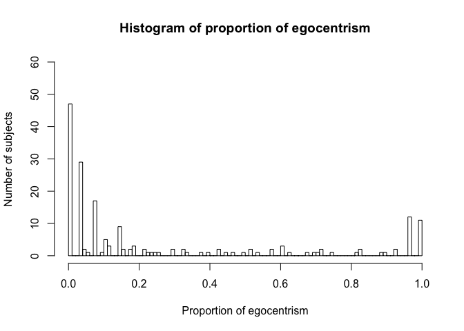

# Social and configural effects on the cognitive dynamics of perspective-taking
Alexia Galati and Rick Dale  
10/31/2017  


## Preliminaries for Exp 2

Here we are loading in prior data analyzed using the scripts "GDD2_batchTrajectoryAnalysis.R". 
These include data from both the "error" (control) trials and the "ambiguous" (critical) trials of the experiment. 

As with Exp 1A and 1B, we trim the data by removing trials that took more than 6000 ms from the initiation of the trial to selection of an initial folder or over 1000 pixels of total distance. 


In Exp 2, the configural cue (the alignment of the configuration) is manipulated within participants.


```r
load('GDD2_churnedRawTrajectoryData.Rd') 

### Data cleaning and trimming ###

# Clean by approx. 3 SDs of M for control trials
resAllError = resAllError[resAllError$RTDV<6000&resAllError$totalDistanceDV<1000,]
resAll = resAll[resAll$RTDV<6000&resAll$totalDistanceDV<1000,]


# Let's reverse all true/false for front/back
resAllError[resAllError$sound %in% c('fron','back'), ]$err = !resAllError[resAllError$sound %in% c('fron','back'), ]$err
```

Given the pattern of performance on sagittal (front-back) trials (with very high errors on control trials), we reverse their assignment in the data. In Exp 2, listeners appear to be interpreting front-back terms according to the opposite mapping that we had assigned. See manuscript for further explanation.


```r
# let's reverse front and back (since their interpretation is now the reverse of what we thought)
resAll$ego2 = 0
resAll[resAll$sound %in% c('fron','back'),]$ego2 = resAll[resAll$sound %in% c('fron','back'),]$other # new ego value with the the other one
resAll[resAll$sound %in% c('fron','back'),]$other = resAll[resAll$sound %in% c('fron','back'),]$ego
resAll[resAll$sound %in% c('fron','back'),]$ego = resAll[resAll$sound %in% c('fron','back'),]$ego2
```

As with the previous Experiments, we plot a histogram for the proportion of egocentric responses across participants. 

Again, participants are classified as egocentric, other-centric, and mixed responders based on their proportion of egocentric responses on ambiguous/critical trials, using the same criteria as Exp 1A and 1B. 


```r
# Create an aggregate variable to see distribution of egocentrism across subjects
#resAll$egoChosen = 1*(resAll$chosen==resAll$ego)
egoChosen = 1*(resAll$chosen==resAll$ego)
perspectiveDistribution = aggregate(egoChosen~resAll$fl,FUN=mean)
hist(perspectiveDistribution$egoChosen,100, main = paste("Histogram of", "proportion of egocentrism in Exp 2"), 
     xlab='Proportion of egocentrism',ylab='Number of subjects', ylim = range(0:60))
```

<!-- -->

```r
# Constructing perspective preference variables...
egoSubjects = perspectiveDistribution[perspectiveDistribution$egoChosen>.7,]$resAll
otherSubjects = perspectiveDistribution[perspectiveDistribution$egoChosen<.3,]$resAll
mixedSubjects = perspectiveDistribution[(perspectiveDistribution$egoChosen>=.3 & perspectiveDistribution$egoChosen<=.7) ,]$resAll

length(egoSubjects)
```

```
## [1] 34
```

```r
length(otherSubjects)
```

```
## [1] 129
```

```r
length(mixedSubjects)
```

```
## [1] 21
```

```r
#Label perspectivePreference levels
resAll$perspectivePreference = 'mixed'
resAll$perspectivePreference[resAll$fl %in% egoSubjects]='ego'
resAll$perspectivePreference[resAll$fl %in% otherSubjects]='other'

#for Control trials let's trasfer the perspectivePreference variable over 
resAllError$perspectivePreference = 'mixed'
resAllError$perspectivePreference[resAllError$fl %in% egoSubjects]='ego'
resAllError$perspectivePreference[resAllError$fl %in% otherSubjects]='other'
```

## Preliminaries: Variable recoding 

As with Exp 1A and 1B, we create an "axis" variable, for which we combine "left-right" instructions to refer to the "lateral" axis, and "front-back" instructions to refer to the "sagittal" axis. Again, we create an "offset" variable, for which we assign "90"" degree offset to speaker positions 90 and 270. For ambiguous trials this level contrasts with the "180" level of offset; for control trials, with the "0" offset.

Control trials also include "ego-reversed" and "partner-reversed" configurations (where the apex of the triangle is pointing toward the ego or partner, respectively); there are 2 trials for each of these types. We combine these with the "ego" and "partner" categories, respectively.


```r
#let's create axis variable to compress front-back and left-right instuctions into a sagittal and lateral axis
resAll$axis = 'sagittal'
resAll$axis[resAll$sound %in% c('righ','left')]='lateral'

#Let's compress 90 and 270 speaker positions into a 90 offset
resAll$offset = '180'
resAll$offset[resAll$ppos %in% c('init_90','init_270')]='90'

#Create egocentric choice variable
resAll$egoChoice = 1*(resAll$chosen==resAll$ego)

#let's create the axis variable for control trials
resAllError$axis = 'sagittal'
resAllError$axis[resAllError$sound %in% c('righ','left')]='lateral'

#Let's compress 90 and 270 speaker positions into a 90 offset
resAllError$offset = '0'
resAllError$offset[resAllError$ppos %in% c('init_90','init_270')]='90'

#compress ego and ego-reversed configurations into a single category
#compress other and other-reversed configurations into a single category
resAllError$config[resAllError$config %in% c('ego', 'ego-reversed')]='ego'
resAllError$config[resAllError$config %in% c('partner', 'partner-reversed')]='partner'
resAllError$config = as.factor(as.matrix(resAllError$config))
#str(resAllError) #confirm 4 levels of config factor
```

## Preliminaries: Create divergence from optimal distance variable

In contrast to Exp 1A and 1B, instead of using total distance in pixels, we computed the divergence from the optimal distance to the selected folder. In the GDD2_batchTrajectoryAnalysis.R code, we computed the optimal distance to be the distance in pixels from the trial initiation to their object selection. This straight line reflects an optimal distance because it is the minimal possible distance needed to reach that point. Here, we subtract the observed distance from this optimal distance. This captured the divergence from optimal distance in pixels. 

This was done because, in the three types of configurations (ego-aligned, other-aligned, and neither-aligned), the average distance from the start point of the trial to the selected folder differed.


```r
resAll$divergDist = resAll$totalDistanceDV-resAll$optimalDist 
resAllError$divergDist = resAllError$totalDistanceDV-resAllError$optimalDist
# raw pixel distance from optimal

#some info about optimal distance
#summary(lm(optimalDist~egoChosen*config,data=resAll))
#pander(aggregate(optimalDist~config+egoChosen,data=resAll,FUN=mean))
```

## Descriptives

Let's get some descriptives for ambiguous and control trials 


```r
# Ambiguous/critical trials (excluding offset, to simplify)
pander(aggregate(egoChoice~config+axis,data=resAll,FUN=mean))
```


-----------------------------
 config    axis    egoChoice 
-------- -------- -----------
  ego    lateral    0.3052   

neither  lateral    0.3384   

partner  lateral    0.2839   

  ego    sagittal   0.2434   

neither  sagittal   0.2201   

partner  sagittal   0.2528   
-----------------------------

```r
pander(aggregate(RTDV~config+perspectivePreference+axis,data=resAll,FUN=mean))
```


------------------------------------------------
 config   perspectivePreference    axis    RTDV 
-------- ----------------------- -------- ------
  ego              ego           lateral   1343 

neither            ego           lateral   1281 

partner            ego           lateral   1402 

  ego             mixed          lateral   1530 

neither           mixed          lateral   1689 

partner           mixed          lateral   1603 

  ego             other          lateral   1733 

neither           other          lateral   2106 

partner           other          lateral   1708 

  ego              ego           sagittal  1253 

neither            ego           sagittal  1385 

partner            ego           sagittal  1328 

  ego             mixed          sagittal  1300 

neither           mixed          sagittal  1478 

partner           mixed          sagittal  1379 

  ego             other          sagittal  1528 

neither           other          sagittal  1493 

partner           other          sagittal  1439 
------------------------------------------------

```r
pander(aggregate(xFlipDV~config+perspectivePreference+axis,data=resAll,FUN=mean))
```


---------------------------------------------------
 config   perspectivePreference    axis    xFlipDV 
-------- ----------------------- -------- ---------
  ego              ego           lateral    1.642  

neither            ego           lateral    1.493  

partner            ego           lateral     1.8   

  ego             mixed          lateral    1.925  

neither           mixed          lateral    1.95   

partner           mixed          lateral    2.06   

  ego             other          lateral    2.292  

neither           other          lateral    2.601  

partner           other          lateral    2.127  

  ego              ego           sagittal   1.885  

neither            ego           sagittal   1.786  

partner            ego           sagittal   1.993  

  ego             mixed          sagittal   1.89   

neither           mixed          sagittal   2.217  

partner           mixed          sagittal     2    

  ego             other          sagittal   2.169  

neither           other          sagittal   2.226  

partner           other          sagittal   2.135  
---------------------------------------------------

```r
pander(aggregate(divergDist~config+perspectivePreference+axis,data=resAll,FUN=mean))
```


------------------------------------------------------
 config   perspectivePreference    axis    divergDist 
-------- ----------------------- -------- ------------
  ego              ego           lateral     80.13    

neither            ego           lateral     79.28    

partner            ego           lateral     94.45    

  ego             mixed          lateral     98.46    

neither           mixed          lateral     111.9    

partner           mixed          lateral     143.4    

  ego             other          lateral      110     

neither           other          lateral     152.4    

partner           other          lateral     120.5    

  ego              ego           sagittal    74.57    

neither            ego           sagittal    91.43    

partner            ego           sagittal    76.22    

  ego             mixed          sagittal    84.02    

neither           mixed          sagittal    122.7    

partner           mixed          sagittal    81.34    

  ego             other          sagittal    109.2    

neither           other          sagittal    117.3    

partner           other          sagittal    101.8    
------------------------------------------------------

```r
# Control trials (excluding offset, to simplify)
#pander(aggregate(err~perspectivePreference+axis+config,data=resAllError,FUN=mean)) 
#pander(aggregate(RTDV~perspectivePreference+axis+config,data=resAllError,FUN=mean))
#pander(aggregate(xFlipDV~perspectivePreference+axis+config,data=resAllError,FUN=mean))
#pander(aggregate(divergDist~perspectivePreference+axis+config,data=resAllError,FUN=mean))
```


## Experiment comparisons

Before getting to the LMERs, let's compare the distribution of other, ego, mixed responders across experiments.

Let's first compare the distribution of other, ego, mixed responders in Exp 2 vs. DDK Study 1, which used a different configural cue that was always ego-aligned. We observe a siginficant difference in the distributions.


```r
preferenceCounts <- matrix(c(129, 34, 21, 43, 31, 8), ncol=3, byrow=TRUE)
colnames(preferenceCounts) <- c("other", "ego", "mixed")
rownames(preferenceCounts) <- c("GDD2", "DDKstudy1")
preferenceCounts <- as.table(preferenceCounts)
summary(preferenceCounts)
```

```
## Number of cases in table: 266 
## Number of factors: 2 
## Test for independence of all factors:
## 	Chisq = 11.552, df = 2, p-value = 0.003101
```

```r
#chisq.test(preferenceCounts)
```

Let's also compare the distribution of responders in Exp 2 vs. Exp 1A, which used was intended to be a replication of DDK Study 1 (with folders that were always ego-aligned). 
Again, we observe a siginficant difference in the distributions.


```r
#GDD1 vs. GDD2a = DDK replication
#GDD2a: 43, 33, 17, other, ego, mixed
preferenceCounts <- matrix(c(129, 34, 21, 43, 33, 17), ncol=3, byrow=TRUE)
colnames(preferenceCounts) <- c("other", "ego", "mixed")
rownames(preferenceCounts) <- c("GDD2", "GDD1A")
preferenceCounts <- as.table(preferenceCounts)
summary(preferenceCounts)
```

```
## Number of cases in table: 277 
## Number of factors: 2 
## Test for independence of all factors:
## 	Chisq = 15.179, df = 2, p-value = 0.0005058
```

```r
#chisq.test(preferenceCounts)
```

Let's now compare the distribution of respoonders in Exp 2 vs. Exp 1B, which also introduced a configural cue (folder orientation) that was always partner-aligned. 
Interestingly, these distributions don't differ significantly. Both Exp 2 and Exp 1B have in common the manipulation of a configural cue.


```r
#GDD1 vs. GDD2b = other-aligned folders
#GDD2B: 59, 18, 18 : other, ego, mixed
preferenceCounts <- matrix(c(129, 34, 21, 59, 18, 18), ncol=3, byrow=TRUE)
colnames(preferenceCounts) <- c("other", "ego", "mixed")
rownames(preferenceCounts) <- c("GDD2", "GDD1b")
preferenceCounts <- as.table(preferenceCounts)
summary(preferenceCounts)
```

```
## Number of cases in table: 279 
## Number of factors: 2 
## Test for independence of all factors:
## 	Chisq = 3.1473, df = 2, p-value = 0.2073
```

```r
#chisq.test(preferenceCounts)
```

## Linear mixed effects models for ambiguous (critical) trials

We create separate linear mixed effects models for each of the dependent variables (proportion of egocentric choices, RT, divergence from optimal distance, x-flips) on ambiguous/critical trials.. 

We start with some pre-processing of the variables, setting the reference categories where relevant, and inspecting the data structure. As it's revealed by the data structure, at offset 180, configurations cannot be ego-aligned or other-aligned: the configuration’s axis of symmetry would be aligned with both the speaker and the listener when the speaker is at 180°. This led to the decision to not include offset as a factor in the subsequent linear mixed effects models


```r
resAll = as.data.frame(as.matrix(resAll))
#Defining as factors in order to set reference categories next
resAll$config = as.factor(as.matrix(resAll$config))
resAll$offset = as.factor(as.matrix(resAll$offset))
resAll$axis = as.factor(as.matrix(resAll$axis))
resAll$perspectivePreference = as.factor(as.matrix(resAll$perspectivePreference))
resAll$trial = as.integer(as.matrix(resAll$trial))

#Setting reference categories
resAll$config = relevel(resAll$config, ref = "ego")
resAll$perspectivePreference= relevel(resAll$perspectivePreference, ref = "ego")

##Check for any "holes" in the design
#with(resAll, table(config, offset, axis, perspectivePreference))
#when offset is 180, configurations cannot be ego-aligned or other-aligned, maybe remove offset as factor?
#with(resAll, table(config, axis, perspectivePreference))

#Make sure DVs are of the right type
resAll$RTDV = as.numeric(as.matrix(resAll$RTDV))
resAll$divergDist = as.numeric(as.matrix(resAll$divergDist))
resAll$xFlipDV = as.integer(as.matrix(resAll$xFlipDV))
resAll$egoChoice = as.factor(as.matrix(resAll$egoChoice))

#str(resAll)
```

## Egocentric Choice models (Ambiguous/Critical trials)

For the model with egocentric perspective choice as dependent variable (egoChoice), the configuration's orientation (config: ego-aligned, other-aligned, neither-aligned) and instruction's axis (axis: on a sagittal axis: front-back vs. a lateral axis: left-right; within-subjects), and their interaction. Since perspective choice as a dependent variable is a binary variable, we use a logistic regression model, specifying a "binomial" distribution.


```r
ChoiceModel1 = glmer(egoChoice ~ config*axis
                     + (1 | fl)
                     + (0 + axis | fl),
                     #+ (0 + config | fl), #did not converge
                     #+ (0 + config:axis | fl), #did not converge
                     data=resAll,
                     family = "binomial",
                     # method = "Laplace",
                     #nAGQ = 1, #due to warning message
                     REML = FALSE)
```

```
## Warning: extra argument(s) 'REML' disregarded
```

```
## Warning in checkConv(attr(opt, "derivs"), opt$par, ctrl = control
## $checkConv, : unable to evaluate scaled gradient
```

```
## Warning in checkConv(attr(opt, "derivs"), opt$par, ctrl = control
## $checkConv, : Model failed to converge: degenerate Hessian with 1 negative
## eigenvalues
```

```r
summary(ChoiceModel1)
```

```
## Generalized linear mixed model fit by maximum likelihood (Laplace
##   Approximation) [glmerMod]
##  Family: binomial  ( logit )
## Formula: egoChoice ~ config * axis + (1 | fl) + (0 + axis | fl)
##    Data: resAll
## 
##      AIC      BIC   logLik deviance df.resid 
##   2913.7   2978.8  -1446.8   2893.7     4979 
## 
## Scaled residuals: 
##     Min      1Q  Median      3Q     Max 
## -4.7254 -0.2766 -0.1119  0.1259  5.8022 
## 
## Random effects:
##  Groups Name         Variance Std.Dev. Corr
##  fl     (Intercept)   2.729   1.652        
##  fl.1   axislateral   9.077   3.013        
##         axissagittal 12.712   3.565    0.88
## Number of obs: 4989, groups:  fl, 184
## 
## Fixed effects:
##                            Estimate Std. Error z value Pr(>|z|)    
## (Intercept)                 -1.7937     0.3109  -5.769 7.97e-09 ***
## configneither                0.3600     0.1738   2.071 0.038348 *  
## configpartner               -0.3005     0.1948  -1.543 0.122815    
## axissagittal                -1.0414     0.2991  -3.481 0.000499 ***
## configneither:axissagittal  -0.8321     0.2648  -3.142 0.001679 ** 
## configpartner:axissagittal   0.3720     0.2868   1.297 0.194544    
## ---
## Signif. codes:  0 '***' 0.001 '**' 0.01 '*' 0.05 '.' 0.1 ' ' 1
## 
## Correlation of Fixed Effects:
##             (Intr) cnfgnt cnfgpr axssgt cnfgn:
## confignethr -0.354                            
## configprtnr -0.295  0.540                     
## axissagittl -0.226  0.369  0.306              
## cnfgnthr:xs  0.232 -0.656 -0.354 -0.497       
## cnfgprtnr:x  0.201 -0.367 -0.679 -0.473  0.538
## convergence code: 0
## unable to evaluate scaled gradient
## Model failed to converge: degenerate  Hessian with 1 negative eigenvalues
```

## Response Time models (Ambiguous/Critical trials)

For the models for response time (RTDV) and the other dependent measures (divergDist, xFlipDV), below, we construct models that include as fixed effects perspective preference (egocentric, other-centric, mixed), configuration type (ego-, other-, and neither-aligned), and instruction type (sagittal vs. lateral). 


```r
RTModel1 = lmer(log(RTDV) ~ perspectivePreference*config*axis 
                    + (1 | fl)
                    + (0 + config | fl) 
                    + (0 + axis | fl),
                    data=resAll, 
                    REML=FALSE)
print('RT:'); pander(print_stats(RTModel1))
```

```
## [1] "RT:"
```


----------------------------------------------------------------------
                          &nbsp;                             Estimate 
----------------------------------------------------------- ----------
                      **(Intercept)**                         7.117   

              **perspectivePreferencemixed**                  0.0982  

              **perspectivePreferenceother**                  0.2469  

                     **configneither**                       -0.05085 

                     **configpartner**                       0.009501 

                     **axissagittal**                         -0.063  

       **perspectivePreferencemixed:configneither**           0.102   

       **perspectivePreferenceother:configneither**           0.2392  

       **perspectivePreferencemixed:configpartner**          -0.0176  

       **perspectivePreferenceother:configpartner**          -0.01869 

        **perspectivePreferencemixed:axissagittal**          -0.08915 

        **perspectivePreferenceother:axissagittal**          -0.05986 

              **configneither:axissagittal**                 0.08537  

              **configpartner:axissagittal**                 0.02333  

 **perspectivePreferencemixed:configneither:axissagittal**   -0.05158 

 **perspectivePreferenceother:configneither:axissagittal**   -0.2812  

 **perspectivePreferencemixed:configpartner:axissagittal**  -0.0003185

 **perspectivePreferenceother:configpartner:axissagittal**   -0.0605  
----------------------------------------------------------------------

Table: Table continues below

 
------------------------------------------------------------------------
                          &nbsp;                             Std..Error 
----------------------------------------------------------- ------------
                      **(Intercept)**                         0.05454   

              **perspectivePreferencemixed**                  0.08858   

              **perspectivePreferenceother**                  0.06136   

                     **configneither**                        0.04034   

                     **configpartner**                        0.04382   

                     **axissagittal**                         0.04776   

       **perspectivePreferencemixed:configneither**            0.0659   

       **perspectivePreferenceother:configneither**            0.0455   

       **perspectivePreferencemixed:configpartner**           0.07123   

       **perspectivePreferenceother:configpartner**           0.04937   

        **perspectivePreferencemixed:axissagittal**           0.07744   

        **perspectivePreferenceother:axissagittal**            0.0537   

              **configneither:axissagittal**                   0.0569   

              **configpartner:axissagittal**                   0.0622   

 **perspectivePreferencemixed:configneither:axissagittal**    0.09254   

 **perspectivePreferenceother:configneither:axissagittal**    0.06405   

 **perspectivePreferencemixed:configpartner:axissagittal**     0.1006   

 **perspectivePreferenceother:configpartner:axissagittal**    0.06998   
------------------------------------------------------------------------

Table: Table continues below

 
-------------------------------------------------------------------------------
                          &nbsp;                             t.value      p    
----------------------------------------------------------- --------- ---------
                      **(Intercept)**                         130.5       0    

              **perspectivePreferencemixed**                  1.109    0.2676  

              **perspectivePreferenceother**                  4.025   5.707e-05

                     **configneither**                       -1.261    0.2074  

                     **configpartner**                       0.2168    0.8284  

                     **axissagittal**                        -1.319    0.1872  

       **perspectivePreferencemixed:configneither**           1.548    0.1217  

       **perspectivePreferenceother:configneither**           5.258   1.458e-07

       **perspectivePreferencemixed:configpartner**          -0.2471   0.8048  

       **perspectivePreferenceother:configpartner**          -0.3785    0.705  

        **perspectivePreferencemixed:axissagittal**          -1.151    0.2496  

        **perspectivePreferenceother:axissagittal**          -1.115     0.265  

              **configneither:axissagittal**                   1.5     0.1335  

              **configpartner:axissagittal**                 0.3751    0.7076  

 **perspectivePreferencemixed:configneither:axissagittal**   -0.5574   0.5772  

 **perspectivePreferenceother:configneither:axissagittal**    -4.39   1.134e-05

 **perspectivePreferencemixed:configpartner:axissagittal**  -0.003166  0.9975  

 **perspectivePreferenceother:configpartner:axissagittal**   -0.8645   0.3873  
-------------------------------------------------------------------------------

```r
# Check residuals (before and after log transform)
# There is deviation from normality and homoscedasticity, so use log(RTDV)
#plot(density(resid(RTModel1))) #does this look approximately normal?
#qqnorm(resid(RTModel1)) #check if they fall on a straight line
#qqline(resid(RTModel1)) #check departure from line
```

## Divergence Distance Models (Ambiguous/Critical trials)


```r
DivergDistModel1 = lmer(log(divergDist) ~ perspectivePreference*config*axis 
                + (1 | fl)
                #+ (0 + config | fl), #does not converge; based on model comparison, it's better to include axis as a random effect than config
                + (0 + axis | fl),
                #+ (0 + config:axis | fl), #does not converge
                data=resAll, 
                REML=FALSE)
```

```
## Warning in checkConv(attr(opt, "derivs"), opt$par, ctrl = control$checkConv, : Model is nearly unidentifiable: large eigenvalue ratio
##  - Rescale variables?
```

```r
print('Divergence Distance:'); pander(print_stats(DivergDistModel1))
```

```
## [1] "Divergence Distance:"
```


----------------------------------------------------------------------
                          &nbsp;                             Estimate 
----------------------------------------------------------- ----------
                      **(Intercept)**                         4.012   

              **perspectivePreferencemixed**                  0.2595  

              **perspectivePreferenceother**                  0.3252  

                     **configneither**                       -0.02479 

                     **configpartner**                        0.1408  

                     **axissagittal**                        -0.03969 

       **perspectivePreferencemixed:configneither**          0.002741 

       **perspectivePreferenceother:configneither**           0.3198  

       **perspectivePreferencemixed:configpartner**           0.1567  

       **perspectivePreferenceother:configpartner**          -0.05935 

        **perspectivePreferencemixed:axissagittal**          -0.1254  

        **perspectivePreferenceother:axissagittal**          0.02931  

              **configneither:axissagittal**                  0.1366  

              **configpartner:axissagittal**                 -0.1529  

 **perspectivePreferencemixed:configneither:axissagittal**    0.1543  

 **perspectivePreferenceother:configneither:axissagittal**   -0.3961  

 **perspectivePreferencemixed:configpartner:axissagittal**   -0.1405  

 **perspectivePreferenceother:configpartner:axissagittal**   0.01093  
----------------------------------------------------------------------

Table: Table continues below

 
------------------------------------------------------------------------
                          &nbsp;                             Std..Error 
----------------------------------------------------------- ------------
                      **(Intercept)**                         0.09672   

              **perspectivePreferencemixed**                   0.1574   

              **perspectivePreferenceother**                   0.1089   

                     **configneither**                        0.08891   

                     **configpartner**                         0.0972   

                     **axissagittal**                          0.1001   

       **perspectivePreferencemixed:configneither**            0.1453   

       **perspectivePreferenceother:configneither**            0.1003   

       **perspectivePreferencemixed:configpartner**            0.158    

       **perspectivePreferenceother:configpartner**            0.1095   

        **perspectivePreferencemixed:axissagittal**            0.1623   

        **perspectivePreferenceother:axissagittal**            0.1125   

              **configneither:axissagittal**                   0.1263   

              **configpartner:axissagittal**                   0.1381   

 **perspectivePreferencemixed:configneither:axissagittal**     0.2055   

 **perspectivePreferenceother:configneither:axissagittal**     0.1422   

 **perspectivePreferencemixed:configpartner:axissagittal**     0.2234   

 **perspectivePreferenceother:configpartner:axissagittal**     0.1554   
------------------------------------------------------------------------

Table: Table continues below

 
------------------------------------------------------------------------------
                          &nbsp;                             t.value     p    
----------------------------------------------------------- --------- --------
                      **(Intercept)**                         41.48      0    

              **perspectivePreferencemixed**                  1.649   0.09916 

              **perspectivePreferenceother**                  2.987   0.002813

                     **configneither**                       -0.2788   0.7804 

                     **configpartner**                        1.449    0.1474 

                     **axissagittal**                        -0.3966   0.6917 

       **perspectivePreferencemixed:configneither**          0.01887   0.9849 

       **perspectivePreferenceother:configneither**           3.189   0.001429

       **perspectivePreferencemixed:configpartner**          0.9919    0.3212 

       **perspectivePreferenceother:configpartner**          -0.542    0.5878 

        **perspectivePreferencemixed:axissagittal**          -0.7728   0.4397 

        **perspectivePreferenceother:axissagittal**          0.2605    0.7945 

              **configneither:axissagittal**                  1.081    0.2798 

              **configpartner:axissagittal**                 -1.107    0.2682 

 **perspectivePreferencemixed:configneither:axissagittal**   0.7509    0.4527 

 **perspectivePreferenceother:configneither:axissagittal**   -2.785   0.005354

 **perspectivePreferencemixed:configpartner:axissagittal**   -0.6289   0.5294 

 **perspectivePreferenceother:configpartner:axissagittal**   0.07035   0.9439 
------------------------------------------------------------------------------

```r
#check residuals (before and after log transform)
#there is deviation from normality and homoscedasticity, so use log(divergDist)
#plot(density(resid(DivergDistModel1))) #does this look approximately normal?
#qqnorm(resid(DivergDistModel1)) #check if they fall on a straight line
#qqline(resid(DivergDistModel1)) #check departure from line
```

## Directional Shifts models (Ambiguous/Critical trials)


```r
xFlipModel1 = lmer(xFlipDV ~ perspectivePreference*config*axis 
                        + (1 | fl),
                        #+ (0 + config | fl) #does not converge
                        #+ (0 + axis | fl), #does not converge
                        #+ (0 + config:axis | fl), #does not converge
                        data=resAll, 
                        #family = "poisson", #model does not converge under Poisson distribution (not even random intercept model)
                        REML=FALSE)
#summary(xFlipModel1)
print('Directional Shifts:'); pander(print_stats(xFlipModel1))
```

```
## [1] "Directional Shifts:"
```


----------------------------------------------------------------------
                          &nbsp;                             Estimate 
----------------------------------------------------------- ----------
                      **(Intercept)**                         1.636   

              **perspectivePreferencemixed**                  0.2793  

              **perspectivePreferenceother**                  0.6535  

                     **configneither**                        -0.144  

                     **configpartner**                        0.162   

                     **axissagittal**                         0.2583  

       **perspectivePreferencemixed:configneither**           0.1605  

       **perspectivePreferenceother:configneither**           0.4675  

       **perspectivePreferencemixed:configpartner**          -0.01774 

       **perspectivePreferenceother:configpartner**          -0.3268  

        **perspectivePreferencemixed:axissagittal**          -0.2676  

        **perspectivePreferenceother:axissagittal**          -0.3811  

              **configneither:axissagittal**                 0.03411  

              **configpartner:axissagittal**                 -0.06786 

 **perspectivePreferencemixed:configneither:axissagittal**    0.2484  

 **perspectivePreferenceother:configneither:axissagittal**   -0.3037  

 **perspectivePreferencemixed:configpartner:axissagittal**   0.01765  

 **perspectivePreferenceother:configpartner:axissagittal**    0.2013  
----------------------------------------------------------------------

Table: Table continues below

 
------------------------------------------------------------------------
                          &nbsp;                             Std..Error 
----------------------------------------------------------- ------------
                      **(Intercept)**                          0.1586   

              **perspectivePreferencemixed**                   0.2582   

              **perspectivePreferenceother**                   0.1786   

                     **configneither**                         0.1471   

                     **configpartner**                         0.1608   

                     **axissagittal**                          0.1624   

       **perspectivePreferencemixed:configneither**            0.2403   

       **perspectivePreferenceother:configneither**            0.1659   

       **perspectivePreferencemixed:configpartner**            0.2613   

       **perspectivePreferenceother:configpartner**            0.1811   

        **perspectivePreferencemixed:axissagittal**            0.2633   

        **perspectivePreferenceother:axissagittal**            0.1825   

              **configneither:axissagittal**                   0.209    

              **configpartner:axissagittal**                   0.2285   

 **perspectivePreferencemixed:configneither:axissagittal**     0.3399   

 **perspectivePreferenceother:configneither:axissagittal**     0.2353   

 **perspectivePreferencemixed:configpartner:axissagittal**     0.3695   

 **perspectivePreferenceother:configpartner:axissagittal**     0.2571   
------------------------------------------------------------------------

Table: Table continues below

 
------------------------------------------------------------------------------
                          &nbsp;                             t.value     p    
----------------------------------------------------------- --------- --------
                      **(Intercept)**                         10.31      0    

              **perspectivePreferencemixed**                  1.082    0.2793 

              **perspectivePreferenceother**                  3.66    0.000252

                     **configneither**                       -0.9788   0.3277 

                     **configpartner**                        1.007    0.3137 

                     **axissagittal**                         1.591    0.1116 

       **perspectivePreferencemixed:configneither**          0.6681    0.5041 

       **perspectivePreferenceother:configneither**           2.818   0.004838

       **perspectivePreferencemixed:configpartner**         -0.06787   0.9459 

       **perspectivePreferenceother:configpartner**          -1.804   0.07121 

        **perspectivePreferencemixed:axissagittal**          -1.016    0.3095 

        **perspectivePreferenceother:axissagittal**          -2.088   0.03684 

              **configneither:axissagittal**                 0.1632    0.8704 

              **configpartner:axissagittal**                 -0.297    0.7665 

 **perspectivePreferencemixed:configneither:axissagittal**   0.7308    0.4649 

 **perspectivePreferenceother:configneither:axissagittal**   -1.291    0.1967 

 **perspectivePreferencemixed:configpartner:axissagittal**   0.04775   0.9619 

 **perspectivePreferenceother:configpartner:axissagittal**    0.783    0.4336 
------------------------------------------------------------------------------

```r
#plot(density(resid(xFlipModel1))) 
#qqnorm(resid(xFlipModel1)) 
#qqline(resid(xFlipModel1)) 
```

## Linear mixed effects models for control trials

We created separate linear mixed effects models for each of the dependent variables (proportion of errors, response time, divergence from optimal distance, x-flips) on controls trials. These models are reported in Appendix A in the manuscript.

We start with some pre-processing of the variables, setting the reference categories where relevant, and inspecting the data structure. Similar to ambiguous/critical trials, this inspection suggests that we have to exclude offset as a factor, since when the offset is 0, configurations can only be both-alinged.


```r
resAllError = as.data.frame(as.matrix(resAllError))
#Defining as factors in order to set reference categories next
resAllError$config = as.factor(as.matrix(resAllError$config))
resAllError$offset = as.factor(as.matrix(resAllError$offset))
resAllError$axis = as.factor(as.matrix(resAllError$axis))
resAllError$perspectivePreference = as.factor(as.matrix(resAllError$perspectivePreference))

#Setting reference categories
resAllError$config = relevel(resAllError$config, ref = "both")
resAllError$perspectivePreference= relevel(resAllError$perspectivePreference, ref = "ego")

##Check for any "holes" in the design
#with(resAllError, table(config, offset, axis))
#when offset is 0, configurations can only be both-aligned --> let's not include offset in the models as a factor
#with(resAllError, table(config, axis, perspectivePreference))

#Make sure DVs are of the right type
resAllError$RTDV = as.numeric(as.matrix(resAllError$RTDV))
resAllError$divergDist = as.numeric(as.matrix(resAllError$divergDist))
resAllError$xFlipDV = as.integer(as.matrix(resAllError$xFlipDV))

#str(resAllError)
```

## Proportion of errors model (Control trials)


```r
ErrorModel1 = glmer(err ~ perspectivePreference*config*axis 
                    + (1 | fl), #does not converge!
                    #+ (0 + config | fl), #does not converge
                    #+ (0 + axis | fl), #does not converge
                    #+ (0 + config:axis | fl), #does not converge
                    data=resAllError, 
                    family = "binomial",
                    REML=FALSE)
```

```
## Warning: extra argument(s) 'REML' disregarded
```

```
## Warning in (function (fn, par, lower = rep.int(-Inf, n), upper =
## rep.int(Inf, : failure to converge in 10000 evaluations
```

```
## Warning in checkConv(attr(opt, "derivs"), opt$par, ctrl = control
## $checkConv, : Model failed to converge with max|grad| = 0.533065 (tol =
## 0.001, component 1)
```

```r
summary(ErrorModel1)
```

```
## Generalized linear mixed model fit by maximum likelihood (Laplace
##   Approximation) [glmerMod]
##  Family: binomial  ( logit )
## Formula: err ~ perspectivePreference * config * axis + (1 | fl)
##    Data: resAllError
## 
##      AIC      BIC   logLik deviance df.resid 
##   1405.5   1559.8   -677.7   1355.5     3519 
## 
## Scaled residuals: 
##      Min       1Q   Median       3Q      Max 
## -10.0532   0.0952   0.1395   0.1975   1.8664 
## 
## Random effects:
##  Groups Name        Variance Std.Dev.
##  fl     (Intercept) 1.756    1.325   
## Number of obs: 3544, groups:  fl, 184
## 
## Fixed effects:
##                                                       Estimate Std. Error
## (Intercept)                                            4.01997    0.58468
## perspectivePreferencemixed                            -1.78887    0.73811
## perspectivePreferenceother                             0.47396    0.66720
## configego                                             -0.58931    0.74271
## configneither                                          1.14441    1.19705
## configpartner                                          0.95314    1.14522
## axissagittal                                          -0.21784    0.67132
## perspectivePreferencemixed:configego                   0.07787    0.91932
## perspectivePreferenceother:configego                   0.48201    0.90226
## perspectivePreferencemixed:configneither              -1.15041    1.33617
## perspectivePreferenceother:configneither              -1.08697    1.30965
## perspectivePreferencemixed:configpartner              -0.43893    1.31501
## perspectivePreferenceother:configpartner              -1.48026    1.23602
## perspectivePreferencemixed:axissagittal               -0.55708    0.80674
## perspectivePreferenceother:axissagittal               -1.10341    0.76196
## configego:axissagittal                                 0.31799    1.02449
## configneither:axissagittal                            -1.11945    1.42253
## configpartner:axissagittal                            -1.25933    1.34542
## perspectivePreferencemixed:configego:axissagittal      0.55823    1.26987
## perspectivePreferenceother:configego:axissagittal      0.37971    1.20361
## perspectivePreferencemixed:configneither:axissagittal  0.80759    1.61660
## perspectivePreferenceother:configneither:axissagittal  2.11406    1.57592
## perspectivePreferencemixed:configpartner:axissagittal  0.63851    1.57091
## perspectivePreferenceother:configpartner:axissagittal  1.89257    1.46007
##                                                       z value Pr(>|z|)    
## (Intercept)                                             6.875 6.18e-12 ***
## perspectivePreferencemixed                             -2.424   0.0154 *  
## perspectivePreferenceother                              0.710   0.4775    
## configego                                              -0.793   0.4275    
## configneither                                           0.956   0.3391    
## configpartner                                           0.832   0.4053    
## axissagittal                                           -0.324   0.7456    
## perspectivePreferencemixed:configego                    0.085   0.9325    
## perspectivePreferenceother:configego                    0.534   0.5932    
## perspectivePreferencemixed:configneither               -0.861   0.3893    
## perspectivePreferenceother:configneither               -0.830   0.4066    
## perspectivePreferencemixed:configpartner               -0.334   0.7385    
## perspectivePreferenceother:configpartner               -1.198   0.2311    
## perspectivePreferencemixed:axissagittal                -0.691   0.4899    
## perspectivePreferenceother:axissagittal                -1.448   0.1476    
## configego:axissagittal                                  0.310   0.7563    
## configneither:axissagittal                             -0.787   0.4313    
## configpartner:axissagittal                             -0.936   0.3493    
## perspectivePreferencemixed:configego:axissagittal       0.440   0.6602    
## perspectivePreferenceother:configego:axissagittal       0.315   0.7524    
## perspectivePreferencemixed:configneither:axissagittal   0.500   0.6174    
## perspectivePreferenceother:configneither:axissagittal   1.341   0.1798    
## perspectivePreferencemixed:configpartner:axissagittal   0.406   0.6844    
## perspectivePreferenceother:configpartner:axissagittal   1.296   0.1949    
## ---
## Signif. codes:  0 '***' 0.001 '**' 0.01 '*' 0.05 '.' 0.1 ' ' 1
```

```
## 
## Correlation matrix not shown by default, as p = 24 > 12.
## Use print(x, correlation=TRUE)  or
## 	 vcov(x)	 if you need it
```

```
## convergence code: 0
## Model failed to converge with max|grad| = 0.533065 (tol = 0.001, component 1)
## failure to converge in 10000 evaluations
```

## Response Time model (Control trials)


```r
RTControl1 = lmer(log(RTDV) ~ perspectivePreference*config*axis 
                  + (1 | fl) 
                  + (0 + config | fl)
                  + (0 + axis | fl),
                  #+ (0 + config:axis | fl), #does not converge
                  data=resAllError,  
                  REML=FALSE)
print('RT:'); pander(print_stats(RTControl1))
```

```
## [1] "RT:"
```


----------------------------------------------------------------------
                          &nbsp;                             Estimate 
----------------------------------------------------------- ----------
                      **(Intercept)**                         7.306   

              **perspectivePreferencemixed**                 -0.04955 

              **perspectivePreferenceother**                  0.2031  

                       **configego**                         -0.2342  

                     **configneither**                       -0.1999  

                     **configpartner**                       -0.1047  

                     **axissagittal**                        -0.1397  

         **perspectivePreferencemixed:configego**            0.07942  

         **perspectivePreferenceother:configego**             0.188   

       **perspectivePreferencemixed:configneither**           0.1969  

       **perspectivePreferenceother:configneither**          0.04668  

       **perspectivePreferencemixed:configpartner**           0.1738  

       **perspectivePreferenceother:configpartner**          0.06836  

        **perspectivePreferencemixed:axissagittal**           0.1262  

        **perspectivePreferenceother:axissagittal**         -0.006309 

                **configego:axissagittal**                    0.2139  

              **configneither:axissagittal**                  0.1116  

              **configpartner:axissagittal**                  0.1634  

   **perspectivePreferencemixed:configego:axissagittal**      -0.11   

   **perspectivePreferenceother:configego:axissagittal**      -0.164  

 **perspectivePreferencemixed:configneither:axissagittal**   -0.2525  

 **perspectivePreferenceother:configneither:axissagittal**   -0.1159  

 **perspectivePreferencemixed:configpartner:axissagittal**    -0.203  

 **perspectivePreferenceother:configpartner:axissagittal**   -0.1975  
----------------------------------------------------------------------

Table: Table continues below

 
------------------------------------------------------------------------
                          &nbsp;                             Std..Error 
----------------------------------------------------------- ------------
                      **(Intercept)**                         0.05474   

              **perspectivePreferencemixed**                   0.0888   

              **perspectivePreferenceother**                  0.06149   

                       **configego**                          0.06203   

                     **configneither**                         0.0611   

                     **configpartner**                        0.06225   

                     **axissagittal**                         0.05254   

         **perspectivePreferencemixed:configego**              0.1007   

         **perspectivePreferenceother:configego**             0.06967   

       **perspectivePreferencemixed:configneither**            0.1011   

       **perspectivePreferenceother:configneither**           0.06874   

       **perspectivePreferencemixed:configpartner**            0.1013   

       **perspectivePreferenceother:configpartner**           0.06999   

        **perspectivePreferencemixed:axissagittal**           0.08553   

        **perspectivePreferenceother:axissagittal**           0.05907   

                **configego:axissagittal**                     0.0873   

              **configneither:axissagittal**                  0.08619   

              **configpartner:axissagittal**                  0.08678   

   **perspectivePreferencemixed:configego:axissagittal**       0.1417   

   **perspectivePreferenceother:configego:axissagittal**      0.09807   

 **perspectivePreferencemixed:configneither:axissagittal**     0.1421   

 **perspectivePreferenceother:configneither:axissagittal**    0.09696   

 **perspectivePreferencemixed:configpartner:axissagittal**     0.141    

 **perspectivePreferenceother:configpartner:axissagittal**    0.09762   
------------------------------------------------------------------------

Table: Table continues below

 
-------------------------------------------------------------------------------
                          &nbsp;                             t.value      p    
----------------------------------------------------------- --------- ---------
                      **(Intercept)**                         133.5       0    

              **perspectivePreferencemixed**                 -0.5579   0.5769  

              **perspectivePreferenceother**                  3.303   0.0009559

                       **configego**                         -3.776   0.0001593

                     **configneither**                       -3.272   0.001068 

                     **configpartner**                       -1.681    0.09271 

                     **axissagittal**                        -2.659   0.007848 

         **perspectivePreferencemixed:configego**            0.7886    0.4303  

         **perspectivePreferenceother:configego**             2.698   0.006966 

       **perspectivePreferencemixed:configneither**           1.947    0.05157 

       **perspectivePreferenceother:configneither**          0.6791    0.4971  

       **perspectivePreferencemixed:configpartner**           1.715    0.0863  

       **perspectivePreferenceother:configpartner**          0.9767    0.3287  

        **perspectivePreferencemixed:axissagittal**           1.475    0.1401  

        **perspectivePreferenceother:axissagittal**          -0.1068   0.9149  

                **configego:axissagittal**                    2.451    0.01426 

              **configneither:axissagittal**                  1.295    0.1954  

              **configpartner:axissagittal**                  1.882    0.05978 

   **perspectivePreferencemixed:configego:axissagittal**     -0.7763   0.4376  

   **perspectivePreferenceother:configego:axissagittal**     -1.672    0.09453 

 **perspectivePreferencemixed:configneither:axissagittal**   -1.777    0.07563 

 **perspectivePreferenceother:configneither:axissagittal**   -1.195    0.2322  

 **perspectivePreferencemixed:configpartner:axissagittal**    -1.44    0.1498  

 **perspectivePreferenceother:configpartner:axissagittal**   -2.023    0.04307 
-------------------------------------------------------------------------------

```r
#plot(density(resid(RTControl1)))
#qqnorm(resid(RTControl1))
#qqline(resid(RTControl1))
```

## Divergence from optimal distance models (Control trials)


```r
DistanceControl1 = lmer(log(divergDist) ~  perspectivePreference*config*axis 
                        + (1 | fl) 
                        + (0 + config | fl),
                        #+ (0 + axis | fl), #does not converge
                        #+ (0 + config:axis | fl), #does not converge
                        data=resAllError,
                        REML=FALSE)
```

```
## Warning in log(divergDist): NaNs produced

## Warning in log(divergDist): NaNs produced

## Warning in log(divergDist): NaNs produced
```

```r
print('Divergence Distance:'); pander(print_stats(DistanceControl1))
```

```
## [1] "Divergence Distance:"
```


----------------------------------------------------------------------
                          &nbsp;                             Estimate 
----------------------------------------------------------- ----------
                      **(Intercept)**                         4.066   

              **perspectivePreferencemixed**                  0.0965  

              **perspectivePreferenceother**                  0.1487  

                       **configego**                         -0.2197  

                     **configneither**                        0.2244  

                     **configpartner**                        0.2057  

                     **axissagittal**                        -0.1105  

         **perspectivePreferencemixed:configego**             0.178   

         **perspectivePreferenceother:configego**            0.08529  

       **perspectivePreferencemixed:configneither**           0.2084  

       **perspectivePreferenceother:configneither**           0.1195  

       **perspectivePreferencemixed:configpartner**           0.2493  

       **perspectivePreferenceother:configpartner**           0.1657  

        **perspectivePreferencemixed:axissagittal**          0.01907  

        **perspectivePreferenceother:axissagittal**           0.0359  

                **configego:axissagittal**                    0.2555  

              **configneither:axissagittal**                 -0.3286  

              **configpartner:axissagittal**                 -0.06926 

   **perspectivePreferencemixed:configego:axissagittal**     -0.1167  

   **perspectivePreferenceother:configego:axissagittal**     -0.02429 

 **perspectivePreferencemixed:configneither:axissagittal**   0.07075  

 **perspectivePreferenceother:configneither:axissagittal**   0.005273 

 **perspectivePreferencemixed:configpartner:axissagittal**   0.03539  

 **perspectivePreferenceother:configpartner:axissagittal**   -0.09029 
----------------------------------------------------------------------

Table: Table continues below

 
------------------------------------------------------------------------
                          &nbsp;                             Std..Error 
----------------------------------------------------------- ------------
                      **(Intercept)**                          0.088    

              **perspectivePreferencemixed**                   0.1429   

              **perspectivePreferenceother**                  0.09882   

                       **configego**                           0.1235   

                     **configneither**                         0.1238   

                     **configpartner**                         0.1262   

                     **axissagittal**                         0.09977   

         **perspectivePreferencemixed:configego**              0.2005   

         **perspectivePreferenceother:configego**              0.1388   

       **perspectivePreferencemixed:configneither**            0.2049   

       **perspectivePreferenceother:configneither**            0.1393   

       **perspectivePreferencemixed:configpartner**            0.2055   

       **perspectivePreferenceother:configpartner**            0.1419   

        **perspectivePreferencemixed:axissagittal**            0.1625   

        **perspectivePreferenceother:axissagittal**            0.1122   

                **configego:axissagittal**                     0.173    

              **configneither:axissagittal**                   0.1708   

              **configpartner:axissagittal**                   0.1721   

   **perspectivePreferencemixed:configego:axissagittal**       0.2808   

   **perspectivePreferenceother:configego:axissagittal**       0.1943   

 **perspectivePreferencemixed:configneither:axissagittal**     0.2818   

 **perspectivePreferenceother:configneither:axissagittal**     0.1922   

 **perspectivePreferencemixed:configpartner:axissagittal**     0.2795   

 **perspectivePreferenceother:configpartner:axissagittal**     0.1936   
------------------------------------------------------------------------

Table: Table continues below

 
-----------------------------------------------------------------------------
                          &nbsp;                             t.value     p   
----------------------------------------------------------- --------- -------
                      **(Intercept)**                         46.21      0   

              **perspectivePreferencemixed**                 0.6751   0.4996 

              **perspectivePreferenceother**                  1.505   0.1323 

                       **configego**                         -1.778   0.07537

                     **configneither**                        1.812   0.06991

                     **configpartner**                        1.63    0.1032 

                     **axissagittal**                        -1.108   0.2679 

         **perspectivePreferencemixed:configego**            0.8876   0.3748 

         **perspectivePreferenceother:configego**            0.6147   0.5387 

       **perspectivePreferencemixed:configneither**           1.017   0.3091 

       **perspectivePreferenceother:configneither**          0.8578    0.391 

       **perspectivePreferencemixed:configpartner**           1.213   0.2251 

       **perspectivePreferenceother:configpartner**           1.167   0.2431 

        **perspectivePreferencemixed:axissagittal**          0.1174   0.9066 

        **perspectivePreferenceother:axissagittal**          0.3201   0.7489 

                **configego:axissagittal**                    1.477   0.1396 

              **configneither:axissagittal**                 -1.924   0.05435

              **configpartner:axissagittal**                 -0.4025  0.6873 

   **perspectivePreferencemixed:configego:axissagittal**     -0.4156  0.6777 

   **perspectivePreferenceother:configego:axissagittal**     -0.125   0.9005 

 **perspectivePreferencemixed:configneither:axissagittal**   0.2511   0.8017 

 **perspectivePreferenceother:configneither:axissagittal**   0.02743  0.9781 

 **perspectivePreferencemixed:configpartner:axissagittal**   0.1266   0.8992 

 **perspectivePreferenceother:configpartner:axissagittal**   -0.4665  0.6409 
-----------------------------------------------------------------------------

```r
#plot(density(resid(DistanceControl1)))
#qqnorm(resid(DistanceControl1))
#qqline(resid(DistanceControl1))
```

## Directional Shifts model (Control trials)


```r
xFlipsControl1 = lmer(xFlipDV ~ perspectivePreference*config*axis 
                      + (1 | fl),
                      #+ (0 + config | fl),
                      #+ (0 + axis | fl), #does not converge
                      #+ (0 + config:axis | fl), #does not converge
                      data=resAllError,
                      REML=FALSE)
print('Directional Shifts:'); pander(print_stats(xFlipsControl1))
```

```
## [1] "Directional Shifts:"
```


----------------------------------------------------------------------
                          &nbsp;                             Estimate 
----------------------------------------------------------- ----------
                      **(Intercept)**                         1.874   

              **perspectivePreferencemixed**                 0.08386  

              **perspectivePreferenceother**                  0.4803  

                       **configego**                         -0.5303  

                     **configneither**                       -0.1387  

                     **configpartner**                       -0.06856 

                     **axissagittal**                        -0.06238 

         **perspectivePreferencemixed:configego**             0.1041  

         **perspectivePreferenceother:configego**            0.04183  

       **perspectivePreferencemixed:configneither**           0.1809  

       **perspectivePreferenceother:configneither**          -0.04611 

       **perspectivePreferencemixed:configpartner**          0.07396  

       **perspectivePreferenceother:configpartner**          -0.1951  

        **perspectivePreferencemixed:axissagittal**           0.2838  

        **perspectivePreferenceother:axissagittal**         -0.004649 

                **configego:axissagittal**                    0.3991  

              **configneither:axissagittal**                 -0.1247  

              **configpartner:axissagittal**                 0.03517  

   **perspectivePreferencemixed:configego:axissagittal**     -0.4366  

   **perspectivePreferenceother:configego:axissagittal**     -0.08145 

 **perspectivePreferencemixed:configneither:axissagittal**   -0.4119  

 **perspectivePreferenceother:configneither:axissagittal**   -0.06844 

 **perspectivePreferencemixed:configpartner:axissagittal**   -0.1105  

 **perspectivePreferenceother:configpartner:axissagittal**   -0.09775 
----------------------------------------------------------------------

Table: Table continues below

 
------------------------------------------------------------------------
                          &nbsp;                             Std..Error 
----------------------------------------------------------- ------------
                      **(Intercept)**                          0.1645   

              **perspectivePreferencemixed**                   0.267    

              **perspectivePreferenceother**                   0.1847   

                       **configego**                           0.2064   

                     **configneither**                         0.2033   

                     **configpartner**                         0.2052   

                     **axissagittal**                          0.1677   

         **perspectivePreferencemixed:configego**              0.3351   

         **perspectivePreferenceother:configego**              0.2319   

       **perspectivePreferencemixed:configneither**            0.3366   

       **perspectivePreferenceother:configneither**            0.2288   

       **perspectivePreferencemixed:configpartner**            0.3342   

       **perspectivePreferenceother:configpartner**            0.2308   

        **perspectivePreferencemixed:axissagittal**            0.273    

        **perspectivePreferenceother:axissagittal**            0.1885   

                **configego:axissagittal**                     0.2906   

              **configneither:axissagittal**                   0.2869   

              **configpartner:axissagittal**                   0.289    

   **perspectivePreferencemixed:configego:axissagittal**       0.4718   

   **perspectivePreferenceother:configego:axissagittal**       0.3265   

 **perspectivePreferencemixed:configneither:axissagittal**     0.4732   

 **perspectivePreferenceother:configneither:axissagittal**     0.3228   

 **perspectivePreferencemixed:configpartner:axissagittal**     0.4694   

 **perspectivePreferenceother:configpartner:axissagittal**     0.325    
------------------------------------------------------------------------

Table: Table continues below

 
-----------------------------------------------------------------------------
                          &nbsp;                             t.value     p   
----------------------------------------------------------- --------- -------
                      **(Intercept)**                         11.39      0   

              **perspectivePreferencemixed**                 0.3141   0.7534 

              **perspectivePreferenceother**                   2.6    0.00932

                       **configego**                         -2.569   0.01021

                     **configneither**                       -0.6821  0.4952 

                     **configpartner**                       -0.334   0.7384 

                     **axissagittal**                        -0.372   0.7099 

         **perspectivePreferencemixed:configego**            0.3105   0.7562 

         **perspectivePreferenceother:configego**            0.1804   0.8568 

       **perspectivePreferencemixed:configneither**          0.5373   0.5911 

       **perspectivePreferenceother:configneither**          -0.2016  0.8403 

       **perspectivePreferencemixed:configpartner**          0.2213   0.8249 

       **perspectivePreferenceother:configpartner**          -0.8455  0.3978 

        **perspectivePreferencemixed:axissagittal**           1.04    0.2986 

        **perspectivePreferenceother:axissagittal**         -0.02467  0.9803 

                **configego:axissagittal**                    1.373   0.1696 

              **configneither:axissagittal**                 -0.4345  0.6639 

              **configpartner:axissagittal**                 0.1217   0.9031 

   **perspectivePreferencemixed:configego:axissagittal**     -0.9254  0.3548 

   **perspectivePreferenceother:configego:axissagittal**     -0.2495   0.803 

 **perspectivePreferencemixed:configneither:axissagittal**   -0.8706   0.384 

 **perspectivePreferenceother:configneither:axissagittal**   -0.212   0.8321 

 **perspectivePreferencemixed:configpartner:axissagittal**   -0.2355  0.8139 

 **perspectivePreferenceother:configpartner:axissagittal**   -0.3007  0.7636 
-----------------------------------------------------------------------------

